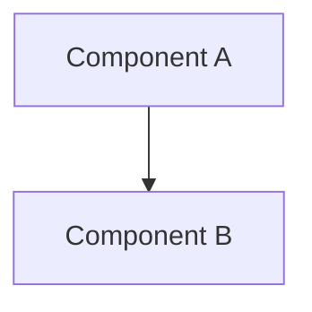

# Tech Research

A collection of technical research articles and overviews on various technologies, frameworks, and platforms. Articles are written in Markdown and rendered as a static blog via GitHub Pages.

## Live Site

Visit the deployed site at your GitHub Pages URL after enabling it in repository settings.

## Topics Covered

- **Blockchain**: Bitcoin, Solana, Binance Smart Chain
- **Automation**: n8n workflow automation
- **AI/ML**: Moondream, Claude Code Web, AgentSkills
- **DevOps**: Dokploy, OAuth2-proxy, Zitadel
- **Architecture**: C4 Model, Architecture Decision Records (ADR)
- **Real-time**: LiveKit
- **Documentation**: Docsify, DeepWiki
- **Design**: Design OS, Loveable, Vibe Kanban
- **PDF**: pdfme

## Project Structure

```
tech-research/
├── index.html          # Main SPA that renders markdown articles
├── style.css           # Blog styling
├── manifest.json       # List of all research articles
├── update-manifest.sh  # Script to regenerate manifest.json
├── researching/        # Markdown research articles
│   ├── n8n-overview.md
│   ├── solana-overview.md
│   └── ...
└── .github/
    └── workflows/
        └── deploy.yml  # GitHub Pages deployment
```

## Adding New Articles

1. Create a new markdown file in the `researching/` directory
2. Follow the naming convention: `topic-name-overview.md`
3. Start with an H1 title: `# Topic Name - Technical Overview`
4. Run `./update-manifest.sh` to update the manifest (or manually edit `manifest.json`)
5. Commit and push - the site will auto-deploy

## Article Format

Articles support:
- GitHub-flavored Markdown
- Syntax-highlighted code blocks
- Mermaid diagrams (use ` ```mermaid ` code blocks)
- Optional frontmatter with `category` field

Example:
```markdown
---
category: DevOps
---

# Topic Name - Technical Overview

Brief introduction paragraph.

## High-Level Architecture



## Key Features

- Feature 1
- Feature 2
```

## Local Development

Open `index.html` directly in a browser, or serve locally:

```bash
python -m http.server 8000
# or
npx serve .
```

## License

Research articles are for educational purposes.
