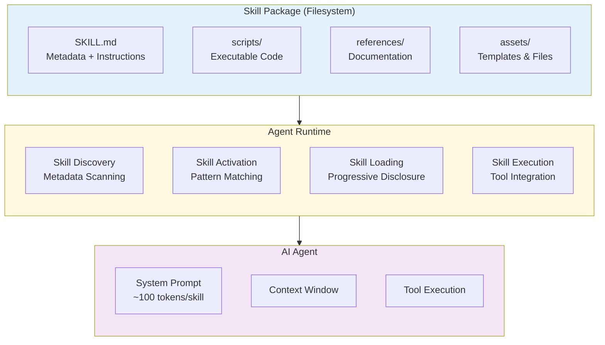
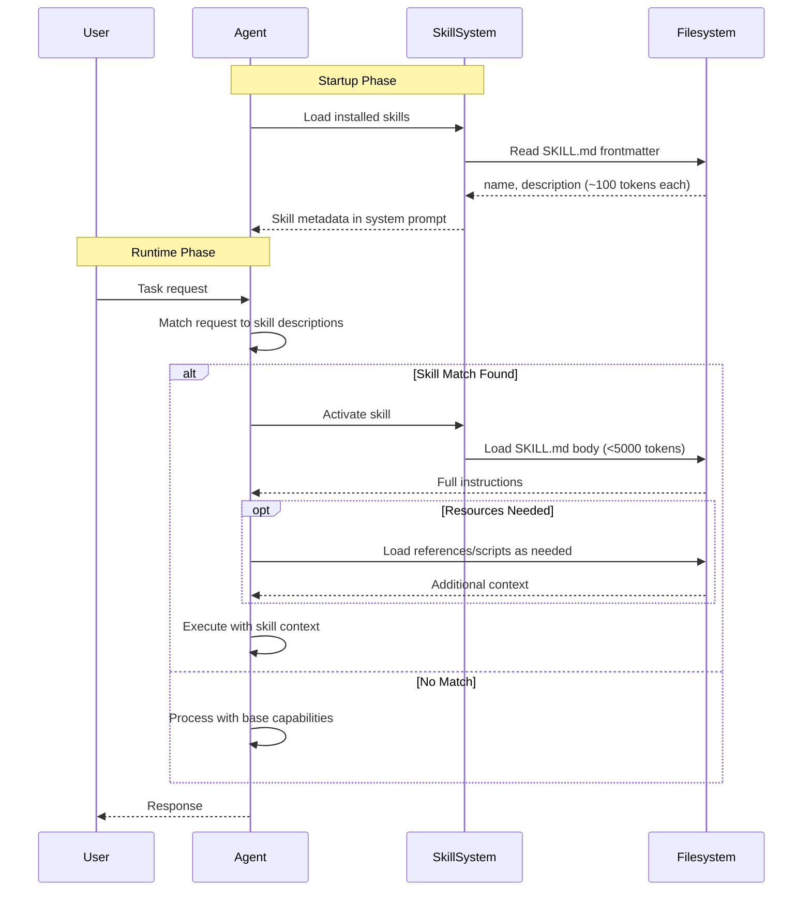
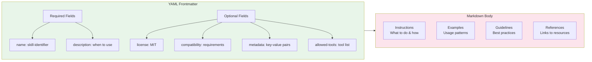
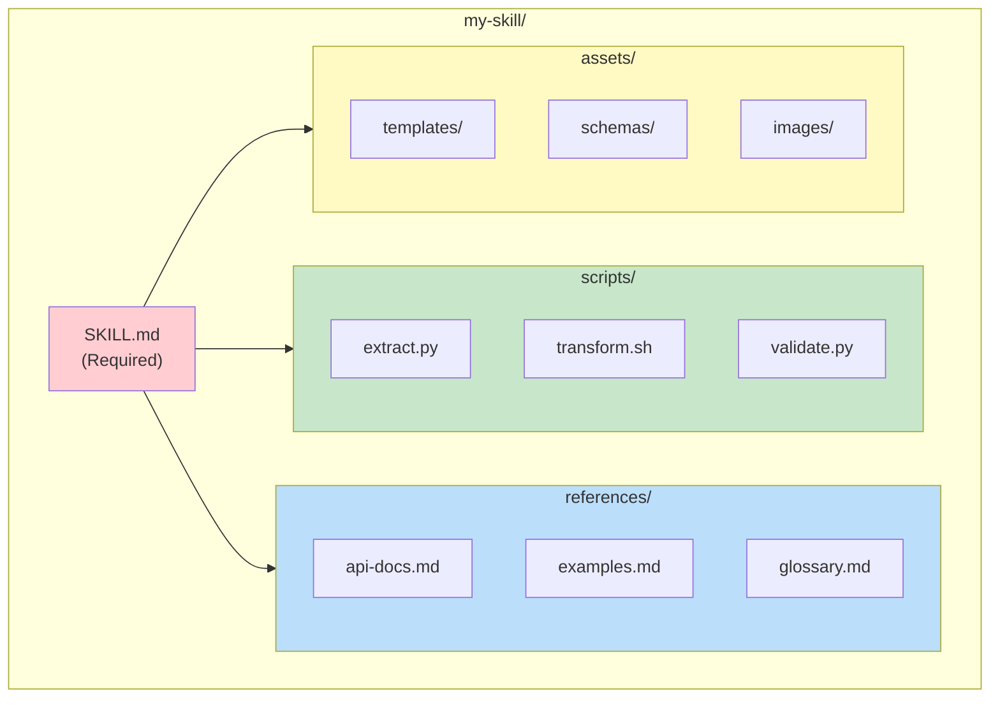
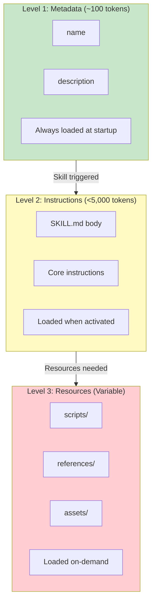
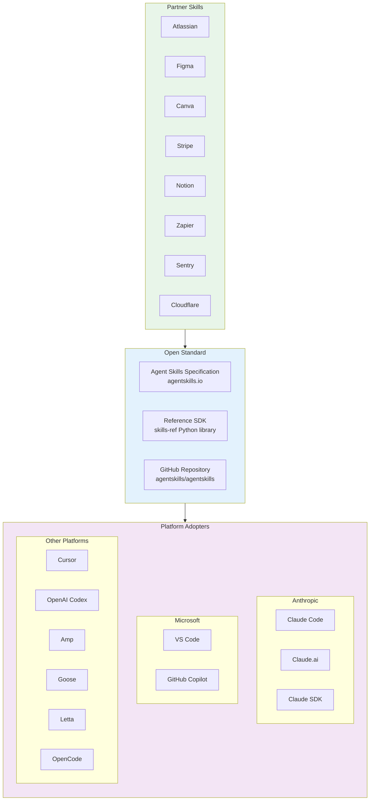
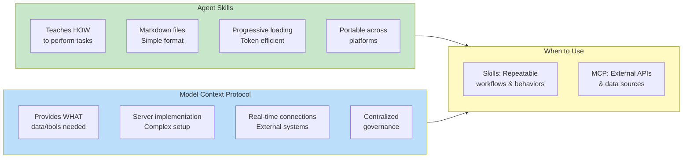
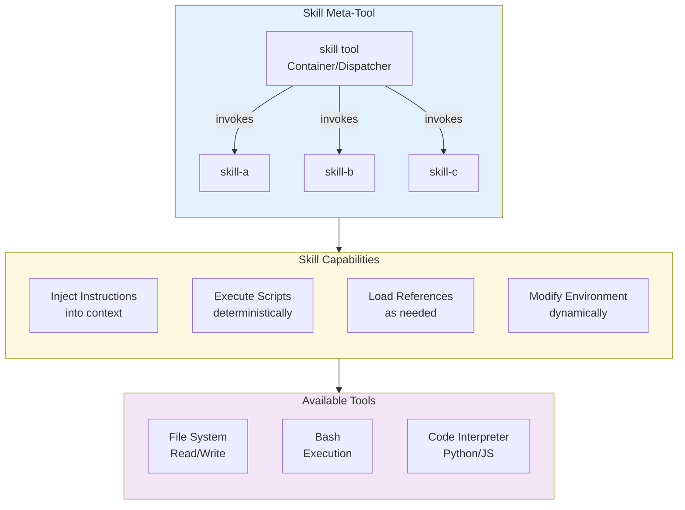

# Agent Skills (agentskills.io) - Technical Overview

## Overview

Agent Skills is an open standard developed by Anthropic for packaging reusable, modular capabilities that AI agents can discover and load dynamically. Skills are folders containing instructions, scripts, and resources that transform general-purpose AI agents into specialized agents capable of performing specific tasks consistently and efficiently.

Released as an open standard on December 18, 2025, Agent Skills has been rapidly adopted across major AI development platforms including GitHub Copilot, VS Code, Cursor, OpenAI Codex, and many others.

## High-Level Architecture



## Progressive Disclosure Architecture



## SKILL.md File Structure



### SKILL.md Example

```yaml
---
name: code-review
description: Reviews code for quality, security, and best practices.
  Use when asked to review pull requests, code changes, or assess code quality.
license: MIT
compatibility: Requires access to file system tools
---

# Code Review Skill

Review code changes systematically for quality, security, and adherence to best practices.

## Process

1. Understand the context and purpose of the changes
2. Review for logical correctness
3. Check for security vulnerabilities
4. Assess code style and maintainability
5. Provide actionable feedback

## Guidelines

- Be constructive and specific
- Prioritize critical issues over style preferences
- Include examples when suggesting improvements
```

## Skill Directory Structure



## Progressive Disclosure Levels



## Ecosystem & Adoption



## Skills vs MCP Comparison



## Meta-Tool Architecture



## Key Concepts

### What Are Skills?

Skills are **reusable, filesystem-based resources** that provide AI agents with domain-specific expertise:
- **Workflows**: Step-by-step procedures for complex tasks
- **Context**: Domain knowledge and best practices
- **Scripts**: Executable code for deterministic operations
- **Templates**: Reusable patterns and forms

### Progressive Disclosure

Skills use a **token-efficient loading strategy**:

| Level | Content | Tokens | When Loaded |
|-------|---------|--------|-------------|
| 1 | Metadata (name, description) | ~100 | Always (startup) |
| 2 | SKILL.md body | <5,000 | When skill activated |
| 3+ | Scripts, references, assets | Variable | On-demand |

### Skill vs Prompt

| Aspect | Skills | Prompts |
|--------|--------|---------|
| Persistence | Reusable across conversations | One-time, conversation-level |
| Structure | Organized folders with metadata | Freeform text |
| Discovery | Automatic pattern matching | Manual invocation |
| Resources | Scripts, references, assets | Text only |

## Technical Details

### Required Fields

```yaml
name: my-skill-name          # 1-64 chars, lowercase, hyphens only
description: What it does    # 1-1024 chars, when to use it
```

### Optional Fields

```yaml
license: MIT                           # License identifier
compatibility: Python 3.9+, bash       # Environment requirements (max 500 chars)
metadata:                              # Key-value pairs
  version: "1.0.0"
  author: "Your Name"
allowed-tools: Read Edit Bash          # Pre-approved tools (experimental)
```

### Validation

The `skills-ref` reference library provides validation:

```bash
# Install
pip install skills-ref

# Validate a skill
skills-ref validate ./my-skill

# Read properties (JSON output)
skills-ref read-properties ./my-skill

# Generate system prompt XML
skills-ref to-prompt ./skills-directory
```

## Key Facts (2025)

- **Release Date**: December 18, 2025 (open standard)
- **Repository Stars**: 26k+ on GitHub (anthropics/skills)
- **Platform Adoption**: 10+ major AI platforms
- **Partner Skills**: 8+ enterprise partners at launch
- **Specification Size**: "Deliciously tiny" - readable in minutes
- **Document Skills**: PDF, DOCX, PPTX, XLSX manipulation available

## Available Skill Categories

| Category | Examples |
|----------|----------|
| **Document Manipulation** | PDF forms, Word docs, PowerPoint, Excel |
| **Development** | Code review, testing, MCP server generation |
| **Creative** | Art generation, music, design |
| **Enterprise** | Communications, branding, workflows |
| **Integrations** | Notion, Stripe, Zapier, Atlassian |

## Use Cases

### Individual Developers
- Create personal coding assistants with project-specific knowledge
- Automate repetitive documentation tasks
- Build custom review and testing workflows

### Teams & Organizations
- Share standardized workflows across team members
- Enforce coding standards and best practices
- Create domain-specific AI assistants

### Enterprise
- Deploy skills centrally via admin hub
- Maintain consistent AI behavior across organization
- Integrate with existing tools (Notion, Jira, Stripe, etc.)

### Skill Marketplace
- Discover community-created skills
- Share specialized capabilities
- Build on existing skill templates

## Best Practices

### Skill Design

1. **Keep it focused**: One skill = one capability
2. **Write clear descriptions**: Enable accurate pattern matching
3. **Use progressive disclosure**: Don't front-load all content
4. **Include examples**: Show expected inputs/outputs
5. **Handle errors gracefully**: Provide helpful error messages

### Performance Optimization

1. **Keep SKILL.md under 500 lines** for optimal loading
2. **Split large skills** into multiple focused skills
3. **Use scripts for deterministic operations** (cheaper than token generation)
4. **Reference external files** rather than embedding large content

### Naming Conventions

- Use **gerund form** (verb + -ing) for skill names: `code-reviewing`, `document-creating`
- Use **lowercase with hyphens** for identifiers
- Write **descriptions in third person**: "Reviews code for..." not "Review code for..."

## Security Considerations

- **No credential storage**: Skills should not contain secrets or API keys
- **Script sandboxing**: Executable scripts run in controlled environments
- **User approval**: Skills require user consent before installation
- **Audit trail**: Skill usage can be tracked and monitored
- **Enterprise controls**: Administrators can manage skill deployment

## Resources

- **Official Specification**: [agentskills.io/specification](https://agentskills.io/specification)
- **GitHub Repository**: [github.com/agentskills/agentskills](https://github.com/agentskills/agentskills)
- **Anthropic Skills**: [github.com/anthropics/skills](https://github.com/anthropics/skills)
- **VS Code Integration**: [code.visualstudio.com/docs/copilot/customization/agent-skills](https://code.visualstudio.com/docs/copilot/customization/agent-skills)
- **Cursor Documentation**: [cursor.com/docs/context/skills](https://cursor.com/docs/context/skills)
- **OpenAI Codex Skills**: [developers.openai.com/codex/skills](https://developers.openai.com/codex/skills)

## Sources

- [Agent Skills Official Site](https://agentskills.io/home)
- [Anthropic Engineering Blog](https://www.anthropic.com/engineering/equipping-agents-for-the-real-world-with-agent-skills)
- [GitHub Copilot Agent Skills Announcement](https://github.blog/changelog/2025-12-18-github-copilot-now-supports-agent-skills/)
- [VentureBeat - Anthropic Launches Enterprise Agent Skills](https://venturebeat.com/ai/anthropic-launches-enterprise-agent-skills-and-opens-the-standard)
- [The New Stack - Agent Skills: Anthropic's Next Bid](https://thenewstack.io/agent-skills-anthropics-next-bid-to-define-ai-standards/)
- [Simon Willison's Blog](https://simonwillison.net/2025/Dec/19/agent-skills/)
- [Claude Skills vs MCP Comparison](https://subramanya.ai/2025/10/30/claude-skills-vs-mcp-a-tale-of-two-ai-customization-philosophies/)
