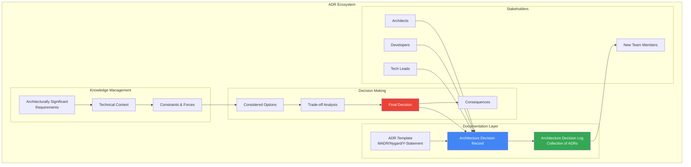
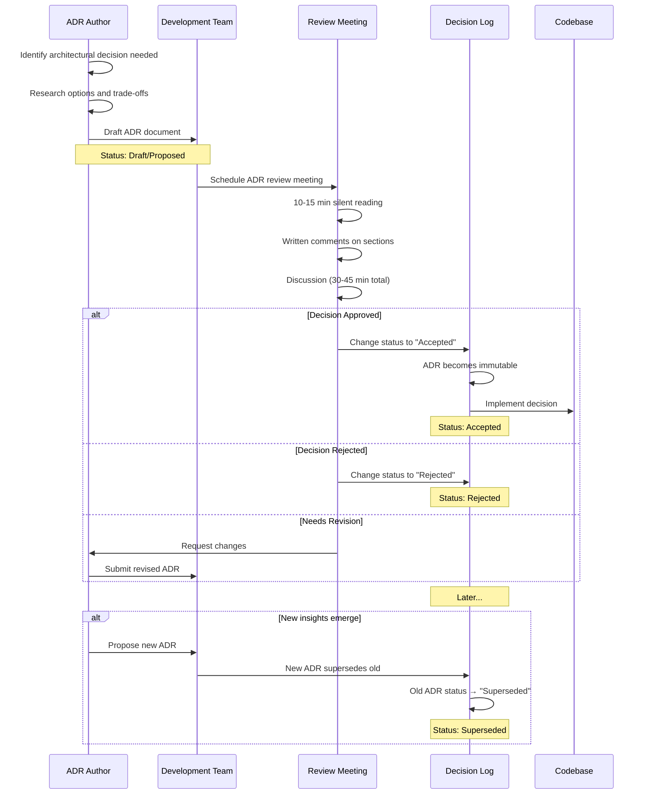
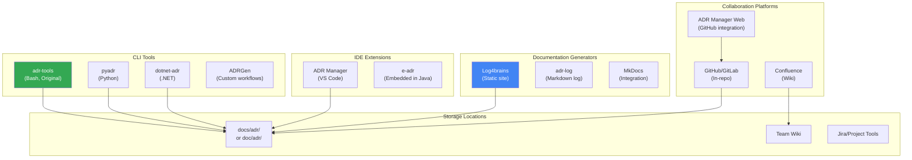
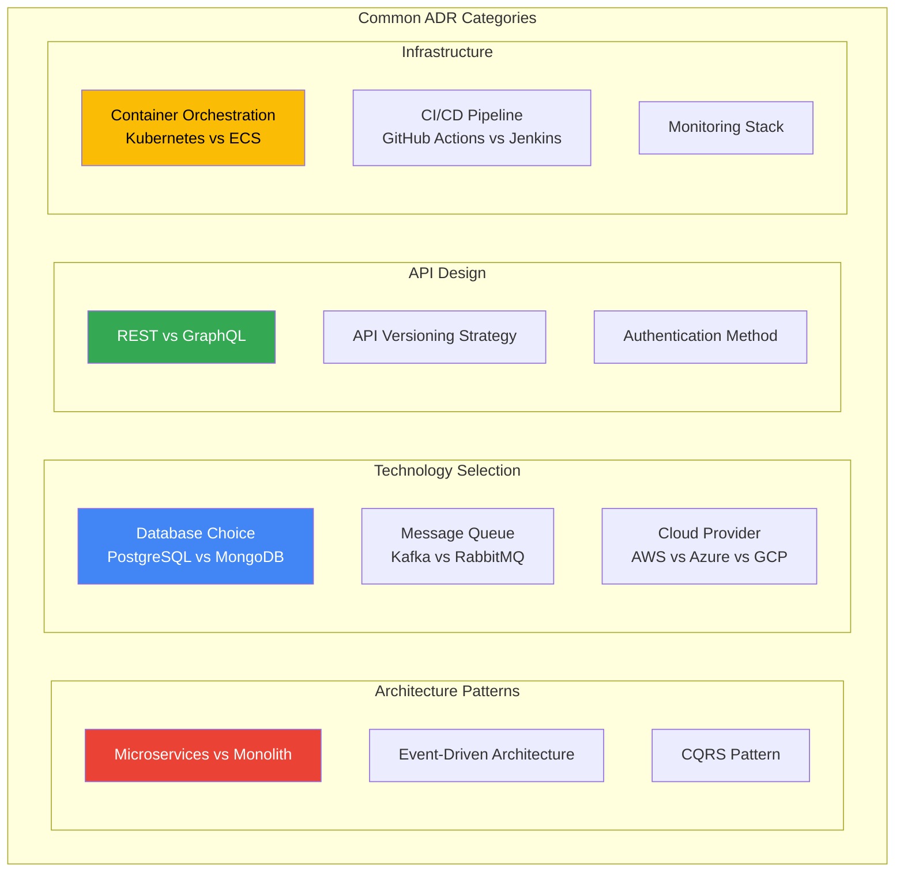
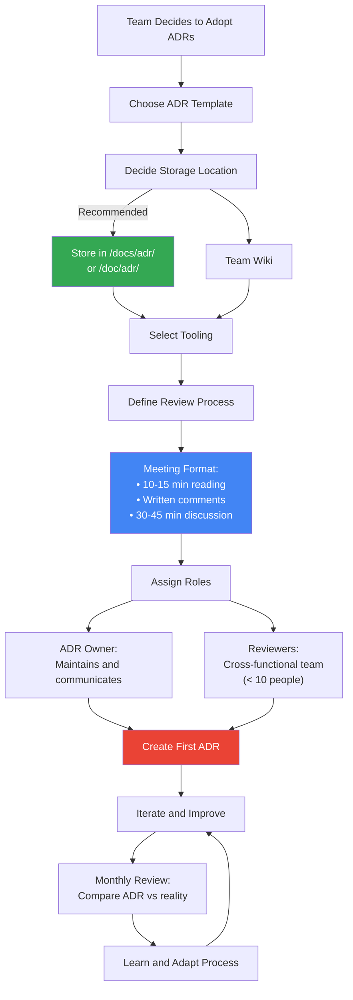

# Architecture Decision Record (ADR) - Technical Overview

An Architecture Decision Record (ADR) is a document that captures an important architectural decision made along with its context, rationale, and consequences. ADRs serve as a historical record of why certain technical decisions were made, helping teams understand the evolution of their system architecture.

## High-Level Architecture



## ADR Lifecycle Workflow



## ADR Document Structure

```mermaid
graph TB
    subgraph "ADR Document Anatomy"
        subgraph "Header"
            Title["Title: ADR-NNNN<br/>Short descriptive title"]
            Date["Date: YYYY-MM-DD"]
            Status["Status: Proposed → Accepted"]
        end

        subgraph "Body"
            ContextSection["Context<br/>━━━━━━━━━━━━<br/>• Current situation<br/>• Technical forces<br/>• Business constraints<br/>• Why decision is needed"]

            OptionsSection["Considered Options<br/>━━━━━━━━━━━━━━━━<br/>• Option A: description<br/>• Option B: description<br/>• Option C: description"]

            DecisionSection["Decision<br/>━━━━━━━━<br/>• Chosen option<br/>• Implementation approach<br/>• Clear rationale"]

            ConsequencesSection["Consequences<br/>━━━━━━━━━━━━<br/>• Positive outcomes<br/>• Negative trade-offs<br/>• Risks accepted"]
        end

        subgraph "Optional Sections"
            Links["Links/References"]
            Supersedes["Supersedes: ADR-xxx"]
            Compliance["Compliance Notes"]
        end
    end

    Title --> Date
    Date --> Status
    Status --> ContextSection
    ContextSection --> OptionsSection
    OptionsSection --> DecisionSection
    DecisionSection --> ConsequencesSection
    ConsequencesSection --> Links
    Links --> Supersedes

    style DecisionSection fill:#4285F4,color:#fff
    style ContextSection fill:#34A853,color:#fff
    style ConsequencesSection fill:#FBBC05,color:#000
```



## Key Concepts

### What is an ADR?

An ADR captures a single Architecture Decision (AD) and its rationale. Key components include:

- **Architecture Decision (AD)**: A software design choice that addresses a significant requirement
- **Architecture Decision Log (ADL)**: The collection of all ADRs for a project or organization
- **Architecturally Significant Requirement (ASR)**: A requirement with measurable effect on system architecture

### When to Create an ADR

Create ADRs when:
- There's no existing basis for a technical decision
- Multiple engineering options exist and you need to document the selection rationale
- Choosing between architectures (microservices vs monolith, cloud providers, etc.)
- Selecting significant technologies (databases, frameworks, protocols)
- Defining security protocols or data encryption standards

### ADR Status Lifecycle

| Status | Description |
|--------|-------------|
| **Draft** | Initial creation, still being refined |
| **Proposed** | Ready for team review |
| **Accepted** | Approved and active - becomes immutable |
| **Rejected** | Not approved, kept for reference |
| **Deprecated** | No longer relevant but preserved |
| **Superseded** | Replaced by a newer ADR |

## Popular ADR Templates

```mermaid
graph LR
    subgraph "Template Comparison"
        subgraph "Nygard (Original)"
            N1["Title"]
            N2["Status"]
            N3["Context"]
            N4["Decision"]
            N5["Consequences"]
            N1 --> N2 --> N3 --> N4 --> N5
        end

        subgraph "MADR (Extended)"
            M1["Title"]
            M2["Status"]
            M3["Context"]
            M4["Considered Options"]
            M5["Decision Outcome"]
            M6["Pros/Cons Analysis"]
            M7["Consequences"]
            M1 --> M2 --> M3 --> M4 --> M5 --> M6 --> M7
        end

        subgraph "Y-Statement (Concise)"
            Y1["In context of..."]
            Y2["facing..."]
            Y3["we decided for..."]
            Y4["to achieve..."]
            Y5["accepting..."]
            Y1 --> Y2 --> Y3 --> Y4 --> Y5
        end
    end

    style N4 fill:#4285F4,color:#fff
    style M5 fill:#4285F4,color:#fff
    style Y3 fill:#4285F4,color:#fff
```



### Michael Nygard's Template (Original)

The simplest and most widely adopted format:

```markdown
# ADR-001: Use PostgreSQL for User Data

## Status
Accepted

## Context
We need a database to store user profiles, authentication data,
and transactional records. The system requires ACID compliance,
complex queries, and horizontal scaling capability.

## Decision
We will use PostgreSQL as our primary database.

## Consequences
- Positive: Strong ACID compliance, mature ecosystem
- Positive: Excellent support for complex queries and JSON
- Negative: Requires more operational expertise than SQLite
- Negative: Horizontal scaling requires additional tooling
```

### MADR (Markdown Architectural Decision Records)

Extended format with explicit options and trade-off analysis:

```markdown
# ADR-002: Authentication Strategy

## Status
Accepted

## Context and Problem Statement
How should we implement user authentication for our API?

## Considered Options
1. Session-based authentication with cookies
2. JWT tokens with refresh mechanism
3. OAuth2 with external identity provider

## Decision Outcome
Chosen option: "JWT tokens with refresh mechanism"

### Consequences
- Good: Stateless, scales horizontally
- Good: Works across domains/services
- Bad: Token revocation is complex
- Bad: Larger request payload

## Pros and Cons of Options

### Session-based
- Good: Simple revocation
- Bad: Requires session store
- Bad: Doesn't work across domains

### OAuth2 External
- Good: Delegates auth complexity
- Bad: External dependency
- Bad: Additional integration work
```

### Y-Statement Format

Ultra-concise single-sentence format:

```
In the context of building a real-time notification system,
facing the need for low-latency message delivery to thousands of clients,
we decided for WebSockets over HTTP polling
to achieve sub-second message delivery and reduced server load,
accepting the additional complexity of connection management and fallback handling.
```

## ADR Tooling Ecosystem



### adr-tools (Original CLI)

```bash
# Initialize ADR directory
adr init doc/adr

# Create new ADR
adr new "Use PostgreSQL for user data"
# Creates: doc/adr/0001-use-postgresql-for-user-data.md

# Create ADR that supersedes another
adr new -s 5 "Migrate to MongoDB for user data"
# Updates ADR 5 status to "Superseded by ADR 6"

# Generate table of contents
adr generate toc

# Link related ADRs
adr link 5 "Amends" 3 "Amended by"
```

### Log4brains

Generates browsable static documentation site from ADRs:

```bash
# Install
npm install -g log4brains

# Initialize in project
log4brains init

# Preview documentation
log4brains preview

# Build static site
log4brains build
```

## Real-World ADR Examples



### Example: Database Selection ADR

```markdown
# ADR-003: Database Choice for User Management Service

## Status
Accepted (2024-03-15)

## Context
Our user management service needs a database that supports:
- High availability (99.9% uptime requirement)
- Complex queries for user search and filtering
- Horizontal scalability for 10M+ users
- ACID transactions for user profile updates

Current user base: 500K active users, growing 20% monthly.

## Considered Options

### Option 1: PostgreSQL
- Proven ACID compliance
- Excellent query performance
- Strong ecosystem (extensions, tools)
- Team has existing expertise

### Option 2: MongoDB
- Flexible schema for evolving user profiles
- Built-in horizontal scaling
- JSON-native storage
- Steeper learning curve for team

### Option 3: CockroachDB
- Distributed SQL
- Automatic failover
- PostgreSQL wire protocol compatible
- Higher operational complexity

## Decision
We will use **PostgreSQL** as the primary database with **Redis**
as a caching layer for session management.

## Rationale
- PostgreSQL meets all functional requirements
- Team expertise reduces implementation risk
- Redis caching addresses performance needs
- Clear migration path to distributed PostgreSQL (Citus) if needed

## Consequences

### Positive
- Leverage existing team knowledge
- Mature tooling and monitoring
- Strong community support
- Cost-effective (open source)

### Negative
- Manual sharding if we exceed single-node capacity
- Redis adds operational complexity
- Potential data inconsistency between cache and DB

### Risks Accepted
- Will need to implement cache invalidation strategy
- May require Citus or similar for horizontal scaling beyond 50M users
```

### Example: Microservices Migration ADR

```markdown
# ADR-007: Migrate Order Processing to Microservices

## Status
Accepted (2024-06-01)

## Context
The monolithic e-commerce application is experiencing:
- Database connection pool exhaustion during peak traffic
- 45-minute build times affecting developer productivity
- Full application restarts for any deployment
- Single point of failure for the entire platform

Peak load: 10K orders/hour during sales events.

## Considered Options

1. **Vertical scaling** - Bigger servers, optimized queries
2. **Modular monolith** - Internal boundaries, separate deployments
3. **Microservices** - Independent services per domain

## Decision
Extract order processing into independent microservices:
- Order Service (order lifecycle management)
- Inventory Service (stock management)
- Payment Service (payment processing)
- Notification Service (customer communications)

Communication via event-driven architecture using Apache Kafka.

## Consequences

### Positive
- Independent scaling per service
- Faster build times (2-5 min vs 45 min)
- Fault isolation (payment issues don't affect browsing)
- Technology flexibility per service
- Smaller, focused teams

### Negative
- Operational complexity (multiple deployments)
- Network latency between services
- Distributed debugging challenges
- Eventual consistency (vs immediate consistency)
- Need for service mesh and observability tooling

### Migration Plan
1. Phase 1: Extract Notification Service (lowest risk)
2. Phase 2: Extract Inventory Service
3. Phase 3: Extract Payment Service
4. Phase 4: Extract Order Service (core domain)

## Related ADRs
- ADR-008: Event Sourcing for Order State
- ADR-009: Saga Pattern for Distributed Transactions
```

## Team Adoption Workflow



## Best Practices

### Writing Effective ADRs

1. **Keep it focused** - One decision per ADR, avoid combining multiple decisions
2. **Be specific** - Include concrete details, not vague statements
3. **Document trade-offs** - Explain what you're accepting by choosing this option
4. **Provide context** - Future readers need to understand the situation
5. **Keep it concise** - Avoid turning ADRs into design documents

### Storage and Organization

```
project/
├── docs/
│   └── adr/
│       ├── 0001-use-postgresql-for-user-data.md
│       ├── 0002-adopt-event-driven-architecture.md
│       ├── 0003-authentication-with-jwt.md
│       └── README.md (index/table of contents)
```

### Review Meeting Structure

| Phase | Duration | Activity |
|-------|----------|----------|
| Reading | 10-15 min | Silent reading of ADR document |
| Comments | 5 min | Write inline comments on specific sections |
| Discussion | 15-20 min | Address comments and questions |
| Decision | 5 min | Accept, reject, or request revision |

### ADR Governance Rules

1. ADRs are **immutable once accepted** - create new ADR to change decisions
2. Never **delete** ADRs - mark as superseded or deprecated
3. **Anyone can propose** - but follow the review process
4. Keep meetings to **< 45 minutes** with **< 10 participants**
5. Review ADRs **monthly** against actual implementation

## Key Facts (2025)

- **Origin**: Coined by Michael Nygard in 2011
- **ThoughtWorks Radar**: Listed as "Adopt" since 2018
- **Major Adopters**: AWS, Microsoft Azure, Google Cloud include ADR guidance in architecture frameworks
- **UK Government**: Published ADR Framework in December 2024 for public sector
- **IBM Watson**: Used 80+ ADRs to document microservices architecture evolution
- **Storage**: Most commonly stored as Markdown files in `/docs/adr/` directory
- **Popular Templates**: MADR, Nygard, Y-Statement
- **Key Tools**: adr-tools, Log4brains, ADR Manager (VS Code), pyadr, dotnet-adr

## Use Cases

### 1. Onboarding New Team Members
New developers can read the ADL to understand why the system is built the way it is, reducing knowledge transfer time.

### 2. Preventing Decision Reversal
Documented rationale prevents future architects from unknowingly reversing decisions without understanding the original context.

### 3. Audit and Compliance
ADRs provide evidence of thoughtful decision-making for security audits, compliance reviews, and due diligence.

### 4. Distributed Teams
Asynchronous ADR review enables decision-making across time zones without requiring synchronous meetings.

### 5. Technical Debt Tracking
Accepted trade-offs documented in consequences section become trackable technical debt items.

### 6. Architecture Evolution
Superseding ADRs create a clear timeline of how the architecture evolved and why.

## Anti-Patterns to Avoid

| Anti-Pattern | Problem | Solution |
|--------------|---------|----------|
| **Too vague** | "We chose X because it's better" | Include specific criteria and measurements |
| **Too long** | 10-page design documents | Keep to 1-2 pages, link to detailed docs |
| **No options** | Only documenting chosen solution | Always list 2-3 alternatives considered |
| **No consequences** | Missing trade-off analysis | Explicitly state positive AND negative impacts |
| **Abandoned** | Initial enthusiasm, then forgotten | Monthly reviews, integrate into workflow |
| **Decision by committee** | 20-person review meetings | Limit to < 10 cross-functional representatives |

## Sources

- [ADR GitHub Organization](https://adr.github.io/) - Official templates and guidance
- [Joel Parker Henderson's ADR Repository](https://github.com/joelparkerhenderson/architecture-decision-record) - Comprehensive examples and templates
- [AWS Prescriptive Guidance on ADRs](https://docs.aws.amazon.com/prescriptive-guidance/latest/architectural-decision-records/adr-process.html)
- [AWS Architecture Blog - Master ADRs](https://aws.amazon.com/blogs/architecture/master-architecture-decision-records-adrs-best-practices-for-effective-decision-making/)
- [Microsoft Azure Well-Architected Framework - ADR](https://learn.microsoft.com/en-us/azure/well-architected/architect-role/architecture-decision-record)
- [Google Cloud Architecture Center - ADRs](https://cloud.google.com/architecture/architecture-decision-records)
- [UK Government ADR Framework](https://technology.blog.gov.uk/2025/12/08/the-architecture-decision-record-adr-framework-making-better-technology-decisions-across-the-public-sector/)
- [TechTarget - 8 Best Practices for Creating ADRs](https://www.techtarget.com/searchapparchitecture/tip/4-best-practices-for-creating-architecture-decision-records)
- [MADR Template Documentation](https://github.com/adr/madr)
- [adr-tools GitHub](https://github.com/npryce/adr-tools)
- [Agile Alliance - Distribute Design Authority with ADRs](https://agilealliance.org/resources/experience-reports/distribute-design-authority-with-architecture-decision-records/)
- [Olaf Zimmermann - MADR Template Explained](https://ozimmer.ch/practices/2022/11/22/MADRTemplatePrimer.html)
