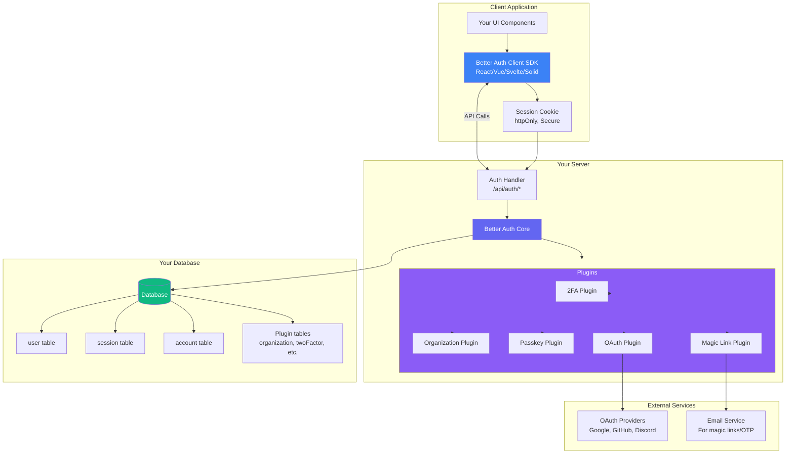
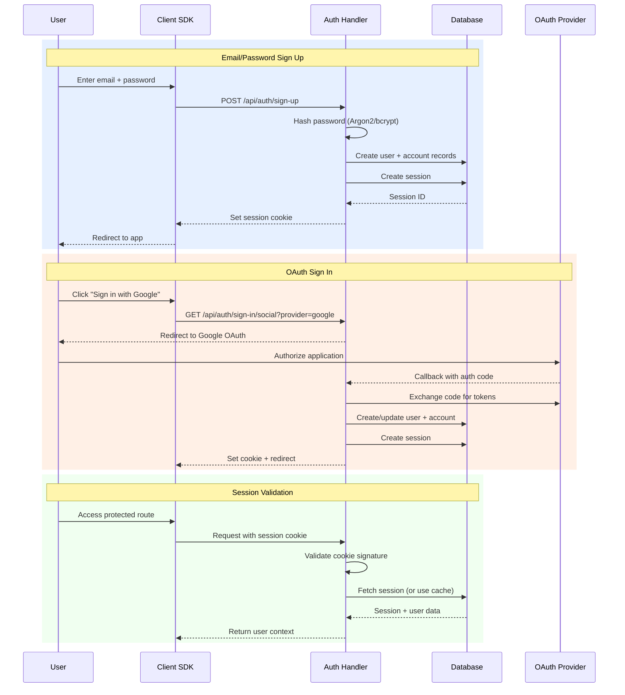
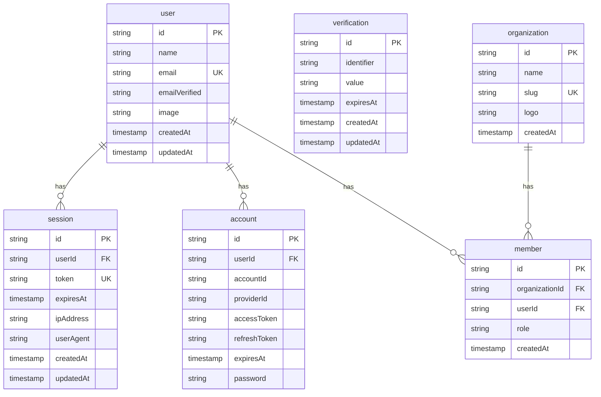
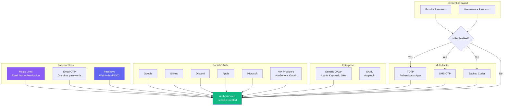
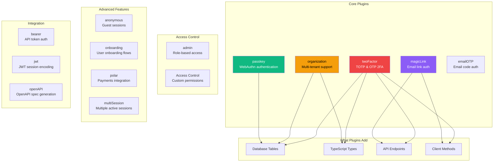
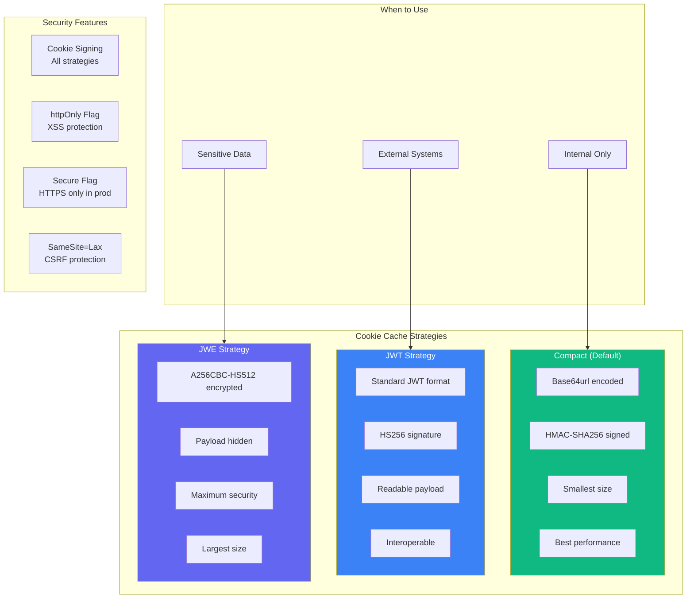
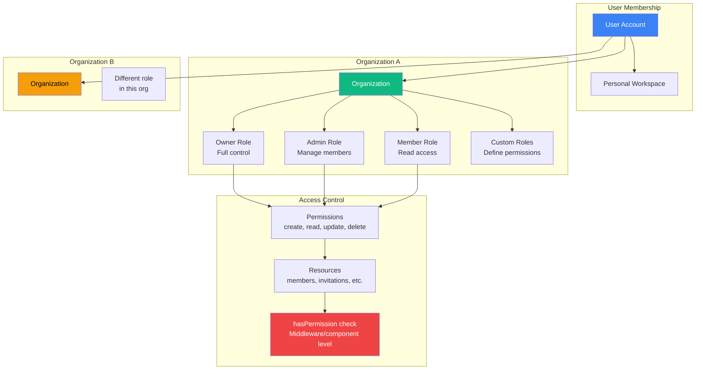

# Better Auth - Technical Overview

Better Auth is a comprehensive, open-source authentication and authorization framework for TypeScript. Unlike managed auth services that store user data externally, Better Auth lets developers keep all authentication data in their own database while providing a rich plugin ecosystem for advanced features like organizations, two-factor authentication, and passkeys.

## High-Level Architecture



## Authentication Flow



## Database Schema



## Key Concepts

### Framework Agnostic Design
Better Auth works with any TypeScript server framework including Next.js, Nuxt, SvelteKit, Remix, Solid Start, Hono, Express, and Elysia. The auth handler mounts at a single endpoint (typically `/api/auth/*`) and handles all authentication routes.

### Plugin Architecture
One of Better Auth's distinguishing features is its plugin system. Complex authentication features like organizations, 2FA, passkeys, and magic links are implemented as plugins that:
- Add their own database tables automatically
- Extend the user/session types
- Expose new API endpoints
- Provide client-side methods

### Database Adapters
Better Auth uses Kysely as its default database handler but provides first-class adapters for:
- **Prisma**: Generates schema.prisma files
- **Drizzle**: Generates TypeScript schema
- **Kysely**: Generates SQL migration files
- **MongoDB**: NoSQL adapter

### Session Management
Sessions are stored in your database (not as JWTs by default), giving you full control over:
- Session revocation
- Multi-device session listing
- Session metadata (IP, user agent)
- Custom session expiration

### Cookie Security
All cookies are:
- `httpOnly`: Not accessible via JavaScript
- `Secure`: Only sent over HTTPS in production
- `SameSite=Lax`: CSRF protection
- Signed with your secret key

## Authentication Methods



## Plugin Ecosystem



## Session Encoding Strategies



## Organization & Multi-Tenancy



## Technical Details

### Server Configuration
```typescript
import { betterAuth } from "better-auth";

export const auth = betterAuth({
  database: {
    provider: "postgresql", // or mysql, sqlite
    url: process.env.DATABASE_URL,
  },
  emailAndPassword: {
    enabled: true,
  },
  socialProviders: {
    google: {
      clientId: process.env.GOOGLE_CLIENT_ID,
      clientSecret: process.env.GOOGLE_CLIENT_SECRET,
    },
  },
  plugins: [
    twoFactor(),
    organization(),
    passkey(),
  ],
});
```

### Client Configuration
```typescript
import { createAuthClient } from "better-auth/client";

export const authClient = createAuthClient({
  baseURL: "http://localhost:3000",
  plugins: [
    twoFactorClient(),
    organizationClient(),
    passkeyClient(),
  ],
});
```

### Type Safety
Better Auth is fully typed with TypeScript. Use `$Infer` to get types for users and sessions, including extensions from plugins:

```typescript
type User = typeof auth.$Infer.Session["user"];
type Session = typeof auth.$Infer.Session["session"];
```

### CLI Commands
- `npx @better-auth/cli generate`: Generate database schema for your ORM
- `npx @better-auth/cli migrate`: Apply migrations (Kysely adapter)

### Experimental Joins
Since v1.4, Better Auth supports database joins for 50+ endpoints, providing 2-3x performance improvements by reducing database roundtrips.

## Framework Integration

```mermaid
graph LR
    subgraph "Server Frameworks"
        Next[Next.js<br/>App & Pages Router]
        Nuxt[Nuxt]
        Svelte[SvelteKit]
        Remix[Remix]
        Solid[Solid Start]
        Hono[Hono]
        Express[Express]
        Elysia[Elysia]
    end

    subgraph "Client Frameworks"
        React[React<br/>@better-auth/react]
        Vue[Vue<br/>@better-auth/vue]
        SvelteC[Svelte<br/>@better-auth/svelte]
        SolidC[Solid<br/>@better-auth/solid]
        Vanilla[Vanilla JS<br/>better-auth/client]
    end

    subgraph "Database Adapters"
        Prisma[Prisma]
        Drizzle[Drizzle]
        Kysely[Kysely<br/>Default]
        Mongo[MongoDB]
    end

    subgraph "Supported DBs"
        PG[PostgreSQL]
        MySQL[MySQL]
        SQLite[SQLite]
        More[+ Kysely Dialects<br/>D1, PlanetScale, etc.]
    end

    Next --> Handler[Auth Handler]
    Nuxt --> Handler
    Svelte --> Handler

    React --> Client[Auth Client]
    Vue --> Client
    SvelteC --> Client

    Handler --> Prisma
    Handler --> Drizzle
    Handler --> Kysely

    Kysely --> PG
    Kysely --> MySQL
    Kysely --> SQLite
    Kysely --> More

    style Next fill:#000,color:#fff
    style React fill:#61DAFB,color:#000
    style Vue fill:#42B883,color:#fff
    style Prisma fill:#2D3748,color:#fff
```

## Key Facts (2025)

- **GitHub Stars**: 15,000+ stars on GitHub
- **Weekly Downloads**: 150,000+ npm weekly downloads
- **Discord Community**: 6,000+ members
- **Initial Release**: September 2024
- **Funding**: $5M seed funding (YC X25)
- **License**: MIT (fully open source)
- **Latest Version**: 1.4.x with experimental joins support
- **OAuth Providers**: 40+ built-in + Generic OAuth for custom providers
- **Framework Support**: 10+ server frameworks, 5+ client frameworks
- **Database Support**: PostgreSQL, MySQL, SQLite + any Kysely dialect
- **Data Ownership**: All user data stays in your database

## Use Cases

### Startup MVPs
- Quick setup with email/password and social OAuth
- No external service costs or vendor lock-in
- Type-safe API with excellent DX

### B2B SaaS Applications
- Multi-tenant organizations out of the box
- Role-based access control (RBAC)
- Custom permissions per organization
- Invitation and member management

### Enterprise Applications
- Generic OAuth plugin for Okta, Auth0, Keycloak, Microsoft Entra
- Two-factor authentication (TOTP, SMS, backup codes)
- Session management and audit capabilities
- On-premise data storage requirement compliance

### API-First Products
- Bearer token authentication for APIs
- JWT session encoding for microservices
- OpenAPI spec generation

### Security-Critical Applications
- Passkey/WebAuthn support for phishing-resistant auth
- JWE encrypted cookies for sensitive data
- Built-in rate limiting
- Cookie signing and validation

## Security Considerations

### Built-in Protections
- **Rate Limiting**: Automatic protection against brute-force attacks
- **Cookie Security**: httpOnly, Secure, SameSite=Lax by default
- **Password Hashing**: Argon2/bcrypt with secure defaults
- **CSRF Protection**: State and nonce validation for OAuth callbacks
- **Input Validation**: Comprehensive validation on all endpoints

### Session Security
- Database-backed sessions allow instant revocation
- Optional cookie cache with configurable TTL
- `disableCookieCache: true` for sensitive operations
- Session metadata tracking (IP, user agent)

### Best Practices
- Use `BETTER_AUTH_SECRET` environment variable (32+ characters)
- Enable `baseURL` configuration for production
- Use JWE encoding for sensitive session data
- Implement proper CORS configuration
- Monitor authentication events

### Comparison to Alternatives
| Feature | Better Auth | NextAuth/Auth.js | Lucia Auth |
|---------|-------------|------------------|------------|
| Data Ownership | Your DB | Your DB | Your DB |
| Plugin System | Extensive | Limited | None |
| TypeScript | Native | Good | Native |
| Organizations | Built-in plugin | External | DIY |
| Passkeys | Built-in plugin | Limited | DIY |
| Maintenance | Active | Active | Deprecated |

---

## Sources

- [Better Auth Official Website](https://www.better-auth.com/)
- [Better Auth Documentation](https://www.better-auth.com/docs/introduction)
- [Better Auth GitHub Repository](https://github.com/better-auth/better-auth)
- [Better Auth npm Package](https://www.npmjs.com/package/better-auth)
- [Database Documentation](https://www.better-auth.com/docs/concepts/database)
- [Session Management](https://www.better-auth.com/docs/concepts/session-management)
- [Two-Factor Authentication Plugin](https://www.better-auth.com/docs/plugins/2fa)
- [Organization Plugin](https://www.better-auth.com/docs/plugins/organization)
- [Passkey Plugin](https://www.better-auth.com/docs/plugins/passkey)
- [Magic Link Plugin](https://www.better-auth.com/docs/plugins/magic-link)
- [OAuth Documentation](https://www.better-auth.com/docs/concepts/oauth)
- [Cookie Security](https://www.better-auth.com/docs/concepts/cookies)
- [Drizzle Adapter](https://www.better-auth.com/docs/adapters/drizzle)
- [Prisma Adapter](https://www.better-auth.com/docs/adapters/prisma)
- [Is Better Auth the key to solving authentication headaches? - LogRocket](https://blog.logrocket.com/better-auth-authentication/)
- [Better Auth vs NextAuth vs Auth0 - Better Stack](https://betterstack.com/community/guides/scaling-nodejs/better-auth-vs-nextauth-authjs-vs-autho/)
- [Auth.js vs BetterAuth Comparison - Wisp CMS](https://www.wisp.blog/blog/authjs-vs-betterauth-for-nextjs-a-comprehensive-comparison)
- [BetterAuth with Encore.ts Guide](https://encore.dev/blog/betterauth-tutorial)
- [Better Auth YC X25 Funding](https://www.startuphub.ai/ai-news/funding-round/2025/better-auth-secures-5-million-seed-funding/)
