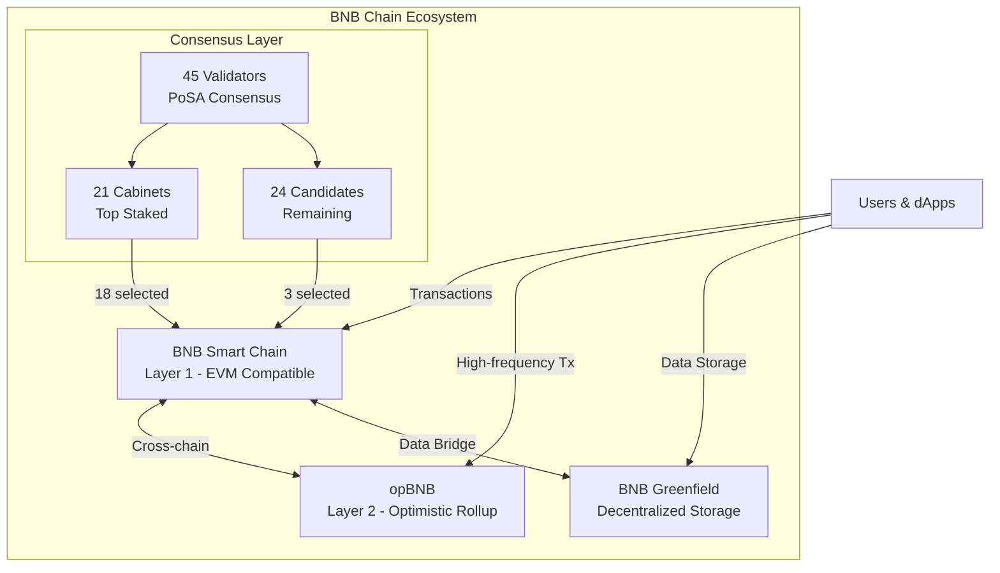
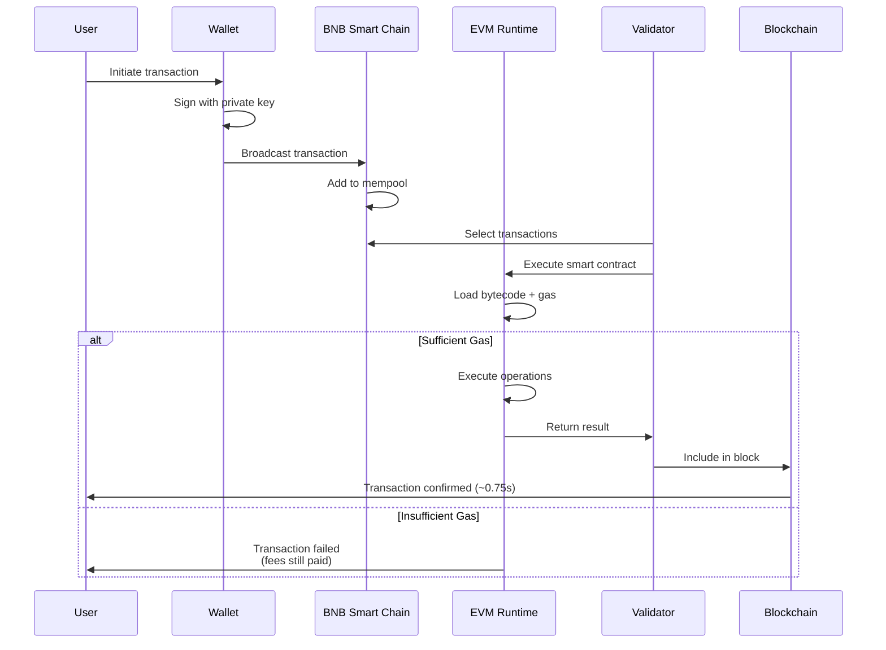
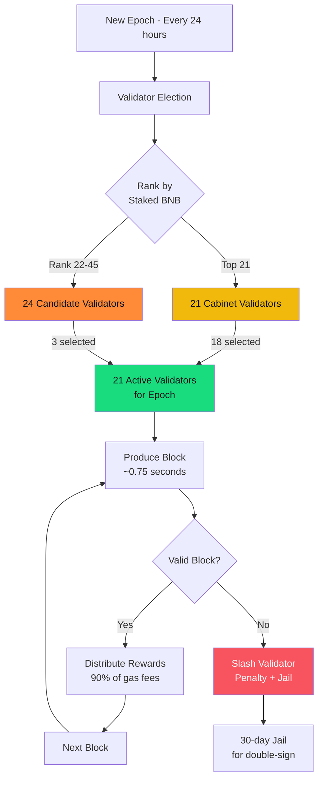
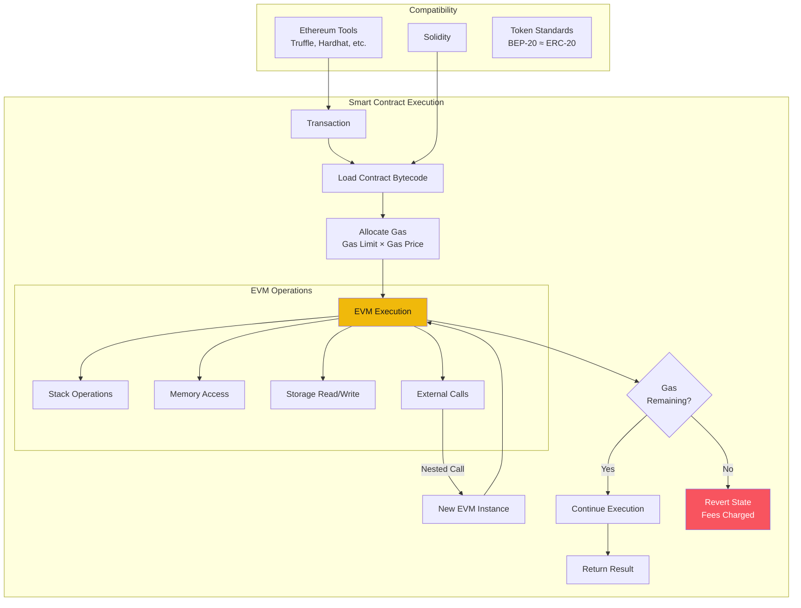
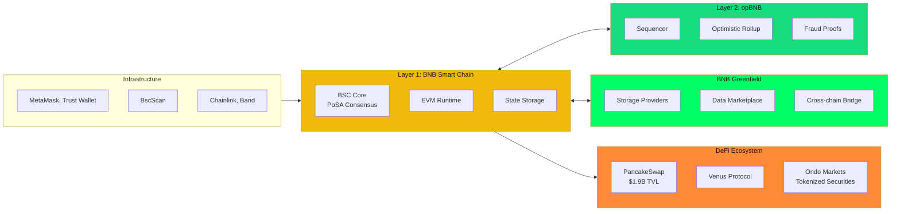
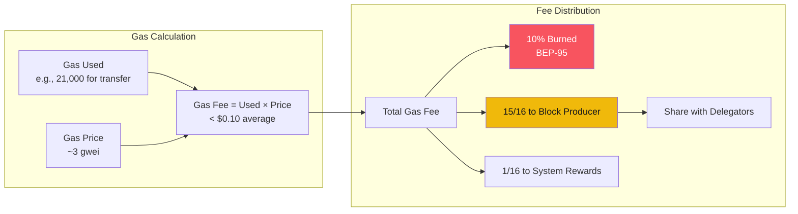
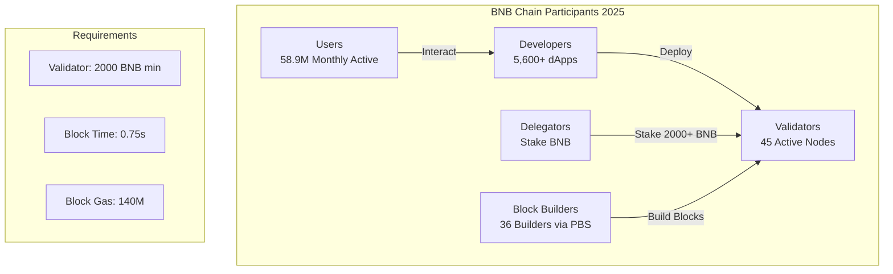
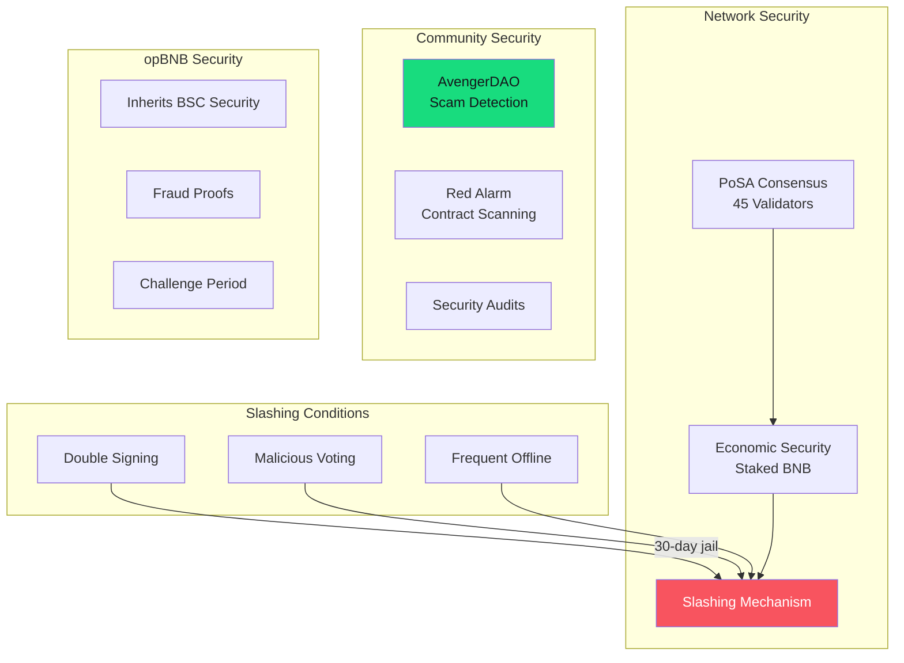

# BNB Chain (Binance Smart Chain) - Technical Overview

## High-Level Architecture

## Transaction Flow

## Proof of Staked Authority (PoSA) Consensus

## EVM Architecture & Smart Contract Execution

## BNB Chain Ecosystem Components

## Gas Fee Structure

## Network Participants

## Security Model

## Key Facts (2025)

### Network Performance
- **Block Time**: ~0.75 seconds (after Maxwell hardfork, June 2025)
- **Finality**: ~6 seconds
- **Block Gas Limit**: 140M (4.6x Ethereum)
- **Average Transaction Fee**: < $0.10
- **Daily Active Users**: 3.6M (highest among L1s)
- **Monthly Active Users**: 58.9M

### Validators & Staking
- **Active Validators**: 45 (21 Cabinets + 24 Candidates)
- **Consensus Validators per Epoch**: 21 (18 Cabinets + 3 Candidates)
- **Minimum Self-Delegation**: 2,000 BNB
- **Fee Burn Rate**: 10% (BEP-95)
- **Validator Reward**: 90% of gas fees

### DeFi Metrics
- **Total Value Locked (TVL)**: $7.1B+
- **30-Day DEX Volume**: $163B+ (June 2025 - #1 chain)
- **PancakeSwap TVL**: $1.9B
- **PancakeSwap DEX Share**: 91.8%

### Ecosystem
- **Total dApps**: 5,600+
- **Block Builders**: 36 (via PBS/BEP-322)
- **Builder API Adoption**: 98% of blocks

### Layer 2 (opBNB)
- **Transaction Cost**: < $0.0001
- **Current TPS**: 5,000-10,000
- **Target TPS**: 20,000 by 2026
- **TVL**: $25.21M

### Market (October 2025)
- **BNB Price**: ~$1,330
- **Market Cap**: ~$170-184B
- **Ranking**: #3-4 by market cap

## Major Upgrades Timeline

| Date | Upgrade | Key Changes |
|------|---------|-------------|
| Apr 2024 | Feynman | Increased validators from 40 to 45 |
| May 2024 | Builder API | PBS implementation (BEP-322) |
| Apr 2025 | Lorentz | Block time reduced to 1.5s |
| Q1 2025 | Pascal | EIP-7702 wallets, BLS12-381 crypto, gas abstraction |
| Jun 2025 | Maxwell | Block time halved to 0.75s |

## Token Standards

| Standard | Chain | Description |
|----------|-------|-------------|
| BEP-2 | BNB Beacon Chain | Native token standard |
| BEP-20 | BNB Smart Chain | ERC-20 equivalent for BSC |

## Use Cases

- **DeFi Trading**: PancakeSwap dominates with 91.8% of DEX volume
- **Tokenized Securities**: Ondo Global Markets for stocks/ETFs
- **Gaming**: opBNB for high-frequency gaming transactions
- **NFTs**: Low-cost minting and trading
- **Cross-chain DeFi**: Bridge assets between chains
- **Decentralized Storage**: BNB Greenfield for data economy

## References

- [BNB Smart Chain Official](https://www.bnbchain.org/en/bnb-smart-chain)
- [Binance Academy - BSC Introduction](https://academy.binance.com/en/articles/an-introduction-to-bnb-smart-chain-bsc)
- [BNB Chain Documentation](https://docs.bnbchain.org/)
- [State of BNB Chain Q1 2025 - Messari](https://messari.io/report/state-of-bnb-chain-q1-2025)
- [BNB Chain Ecosystem 2025 - Dropstab](https://dropstab.com/research/crypto/bnb-ecosystem-in-2025)
- [Cointelegraph - BNB Chain Guide](https://cointelegraph.com/learn/articles/a-beginners-guide-to-the-bnb-chain-the-evolution-of-the-binance-smart-chain)
