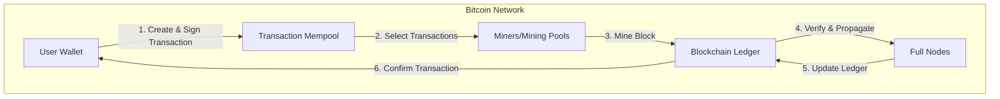
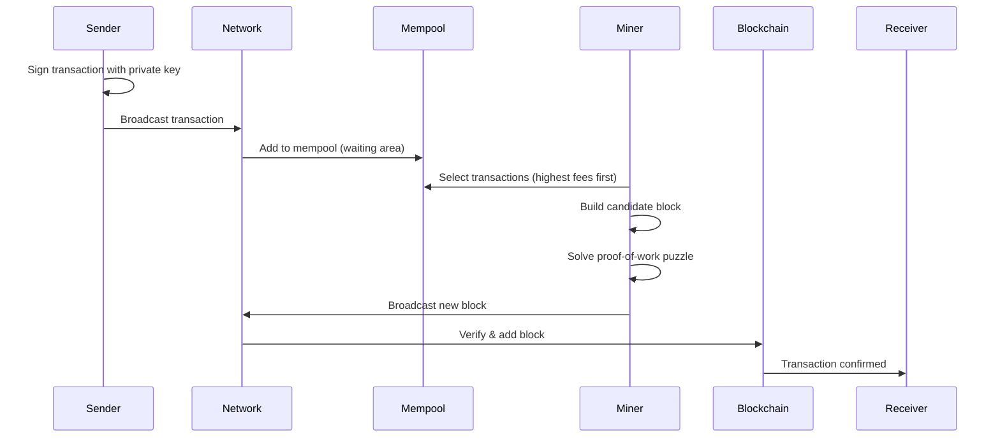
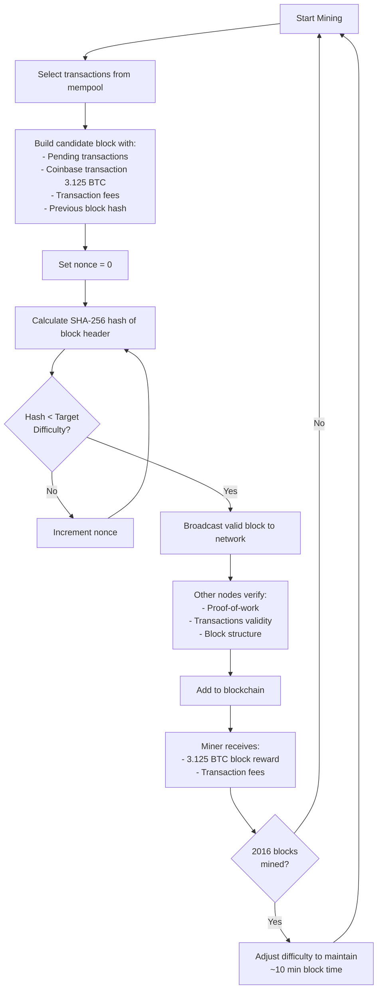
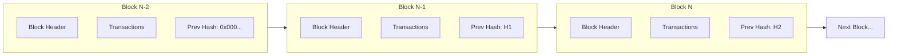
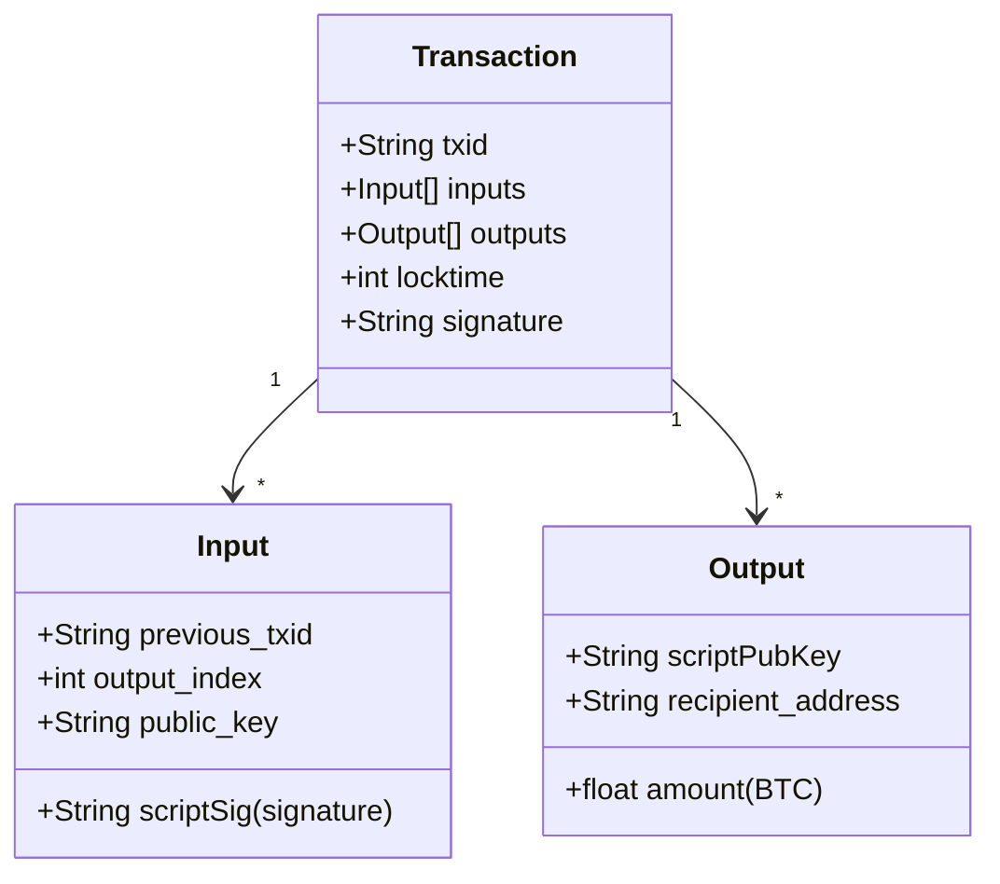
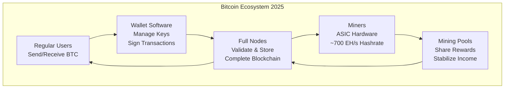
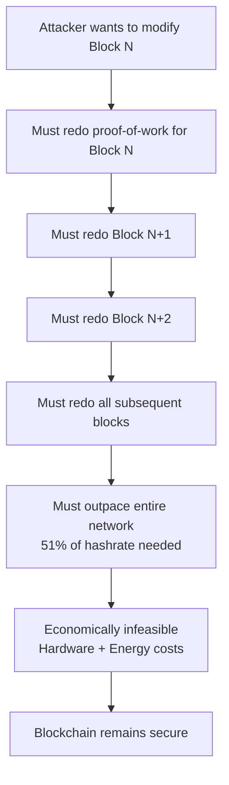

# How Bitcoin Works - Technical Overview

## High-Level Architecture

## Transaction Flow

## Mining Process (Proof-of-Work)

## Blockchain Structure

## Bitcoin Transaction Anatomy

## Network Participants

## Security Model

## Key Facts (2025)

- **Block Time**: ~10 minutes (adjusted every 2,016 blocks)
- **Block Reward**: 3.125 BTC (halved April 2024)
- **Daily Issuance**: ~450 BTC (144 blocks/day)
- **Network Hashrate**: >700 EH/s
- **Difficulty Adjustment**: Every ~2 weeks
- **Mining Hardware**: ASIC machines
- **Mining Strategy**: Mostly pool mining