# C4 Model - Technical Overview

The C4 model is an "abstraction-first" approach to diagramming software architecture, created by Simon Brown between 2006-2011. It provides a hierarchical set of abstractions (software systems, containers, components, and code) that reflect how architects and developers think about and build software. The name "C4" comes from the four core diagram types: Context, Containers, Components, and Code.

## High-Level Architecture

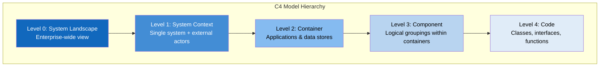

## The Four Core Levels (Zoom Levels)

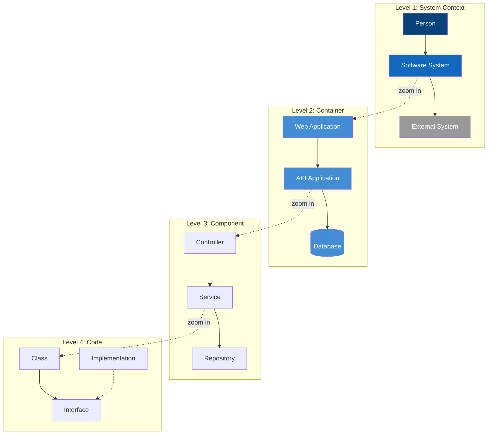

## Core Abstractions

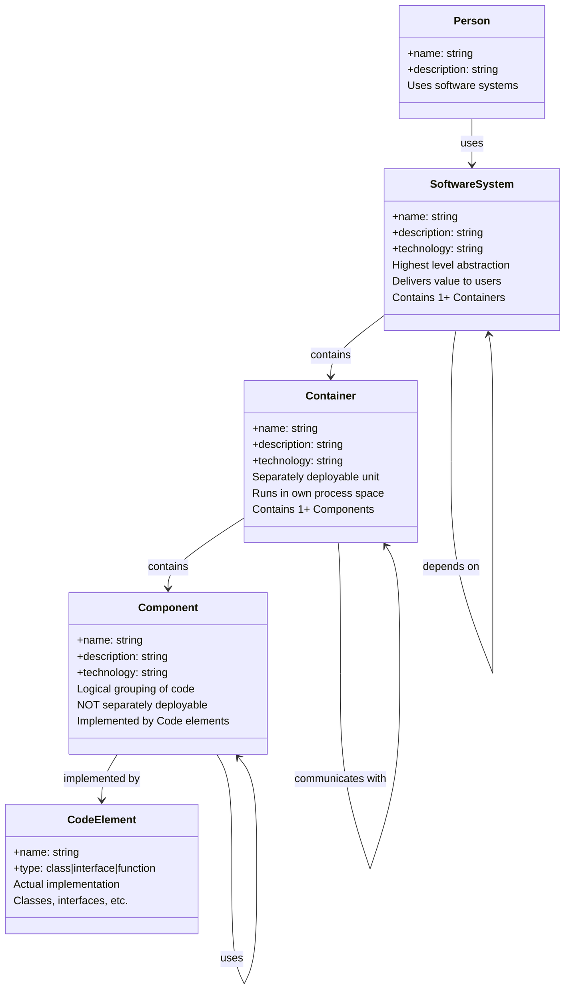

### Abstraction Definitions

| Abstraction | Definition | Example |
|-------------|------------|---------|
| **Person** | Human users, actors, roles, or personas that interact with the system | Customer, Admin, Developer |
| **Software System** | Highest level; delivers value to users (human or not) | E-commerce Platform, Banking System |
| **Container** | Separately deployable/runnable unit; runs in its own process space | Web App, API, Database, Message Queue |
| **Component** | Logical grouping of related functionality; NOT separately deployable | UserController, PaymentService, OrderRepository |
| **Code** | Implementation details: classes, interfaces, functions | UserService.java, IPaymentGateway |

## Diagram Types Overview

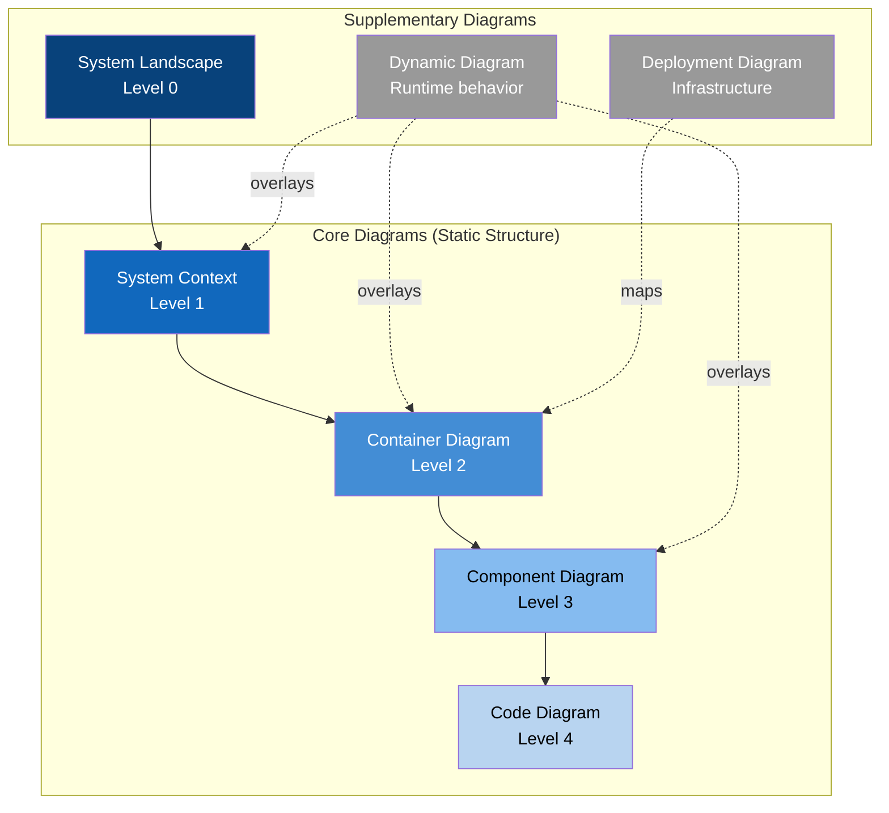

## Level 1: System Context Diagram

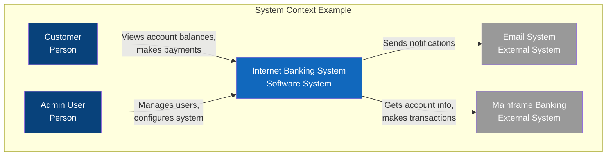

**Purpose**: Show system in the big picture context
**Scope**: Single software system
**Audience**: Everyone (technical and non-technical)
**Shows**: People, the system, and external dependencies
**Recommendation**: Essential for all teams

## Level 2: Container Diagram

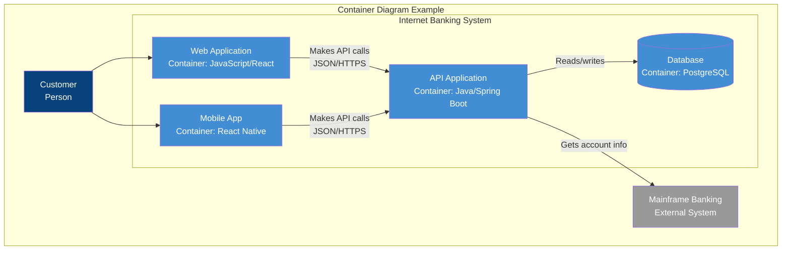

**Purpose**: Show high-level technology choices and responsibilities
**Scope**: Single software system
**Audience**: Technical people (architects, developers, ops)
**Shows**: Containers (apps, data stores), their technologies, and communication
**Recommendation**: Essential for all teams

### What is a Container?

A container is something that needs to be running for the system to work:
- Server-side web application (Java, .NET, Node.js)
- Client-side SPA (React, Angular, Vue)
- Mobile application (iOS, Android, React Native)
- Desktop application (Electron, WPF)
- Database (PostgreSQL, MongoDB, Redis)
- File system / blob storage (S3, Azure Blob)
- Message broker (RabbitMQ, Kafka)
- Serverless function (AWS Lambda, Azure Functions)

## Level 3: Component Diagram

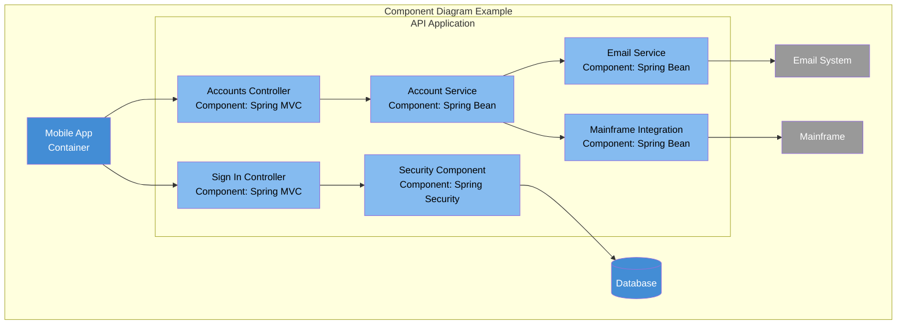

**Purpose**: Decompose a container into its logical components
**Scope**: Single container
**Audience**: Software architects and developers
**Shows**: Components, their responsibilities, technology/implementation
**Recommendation**: Create only if they add value; consider automation

## Supplementary Diagrams

### System Landscape Diagram (Level 0)

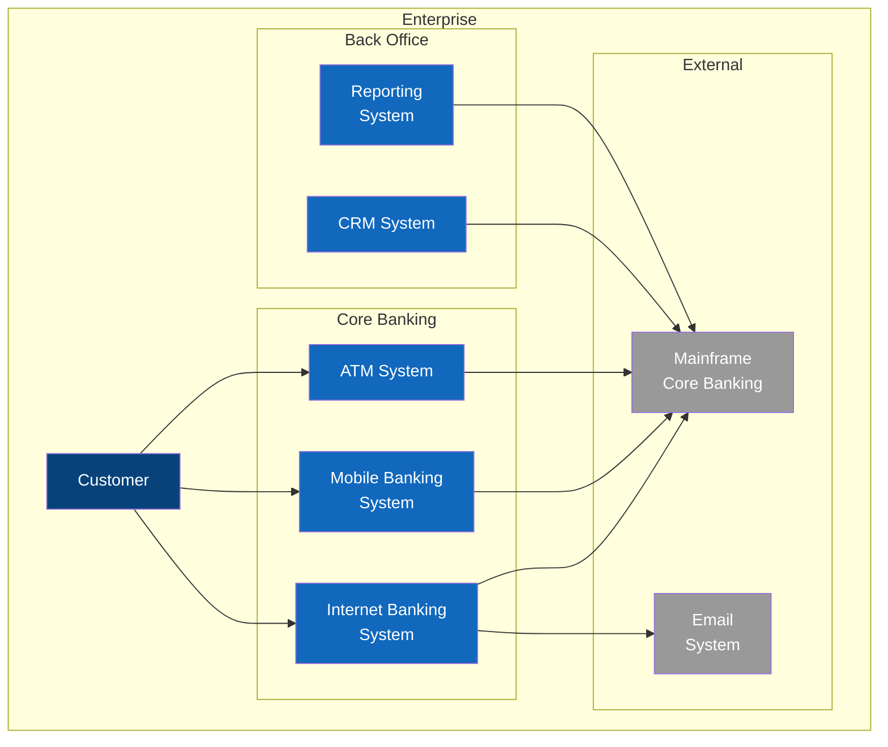

**Purpose**: Enterprise-wide view of all software systems
**Scope**: Organization/enterprise
**Use**: Understanding relationships between multiple systems

### Deployment Diagram

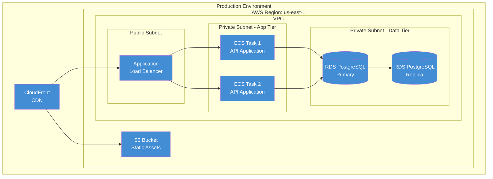

**Purpose**: Map containers to infrastructure
**Scope**: Deployment environment (prod, staging, dev)
**Shows**: Deployment nodes, container instances, infrastructure

### Dynamic Diagram

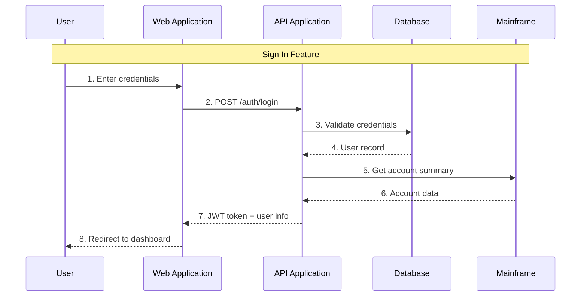

**Purpose**: Show runtime behavior for specific scenarios
**Scope**: Feature or use case
**Shows**: Sequence of interactions between elements

## C4 Model Notation

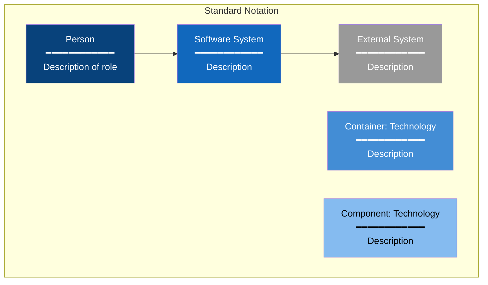

### Notation Principles

1. **Every element has**: Name, Type, Description, Technology (where applicable)
2. **Every relationship has**: Description of the interaction
3. **Every diagram has**: Title, Legend/Key
4. **Colors are optional**: Blue shades for internal, gray for external is common

## Tooling Ecosystem

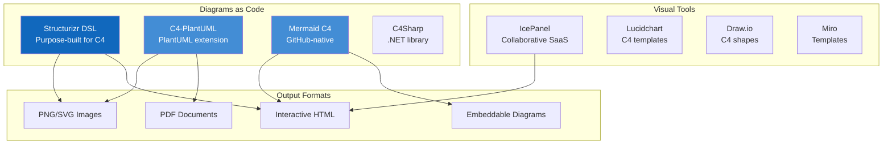

### Tool Comparison

| Tool | Type | Best For | Model Reuse |
|------|------|----------|-------------|
| **Structurizr** | DSL + SaaS | Full C4 workflow, single model → many diagrams | Yes |
| **C4-PlantUML** | Text-based | CI/CD integration, version control | Limited |
| **Mermaid** | Text-based | GitHub/GitLab native rendering | No |
| **IcePanel** | Visual SaaS | Collaborative modeling, interactive | Yes |
| **Draw.io** | Visual tool | Quick diagrams, offline use | No |

## Creating C4 Diagrams: Workflow

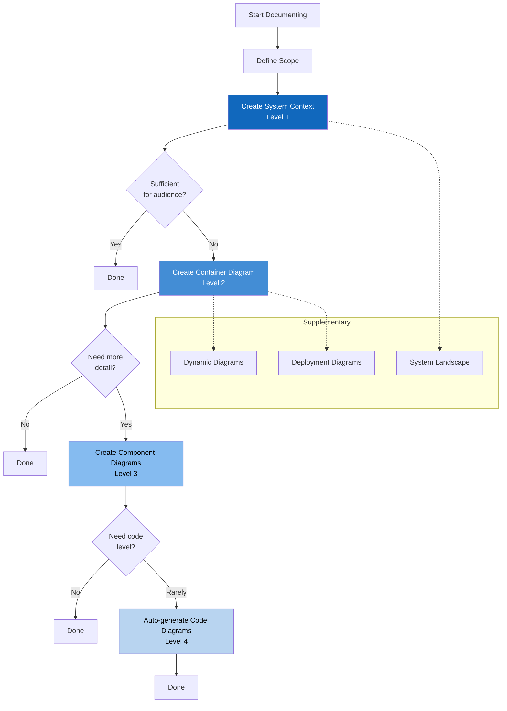

## Key Facts (2025)

- **Created by**: Simon Brown (2006-2011)
- **Based on**: UML and 4+1 Architectural View Model
- **License**: Creative Commons Attribution 4.0
- **Adoption**: Taught to 10,000+ people in ~40 countries
- **Official Book**: "The C4 Model" (O'Reilly, 2024)
- **Primary Tool**: Structurizr (by Simon Brown)
- **Key Principle**: "Diagrams as maps of your code at various zoom levels"

## Best Practices

### Do

1. **Start with Context** - Always create a System Context diagram first
2. **Add legend/key** - Every diagram needs one
3. **Use clear labels** - Describe relationships, not just "uses"
4. **Keep it simple** - Avoid unnecessary detail at each level
5. **Focus on audience** - Context for everyone, Components for devs
6. **Automate when possible** - Generate Code diagrams from source

### Don't

1. **Don't show everything** - Only include what adds value
2. **Don't mix levels** - Keep each diagram at one abstraction level
3. **Don't include deployment at Container level** - Use Deployment diagrams
4. **Don't create Component diagrams for every container** - Only if valuable
5. **Don't manually maintain Code diagrams** - They become stale quickly

## Use Cases

### 1. Onboarding New Team Members
System Context and Container diagrams provide quick understanding of the system

### 2. Architecture Decision Records (ADRs)
Container diagrams show technology choices and their rationale

### 3. Technical Documentation
Progressive zoom from Context → Container → Component for different readers

### 4. Design Reviews
Dynamic diagrams show specific feature implementations

### 5. Infrastructure Planning
Deployment diagrams map containers to infrastructure

### 6. Stakeholder Communication
Context diagrams communicate with non-technical stakeholders

## Structurizr DSL Example

```text
workspace {
    model {
        user = person "Customer" "A user of the banking system"

        bankingSystem = softwareSystem "Internet Banking" {
            webapp = container "Web Application" "React SPA" "JavaScript"
            api = container "API" "Spring Boot" "Java" {
                authController = component "Auth Controller" "Handles authentication"
                accountService = component "Account Service" "Business logic"
            }
            db = container "Database" "PostgreSQL"
        }

        mainframe = softwareSystem "Mainframe Banking" "Core banking system" "Existing System"

        user -> webapp "Uses"
        webapp -> api "Makes API calls" "JSON/HTTPS"
        api -> db "Reads from and writes to"
        api -> mainframe "Gets account information"
    }

    views {
        systemContext bankingSystem "Context" {
            include *
            autolayout lr
        }

        container bankingSystem "Containers" {
            include *
            autolayout lr
        }

        component api "Components" {
            include *
            autolayout lr
        }
    }
}
```

## Sources

- [C4 Model Official Website](https://c4model.com/)
- [C4 Model Diagrams](https://c4model.com/diagrams)
- [System Context Diagram](https://c4model.com/diagrams/system-context)
- [Container Diagram](https://c4model.com/diagrams/container)
- [Component Diagram](https://c4model.com/diagrams/component)
- [C4 Model Abstractions](https://c4model.com/abstractions)
- [C4 Model - Wikipedia](https://en.wikipedia.org/wiki/C4_model)
- [Structurizr](https://structurizr.com/)
- [C4-PlantUML](https://github.com/plantuml-stdlib/C4-PlantUML)
- [Mermaid C4 Diagrams](https://mermaid.js.org/syntax/c4.html)
- [IcePanel - C4 Model Tools](https://icepanel.io/blog/2025-08-28-top-9-tools-for-c4-model-diagrams)
- [Simon Brown's Website](https://simonbrown.je)
