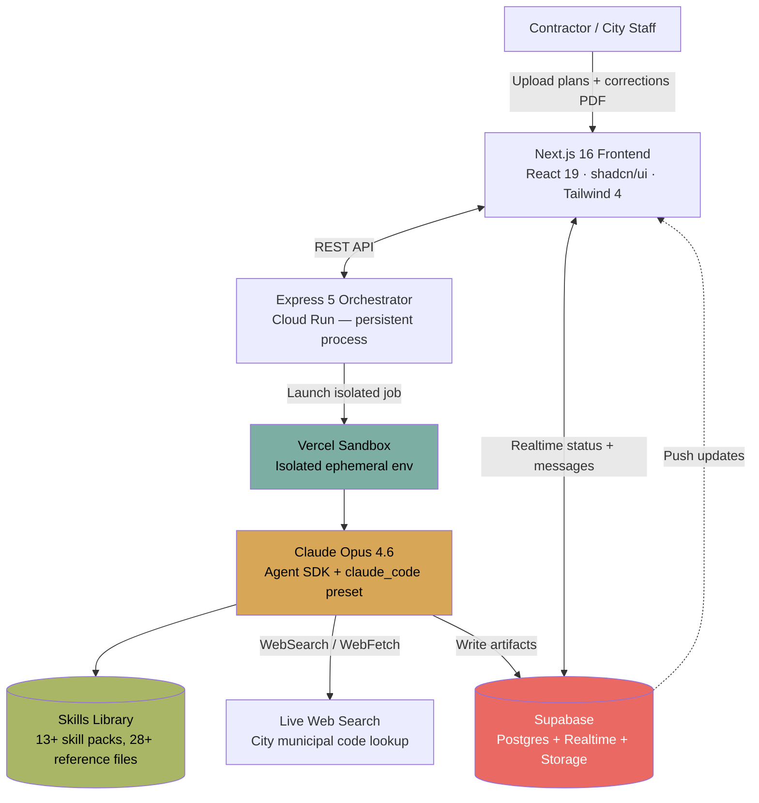
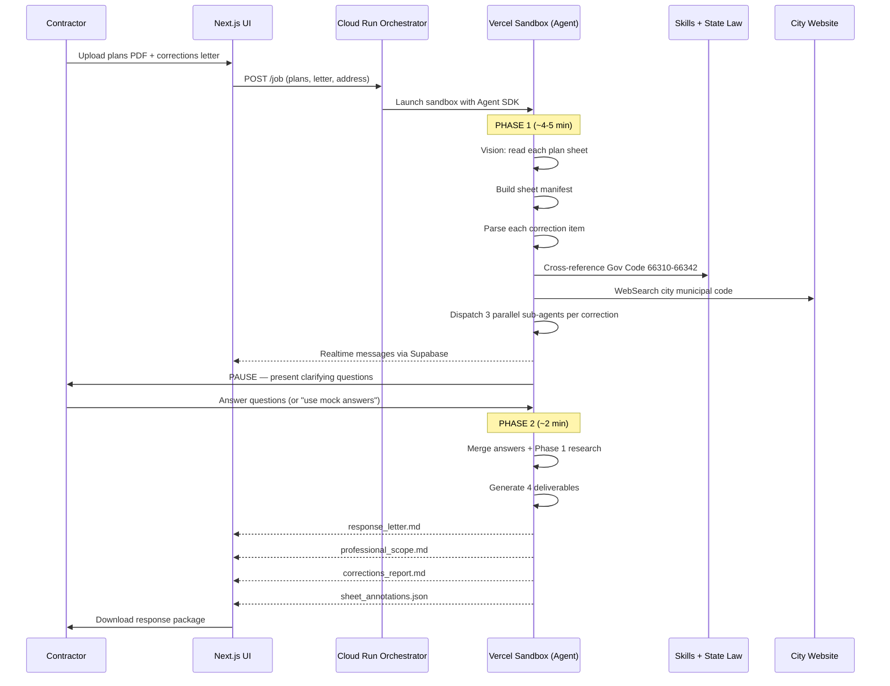
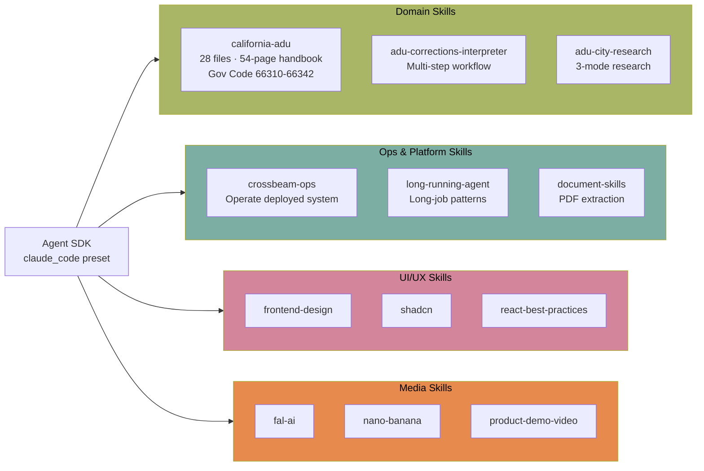
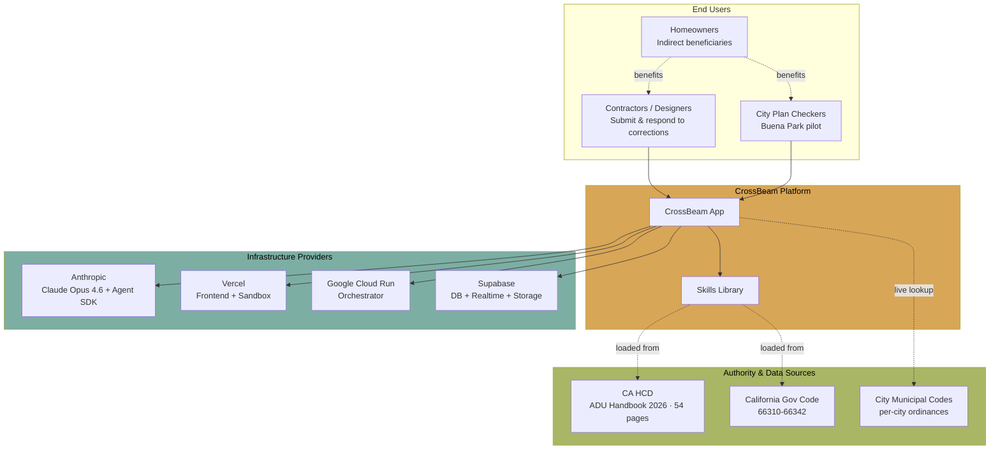

# CrossBeam (cc-crossbeam) - Technical Overview

CrossBeam is an AI-powered ADU (Accessory Dwelling Unit) permit assistant for California, built by Mike Brown. It won first place at Anthropic's "Built with Opus 4.6" Global Claude Code Hackathon (Feb 10–16, 2026). The tool reads architectural plans, interprets city corrections letters, cross-references California state law, and produces a professional response package ready for resubmission.

Notably, the entire project was built with Claude Code by a personal injury lawyer with no traditional software engineering background — a canonical example of "skills-first" AI-assisted development.

## High-Level Architecture

## How It Works — Corrections Flow

The primary flow is a two-phase process with a human-in-the-loop pause.

## Key Concepts

**ADU (Accessory Dwelling Unit)**
A secondary housing unit on a single-family or multifamily residential lot. California's 2017+ laws (Gov Code 66310–66342) aggressively mandate ministerial approval to boost housing supply — but cities still reject 90%+ of first submissions on bureaucratic technicalities.

**Skills-First Design**
Instead of hardcoding domain knowledge into prompts or fine-tuning, CrossBeam uses **Claude Code skills** — structured directories of reference markdown files, decision trees, and quick-reference tables that teach Claude about a specific domain. The agent loads the relevant skill, and its behavior becomes domain-expert-grade without model changes.

**Parallel Sub-Agents**
Each distinct correction item is handled by a dedicated sub-agent. Three run in parallel (for sheet review, code research, and verification). This collapses what would be a 2-hour sequential task into ~20 minutes.

**Spatial Index of Plan Sheets**
Before answering any question, the agent first reads every plan page using Claude Opus 4.6 vision and builds a **sheet manifest** — a map of which sheet contains which information (site plan, floor plan, electrical, Title 24, etc.). All downstream reasoning references this index.

**Decision Tree Router**
The California ADU skill includes a router: `lot type → construction type → modifiers → process`. This narrows the applicable subset of state law before any LLM reasoning happens, keeping context windows focused.

**Long-Running Agent Problem**
Agent runs take 10–30 minutes. Vercel serverless functions time out at 60–300 seconds, so CrossBeam needed Cloud Run for a persistent orchestrator process plus Vercel Sandbox for the isolated filesystem the Agent SDK requires.

## Technical Details

### The Skills Library

### Three Research Modes for City Rules

The `adu-city-research` skill tries three modes in order:

1. **WebSearch discovery** — find the city's ADU ordinance page
2. **WebFetch extraction** — pull text directly from the page
3. **Browser fallback** — for cities with JavaScript-heavy or PDF-only sites

### Deliverables Produced (Phase 2)

| File | Purpose |
|------|---------|
| `response_letter.md` | Professional letter to the city building department |
| `professional_scope.md` | Work breakdown for the design team / engineer |
| `corrections_report.md` | Status dashboard with per-item checklists |
| `sheet_annotations.json` | Per-sheet markup instructions (where to redline) |

### Tech Stack

| Layer | Technology |
|-------|------------|
| Frontend | Next.js 16, React 19, shadcn/ui, Tailwind CSS 4 |
| Orchestrator | Express 5 on Google Cloud Run |
| Agent Runtime | Vercel Sandbox (ephemeral, filesystem-enabled) |
| Model + Framework | Claude Opus 4.6 via Agent SDK, `claude_code` preset |
| Data | Supabase (Postgres, Realtime, Storage) |
| Dev Tooling | Claude Code (entire project authored via Claude Code) |

## Ecosystem / Participants

## Key Facts (2026)

- **Winner** of Anthropic's *Built with Opus 4.6* Claude Code Hackathon — Feb 10–16, 2026
- **~13,000 applicants** to the hackathon; **500 selected** builders; Mike Brown finished first
- Built in **6 days** by a solo non-developer (lawyer) using Claude Code — *"didn't write a single line of code"*
- Targets California's **90%+ ADU permit rejection rate** on first submission
- **$30,000** — average cost of a typical 6-month permit delay for a homeowner
- **429,000+** ADU permits issued in California since 2018
- **Buena Park, CA** (pilot interest) — must permit **8,900+ housing units by 2029**, only issued ~120 in 2024
- **End-to-end run time**: ~20 minutes (Phase 1 ≈ 4–5 min, Phase 2 ≈ 2 min, plus human pause)
- **28+ reference files** in the California ADU skill alone covering HCD Handbook + Gov Code 66310–66342
- **13 custom skills** across domain, ops, UI, and media
- **Repo**: 212 stars, 76 forks (as of 2026-04-23), Python-majority, MIT licensed
- Ships with two additional flow modes: a local-only Claude Code demo (no server, no Supabase) and a **city-side** flow that generates draft corrections letters

## Use Cases

- **Contractor corrections response** — the primary flow; upload plans + corrections letter, get a submission-ready response package
- **Pre-submission permit checklist** — enter address + ADU parameters, get a city-specific checklist before drafting
- **City plan review (pilot)** — cities upload incoming submissions; CrossBeam flags missing signatures, forms, and citations before a human checker touches them, and drafts the corrections letter
- **Local Claude Code demo mode** — `DEMO.md` shows how to run the full pipeline locally with only Claude Code + skills (no Cloud Run, no Supabase, no sandbox) — useful as a reference for skills-first agent design
- **Template for long-running agent apps** — the Cloud Run + Vercel Sandbox + Supabase Realtime pattern generalizes to any job that exceeds serverless timeout limits

## Security & Considerations

- **Document sensitivity**: architectural plans may contain homeowner addresses, structural details, and owner names. Supabase Storage RLS policies and signed URLs are the security boundary for uploaded PDFs.
- **Sandbox isolation**: each agent job runs in an ephemeral Vercel Sandbox, preventing cross-job data leakage through the Agent SDK's filesystem.
- **Authority vs. assistance**: CrossBeam generates drafts — it does **not** replace a licensed engineer's stamp. Output is explicitly designed to be reviewed and signed before resubmission.
- **City-side bias risk**: if municipalities adopt the city-pre-screening flow, automated rejections could amplify existing permit bias. The README positions this flow as open-source and intentionally unbuilt, inviting scrutiny before adoption.
- **Web research freshness**: municipal codes change; the `adu-city-research` skill relies on live WebSearch/WebFetch, so output quality depends on whether city pages are current. No caching layer is documented.
- **Model cost**: 20-minute Opus 4.6 runs with vision over 15+ plan sheets are token-heavy. Production deployment should budget for per-job costs in the several-dollar range.
- **Jurisdictional scope**: explicitly California-only. Other states' ADU laws differ substantially; the decision tree router would need re-authoring for reuse.

## Sources

- [GitHub: mikeOnBreeze/cc-crossbeam](https://github.com/mikeOnBreeze/cc-crossbeam)
- [Meet the winners of our Built with Opus 4.6 Claude Code hackathon — Anthropic](https://claude.com/blog/meet-the-winners-of-our-built-with-opus-4-6-claude-code-hackathon)
- [A lawyer, a road inspector and a cardiologist walk into a coding competition — Digital Digging](https://www.digitaldigging.org/p/a-lawyer-a-road-inspector-and-a-cardiologist)
- [The Lawyer Who Won — HadleyLab](https://hadleylab.org/blogs/2026-03-22-the-lawyer-who-won)
- [Claude Hackathon Winners: 5 Non-Coder Apps in One Week — Medium](https://medium.com/coding-nexus/claude-hackathon-winners-5-non-coder-apps-in-one-week-736425986774)
