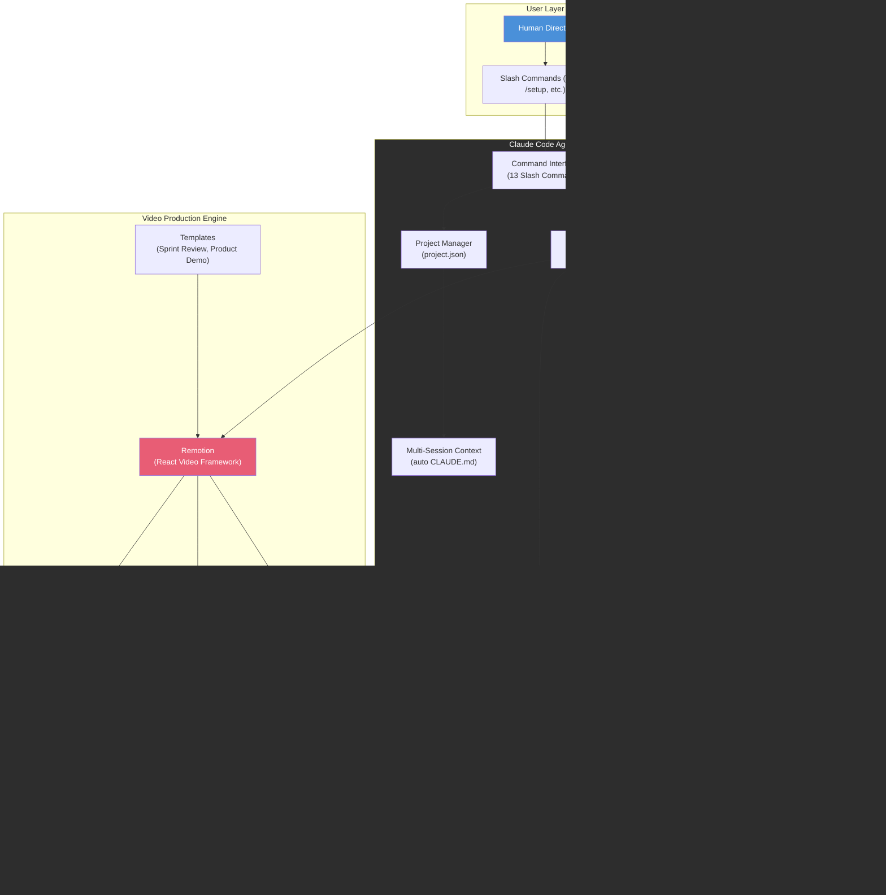
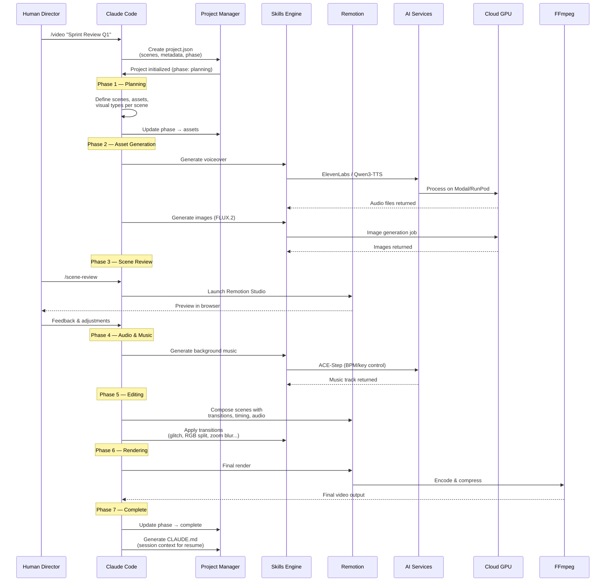
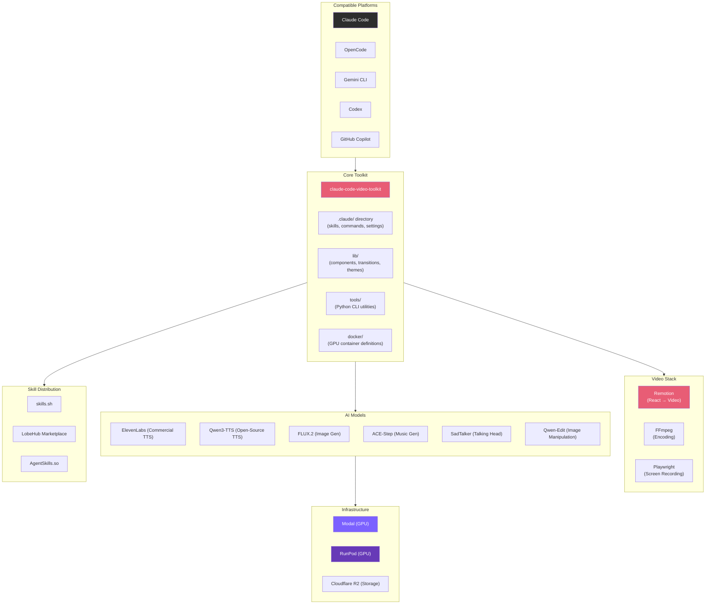

# Claude Code Video Toolkit - Technical Overview

The Claude Code Video Toolkit is an AI-native video production workspace for Claude Code, created by DigitalSamba. It provides an integrated environment where Claude Code can autonomously generate professional videos — from concept through final rendering — using React-based programmatic video (Remotion), AI audio generation, cloud GPU processing, and a structured multi-session project lifecycle.

---

## High-Level Architecture

---

## How It Works — Video Production Lifecycle

---

## Skills & Commands Architecture

```mermaid
graph LR
    subgraph Skills["8 Skills (Knowledge Domains)"]
        S1["remotion<br/>React video framework"]
        S2["elevenlabs<br/>AI voice synthesis"]
        S3["ffmpeg<br/>Media processing"]
        S4["playwright-recording<br/>Screen capture"]
        S5["frontend-design<br/>Visual refinement"]
        S6["qwen-edit<br/>AI image manipulation"]
        S7["acestep<br/>Music generation"]
        S8["runpod<br/>Cloud GPU mgmt"]
    end

    subgraph Commands["13 Slash Commands"]
        C1["/video<br/>Project create/resume"]
        C2["/setup<br/>Initial configuration"]
        C3["/scene-review<br/>Remotion Studio preview"]
        C4["/design<br/>Visual refinement"]
        C5["/template<br/>Template management"]
        C6["/generate-voiceover<br/>Speech synthesis"]
        C7["/brand<br/>Visual identity"]
        C8["/record-demo<br/>Screen recording"]
        C9["+ 5 more commands"]
    end

    subgraph PythonTools["Python CLI Tools"]
        direction TB
        PT1["Project Integration (5)<br/>voiceover, music, SFX,<br/>Qwen3-TTS, ACE-Step"]
        PT2["Utilities (4)<br/>revoice, add music,<br/>rebrand, watermark detect"]
        PT3["Cloud GPU (7)<br/>image edit, upscale,<br/>remove watermark, talking head,<br/>music gen, TTS, FLUX.2"]
    end

    Commands --> Skills
    Skills --> PythonTools

    style S1 fill:#E85D75,color:#fff
    style S2 fill:#4A90D9,color:#fff
    style S3 fill:#388E3C,color:#fff
    style S4 fill:#F57C00,color:#fff
    style S5 fill:#AB47BC,color:#fff
    style S6 fill:#00ACC1,color:#fff
    style S7 fill:#FFB300,color:#000
    style S8 fill:#673AB7,color:#fff
```

---

## Key Concepts

### Programmatic Video with Remotion
Videos are not edited in a traditional timeline — Claude Code writes **TypeScript/React components** that describe each frame. Remotion renders these into actual video. This means every visual element (text, images, animations, transitions) is code, making it fully reproducible, version-controlled, and AI-authorable.

### Skills as Knowledge Domains
Skills are markdown files in `.claude/skills/` that give Claude Code deep domain expertise. Each skill contains patterns, best practices, and API knowledge for a specific tool (e.g., FFmpeg flags, Remotion animation patterns, ElevenLabs API usage). Skills are loaded into Claude's context automatically.

### Multi-Session Project Lifecycle
Each project follows a structured 7-phase lifecycle: **planning → assets → review → audio → editing → rendering → complete**. State is persisted in `project.json`, and a per-project `CLAUDE.md` is auto-generated so Claude Code can seamlessly resume work across separate sessions without manual re-briefing.

### Brand System
Visual identity is configurable through `brands/` directories containing color palettes, typography, voice configuration, logos, and backgrounds. Multiple brand profiles can coexist, enabling reuse across different products or clients.

### Cloud GPU Model
AI-heavy tasks (image generation, TTS, music, talking heads) run on personal cloud GPU accounts via Modal or RunPod — not through expensive SaaS APIs. This keeps costs at **$0.01–$0.15 per job**, with typical monthly spend of **$1–2**.

---

## Technical Details

### Transitions Library (11 Effects)

| Category | Effects |
|----------|---------|
| Custom | Glitch, RGB Split, Zoom Blur, Light Leak, Clock Wipe, Pixelate, Checkerboard |
| Remotion Official | Slide, Fade, Wipe, Flip |

### Reusable Components (11)
The `lib/` directory provides pre-built React components for common video elements — titles, code blocks, metrics displays, comparison layouts, etc. These integrate with the theme system for consistent styling.

### Templates
Three pre-built video templates provide starting structures:
- **Sprint Review** — Two versions including a modular architecture variant
- **Product Demo** — Marketing-focused aesthetics with feature showcases

### Python Tools Ecosystem (16 Tools)
- **Project Integration** (5): Voiceover generation, music composition, sound effects, Qwen3-TTS, ACE-Step
- **Utilities** (4): Video revoicing, music addition, NotebookLM rebranding, watermark detection
- **Cloud GPU** (7): Image editing/style transfer, upscaling, watermark removal, talking head generation, music gen, TTS, FLUX.2 image generation

### Cloud GPU Deployment

| Provider | Pricing | Setup |
|----------|---------|-------|
| **Modal** (recommended) | $30/mo free tier, ~$0.01–0.10/job | Docker containers via `docker/modal-*/app.py` |
| **RunPod** | Pay-per-second, no minimums | Pre-built images from `ghcr.io` registry |

### Storage
Cloudflare R2 provides the storage layer — 10GB free tier with zero egress fees, used for transferring generated assets between cloud GPU and local environment.

---

## Ecosystem View

---

## Key Facts (2025–2026)

- **GitHub**: ~146 stars, 21 forks (as of March 2026)
- **License**: MIT
- **Requirements**: Node.js 18+, Python 3.9+, Claude Code
- **FFmpeg Skill**: 562+ weekly installs across platforms (first seen Jan 2026)
- **Cost**: Typical cloud GPU usage $1–2/month; individual jobs $0.01–$0.15
- **Remotion Skill Virality**: The official Remotion skill (related ecosystem) got 6M+ views and 25k+ installs in its first week (Jan 2026)
- **Open-Source AI Trend**: Qwen3-TTS positioned to replace ElevenLabs as default — "arguably better results with significantly less effort and cost"
- **Example Projects**: 6 completed showcases from sprint reviews to fully AI-generated video essays
- **Latest Example**: "The Space Between" (March 2026) — fully AI-generated video essay using FLUX.2 avatar, Qwen3-TTS voice, and SadTalker animation

---

## Use Cases

### Sprint Review Videos
The toolkit's original purpose — automatically generating sprint review videos from demo recordings and feature descriptions. Templates and brand profiles streamline recurring production.

### Product Demo Videos
Marketing-oriented explainer videos with polished transitions, voiceover narration, and branded visual identity. Claude Code composes scenes from screenshots, screen recordings, and generated assets.

### AI-Generated Video Essays
Fully synthetic content using AI-generated avatars (FLUX.2), voices (Qwen3-TTS), and animated talking heads (SadTalker) — no human footage required.

### Screen Recording Demos
Using Playwright, Claude Code can navigate applications, click through flows, fill forms, and capture everything as a recording — then compose it into a polished video with overlays and narration.

### Internal Communications
Company updates, onboarding videos, and training content that can be regenerated when information changes — because everything is code.

---

## Security & Considerations

- **API Key Management**: Multiple API keys required (ElevenLabs, Modal, RunPod, Cloudflare R2). The `.env` pattern is used; ensure keys are never committed to version control.
- **Cloud GPU Costs**: While typically low ($1–2/month), unmonitored usage or misconfigured endpoints could incur unexpected charges. Modal's free tier caps at $30/month.
- **Generated Content**: AI-generated voices and images may raise IP and consent considerations. ElevenLabs voice cloning requires explicit consent from voice owners.
- **Open-Source Model Risks**: Self-hosted models (Qwen3-TTS, FLUX.2, SadTalker) run on personal cloud accounts — responsibility for model behavior and outputs rests with the user.
- **Remotion Licensing**: Remotion has a company license requirement for commercial use (free for individuals and small companies under revenue threshold).
- **Data in Transit**: Assets move between local machine, cloud GPU, and Cloudflare R2. Ensure TLS is enforced and R2 buckets are properly access-controlled.

---

## Sources

- [digitalsamba/claude-code-video-toolkit — GitHub](https://github.com/digitalsamba/claude-code-video-toolkit)
- [FFmpeg Skill — LobeHub Marketplace](https://lobehub.com/skills/digitalsamba-claude-code-video-toolkit-ffmpeg)
- [FFmpeg Skill — skills.sh](https://skills.sh/digitalsamba/claude-code-video-toolkit/ffmpeg)
- [Remotion Skill — AgentSkills.so](https://agentskills.so/skills/digitalsamba-claude-code-video-toolkit-remotion)
- [wilwaldon/Claude-Code-Video-Toolkit — GitHub](https://github.com/wilwaldon/Claude-Code-Video-Toolkit)
- [Video Post-Production Pipeline Blog](https://wonderingaboutai.substack.com/p/i-built-a-video-post-production-pipeline)
