# Claude Code Web - Technical Architecture Overview

## Overview

Claude Code Web is Anthropic's browser-based agentic coding assistant that allows developers to delegate coding tasks directly from their browser. Launched in November 2025 as a research preview, it represents a fundamental shift from traditional desktop IDE tools by executing all operations within secure, isolated cloud sandboxes on Anthropic's infrastructure.

Unlike the CLI version that runs locally, Claude Code Web provides:
- **Browser-based access** - No terminal or local installation required
- **Parallel task execution** - Run multiple coding jobs simultaneously
- **Secure sandbox isolation** - gVisor-based kernel-level isolation
- **GitHub integration** - Direct repository access via OAuth

## High-Level Architecture

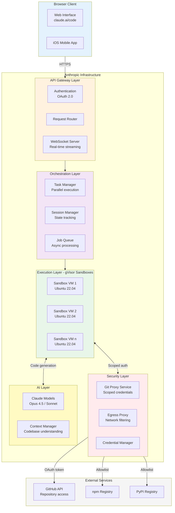

## Core Architecture Components

### 1. Sandbox Execution Environment

Each Claude Code Web session creates an isolated container with:

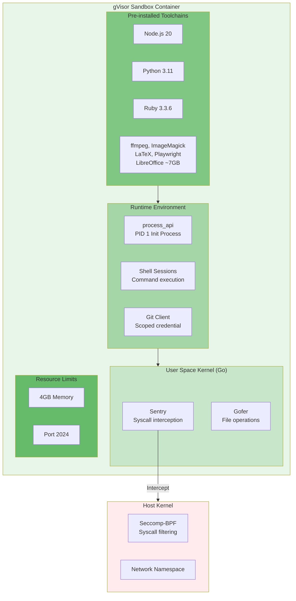

### 2. Security Architecture - gVisor Isolation

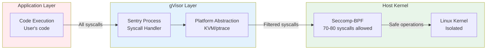

**Key Security Features:**

| Feature | Implementation | Purpose |
|---------|---------------|---------|
| Kernel Isolation | gVisor user-space kernel | Prevent direct hardware access |
| Syscall Filtering | Seccomp-BPF (70-80 of 300+ allowed) | Block dangerous operations |
| Network Control | Egress proxy with JWT validation | Restrict outbound connections |
| Filesystem Isolation | Read/write only to working directory | Prevent file system escape |
| Credential Protection | Scoped credentials via proxy | Never expose real tokens |

### 3. GitHub Integration Flow

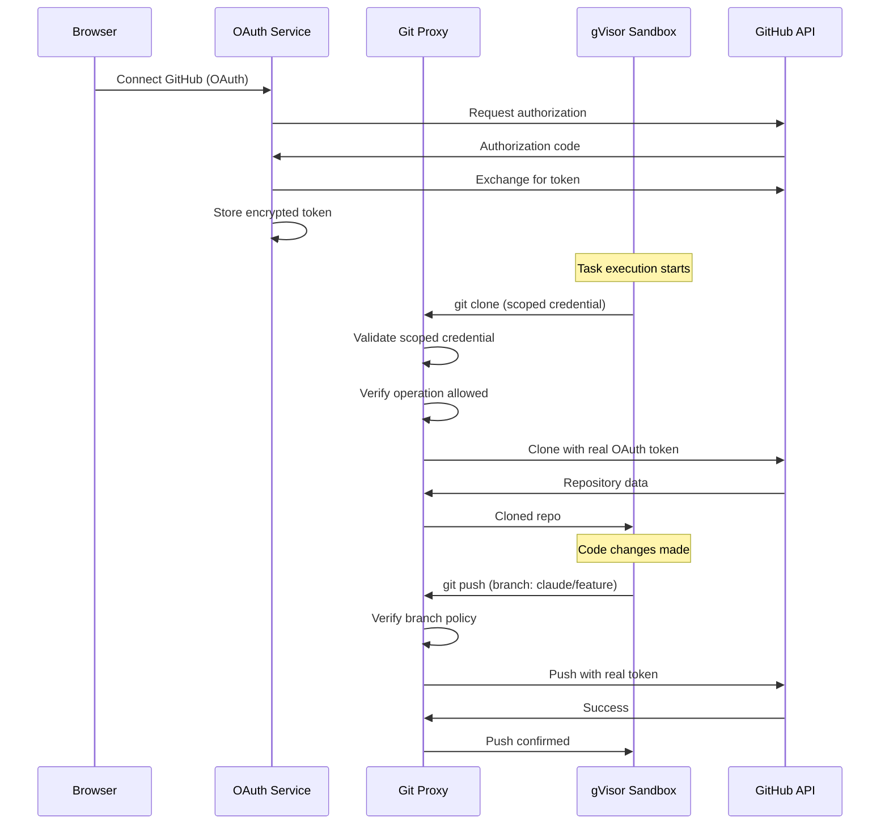

**Git Proxy Security Model:**
- Real OAuth tokens **never** enter the sandbox
- Scoped credentials are validated per-operation
- Branch restrictions enforced at proxy level
- All git interactions logged and auditable

### 4. Network Egress Architecture

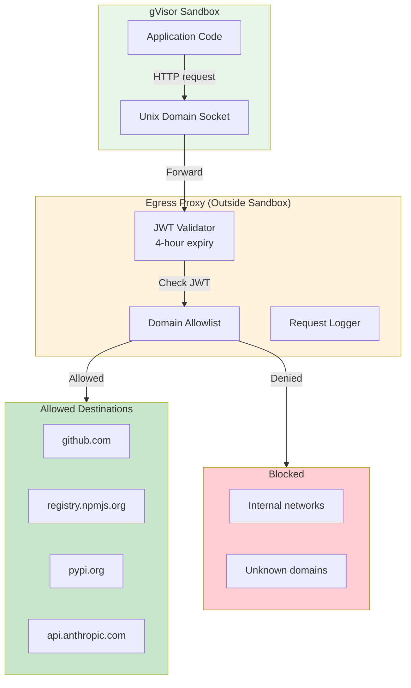

## Task Execution Flow

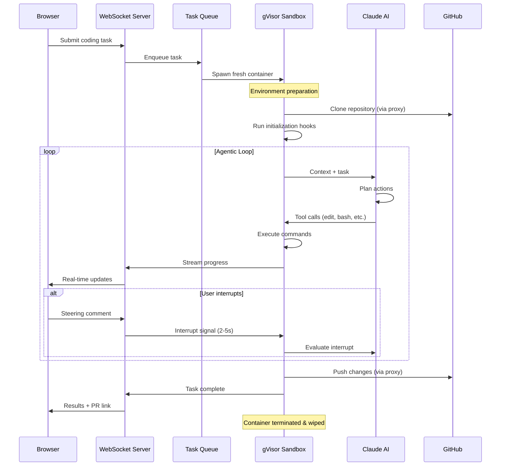

## Parallel Task Execution

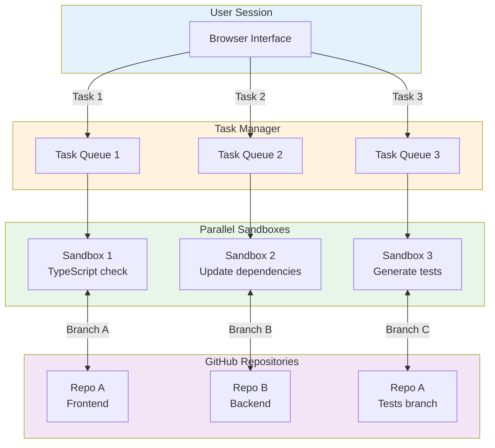

**Parallel Execution Benefits:**
- Run multiple tasks across different repositories
- No additional cost - pay for compute time, not concurrent sessions
- Each sandbox is fully isolated
- Rate limits consumed proportionally

## Real-Time Communication

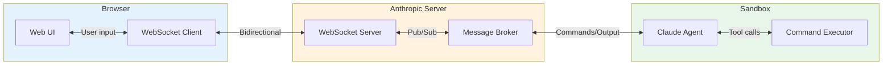

**Communication Features:**
- Bidirectional WebSocket for real-time updates
- Follow-up comments evaluated every 2-5 seconds
- High-priority abort commands preempt within milliseconds
- Streaming output for long-running tasks

## Container Lifecycle

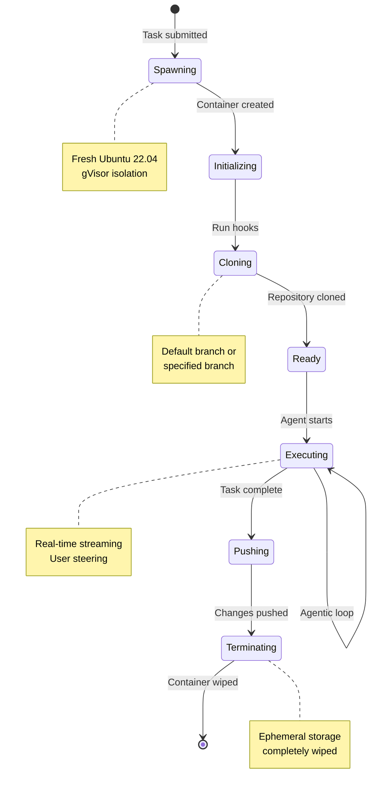

## Key Facts (2025)

### Usage Statistics
- **115,000+ developers** actively using Claude Code
- **195 million lines** of code processed weekly
- **10x user growth** since May 2025 launch
- **90%** of Claude Code itself written by AI

### Revenue & Market
- **$500M+** annualized revenue from Claude Code
- **$130M** estimated from Claude Code Web specifically
- Part of Anthropic's **$5B annualized revenue**
- **5.5x revenue jump** with **300% user growth**

### Technical Specs
- **~7GB** universal container image
- **4GB** memory limit per sandbox
- **4-hour** JWT token expiry
- **84%** reduction in permission prompts with sandboxing

### Availability
- **Pro plan** ($20/month)
- **Max plans** ($100-200/month)
- **Team & Enterprise** users with premium seats

## Use Cases

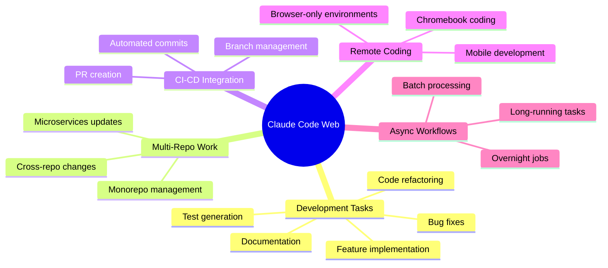

## Security Considerations

### Strengths
1. **Defense in Depth**: Multiple isolation layers (gVisor + Seccomp + Network)
2. **Credential Protection**: Real tokens never enter sandbox
3. **Auditable Operations**: All git operations logged at proxy
4. **Ephemeral Storage**: No data persistence after task completion
5. **Restricted Network**: Allowlist-based egress filtering

### Considerations
1. **Trust Model**: Code executes on Anthropic infrastructure
2. **Network Access**: Some external access required for packages
3. **Repository Access**: OAuth grants broad repository permissions
4. **Rate Limits**: Parallel tasks consume proportionally more

## Comparison: Web vs CLI

| Feature | Claude Code Web | Claude Code CLI |
|---------|----------------|-----------------|
| Execution | Anthropic cloud sandbox | Local machine |
| Security | gVisor + proxy isolation | OS-level sandboxing |
| GitHub Auth | OAuth (scoped proxy) | Personal tokens/SSH |
| Parallel Tasks | Native support | Manual (multiple terminals) |
| Network | Allowlist egress proxy | Full network access |
| Persistence | Ephemeral per-task | Persistent local |
| Mobile Access | Yes (iOS app) | No |
| Offline | No | Yes |

## Architecture Principles

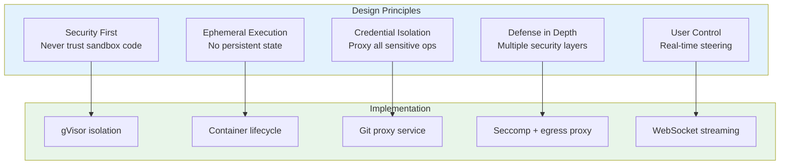

## Sources

- [Claude Code on the web | Anthropic](https://www.anthropic.com/news/claude-code-on-the-web)
- [Claude Code Docs - On the Web](https://code.claude.com/docs/en/claude-code-on-the-web)
- [Making Claude Code More Secure | Anthropic Engineering](https://www.anthropic.com/engineering/claude-code-sandboxing)
- [Claude Code Sandboxing Docs](https://code.claude.com/docs/en/sandboxing)
- [How Claude Code is Built | Pragmatic Engineer](https://newsletter.pragmaticengineer.com/p/how-claude-code-is-built)
- [Claude Code Architecture | ZenML](https://www.zenml.io/llmops-database/claude-code-agent-architecture-single-threaded-master-loop-for-autonomous-coding)
- [Claude Code Best Practices | Anthropic](https://www.anthropic.com/engineering/claude-code-best-practices)
- [Claude Code reaches 115,000 developers | PPC Land](https://ppc.land/claude-code-reaches-115-000-developers-processes-195-million-lines-weekly/)
- [Reverse Engineering Claude's Sandbox](https://michaellivs.com/blog/sandboxed-execution-environment)
