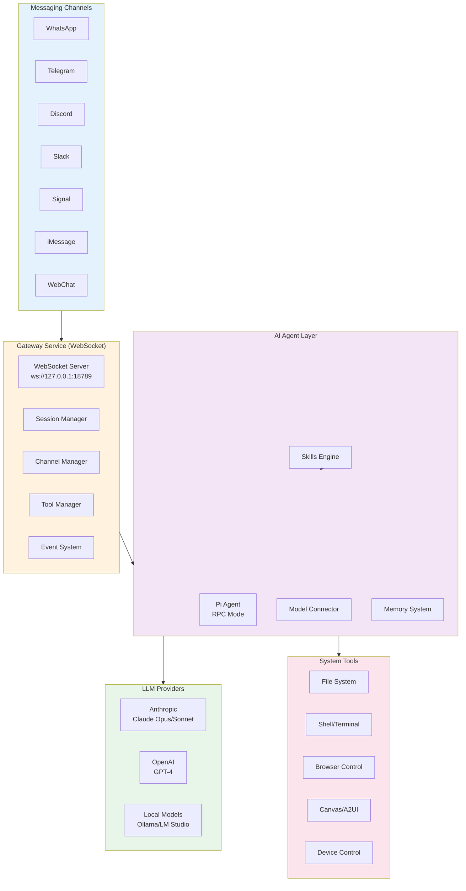
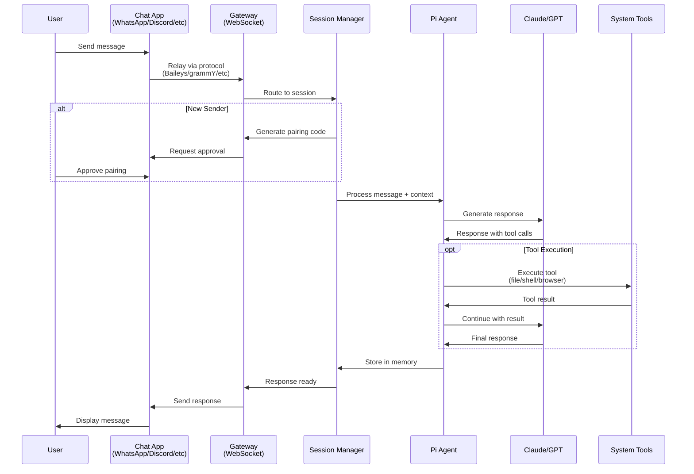
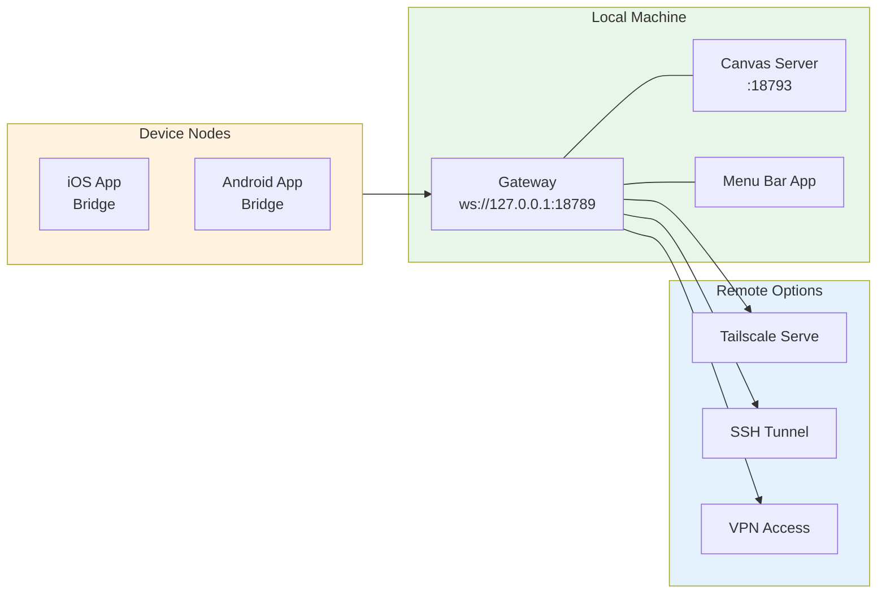
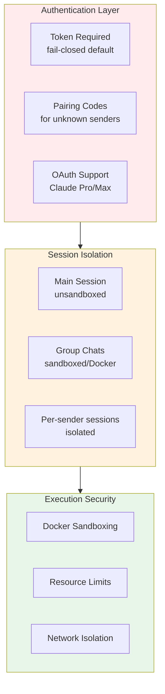
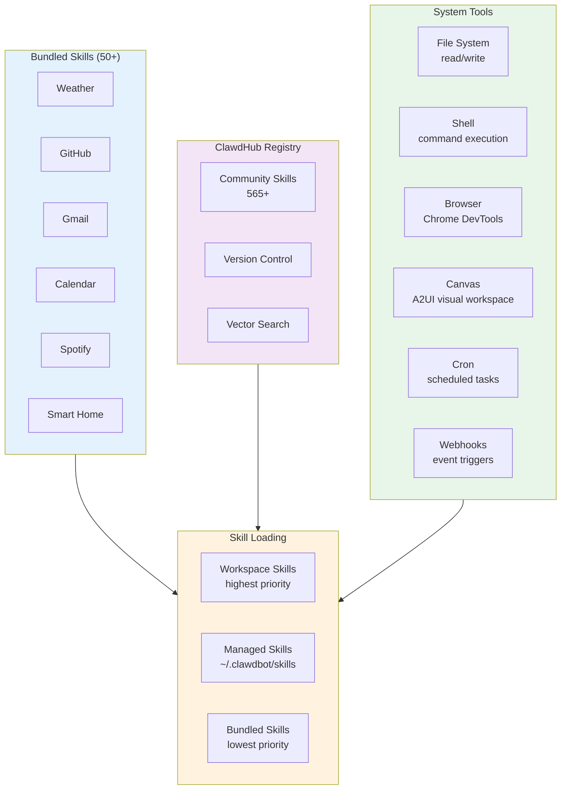
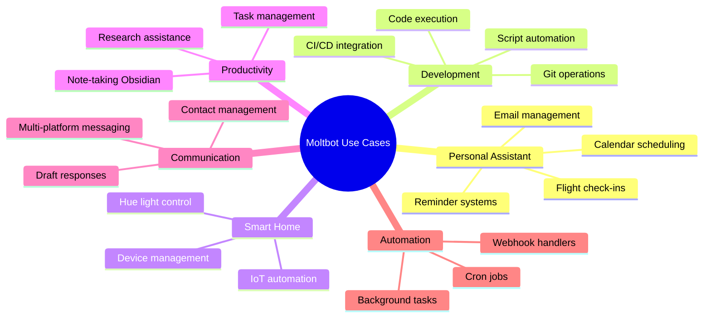

# Clawdbot (Moltbot) - Technical Overview

## Overview

Clawdbot (now rebranded as **Moltbot**) is an open-source, self-hosted personal AI assistant created by Peter Steinberger (founder of PSPDFKit). Unlike cloud-based AI assistants that live in browser tabs, Moltbot runs locally on your machine and connects to messaging apps you already use (WhatsApp, Telegram, Discord, Slack, Signal, iMessage). It's described as "Claude with hands" - an AI that doesn't just chat but actually executes tasks autonomously.

The project went viral in January 2026, reaching 60,000+ GitHub stars within 72 hours of launch, making it one of the fastest-growing open-source projects in history. Following a trademark dispute with Anthropic over the name's similarity to "Claude," the project rebranded from Clawdbot to Moltbot.

## High-Level Architecture



## How It Works



## Key Concepts

### Gateway-Centric Architecture

The heart of Moltbot is a persistent **Gateway service** that:
- Manages all channel connections through a single WebSocket control plane
- Routes messages between chat apps and the AI agent
- Maintains session state and persistent memory
- Runs as a daemon (launchd on macOS, systemd on Linux)

### Multi-Channel Messaging

The system unifies conversations across platforms:
- **WhatsApp Web** via Baileys protocol
- **Telegram Bot** via grammY library
- **Discord** via discord.js
- **iMessage** via imsg CLI (macOS only)
- **Slack, Signal, Mattermost** via respective APIs

Users get the same assistant, same memory, same context - regardless of which app they use.

### Persistent Memory

Unlike stateless chatbots, Moltbot remembers:
- Conversation history across sessions
- User preferences mentioned weeks ago
- Context from previous interactions
- Learned patterns and behaviors

### Skills System

Skills are modular capabilities defined in `SKILL.md` files:

```yaml
---
name: skill-identifier
description: Brief explanation of functionality
metadata: {"moltbot":{"requires":{"bins":["tool"],"env":["VAR"]}}}
---

# Instructions for the AI agent
[Markdown content explaining how to use the skill]
```

Skills are loaded from three locations (in precedence order):
1. `<workspace>/skills` - Project-specific
2. `~/.clawdbot/skills` - User-managed
3. Bundled skills - Shipped with install

## Technical Details

### System Requirements

- **Runtime**: Node.js 22+
- **Platforms**: macOS, Linux, Windows (via WSL)
- **Memory**: 4GB+ recommended
- **Network**: Loopback for local, Tailscale/SSH for remote

### Installation

```bash
npm install -g moltbot@latest
moltbot onboard --install-daemon
moltbot channels login  # QR pairing for WhatsApp
moltbot gateway --port 18789
```

### Configuration

Primary config file: `~/.clawdbot/moltbot.json`

```json
{
  "agent": {
    "model": "anthropic/claude-opus-4-5"
  },
  "channels": {
    "whatsapp": {
      "allowFrom": ["+15555550123"],
      "groups": { "*": { "requireMention": true } }
    }
  },
  "sandbox": {
    "mode": "non-main"
  }
}
```

### Network Topology



### Security Model



## Skills & Tools Ecosystem



### SKILL.md Format

Skills follow the Agent Skill convention:

```yaml
---
name: github-integration
description: Manage GitHub repos, issues, and PRs
metadata: {"moltbot":{"requires":{"bins":["gh"],"env":["GITHUB_TOKEN"]},"emoji":"octocat"}}
---

# GitHub Integration

## Available Commands
- Create issues and pull requests
- List and review PRs
- Manage repository settings

## Usage
When the user asks about GitHub operations...
```

Token impact per skill: ~24 tokens + field content lengths.

## Key Facts (2026)

- **GitHub Stars**: 68,000+ (grew from 9K to 60K in 72 hours)
- **Discord Community**: 8,900+ members
- **Contributors**: 130+
- **Bundled Skills**: 50+
- **Community Skills**: 565+
- **Launch Date**: January 2026
- **Creator**: Peter Steinberger (@steipete)
- **API Costs**: $20-100/month typical, $100-300/month heavy usage
- **Trademark Rebrand**: January 27, 2026 (Clawdbot to Moltbot)

## Use Cases



### Common Workflows

1. **Morning Briefings**: Proactive daily summaries of emails, calendar, weather
2. **Smart Home Control**: "Turn off all lights" via any messaging app
3. **Code Assistance**: Execute scripts, manage repos, run tests
4. **Document Processing**: Read, analyze, and summarize files
5. **Research**: Web browsing, data extraction, report generation
6. **Multi-App Orchestration**: Coordinate between Slack, GitHub, Notion, etc.

## Security Considerations

### Potential Risks

1. **Full System Access**: Requires admin/root for full functionality
2. **Code Execution**: Can run arbitrary shell commands
3. **Credential Storage**: API keys stored locally
4. **Network Exposure**: Gateway can be exposed via Tailscale/SSH
5. **Reverse Proxy Issues**: Localhost auto-auth can leak behind proxies

### Mitigations

- **Fail-closed authentication**: No token = no WebSocket connection
- **Pairing codes**: Unknown senders must be explicitly approved
- **Docker sandboxing**: Group/channel sessions run in containers
- **Session isolation**: Per-sender or per-channel session boundaries
- **Resource limits**: CPU, memory, and network constraints

### Security Incident (January 2026)

Exposed control panels due to authentication bypass when running behind reverse proxies. Users were advised to configure proper authentication tokens even for localhost deployments.

## Comparison with Alternatives

| Feature | Moltbot | ChatGPT | Claude.ai | Siri/Alexa |
|---------|---------|---------|-----------|------------|
| Self-hosted | Yes | No | No | No |
| Persistent memory | Yes | Limited | Limited | Limited |
| Multi-platform | Yes | Web/App | Web/App | Voice |
| System access | Full | No | No | Limited |
| Custom skills | Yes | Plugins | MCP | Skills |
| Proactive | Yes | No | No | Limited |
| Open source | Yes | No | No | No |

## Cost Structure

### API Costs (Anthropic Claude)

- **Claude Sonnet**: $3 input / $15 output per 1M tokens
- **Claude Opus**: $15 input / $75 output per 1M tokens
- **Typical usage**: $20-50/month moderate, $100-300/month heavy

### Hardware Options

- **Mac Mini**: ~$599 + API costs
- **VPS**: ~$5-20/month + API costs
- **Self-hosted**: Any machine with Node.js 22+

### Authentication Options

1. **API Key** (recommended): Direct Anthropic/OpenAI keys
2. **OAuth**: Claude Pro/Max subscription ($20/month)
3. **Local models**: Free via Ollama/LM Studio

## Sources

- [Clawdbot Official Site](https://clawd.bot/)
- [Moltbot Documentation](https://docs.molt.bot/)
- [GitHub Repository](https://github.com/moltbot/moltbot)
- [DEV Community Article](https://dev.to/sivarampg/clawdbot-the-ai-assistant-thats-breaking-the-internet-1a47)
- [ClawdHub Skills Registry](https://github.com/moltbot/clawdhub)
- [Awesome Moltbot Skills](https://github.com/VoltAgent/awesome-moltbot-skills)
- [Vercel AI Gateway Docs](https://vercel.com/docs/ai-gateway/chat-platforms/clawd-bot)
- [MacStories Review](https://www.macstories.net/stories/clawdbot-showed-me-what-the-future-of-personal-ai-assistants-looks-like/)
