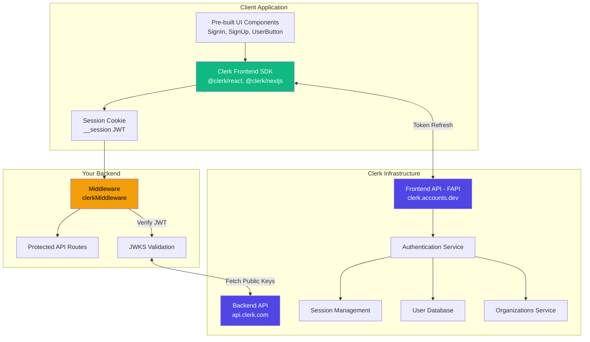
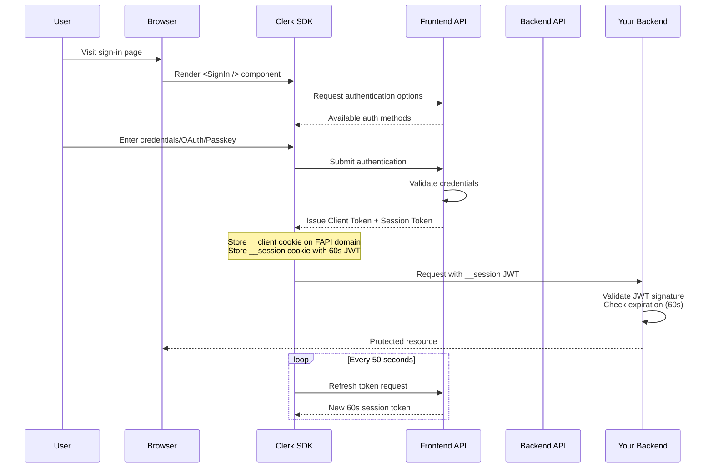
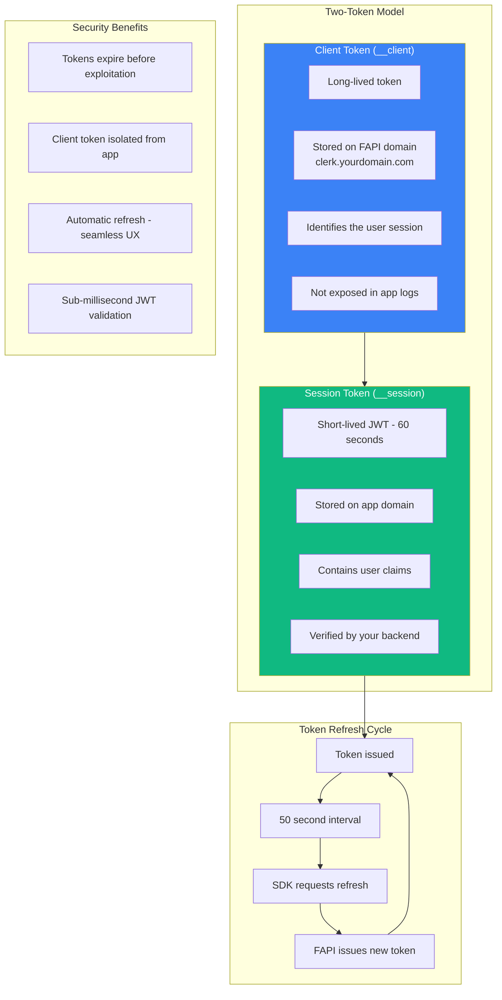
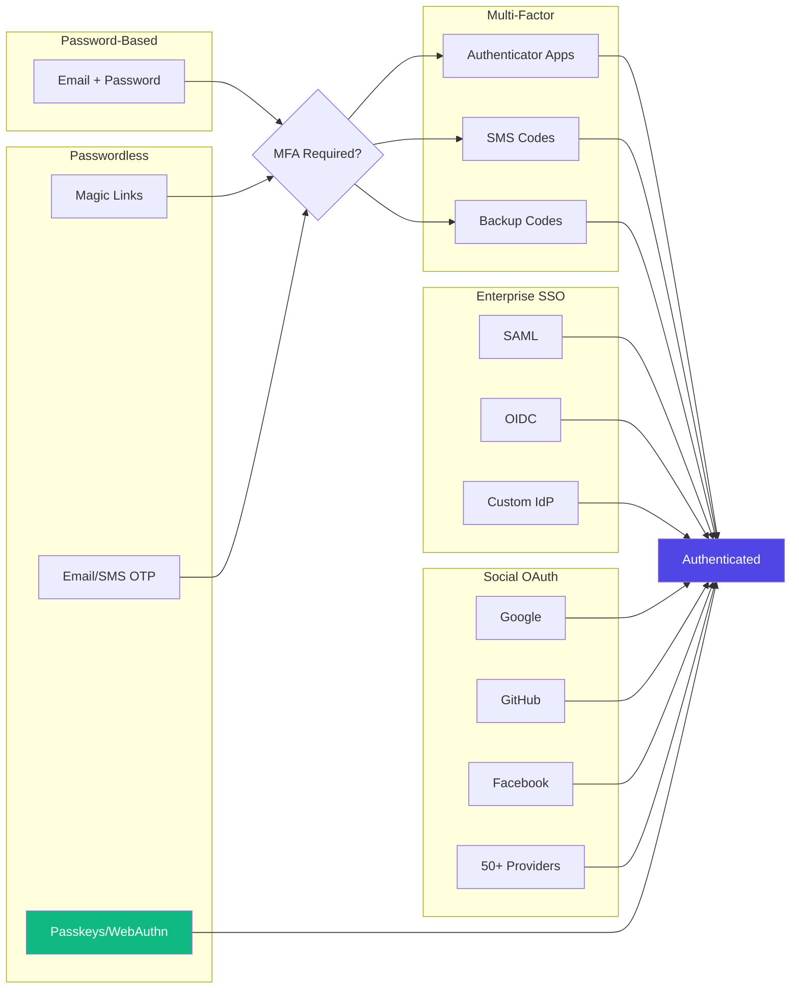
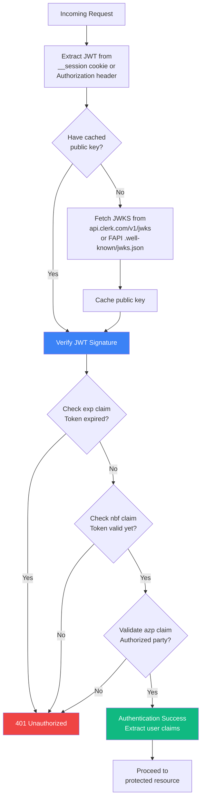
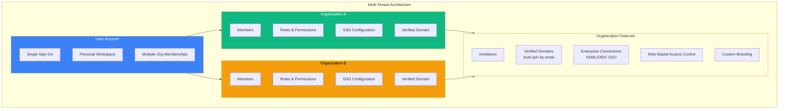
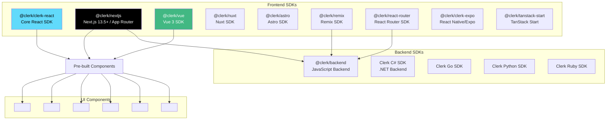

# Clerk Authentication - Technical Overview

Clerk is a complete authentication and user management platform designed for modern web applications, particularly those built with React, Next.js, and other JavaScript frameworks. It provides pre-built UI components, secure session management with short-lived JWTs, and comprehensive B2B features including multi-tenancy and organizations.

## High-Level Architecture

## Authentication Flow

## Token Architecture

## Key Concepts

### Frontend API (FAPI)
The Frontend API is a dedicated instance provisioned for each Clerk application, hosted at `https://<slug>.clerk.accounts.dev` in development. It handles per-user authentication flows like signing up, retrieving sessions, creating organizations, and managing invitations.

### Backend API (BAPI)
The Backend API at `api.clerk.com` handles administrative operations that affect multiple users, such as listing all users, banning users, or impersonation. It also provides JWKS endpoints for token verification.

### Session Tokens (JWTs)
Clerk uses 60-second JWTs for session authentication. This extremely short lifetime means tokens typically expire before an attacker can exploit them, while automatic background refresh every 50 seconds ensures seamless user experience.

### Publishable Key
The Publishable Key encodes your FAPI URL in base64 with an environment prefix, enabling your app to locate and communicate with your dedicated Clerk instance.

## Authentication Methods

## JWT Verification Flow

## Organizations & Multi-Tenancy

## SDK Ecosystem

## Technical Details

### Session Token Structure
Session tokens are JWTs containing:
- **Standard Claims**: `exp` (expiration), `nbf` (not before), `iat` (issued at)
- **Clerk Claims**: `sub` (user ID), `sid` (session ID), `org_id`, `org_role`, `org_slug`
- **Custom Claims**: Up to 1.2KB of custom claims (browser cookie limit is 4KB)

### JWKS Endpoints
Public keys for JWT verification are available at:
- Backend API: `https://api.clerk.com/v1/jwks`
- Frontend API: `https://<YOUR_FAPI>/.well-known/jwks.json`

### Networkless Verification
For maximum performance, provide the PEM public key directly to `verifyToken()` to avoid network calls during verification. JWT validation runs at sub-millisecond speeds.

### Cookie Security
- `__client` cookie: Set on FAPI domain (clerk.yourdomain.com) for isolation
- `__session` cookie: Contains the short-lived JWT on your app domain
- Domain isolation prevents credential exposure in app logs

## Key Facts (2025)

- **Free Tier**: 10,000 monthly active users and 100 organizations included free
- **Pro Plan**: $25/month base + $0.02 per additional MAU beyond 10,000
- **B2B Add-on**: $100/month for verified domains and custom roles
- **Enterprise SSO**: $50 per SAML connection
- **Token Lifetime**: 60 seconds with 50-second automatic refresh
- **OAuth Providers**: 50+ social login providers supported
- **Passkeys**: WebAuthn-based authentication (requires paid plan in production)
- **SDKs Released (2024-2025)**: Vue/Nuxt official SDK, C# SDK, Next.js v6 for Next.js 15
- **Setup Time**: Production-ready authentication in ~30 minutes
- **SOC 2 Compliant**: Helps simplify your own audit scope

## Use Cases

### B2C Applications
- Social login with 50+ OAuth providers
- Passwordless authentication (magic links, OTP, passkeys)
- User profiles and account management
- Multi-factor authentication

### B2B SaaS
- Multi-tenant organizations with isolated data
- Role-based access control (RBAC)
- Enterprise SSO via SAML/OIDC
- Verified domains for automatic organization membership
- Custom branding per organization

### Mobile Applications
- React Native/Expo SDK with native experience
- Cross-platform passkey synchronization
- Secure token storage

## Security Considerations

### Strengths
- **Short-lived tokens**: 60-second JWTs minimize exploitation window
- **Automatic refresh**: Seamless UX without session interruption
- **Domain isolation**: Client tokens stored on separate FAPI domain
- **JWKS rotation**: Standard key rotation for public key verification
- **Authorized parties (azp)**: Validate token origin to prevent CSRF

### Best Practices
- Always set `authorizedParties` when verifying requests
- Use networkless verification with cached public keys for performance
- Implement proper CORS configuration for your frontend domains
- Monitor for unusual authentication patterns through Clerk Dashboard
- Keep custom claims under 1.2KB to avoid cookie size issues

### Compliance
- SOC 2 Type II certified
- GDPR compliant with data residency options
- Supports EU eIDAS requirements for digital identity

---

## Sources

- [How Clerk Works - Overview](https://clerk.com/docs/guides/how-clerk-works/overview)
- [Session Tokens Documentation](https://clerk.com/docs/guides/sessions/session-tokens)
- [JWT Templates](https://clerk.com/docs/guides/sessions/jwt-templates)
- [Manual JWT Verification](https://clerk.com/docs/guides/sessions/manual-jwt-verification)
- [Organizations Overview](https://clerk.com/docs/organizations/overview)
- [Multi-tenant Architecture](https://clerk.com/docs/guides/how-clerk-works/multi-tenant-architecture)
- [B2B SaaS with Clerk](https://clerk.com/b2b-saas)
- [Next.js Quickstart](https://clerk.com/docs/nextjs/getting-started/quickstart)
- [Clerk Pricing](https://clerk.com/pricing)
- [Sign-up and Sign-in Options](https://clerk.com/docs/guides/configure/auth-strategies/sign-up-sign-in-options)
- [Social Connection Providers](https://clerk.com/docs/guides/configure/auth-strategies/social-connections/all-providers)
- [JavaScript Backend SDK](https://clerk.com/docs/js-backend/getting-started/quickstart)
- [Complete Authentication Guide for Next.js App Router 2025](https://clerk.com/articles/complete-authentication-guide-for-nextjs-app-router)
- [Combining Session Tokens and JWTs](https://clerk.com/blog/combining-the-benefits-of-session-tokens-and-jwts)
