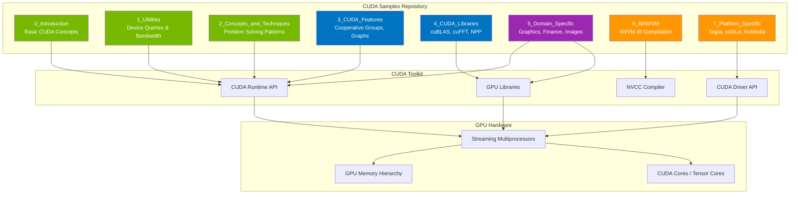
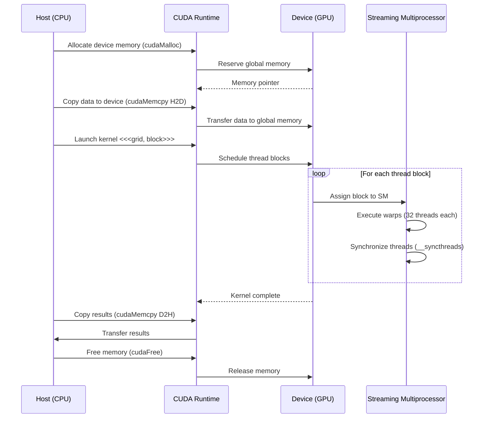
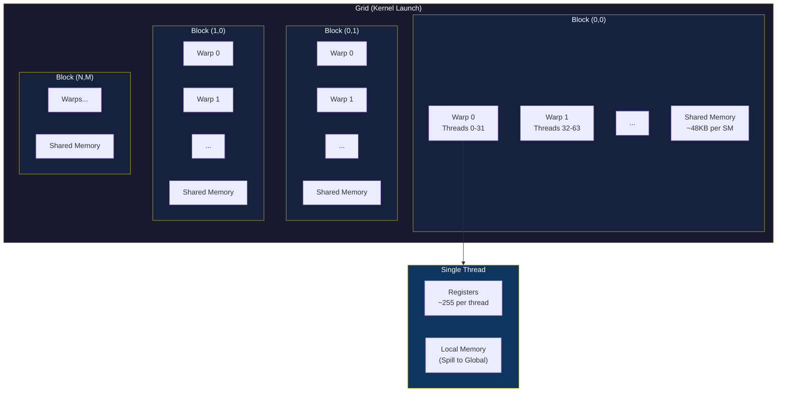
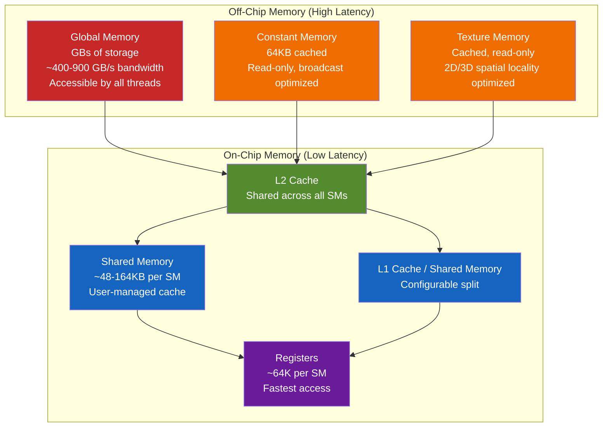
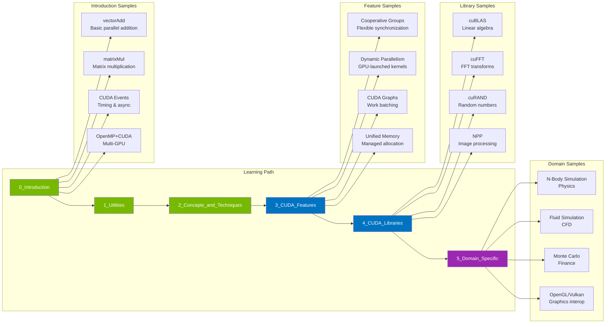
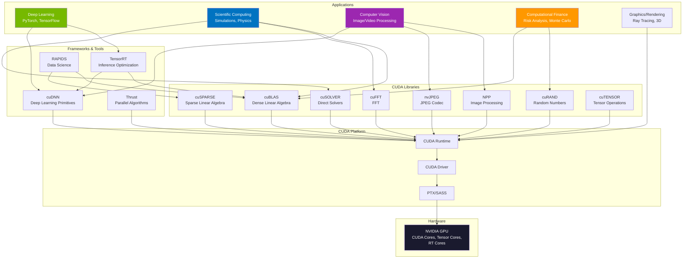

# NVIDIA CUDA Samples - Technical Overview

## High-Level Architecture



## How CUDA Programming Works



## CUDA Thread Hierarchy



## Key Concepts

### CUDA Programming Model

| Concept | Description |
|---------|-------------|
| **Kernel** | Function that runs on the GPU, launched with `<<<grid, block>>>` syntax. Marked with `__global__` qualifier. |
| **Thread** | Smallest execution unit. Each thread has unique IDs (`threadIdx.x/y/z`) and private registers. |
| **Thread Block** | Group of threads that can synchronize and share memory. Max 1024 threads (Compute Capability 2.0+). |
| **Grid** | Collection of thread blocks executing the same kernel. Blocks execute independently. |
| **Warp** | 32 threads executing in SIMT (Single Instruction Multiple Threads) fashion. The GPU's scheduling unit. |
| **Streaming Multiprocessor (SM)** | GPU processor that executes thread blocks. Contains CUDA cores, shared memory, and registers. |

### Memory Hierarchy



### Memory Access Performance

| Memory Type | Location | Scope | Latency | Bandwidth |
|-------------|----------|-------|---------|-----------|
| **Registers** | On-chip | Thread | 1 cycle | Highest |
| **Shared Memory** | On-chip | Block | ~5 cycles | ~1.5 TB/s |
| **L1 Cache** | On-chip | SM | ~30 cycles | High |
| **L2 Cache** | On-chip | Device | ~200 cycles | ~2-3 TB/s |
| **Global Memory** | Off-chip | Device | ~400-800 cycles | 400-900 GB/s |
| **Constant Memory** | Off-chip (cached) | Device | 1 cycle (cached) | Broadcast |

## CUDA Sample Categories



### Sample Category Details

| Category | Purpose | Key Samples |
|----------|---------|-------------|
| **0_Introduction** | Learn basic CUDA concepts and runtime APIs | vectorAdd, matrixMul, asyncAPI, cudaOpenMP |
| **1_Utilities** | Query device capabilities and benchmark | deviceQuery, bandwidthTest, topologyQuery |
| **2_Concepts_and_Techniques** | Common parallel programming patterns | reduction, scan, histogram, sorting |
| **3_CUDA_Features** | Advanced CUDA capabilities | cooperativeGroups, cudaGraphs, dynamicParallelism |
| **4_CUDA_Libraries** | Using GPU-accelerated libraries | cuBLAS, cuFFT, cuSPARSE, NPP, cuRAND |
| **5_Domain_Specific** | Real-world application examples | nbody, fluidsGL, MonteCarloGPU, imageProcessing |
| **6_libNVVM** | NVVM IR compilation and JIT | simple, ptxgen |
| **7_Platform_Specific** | Platform-specific features | Tegra, cuDLA, NvMedia, NvSci |

## Technical Details

### Building CUDA Samples

```bash
# Clone the repository
git clone https://github.com/NVIDIA/cuda-samples.git
cd cuda-samples

# Linux build
mkdir build && cd build
cmake ..
make -j$(nproc)

# Windows build (Visual Studio 2019+)
cmake .. -G "Visual Studio 16 2019" -A x64
cmake --build . --config Release

# Optional: Enable GPU debugging
cmake .. -DENABLE_CUDA_DEBUG=True

# Optional: Build Tegra samples
cmake .. -DBUILD_TEGRA=True
```

### Requirements

- **CUDA Toolkit**: 11.0+ (latest: 13.1)
- **CMake**: 3.20 or later
- **Compiler**: GCC 7+, Clang 8+, or MSVC 2019+
- **GPU**: NVIDIA GPU with Compute Capability 5.0+
- **Driver**: Compatible with CUDA Toolkit version

### Compute Capability Matrix

| Architecture | Compute Capability | Key Features |
|--------------|-------------------|--------------|
| **Maxwell** | 5.0-5.3 | Dynamic Parallelism (feature-complete in CUDA 13) |
| **Pascal** | 6.0-6.2 | Unified Memory, NVLink (feature-complete in CUDA 13) |
| **Volta** | 7.0 | Tensor Cores, Independent Thread Scheduling (feature-complete in CUDA 13) |
| **Turing** | 7.5 | RT Cores, INT8 Tensor Cores |
| **Ampere** | 8.0-8.6 | 3rd Gen Tensor Cores, Sparsity |
| **Ada Lovelace** | 8.9 | 4th Gen Tensor Cores, FP8 |
| **Hopper** | 9.0 | Transformer Engine, Thread Block Clusters |
| **Blackwell** | 10.0 | 5th Gen Tensor Cores, FP4 |

## CUDA Ecosystem



## Key Facts (2025)

- **Repository Stats**: 8.7k+ stars, 2.2k+ forks on GitHub
- **Current Version**: CUDA Toolkit 13.1 (samples updated accordingly)
- **Sample Count**: 100+ samples across 8 categories
- **Build System**: CMake 3.20+ (migrated from Makefiles)
- **Platform Support**: Linux, Windows, Tegra, QNX, DriveOS
- **Architecture Deprecation**: Maxwell, Pascal, Volta are feature-complete in CUDA 13 (no new features)
- **Multi-Device Changes**: Multi-device cooperative groups removed in CUDA 13
- **Performance**: GPU-accelerated applications can be 50-400x faster than CPU-only implementations
- **Market Share**: CUDA dominates GPU computing with ~95% market share in AI/ML workloads

## Use Cases

### Learning & Education
- **Beginner tutorials**: vectorAdd, matrixMul introduce parallel thinking
- **Performance optimization**: bandwidthTest, reduction teach optimization strategies
- **Memory management**: Understanding global, shared, and constant memory

### Development & Testing
- **GPU validation**: deviceQuery confirms driver and hardware setup
- **Performance benchmarking**: bandwidthTest measures actual vs theoretical bandwidth
- **Feature exploration**: Test new CUDA features before production use

### Application Development
| Domain | Sample | Description |
|--------|--------|-------------|
| **Deep Learning** | cudaTensorCoreGemm | Matrix multiplication using Tensor Cores |
| **Physics** | nbody | N-body gravitational simulation |
| **Fluid Dynamics** | fluidsGL | Real-time fluid simulation with OpenGL |
| **Finance** | MonteCarloGPU | Option pricing with Monte Carlo methods |
| **Image Processing** | imageProcessingNPP | GPU-accelerated image filters |
| **Signal Processing** | convolutionFFT2D | 2D convolution using cuFFT |
| **Graphics** | simpleVulkan | Vulkan-CUDA interoperability |

### Production Patterns
- **Cooperative Groups**: Flexible thread synchronization patterns
- **CUDA Graphs**: Reduce launch overhead for repetitive workflows
- **Unified Memory**: Simplified memory management across CPU/GPU
- **Dynamic Parallelism**: GPU-side kernel launches for adaptive algorithms

## Security & Considerations

### Hardware Requirements
- NVIDIA GPU required (no AMD/Intel support)
- Driver compatibility with CUDA Toolkit version is critical
- Older architectures may lose support in future toolkit versions

### Development Considerations
- **Memory management**: Manual allocation/deallocation can lead to leaks
- **Race conditions**: Improper synchronization causes data corruption
- **Bank conflicts**: Shared memory access patterns affect performance
- **Occupancy**: Thread block configuration impacts GPU utilization
- **Warp divergence**: Conditional branches within warps reduce efficiency

### Best Practices
- Use `cuda-memcheck` or Compute Sanitizer for debugging
- Profile with NVIDIA Nsight Systems and Nsight Compute
- Test on multiple GPU architectures for compatibility
- Monitor GPU memory usage to prevent out-of-memory errors
- Use CUDA error checking (`cudaGetLastError()`) in production

## Resources

- [CUDA Samples Repository](https://github.com/NVIDIA/cuda-samples)
- [CUDA Programming Guide](https://docs.nvidia.com/cuda/cuda-programming-guide/)
- [CUDA Toolkit Documentation](https://docs.nvidia.com/cuda/)
- [CUDA Libraries Documentation](https://docs.nvidia.com/cuda-libraries/)
- [NVIDIA Developer Blog](https://developer.nvidia.com/blog/)
- [CUDA Library Samples](https://github.com/NVIDIA/CUDALibrarySamples)
