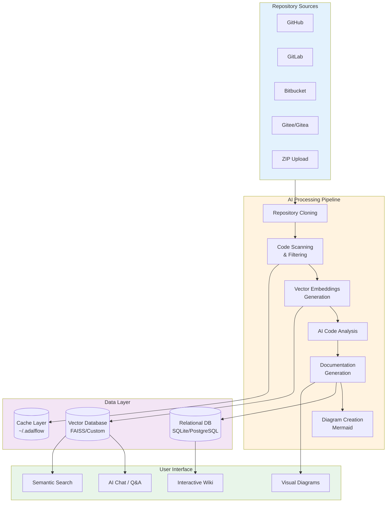
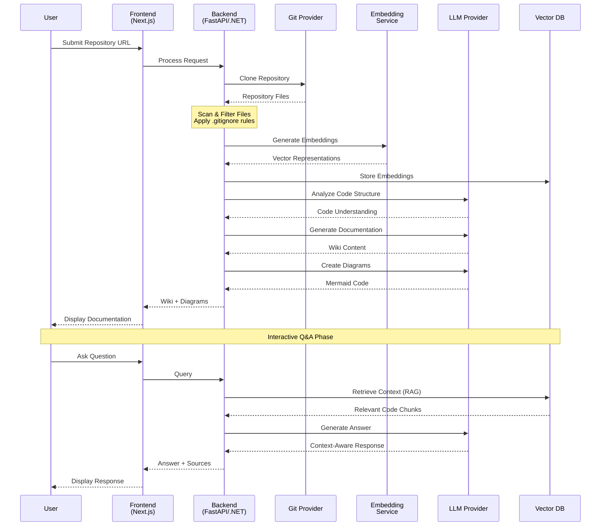
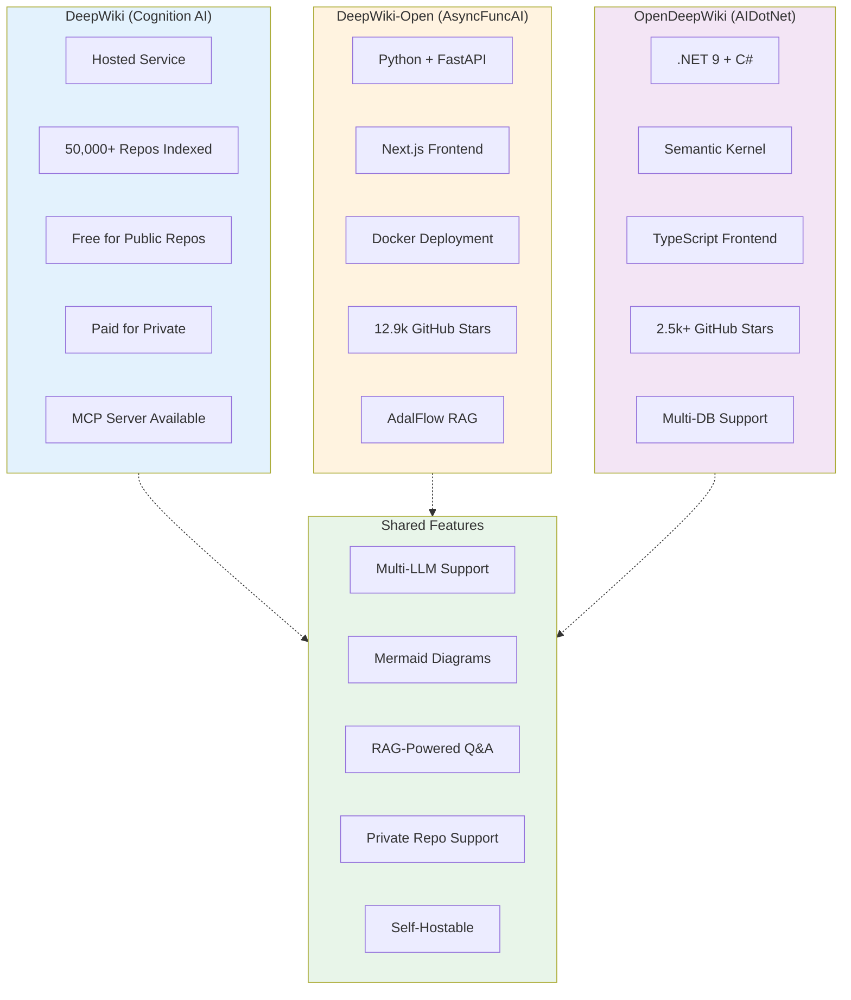
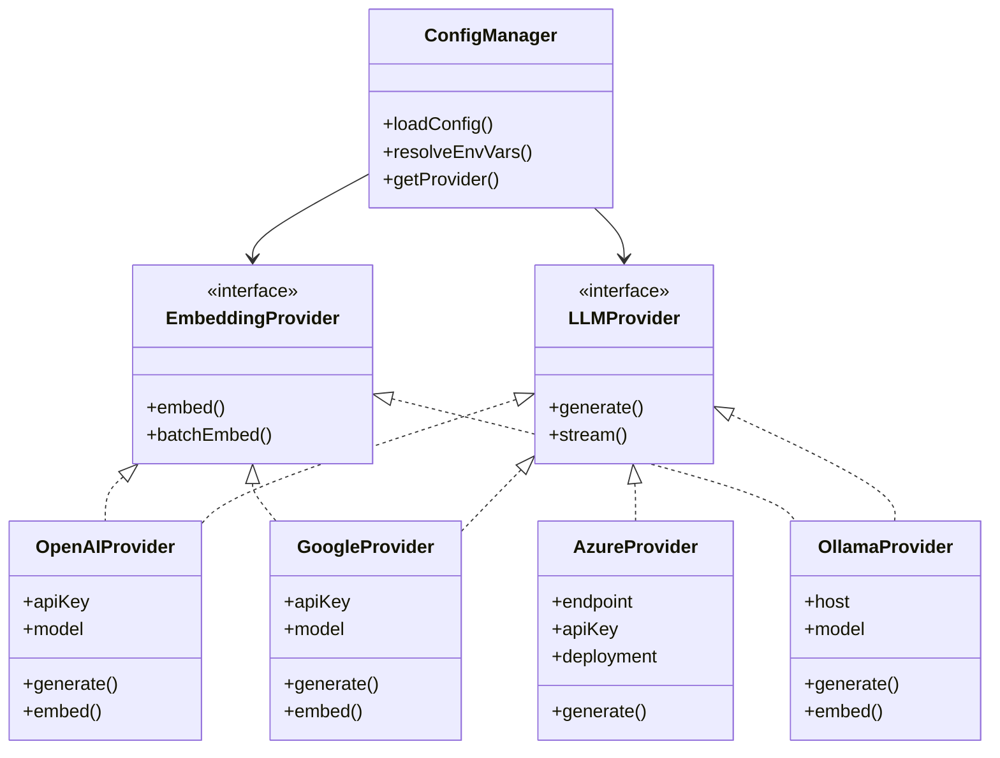
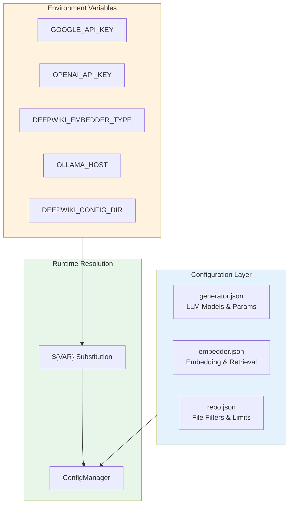
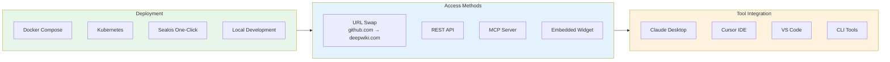

# DeepWiki - Technical Overview

## Overview

DeepWiki is an AI-powered documentation platform that automatically converts code repositories into comprehensive, interactive wiki-style documentation. Originally launched by Cognition AI (creators of Devin) on April 25, 2025, the platform now has multiple open-source implementations available for self-hosting.

The ecosystem includes:
- **DeepWiki (Cognition AI)**: The original hosted service at deepwiki.com
- **DeepWiki-Open (AsyncFuncAI)**: Python/FastAPI + Next.js open-source implementation
- **OpenDeepWiki (AIDotNet)**: .NET 9 + Semantic Kernel open-source implementation

## High-Level Architecture



## How It Works



## Processing Pipeline

```mermaid
flowchart LR
    subgraph Stage1["1. Acquisition"]
        A1[Clone Repository]
        A2[Parse .gitignore]
        A3[Extract Metadata]
    end

    subgraph Stage2["2. Scanning"]
        B1[Recursive<br/>Directory Walk]
        B2[File Filtering]
        B3[Token Counting]
        B4[Skip Oversized<br/>Files]
    end

    subgraph Stage3["3. Embedding"]
        C1[Text Splitting<br/>with Overlap]
        C2[Chunk Creation]
        C3[Vector Generation]
        C4[Index Storage]
    end

    subgraph Stage4["4. Analysis"]
        D1[Structure Analysis]
        D2[Dependency Mapping]
        D3[Relationship<br/>Detection]
        D4[Classification]
    end

    subgraph Stage5["5. Generation"]
        E1[Overview Creation]
        E2[Module Docs]
        E3[Function Docs]
        E4[Diagram Generation]
    end

    subgraph Stage6["6. Output"]
        F1[Wiki Pages]
        F2[Search Index]
        F3[RAG Database]
    end

    Stage1 --> Stage2 --> Stage3 --> Stage4 --> Stage5 --> Stage6

    style Stage1 fill:#ffebee
    style Stage2 fill:#fff8e1
    style Stage3 fill:#e8f5e9
    style Stage4 fill:#e3f2fd
    style Stage5 fill:#f3e5f5
    style Stage6 fill:#fce4ec
```



## Key Concepts

### RAG (Retrieval Augmented Generation)
The core of DeepWiki's Q&A capability. When users ask questions:
1. Query is converted to embedding vector
2. Similar code chunks retrieved from vector database
3. Retrieved context added to LLM prompt
4. LLM generates answer grounded in actual code

### Vector Embeddings
Code is split into overlapping chunks and converted to high-dimensional vectors that capture semantic meaning. This enables:
- Semantic search (find conceptually related code)
- Context retrieval for Q&A
- Code relationship mapping

### Multi-Provider Architecture
All implementations support multiple LLM and embedding providers:
- Swap between OpenAI, Google, Anthropic, Ollama without code changes
- Configure via JSON or environment variables
- Support for OpenAI-compatible APIs (Alibaba Qwen, Azure, etc.)

## Ecosystem Comparison



## Technical Details

### DeepWiki-Open (AsyncFuncAI) Stack

| Component | Technology |
|-----------|------------|
| Backend | Python 3.11+, FastAPI |
| Frontend | Next.js, React, TypeScript |
| RAG Framework | AdalFlow |
| Vector Store | FAISS |
| Diagrams | Mermaid |
| Container | Docker, Docker Compose |

**Supported LLM Providers:**
- Google Gemini (default: `gemini-2.5-flash`)
- OpenAI (`gpt-5-nano`, `gpt-4o`)
- OpenRouter (Claude, Llama, Mistral)
- Azure OpenAI
- Ollama (local models)

**Embedding Options:**
- OpenAI: `text-embedding-3-small`
- Google AI: `text-embedding-004`
- Ollama: Local embeddings

### OpenDeepWiki (AIDotNet) Stack

| Component | Technology |
|-----------|------------|
| Backend | C# .NET 9, Semantic Kernel |
| Frontend | TypeScript, Next.js |
| Databases | SQLite, PostgreSQL, MySQL, SQL Server |
| Git | LibGit2Sharp |
| Container | Docker (ARM64/AMD64) |

**Supported AI Providers:**
- OpenAI
- Azure OpenAI
- Anthropic Claude
- DeepSeek
- Custom API endpoints

## Provider Architecture



## Configuration System

### DeepWiki-Open Configuration Files



### Key Environment Variables

**DeepWiki-Open:**
```bash
GOOGLE_API_KEY          # For Gemini models
OPENAI_API_KEY          # For OpenAI models
DEEPWIKI_EMBEDDER_TYPE  # 'openai', 'google', or 'ollama'
OLLAMA_HOST             # Default: http://localhost:11434
PORT                    # API server port (default: 8001)
```

**OpenDeepWiki:**
```bash
CHAT_MODEL              # Model for chat interactions
ANALYSIS_MODEL          # Model for code analysis
DEEP_RESEARCH_MODEL     # Model for deep analysis
DB_TYPE                 # sqlite, postgresql, mysql, sqlserver
DB_CONNECTION_STRING    # Database connection
AUTO_CONTEXT_COMPRESS   # Enable 90%+ token reduction
```

## Key Facts (2025)

- **50,000+** public repositories indexed by Cognition AI's DeepWiki
- **4 billion+** lines of code processed
- **$300,000+** compute costs for initial indexing
- **12,900+** GitHub stars for DeepWiki-Open
- **2,500+** GitHub stars for OpenDeepWiki
- **Free** for public repositories (hosted version)
- **MIT License** for both open-source implementations
- **MCP Server** available for programmatic access

## Use Cases

### For Developers
- **Onboarding**: Quickly understand unfamiliar codebases
- **Documentation**: Auto-generate docs for undocumented projects
- **Code Review**: Get AI analysis of code structure and patterns
- **Bug Finding**: Use DeepResearch for potential issue detection

### For Teams
- **Private Repos**: Self-host for proprietary code analysis
- **Knowledge Base**: Convert internal repos into searchable wikis
- **Technical Writing**: Bootstrap documentation from code

### For Open Source
- **Community**: Make projects more accessible to contributors
- **Discovery**: Help users understand project architecture
- **Comparison**: Analyze how different projects solve similar problems

## Integration Options



### MCP Server Tools (Cognition AI)
- `ask_question`: Query any indexed repository
- `read_wiki_structure`: Get documentation structure
- `read_wiki_contents`: Read specific wiki pages

## Security Considerations

### Self-Hosting Benefits
- **Privacy**: Code never leaves your infrastructure
- **Control**: Full control over data retention and access
- **Compliance**: Meet regulatory requirements for sensitive code

### API Key Management
- Use environment variables, never hardcode keys
- Support for Azure Key Vault and similar services
- Role-based access for team deployments

### Data Handling
- Repository clones stored in configurable locations
- Embeddings cached locally (`~/.adalflow/`)
- Option to clear cache after processing

## Quick Start Comparison

### DeepWiki (Hosted)
```
# Just change the URL
https://github.com/user/repo
→
https://deepwiki.com/user/repo
```

### DeepWiki-Open (Docker)
```bash
git clone https://github.com/AsyncFuncAI/deepwiki-open
cd deepwiki-open
cp .env.example .env
# Configure API keys in .env
docker-compose up
# Access at http://localhost:3000
```

### OpenDeepWiki (Docker)
```bash
git clone https://github.com/AIDotNet/OpenDeepWiki
cd OpenDeepWiki
# Configure docker-compose.yml
make build && make up
# Access at http://localhost:3000
```

## Sources

- [DeepWiki Official](https://deepwiki.com/)
- [Cognition AI Blog - DeepWiki Launch](https://cognition.ai/blog/deepwiki)
- [DeepWiki-Open GitHub](https://github.com/AsyncFuncAI/deepwiki-open)
- [OpenDeepWiki GitHub](https://github.com/AIDotNet/OpenDeepWiki)
- [DeepWiki MCP Server](https://cognition.ai/blog/deepwiki-mcp-server)
- [Devin Documentation](https://docs.devin.ai/work-with-devin/deepwiki)
- [DeepWiki-Open Documentation](https://asyncfunc.mintlify.app/getting-started/introduction)
- [Medium - Why I Open-Sourced DeepWiki](https://medium.com/@sjng/deepwiki-why-i-open-sourced-an-ai-powered-wiki-generator-b67b624e4679)
