# Design OS - Technical Overview

## What is Design OS?

Design OS is an open-source product planning and design tool by Builder Methods that bridges the gap between product ideation and AI-powered code implementation. It addresses a fundamental problem in AI development: **coding agents produce suboptimal results when asked to simultaneously determine what to build and construct it**.

The solution: separate design decisions from implementation through a structured, conversational design process that generates complete handoff packages for any AI coding agent.

## High-Level Architecture

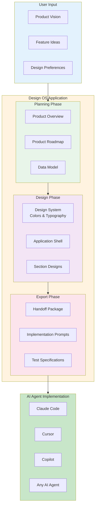

## The Problem It Solves

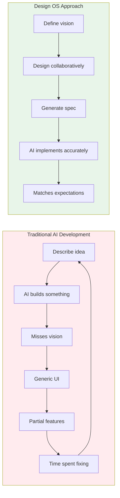

## Design OS Workflow

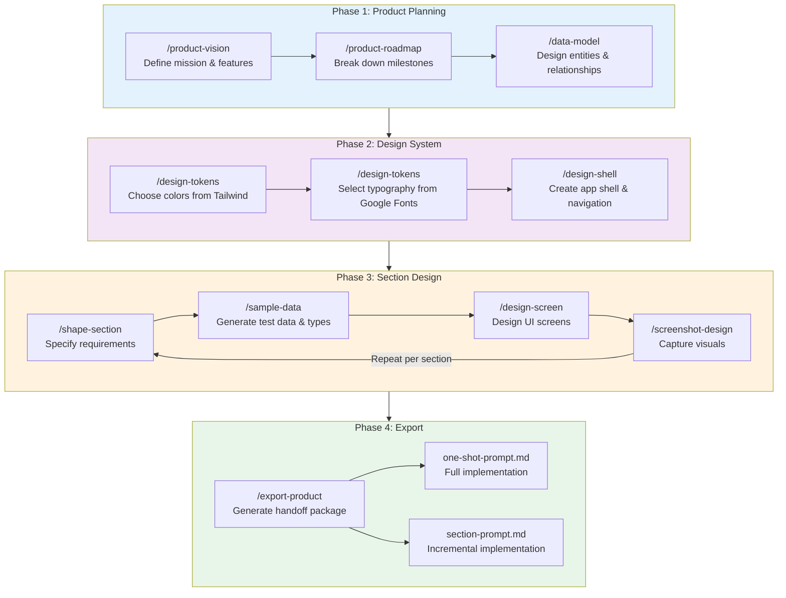

## File Structure

```mermaid
graph TB
    subgraph Root["Design OS Project"]
        subgraph Product["product/<br/>Portable Definitions"]
            PO[product-overview.md]
            PR[product-roadmap.md]
            DM["data-model/<br/>data-model.md"]
            DS["design-system/<br/>colors.json<br/>typography.json"]
            SH["shell/<br/>spec.md"]
            SEC["sections/[name]/<br/>spec.md<br/>data.json<br/>types.ts<br/>*.png"]
        end

        subgraph Src["src/<br/>Design OS React App"]
            Shell["shell/components/<br/>AppShell.tsx<br/>MainNav.tsx<br/>UserMenu.tsx"]
            Sections["sections/[name]/<br/>components/<br/>[ViewName].tsx"]
        end

        subgraph Export["product-plan/<br/>Generated Export"]
            RM[README.md]
            OV[product-overview.md]
            Prompts["prompts/<br/>one-shot-prompt.md<br/>section-prompt.md"]
            Inst["instructions/<br/>one-shot-instructions.md<br/>incremental/"]
            Assets["design-system/<br/>data-model/<br/>shell/<br/>sections/"]
        end
    end

    Product -->|"generates"| Export
    Src -->|"renders"| Product

    style Product fill:#e8f5e9
    style Src fill:#e3f2fd
    style Export fill:#fff3e0
```

## Component Architecture

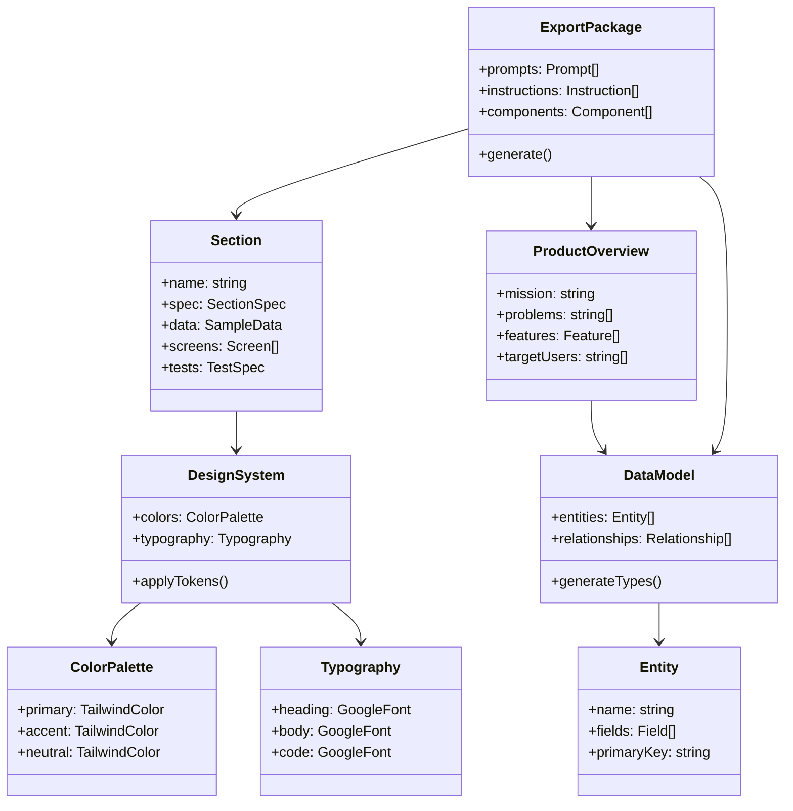

## Technology Stack

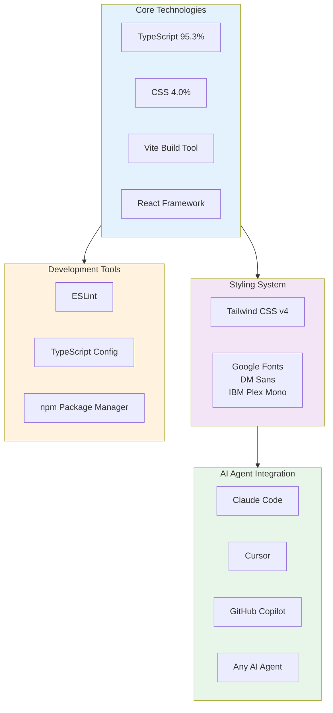

## Design Tokens Flow

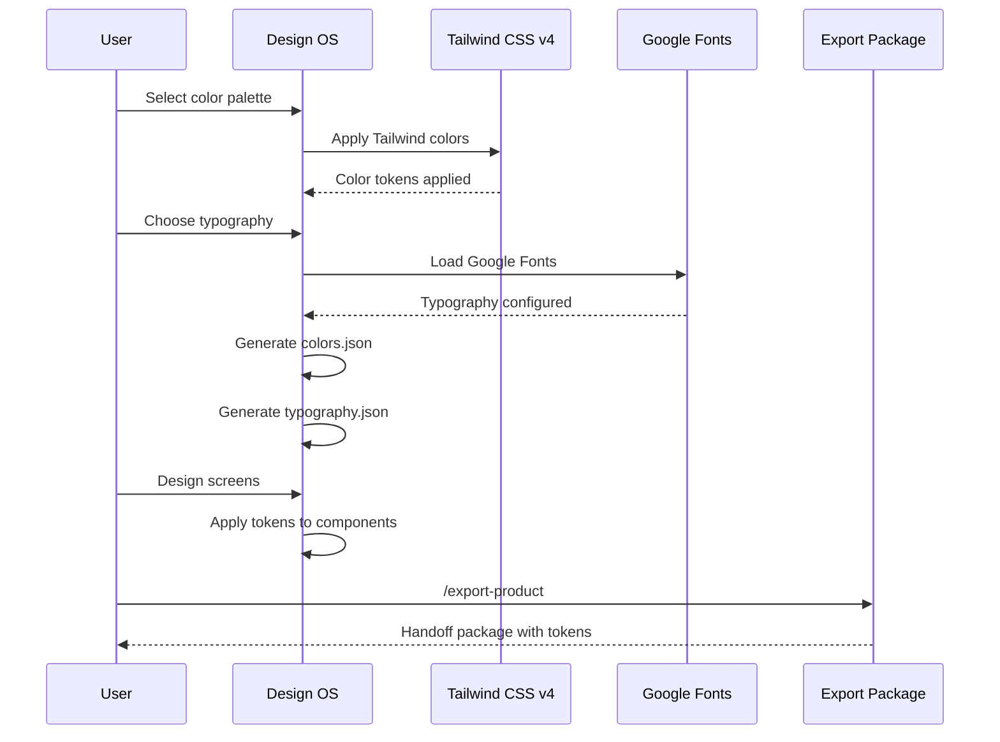

## Export Package Structure

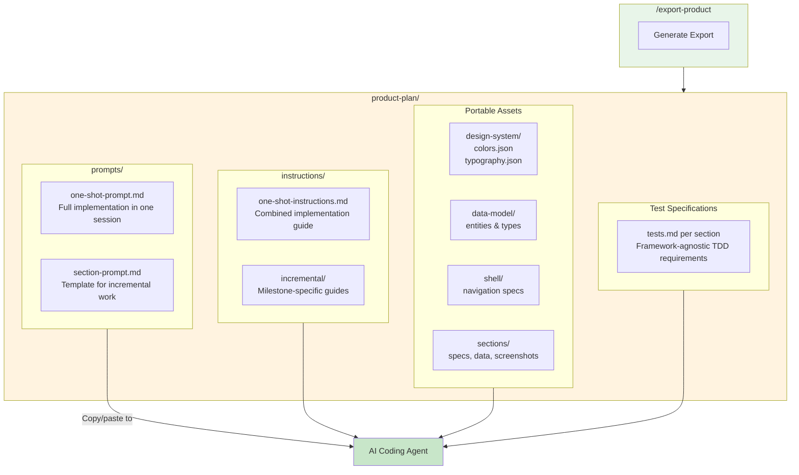

## Key Commands Reference

| Command | Phase | Output | Description |
|---------|-------|--------|-------------|
| `/product-vision` | Planning | `product/product-overview.md` | Define mission, problems, features |
| `/product-roadmap` | Planning | `product/product-roadmap.md` | Break down milestones |
| `/data-model` | Planning | `product/data-model/data-model.md` | Design entities & relationships |
| `/design-tokens` | Design | `product/design-system/*.json` | Configure colors & typography |
| `/design-shell` | Design | `product/shell/spec.md` | Create app shell & navigation |
| `/shape-section` | Section | `product/sections/[name]/spec.md` | Specify section requirements |
| `/sample-data` | Section | `product/sections/[name]/data.json, types.ts` | Generate test data |
| `/design-screen` | Section | `src/sections/[name]/*.tsx` | Design UI screens |
| `/screenshot-design` | Section | `product/sections/[name]/*.png` | Capture visual references |
| `/export-product` | Export | `product-plan/*` | Generate complete handoff |

## Design Requirements

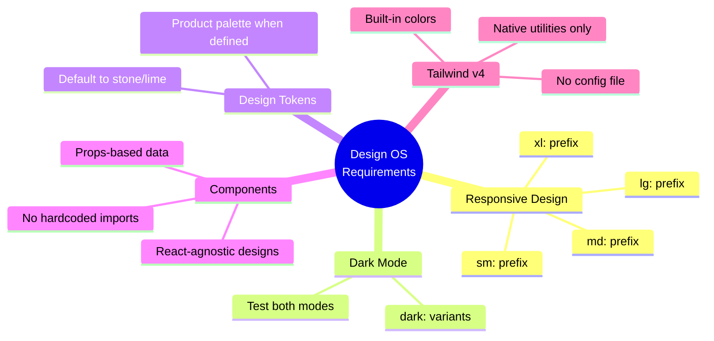

## Relationship with Agent OS

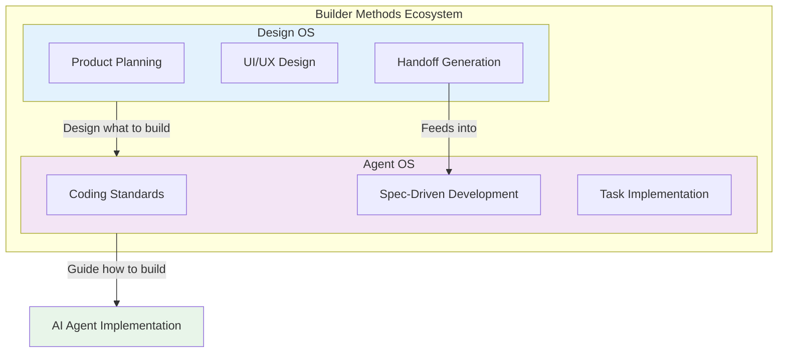

**Design OS** focuses on the "what" - defining product vision, designing UI, and creating specifications.

**Agent OS** focuses on the "how" - providing structured workflows for AI coding agents to implement the designs with your coding standards.

## Key Statistics (December 2025)

- **GitHub Stars**: 994+
- **Forks**: 178+
- **Version**: 0.1 (Initial release: December 18, 2025)
- **Language**: TypeScript (95.3%)
- **License**: MIT
- **Creator**: Brian Casel (Builder Methods)

## Use Cases

```mermaid
graph LR
    subgraph Users["Target Users"]
        U1[Solo Developers]
        U2[Small Teams]
        U3[Indie Hackers]
        U4[Product Managers]
    end

    subgraph UseCases["Use Cases"]
        UC1[New Product Development]
        UC2[Feature Design]
        UC3[Design System Creation]
        UC4[AI Agent Handoffs]
        UC5[Rapid Prototyping]
    end

    subgraph Benefits["Benefits"]
        B1[Reduced AI iterations]
        B2[Consistent UI/UX]
        B3[Clear specifications]
        B4[Portable designs]
        B5[Framework-agnostic]
    end

    Users --> UseCases
    UseCases --> Benefits

    style Users fill:#e3f2fd
    style UseCases fill:#fff3e0
    style Benefits fill:#e8f5e9
```

## Getting Started

1. **Clone the repository**
   ```bash
   git clone https://github.com/buildermethods/design-os.git
   cd design-os
   ```

2. **Install dependencies**
   ```bash
   npm install
   ```

3. **Start Design OS**
   ```bash
   npm run dev
   ```

4. **Follow the workflow**
   - Begin with `/product-vision` to define your product
   - Progress through planning, design, and section phases
   - Export with `/export-product` for AI implementation

## Best Practices

1. **Complete each phase before moving forward** - The workflow is sequential for a reason
2. **Use conversational commands** - Design OS is designed for AI-guided conversations
3. **Review generated specs** - Validate specifications before exporting
4. **Iterate on sections** - Refine individual sections without affecting others
5. **Test with multiple agents** - Handoff packages work with any AI coding tool

## Sources

- [Design OS GitHub Repository](https://github.com/buildermethods/design-os)
- [Design OS Official Documentation](https://buildermethods.com/design-os)
- [Agent OS GitHub Repository](https://github.com/buildermethods/agent-os)
- [Builder Methods](https://buildermethods.com/)
- [Brian Casel - Creator](https://briancasel.com/builder-methods-story)
