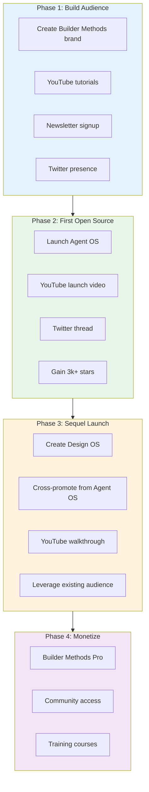

# Design OS GitHub Promotion Analysis

## Repository: buildermethods/design-os

**Stars:** 994 | **Forks:** 179 | **Created:** December 16, 2025 | **Time to ~1k stars:** ~3 days

---

## Why It Gained Traction

### 1. Established Creator with Proven Playbook

Brian Casel isn't a first-time launcher. He successfully deployed Agent OS (3,244 stars, 597 forks) in July 2025 using the same strategy. Design OS is a deliberate sequel that leverages:

- **Existing audience** from Builder Methods community
- **YouTube channel** with proven tutorial format
- **Twitter/X presence** (@CasJam) with engaged followers
- **Email newsletter** (Builder Briefing) for direct reach

### 2. Perfect Problem-Solution Fit

The pitch resonates because it articulates a pain point every AI developer experiences:

> "AI coding tools are incredible at building fast. But the results often miss the mark."

The solution is simple: **separate design decisions from implementation**.

### 3. Sequel Strategy (Agent OS → Design OS)

| Project | Stars | Launch | Purpose |
|---------|-------|--------|---------|
| **Agent OS** | 3,244 | July 2025 | How to build with AI agents |
| **Design OS** | 994 | December 2025 | What to build before coding |

Design OS complements Agent OS, creating a complete ecosystem. Users of Agent OS naturally discover Design OS.

### 4. AI Development Wave (December 2025)

Design OS launched during peak AI coding agent interest:
- Claude Code ecosystem rapidly growing
- Cursor, Copilot, Windsurf competing for developers
- "Spec-driven development" becoming a trending topic
- GitHub Trending full of AI agent repos

---

## Promotion Channels Found

| Platform | Link | Evidence | Impact |
|----------|------|----------|--------|
| **Twitter/X** | [@CasJam](https://x.com/CasJam/status/1995604253101228325) | Launch thread with explainer | Primary announcement |
| **YouTube** | Builder Methods Channel | Demo video + walkthrough | Tutorial-driven discovery |
| **GitHub** | [buildermethods](https://github.com/buildermethods) | Linked from Agent OS | Cross-promotion |
| **Website** | [buildermethods.com/design-os](https://buildermethods.com/design-os) | Full documentation | Authority/Trust |
| **Hacker News** | Not found | No evidence of HN post | Missed opportunity |
| **Reddit** | Not found | No evidence of Reddit posts | Missed opportunity |

---

## Viral-Readiness Score: 7/10

| Factor | Score | Notes |
|--------|-------|-------|
| **News hook** | Partial | Rides AI agent wave but no specific news event |
| **Simple pitch** | Yes | "The missing design process between your product idea and your codebase" |
| **Low friction** | Yes | `npm install` + Claude Code slash commands |
| **Good timing** | Yes | Peak AI dev interest in December 2025 |
| **Demo video** | Yes | YouTube walkthrough available |
| **MIT license** | Yes | Zero friction |
| **Multi-channel** | Partial | Twitter + YouTube, but no HN/Reddit |

---

## What Worked

### 1. The "Sequel Launch" Strategy

Brian's playbook:
1. Build Agent OS first → gain credibility and audience
2. Launch Design OS → existing audience amplifies organically
3. Cross-promote between projects → compound growth

### 2. YouTube-First Content

Unlike the Manus-style "news jacking" approach, Brian uses **educational content marketing**:
- Demo videos show real-world usage
- Tutorials attract developers searching for solutions
- Videos build trust before GitHub visit

### 3. Product-Market Fit Messaging

The README doesn't just describe features—it describes the **problem**:

> "You describe what you want, the agent builds something, but it's not what you envisioned. The UI looks generic. Features get half-implemented."

This resonates instantly with AI developers.

### 4. Complete Ecosystem

Design OS isn't standalone. It's part of:
- **Agent OS** (implementation)
- **Builder Methods** (training/community)
- **Builder Methods Pro** (paid tier)

This creates multiple touchpoints and revenue paths.

---

## What Could Be Improved

### 1. No Hacker News Launch

The repo wasn't posted to HN (or wasn't successful there). A "Show HN" post with the right framing could add 500-1000+ stars.

**Recommended HN title:**
> "Show HN: Design OS – Stop asking AI to design and code simultaneously"

### 2. No Reddit Presence

Missing from r/ClaudeAI, r/LocalLLaMA, r/programming, r/webdev. These communities have high overlap with target audience.

### 3. No News Hook

Unlike planning-with-files (which rode the Manus $2B acquisition), Design OS launched without a specific news event. A stronger hook could accelerate growth.

**Potential hooks for future promotion:**
- "The workflow pattern used by top AI developers"
- Connect to any trending AI coding news

### 4. Limited Third-Party Coverage

No Dev.to articles, Medium posts, or newsletter features found. Building external validation would help.

---

## The Brian Casel Playbook

---

## Comparison: Design OS vs Manus-Style Viral

| Factor | Design OS | planning-with-files |
|--------|-----------|---------------------|
| **Stars** | 994 | 4,700 |
| **Time** | ~3 days | 5 days |
| **Strategy** | Audience-first | News jacking |
| **News hook** | General AI wave | $2B acquisition |
| **HN presence** | None found | Front page |
| **Reddit** | None found | Multiple subs |
| **Sustainability** | High (ecosystem) | Unknown |
| **Monetization** | Clear (Pro tier) | None apparent |

**Key insight:** Design OS took a slower but more sustainable path. It builds an ecosystem and business, not just star count.

---

## Recommendations for Your Repo

### If You Have an Existing Audience (Brian's approach):

1. **Build audience first** — Newsletter, YouTube, Twitter
2. **Launch complementary projects** — Each feeds the other
3. **Create educational content** — Demo videos > README text
4. **Monetize the ecosystem** — Free tools → paid community/training

### If You're Starting Fresh (News jacking approach):

1. **Find a news hook** — Acquisitions, launches, trending topics
2. **Craft a one-line pitch** — Must create instant "aha!"
3. **Post to HN first** — Show HN on launch day
4. **Multi-channel blast** — Twitter + Reddit + Discord same day
5. **Keep friction zero** — Single command install

### Hybrid Strategy:

1. Build something genuinely useful (don't just chase stars)
2. Connect to trending topic if possible
3. Launch on HN + Reddit + Twitter simultaneously
4. Create a YouTube walkthrough within 48 hours
5. Engage in discussions (don't just drop and leave)

---

## Sources

- [Design OS GitHub Repository](https://github.com/buildermethods/design-os)
- [Agent OS GitHub Repository](https://github.com/buildermethods/agent-os)
- [Brian Casel on X (@CasJam)](https://x.com/CasJam)
- [Builder Methods](https://buildermethods.com/)
- [Brian Casel - Builder Methods Story](https://briancasel.com/builder-methods-story)
- [Design OS Official Docs](https://buildermethods.com/design-os)
- [GitHub Trending December 2025](https://medium.com/@lssmj2014/december-16-2025-unveils-a-transformative-concept-the-agentic-frontend-2b7c60d9c2de)
