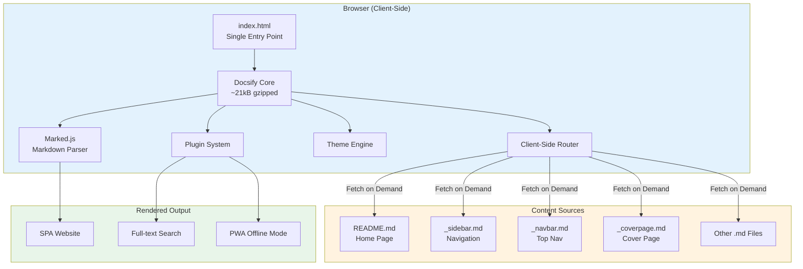
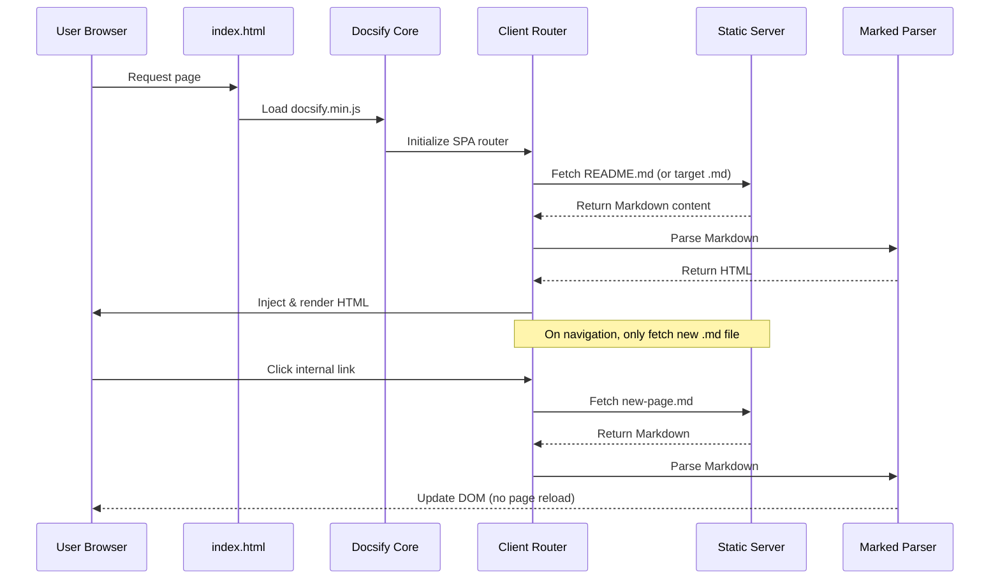
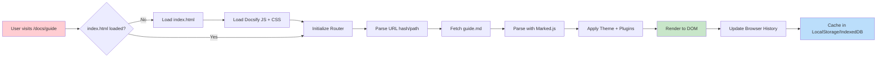
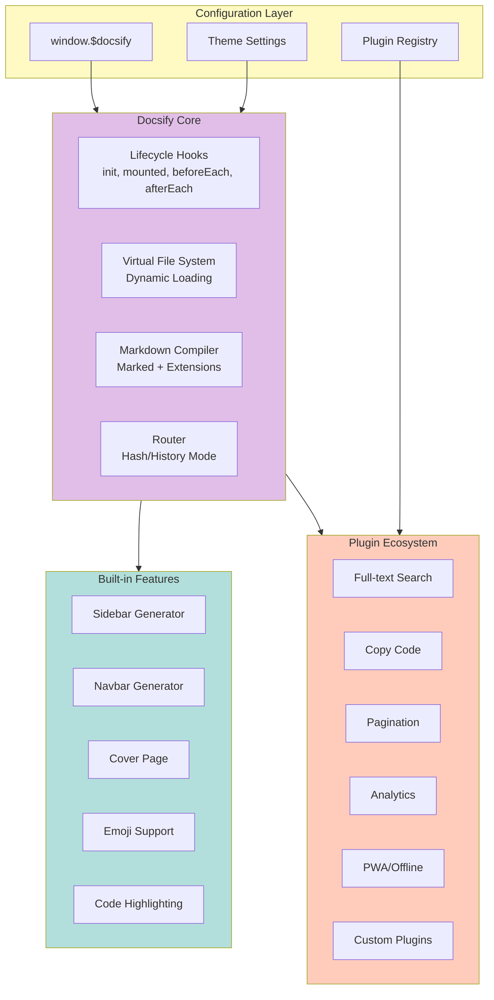
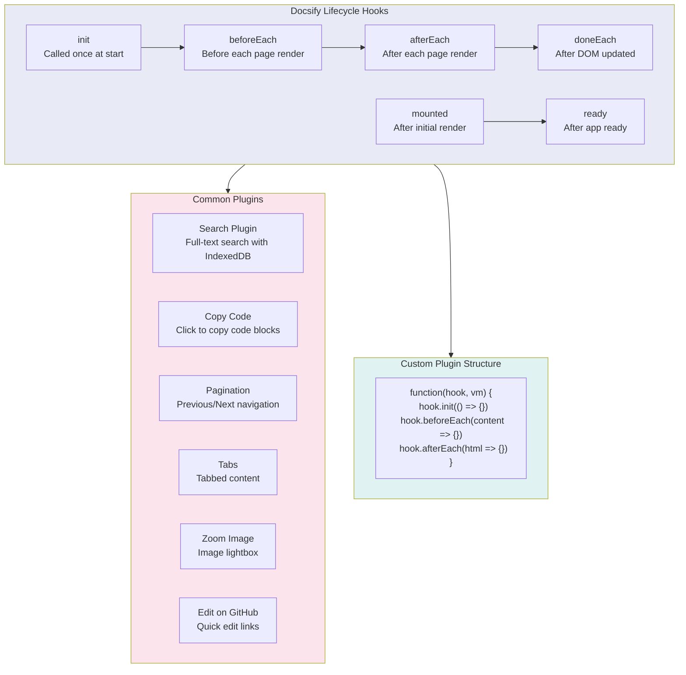
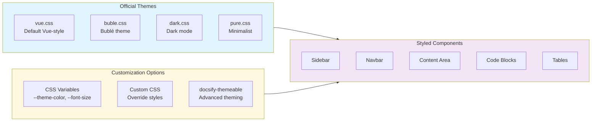
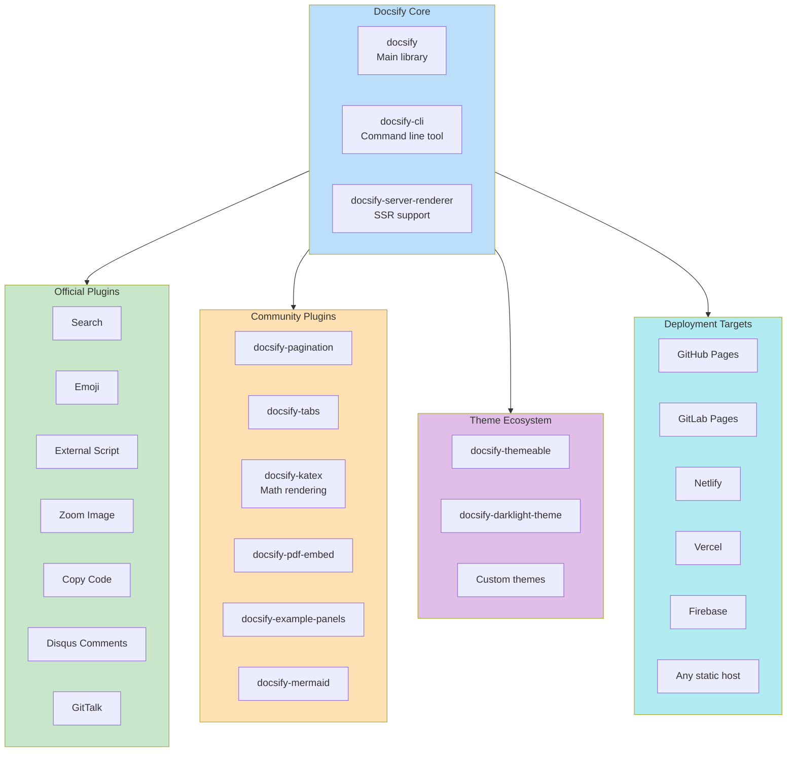
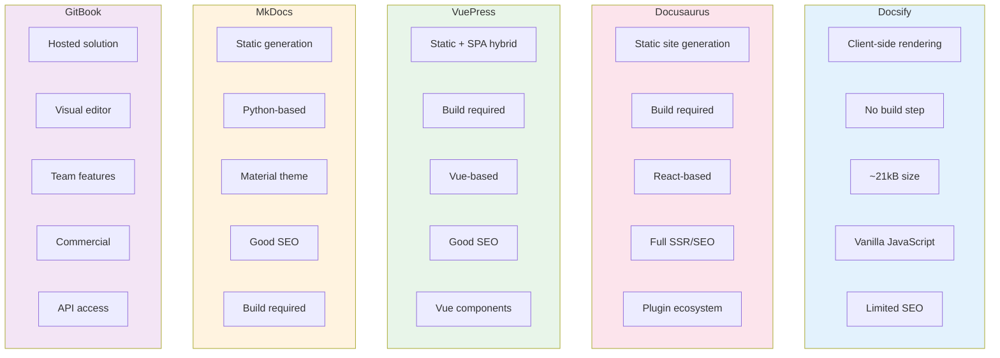

# Docsify - Technical Overview

## Overview

Docsify is a lightweight, client-side documentation site generator that renders Markdown files dynamically without generating static HTML files. Unlike traditional static site generators like Jekyll, Hugo, or Docusaurus, Docsify fetches and parses Markdown files on-the-fly in the browser, making it ideal for projects requiring minimal setup and quick documentation deployment.

## High-Level Architecture



## How It Works



## Request Flow



## Core Architecture Components



## Key Concepts

### Client-Side Rendering

Unlike static site generators that pre-build HTML files, Docsify:
- Loads a single `index.html` as the entry point
- Fetches Markdown files asynchronously via AJAX
- Parses and renders content in the browser using JavaScript
- Uses client-side routing (similar to React Router or Vue Router)

### Zero Build Process

- No compilation step required
- No `node_modules` or build tools needed for basic usage
- Simply serve static files from any web server
- Changes to Markdown files reflect immediately

### File Structure

```
docs/
├── index.html          # Entry point with Docsify config
├── README.md           # Home page content
├── _sidebar.md         # Sidebar navigation (optional)
├── _navbar.md          # Top navigation (optional)
├── _coverpage.md       # Cover/landing page (optional)
├── guide.md            # Additional pages
├── api.md
└── .nojekyll           # Prevents GitHub Pages Jekyll processing
```

### Configuration

All configuration is done via `window.$docsify` object in `index.html`:

```javascript
window.$docsify = {
  name: 'My Docs',
  repo: 'username/repo',
  loadSidebar: true,
  loadNavbar: true,
  coverpage: true,
  maxLevel: 4,
  subMaxLevel: 2,
  search: 'auto',
  themeColor: '#3F51B5'
}
```

## Plugin Architecture



## Theme System



## Ecosystem & Related Tools



## Comparison with Alternatives



| Feature | Docsify | Docusaurus | VuePress | MkDocs |
|---------|---------|------------|----------|--------|
| Build Step | None | Required | Required | Required |
| Size | ~21kB | Heavy | Medium | Light |
| SEO | Limited | Excellent | Good | Excellent |
| Framework | Vanilla JS | React | Vue | Python |
| Learning Curve | Very Low | Medium | Medium | Low |
| Customization | CSS + Plugins | Full React | Full Vue | Themes |

## Key Facts (2025)

- **Repository**: 28,000+ GitHub stars on [docsifyjs/docsify](https://github.com/docsifyjs/docsify)
- **Size**: ~21kB gzipped (core library)
- **License**: MIT
- **Markdown Parser**: Marked.js with GFM support
- **Browser Support**: Modern browsers + IE11 (with polyfills)
- **Notable Users**: Microsoft TypeScript, Ant Design, Element UI, Vite, Adobe Experience Manager

## Use Cases

### Ideal For
- Quick project documentation
- Open-source README documentation
- Personal knowledge bases
- API documentation
- Internal company wikis
- Single-page documentation sites

### Not Ideal For
- SEO-critical marketing sites
- Very large documentation (1000+ pages)
- Sites requiring server-side features
- Complex navigation structures

## Security & Considerations

### SEO Limitations
- Client-side rendering means search engines may have difficulty indexing content
- Workaround: Use docsify-ssr for server-side rendering (experimental)
- Alternative: Generate static snapshots for crawlers

### JavaScript Dependency
- Site will not function without JavaScript enabled
- Content not accessible to non-JS browsers
- May affect accessibility for some users

### CDN Reliance
- Default setup relies on external CDNs (jsdelivr, unpkg)
- Consider self-hosting assets for production
- Network issues can affect site availability

### Content Security
- Markdown is parsed client-side; ensure trusted content sources
- External includes should be from trusted domains
- Consider Content Security Policy headers

## PWA & Offline Support

Docsify supports Progressive Web App features for offline access:


- Service worker caches Markdown files and assets
- Runtime caching with cache-first strategy
- Works with common CDN hostnames
- Full offline access after initial load

## Quick Start

```html
<!-- index.html -->
<!DOCTYPE html>
<html>
<head>
  <meta charset="UTF-8">
  <link rel="stylesheet" href="//cdn.jsdelivr.net/npm/docsify/themes/vue.css">
</head>
<body>
  <div id="app"></div>
  <script>
    window.$docsify = {
      name: 'My Docs',
      repo: 'username/repo'
    }
  </script>
  <script src="//cdn.jsdelivr.net/npm/docsify/lib/docsify.min.js"></script>
</body>
</html>
```

```bash
# Using docsify-cli
npm i docsify-cli -g
docsify init ./docs
docsify serve docs
```

## Sources

- [Docsify Official Website](https://docsify.js.org/)
- [Docsify GitHub Repository](https://github.com/docsifyjs/docsify)
- [Docsify Configuration Documentation](https://github.com/docsifyjs/docsify/blob/develop/docs/configuration.md)
- [Docsify Plugins Documentation](https://github.com/docsifyjs/docsify/blob/develop/docs/plugins.md)
- [Docsify SSR Documentation](https://github.com/docsifyjs/docsify/blob/develop/docs/ssr.md)
- [Awesome Docsify - Plugin Collection](https://github.com/docsifyjs/awesome-docsify)
- [Docsify Themeable](https://jhildenbiddle.github.io/docsify-themeable/)
- [How to Create Documentation with Docsify](https://opensource.com/article/20/7/docsify-github-pages)
- [FreeCodeCamp - How to Write Good Documentation with Docsify](https://www.freecodecamp.org/news/how-to-write-good-documentation-with-docsify/)
