# Dokploy - Technical Overview

## Overview

Dokploy is a free, open-source, self-hostable Platform as a Service (PaaS) that simplifies the deployment and management of applications and databases. Created by developer Mauricio Suárez and launched in April 2024, it serves as an alternative to platforms like Heroku, Vercel, and Netlify, leveraging Docker and Traefik for container orchestration and traffic management.

**Key Value Propositions:**
- **Self-hosted** - Full control over your infrastructure with no vendor lock-in
- **Docker-native** - Built around Docker, Docker Compose, and Docker Swarm
- **Zero-config SSL** - Automatic Let's Encrypt certificate management
- **Multi-server** - Scale across multiple nodes with Docker Swarm support
- **Open Source** - Apache 2.0 license, free to use

## High-Level Architecture

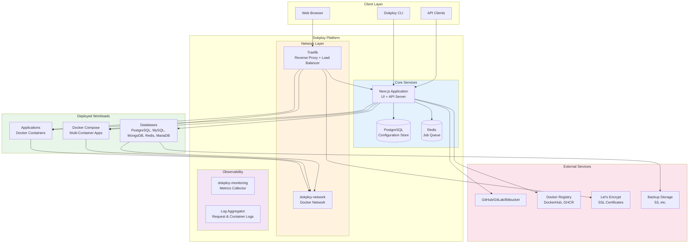

## Core Components

### 1. Next.js Application
The main Dokploy application built with Next.js, providing:
- Server-side rendered UI dashboard
- tRPC API for type-safe communication
- Backend logic for deployments and management

### 2. PostgreSQL Database
Primary data store for:
- User accounts and permissions
- Project and application configurations
- Deployment history and logs
- Domain and certificate settings

### 3. Redis Queue
Manages deployment job queue to:
- Prevent simultaneous deployments
- Handle async build processes
- Manage server load during deployments

### 4. Traefik Reverse Proxy
Handles all incoming traffic:
- Dynamic routing to containers
- Automatic SSL termination
- Load balancing across replicas
- HTTP/3 support for improved performance

## Deployment Workflow

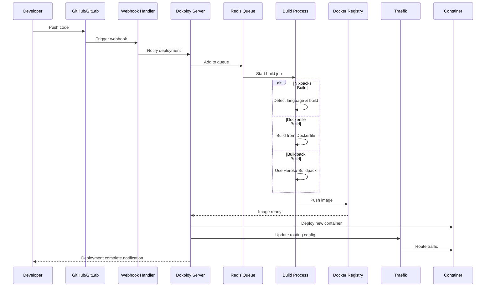

## Build Options

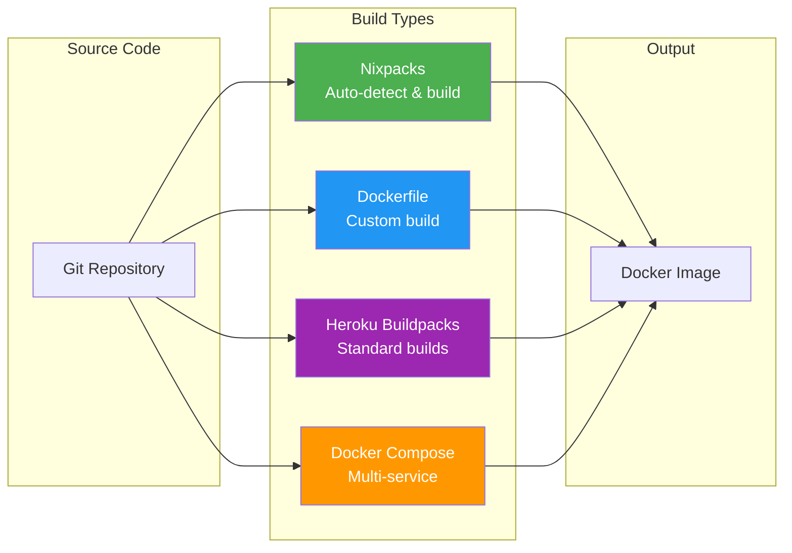

| Build Type | Best For | Features |
|------------|----------|----------|
| **Nixpacks** | Most apps | Auto-detects language, zero config |
| **Dockerfile** | Custom builds | Full control over build process |
| **Buildpack** | Heroku migrations | Compatible with Heroku apps |
| **Docker Compose** | Multi-service apps | Complex architectures, microservices |

## Multi-Server Architecture (Docker Swarm)

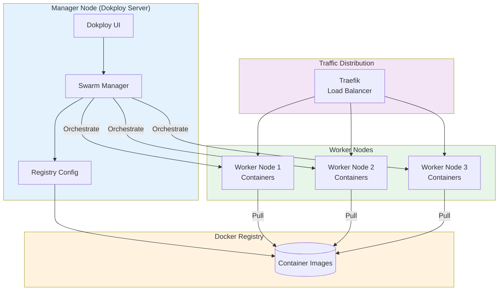

### Cluster Configuration Steps
1. Configure a Docker registry (DockerHub, GHCR, etc.)
2. Initialize Docker Swarm on the manager node
3. Add worker nodes using the join command
4. Deploy applications with replica settings
5. Traefik handles load balancing across nodes

## Database Support

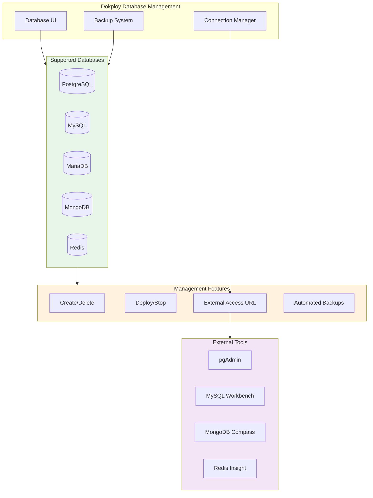

### Database Features
- **One-click deployment** for all supported databases
- **Automated backups** to external storage (S3, etc.)
- **External connection URLs** for database management tools
- **Resource monitoring** per database container

## SSL/TLS Certificate Management

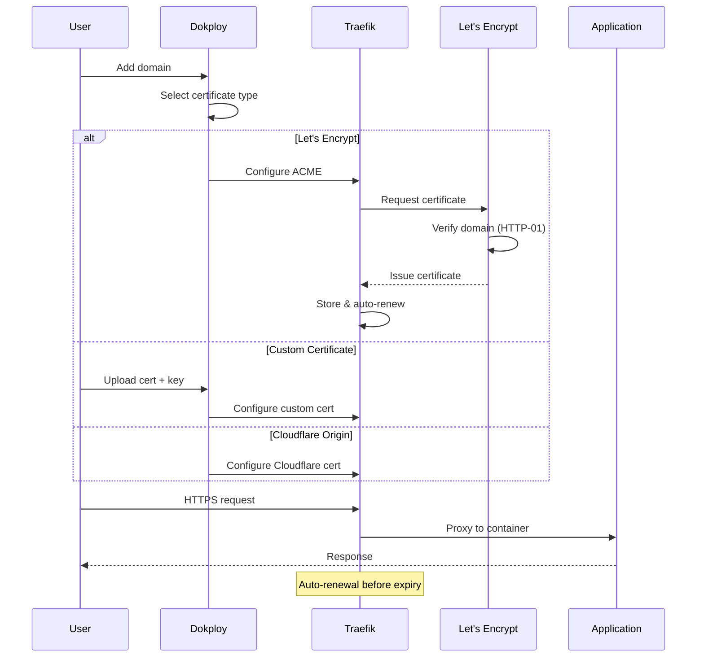

### Certificate Options
| Type | Use Case | Configuration |
|------|----------|---------------|
| **Let's Encrypt** | Public domains | Automatic, free |
| **Custom** | Enterprise/specific needs | Upload cert + key |
| **Cloudflare Origin** | Cloudflare-proxied domains | Full (Strict) mode |

## Monitoring & Observability

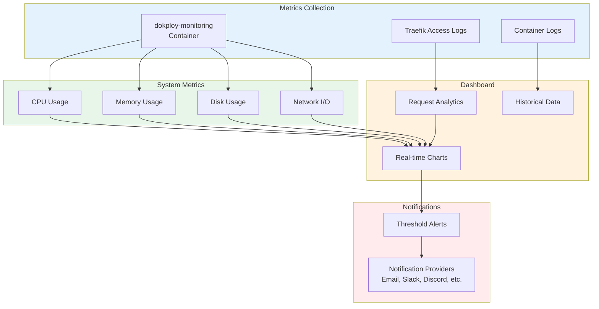

### Monitoring Configuration
| Setting | Default | Description |
|---------|---------|-------------|
| Server Refresh Rate | 20 seconds | Metric collection frequency |
| Container Refresh Rate | 20 seconds | Per-container metrics |
| Retention Days | 2 days | How long metrics are kept |
| Metrics Port | 4500 | Port for metrics server |

## Template System

```mermaid
flowchart LR
    subgraph Templates["Template Repository"]
        Remote[templates.dokploy.com<br/>GitHub Repository]
    end

    subgraph Browser["Template Browser"]
        List[Browse Templates]
        Search[Search & Filter]
        Preview[Preview Config]
    end

    subgraph Deploy["One-Click Deploy"]
        Configure[Configure Variables]
        Create[Create Services]
        Start[Start Containers]
    end

    subgraph Apps["Pre-built Templates"]
        Supabase[Supabase]
        Appwrite[Appwrite]
        Pocketbase[Pocketbase]
        Grafana[Grafana]
        Plausible[Plausible]
        Calcom[Cal.com]
        WordPress[WordPress]
        More[100+ more...]
    end

    Remote --> Browser
    Browser --> Deploy
    Deploy --> Apps

    style Templates fill:#e3f2fd
    style Browser fill:#fff3e0
    style Deploy fill:#e8f5e9
    style Apps fill:#f3e5f5
```

### Popular Templates
- **Supabase** - Open-source Firebase alternative
- **Appwrite** - Backend server for web/mobile apps
- **Pocketbase** - Backend in a single file
- **Plausible** - Privacy-focused analytics
- **Cal.com** - Scheduling & booking
- **Grafana** - Monitoring & visualization
- **Directus** - Headless CMS
- **WordPress** - Content management
- **Nextcloud** - File hosting & collaboration

## CI/CD Integration

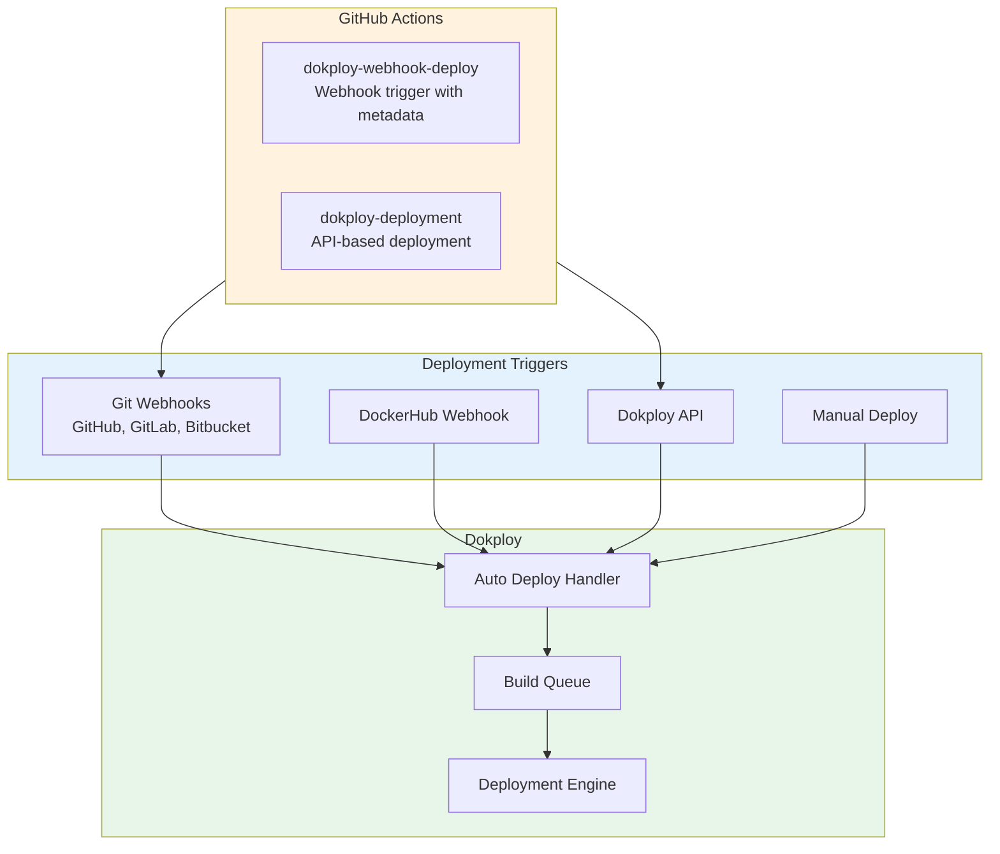

### Auto-Deploy Setup
1. Enable Auto Deploy in application settings
2. Copy webhook URL from deployment logs
3. Add webhook to repository settings
4. Push code to trigger automatic deployment

## Ecosystem & Integrations

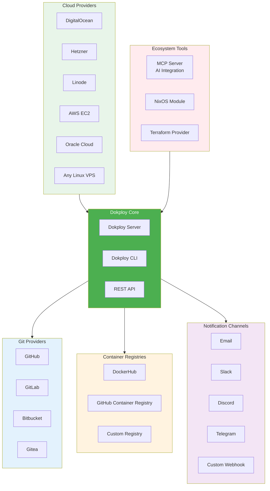

## Key Facts (2025)

### Project Statistics
- **GitHub Stars**: ~24,000 (growing rapidly)
- **First Release**: April 2024
- **License**: Apache 2.0
- **Created by**: Mauricio Suárez

### Technical Specs
- **Stack**: Next.js + tRPC + PostgreSQL + Redis
- **Proxy**: Traefik (with HTTP/3 support)
- **Container Runtime**: Docker + Docker Swarm
- **Required Ports**: 80, 443, 3000 (UI), 4500 (metrics)

### Supported Languages & Frameworks
- Node.js, Python, Go, Ruby, PHP, Rust, Java
- React, Vue, Angular, Svelte, Next.js, Nuxt
- Django, Flask, Rails, Laravel, Spring

### Deployment Options
| Feature | Dokploy | Vercel | Heroku |
|---------|---------|--------|--------|
| Self-hosted | Yes | No | No |
| Price | Free | $20+/mo | $25+/mo |
| Multi-server | Yes | N/A | N/A |
| Docker Compose | Yes | No | Limited |
| Database Management | Yes | Limited | Yes |
| SSL Certificates | Auto | Auto | Auto |

## Use Cases

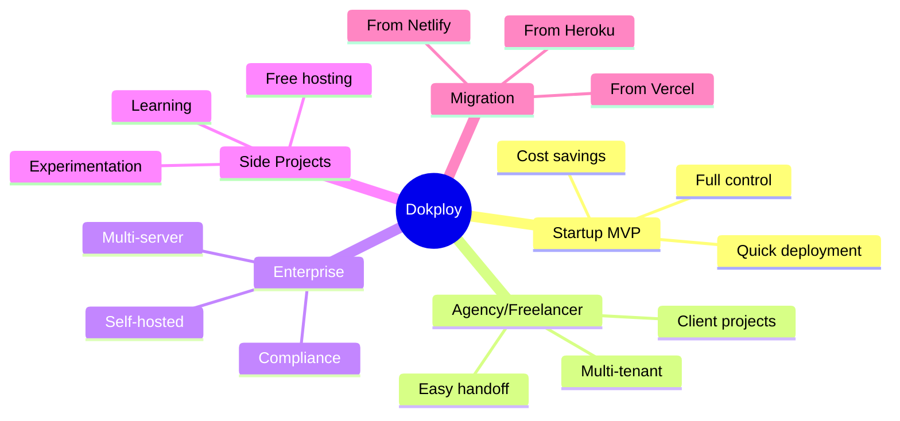

### Ideal For
1. **Startups** - Deploy MVPs without PaaS costs
2. **Agencies** - Manage multiple client projects
3. **Enterprises** - Self-hosted with compliance requirements
4. **Developers** - Side projects with full control
5. **Heroku Refugees** - Smooth migration path

## Security Considerations

### Strengths
- **Container Isolation** - Each app runs in isolated Docker container
- **Automatic SSL** - Let's Encrypt integration
- **Network Isolation** - Internal Docker network (dokploy-network)
- **No Exposed Ports** - Traefik handles all traffic routing
- **Scoped Permissions** - Role-based access control

### Best Practices
1. **Keep Dokploy Updated** - Regular security patches
2. **Firewall Configuration** - Only expose required ports
3. **Strong Passwords** - Use strong credentials for admin
4. **Backup Strategy** - Configure automated database backups
5. **Monitoring Alerts** - Set up threshold notifications

### Considerations
- Self-hosted means **you manage security**
- Database external URLs need proper access control
- Docker Swarm doesn't migrate volumes automatically
- Traefik CE doesn't share ACME certificates across nodes

## Comparison with Alternatives

| Feature | Dokploy | Coolify | CapRover |
|---------|---------|---------|----------|
| **GitHub Stars** | ~24K | ~45K | ~13K |
| **First Release** | 2024 | 2020 | 2018 |
| **UI** | Modern, Docker-focused | Beginner-friendly | Basic |
| **Docker Compose** | Native support | Supported | Limited |
| **Multi-server** | Docker Swarm | Yes | Yes |
| **Resource Usage** | Lower | Higher | Medium |
| **Templates** | 100+ | 150+ | 50+ |
| **Build Options** | Nixpacks, Buildpacks, Dockerfile | Nixpacks, Buildpacks | Dockerfile |

## Installation

```bash
# One-line installation (as root on Linux)
curl -sSL https://dokploy.com/install.sh | sh
```

### Requirements
- Linux server (Ubuntu 20.04+ recommended)
- Root access
- Ports 80, 443, 3000 available
- 2GB+ RAM recommended
- Docker (installed automatically if missing)

## Sources

- [Dokploy Official Website](https://dokploy.com/)
- [Dokploy Documentation](https://docs.dokploy.com/)
- [Dokploy GitHub Repository](https://github.com/Dokploy/dokploy)
- [Dokploy Architecture Docs](https://docs.dokploy.com/docs/core/architecture)
- [Dokploy Templates](https://github.com/Dokploy/templates)
- [Coolify vs Dokploy Comparison](https://fwfw.app/blog/coolify-vs-dokploy-comparison)
- [Dreams of Code - Coolify vs Dokploy](https://blog.dreamsofcode.io/coolify-vs-dokploy-why-i-decided-to-use-one-over-the-other)
- [Dokploy DeepWiki](https://deepwiki.com/dokploy/dokploy)
