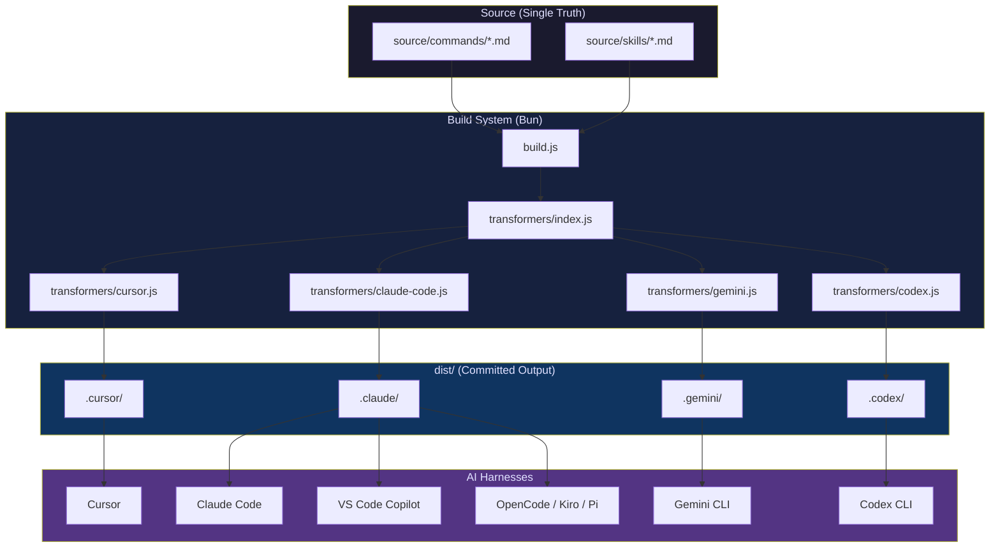
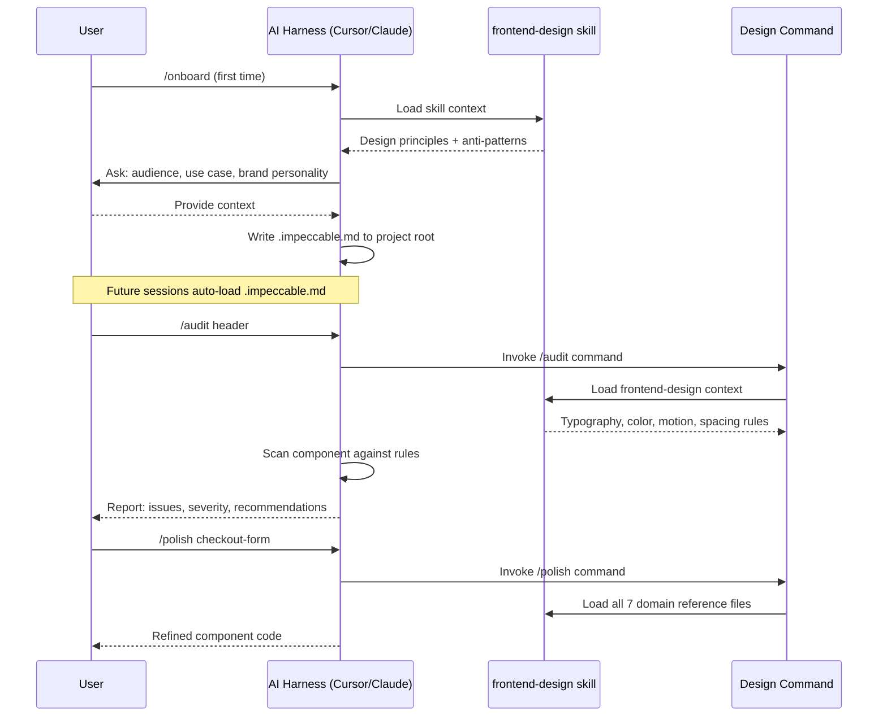
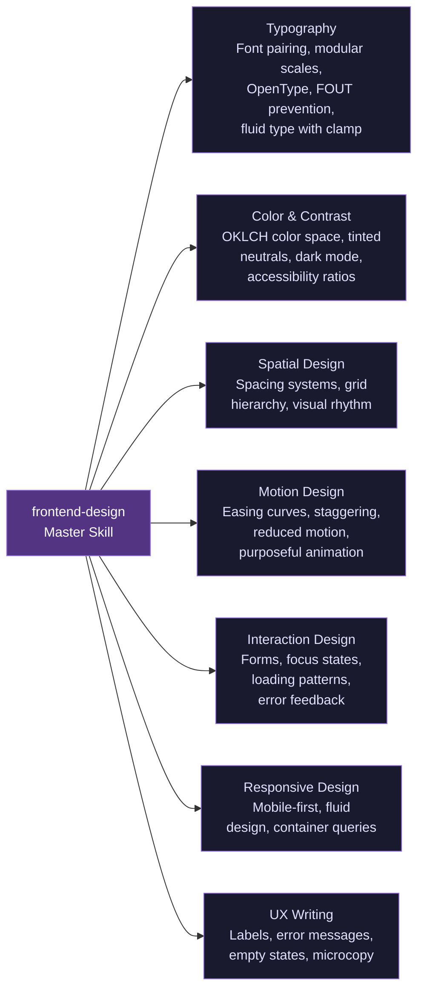
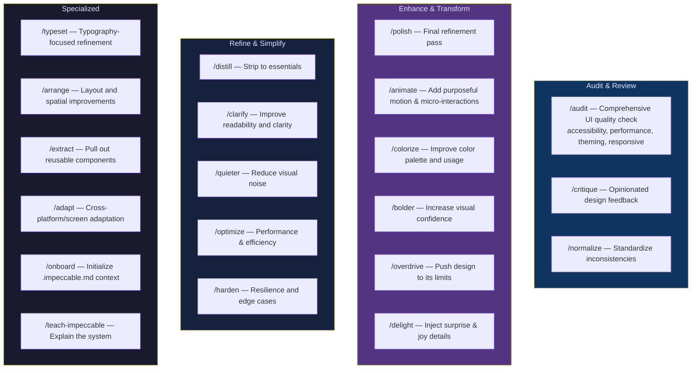
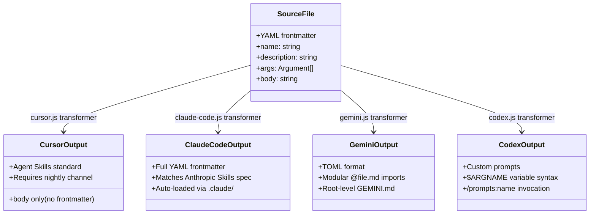
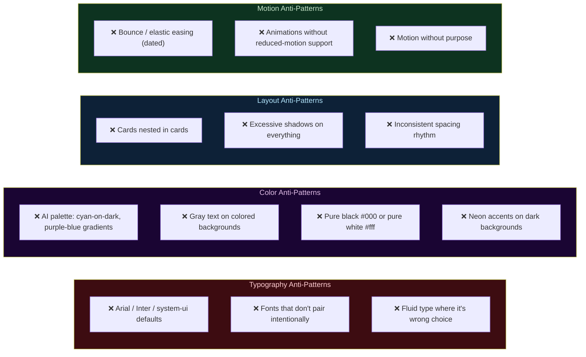
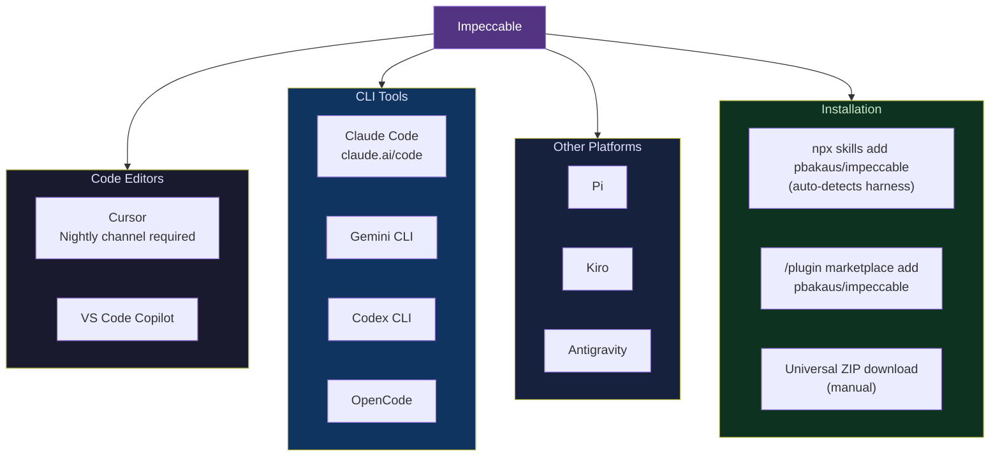
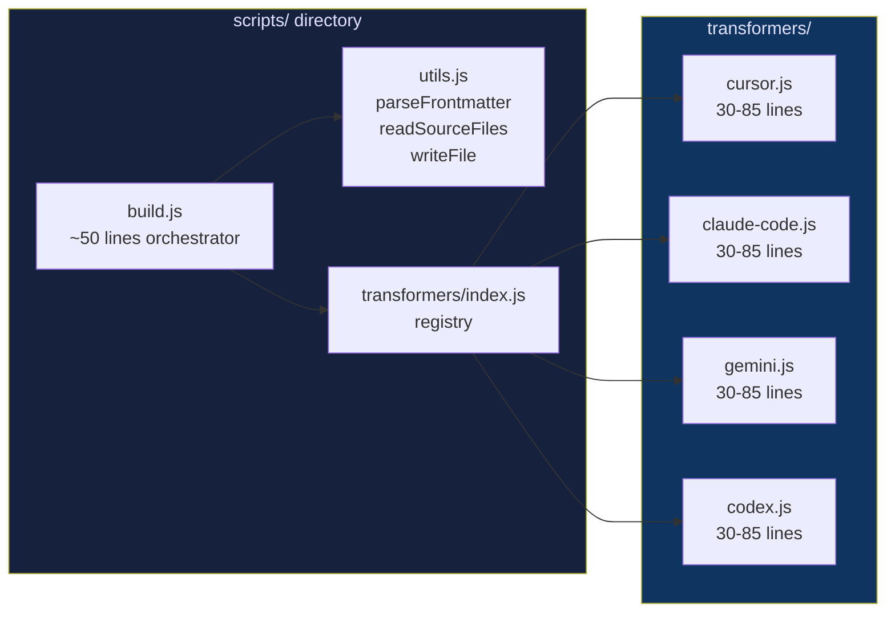

# Impeccable - Technical Overview

> The design language that makes your AI harness better at design.
> — Paul Bakaus ([@pbakaus](https://github.com/pbakaus))

**Repository**: [github.com/pbakaus/impeccable](https://github.com/pbakaus/impeccable) | **Website**: [impeccable.style](https://impeccable.style) | **Stars**: 10.2k | **License**: Apache 2.0

---

## The Problem It Solves

Every LLM was trained on the same generic templates. Without guidance, AI-generated UI defaults to predictable "AI slop": Inter font everywhere, purple-to-blue gradients, cards nested in cards, gray text on colored backgrounds, and dated bounce animations. Impeccable injects design domain expertise into AI coding assistants to break those defaults.

---

## High-Level Architecture



---

## How It Works



---

## Skill System: The Core Knowledge Base

The single `frontend-design` skill is split into 7 domain-specific reference files loaded as context:



---

## 20 Design Commands



**Usage examples:**
```bash
/audit header              # Check a specific component
/polish checkout-form      # Final refinement
/animate hero-section      # Add motion to hero
/i-polish checkout-form    # Use /i- prefix to avoid naming conflicts
```

---

## Provider Transformation System



---

## Anti-Pattern Library (Key Innovation)

Unlike typical design guides that say what *to* do, Impeccable bakes explicit "DO NOT" constraints directly into model context:



---

## Ecosystem & Supported Platforms



---

## Build System Architecture



**Run**: `bun run build` — 2-4x faster than Node.js with zero config

---

## Key Facts (March 2026)

- **Released**: February 2026 (v1.0), latest v1.5.1
- **GitHub Stars**: 10.2k (trending rapidly after March 2026 launch)
- **Forks**: 394
- **Commits**: 182
- **Language mix**: JavaScript 53.4%, CSS 27.8%, HTML 18.8%
- **License**: Apache 2.0 (builds on Anthropic's original frontend-design skill)
- **Install command**: `npx skills add pbakaus/impeccable`
- **Context file**: `.impeccable.md` — auto-saved project design context
- **Platforms**: 9 supported AI harnesses
- **Commands**: 20 design-specific slash commands
- **Skill domains**: 7 (typography, color, space, motion, interaction, responsive, UX writing)

---

## Use Cases

| Scenario | Commands Used |
|----------|---------------|
| New project design setup | `/onboard` → saves brand/audience context |
| UI quality review before shipping | `/audit`, `/critique` |
| Adding animations to existing UI | `/animate` |
| Typography deep-dive | `/typeset` |
| Reducing visual clutter | `/distill`, `/quieter` |
| Making design more confident | `/bolder`, `/overdrive` |
| Extracting reusable components | `/extract` |
| Cross-device adaptation | `/adapt` |
| Final production polish | `/polish`, `/harden` |
| Learning the system | `/teach-impeccable` |

---

## Technical Considerations

### Context Management
- `.impeccable.md` is automatically loaded in every session — keep it concise
- The 7 domain reference files load as context; large skill files affect token usage
- Gemini uses native `@file.md` import syntax for modular context loading

### Naming Conflicts
- Use `/i-` prefix variants (e.g., `/i-polish`) to avoid conflicts with other commands in the same project

### Provider Constraints
- Cursor requires the **Nightly channel** with Agent Skills enabled
- The `dist/` folder is committed so users can copy files without needing build tools
- Never edit `dist/` directly — always edit `source/` and rebuild

### Design Philosophy
- **Anti-patterns are first-class citizens** — explicit "don't" constraints are as valuable as "do" guidance
- **One source of truth** — the transformer architecture ensures all providers stay in sync
- **Vanilla JS + Bun** — no framework complexity for the website/build tooling
- **OKLCH colors** — modern color space for better perceptual uniformity in design tokens

---

## Repository Structure

```
impeccable/
├── source/
│   ├── commands/     # 20 .md files with YAML frontmatter
│   └── skills/       # frontend-design + 7 domain reference files
├── dist/
│   ├── .cursor/
│   ├── .claude/      # skills/ and commands/
│   ├── .gemini/
│   └── .codex/
├── scripts/
│   ├── build.js
│   ├── utils.js
│   └── transformers/
├── functions/        # Vercel/Cloudflare edge functions
├── public/           # Website assets
├── server/           # Local dev server (Bun)
├── tests/
├── CLAUDE.md
├── AGENTS.md
└── wrangler.toml     # Cloudflare Workers config
```

---

Sources:
- [GitHub - pbakaus/impeccable](https://github.com/pbakaus/impeccable)
- [impeccable.style](https://impeccable.style/)
- [Skills and Commands Catalog - DeepWiki](https://deepwiki.com/pbakaus/impeccable/2.3-skills-and-commands-catalog)
- [The frontend-design Skill - DeepWiki](https://deepwiki.com/pbakaus/impeccable/2.2-the-frontend-design-skill)
- [Impeccable - Claude Code Plugin Hub](https://www.claudepluginhub.com/plugins/pbakaus-impeccable)
- [AGENTS.md - pbakaus/impeccable](https://github.com/pbakaus/impeccable/blob/main/AGENTS.md)
