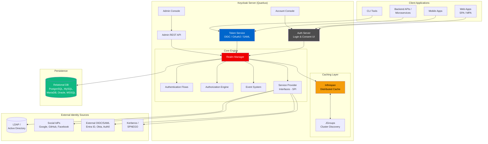
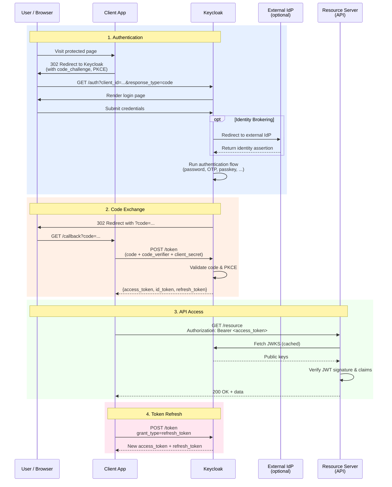
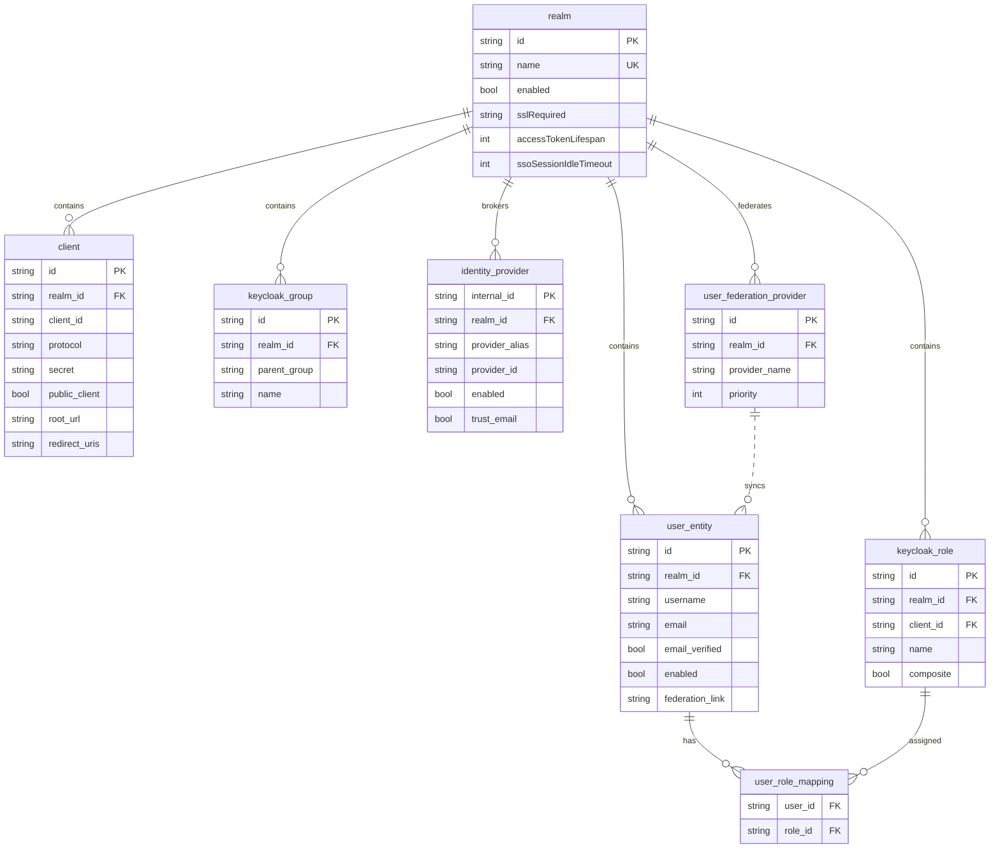
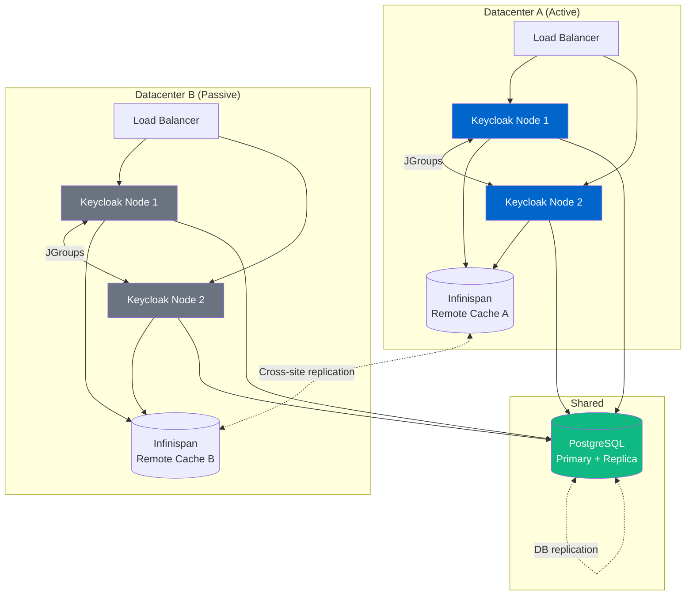
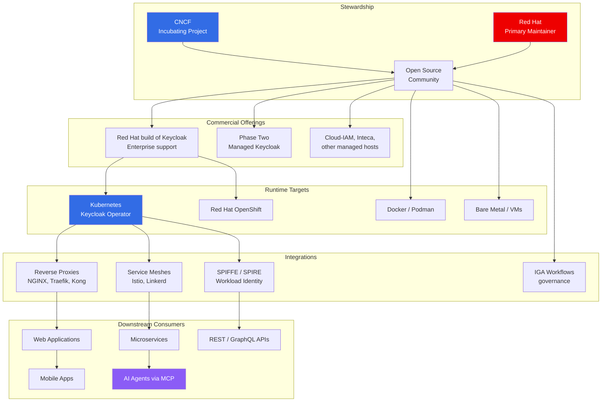

# Keycloak - Technical Overview

Keycloak is an open-source Identity and Access Management (IAM) platform that provides Single Sign-On (SSO), identity brokering, user federation, and fine-grained authorization for modern applications. Originally developed by Red Hat and now a CNCF Incubating project (since April 2023), Keycloak acts as a central authentication server that speaks standard protocols (OpenID Connect, OAuth 2.0, SAML 2.0) so applications can offload all login, session, and user management logic to a single, battle-tested service.

## High-Level Architecture



## Authorization Code Flow (OIDC)



## Key Concepts

### Realms
A **realm** is an isolated tenant within Keycloak. It owns its own users, groups, roles, clients, identity providers, and authentication flows. The `master` realm is reserved for administering Keycloak itself; all application tenancy should live in dedicated realms. Organizations use realms to separate environments (prod/staging), tenants (SaaS customers), or lines of business.

### Clients
A **client** represents an application that wants to authenticate users. Each client is configured with a protocol (OIDC or SAML), redirect URIs, access type (public/confidential/bearer-only), and optional **client scopes** and **protocol mappers** that shape the tokens it receives.

### Users, Groups, and Roles
- **Users** are authenticated principals (human or service). Stored natively or federated from LDAP/AD.
- **Groups** organize users into hierarchies and apply role mappings in bulk.
- **Roles** are permissions. Two scopes exist: **realm roles** (global) and **client roles** (app-specific). Composite roles can bundle other roles.

### Identity Brokering vs User Federation
These are two different integration patterns that are often confused:
- **Identity Brokering**: Users authenticate at a *remote* IdP (Google, Entra ID, Okta) and Keycloak issues its own tokens from the result. No user records are copied — only a federated identity link.
- **User Federation**: Keycloak reads/writes users from an *external store* (LDAP, AD, or a custom store via SPI) as if they were local. Users appear in the Keycloak user list.

### Authentication Flows
Flows are configurable DAGs of authenticators (password → OTP → risk check → passkey → ...). Each step can be REQUIRED, ALTERNATIVE, CONDITIONAL, or DISABLED. Flows support step-up authentication (higher assurance for sensitive actions) and can be customized per client.

### Protocol Mappers
Per-client or per-scope rules that decide which claims/attributes end up in issued tokens. You can map user attributes, roles, group memberships, or hardcoded values into either OIDC JWTs or SAML assertions.

### Fine-Grained Authorization Services (UMA 2.0)
Beyond role checks, Keycloak can act as a **Policy Decision Point (PDP)**, evaluating resource-level policies (role-based, attribute-based, time-based, JavaScript, or aggregated) and returning Requesting Party Tokens (RPTs) to clients.

## Technical Details

### Realm Data Model



### Quarkus Distribution
Since Keycloak 17 (2022), the default distribution runs on **Quarkus** instead of the legacy WildFly app server. Quarkus delivers faster startup, lower memory footprint, container-first packaging, and AOT compilation. Configuration moved from XML subsystems to a flat `keycloak.conf` + CLI flags model.

```bash
# Build an optimized server image
kc.sh build --db=postgres --features=preview

# Start in production mode
kc.sh start --hostname=auth.example.com \
            --https-certificate-file=... \
            --db-url=jdbc:postgresql://...
```

### Clustering & High Availability
Keycloak uses **Infinispan** (embedded by default) for distributed caches and **JGroups** for node discovery. Caches cover user sessions, authentication sessions, authorization data, and login failures.



Since Keycloak 24, **active/passive multi-site** is fully supported. Keycloak 26 added **persistent sessions** (sessions survive restarts without sticky sessions) and **clusterless mode** (external Infinispan only).

### Service Provider Interfaces (SPIs)
Nearly every component in Keycloak is pluggable via an SPI:
- **User Storage SPI** — plug custom user databases
- **Authenticator SPI** — custom login steps
- **Identity Provider SPI** — custom brokers
- **Event Listener SPI** — stream login/admin events
- **Protocol Mapper SPI** — custom claim logic
- **Theme SPI** — override login/email/account/admin UI
- **Policy SPI** — custom authorization rules

### Tokens
Keycloak issues three token types for OIDC:
- **Access Token**: JWT signed with RS256/ES256/EdDSA, carries roles, scopes, audience
- **ID Token**: JWT with user profile claims (sub, name, email, ...)
- **Refresh Token**: Opaque or JWT, used to mint new access tokens

Token lifespan, audience, and claim content are all configurable per realm and client.

## Ecosystem & Participants



## Authentication & Authorization Capabilities

```mermaid
graph TB
    subgraph "Authentication Methods"
        Pwd[Username + Password]
        Pass[Passkeys / WebAuthn<br/>Default in 26.4+]
        OTP[TOTP / HOTP<br/>Google Auth, FreeOTP]
        Magic[Magic Link Email]
        XCert[X.509 Client Cert]
        Kerb[Kerberos / SPNEGO]
        Social[Social Login<br/>Google, GitHub, FB, ...]
        SAMLB[SAML Brokering]
        OIDCB[OIDC Brokering]
    end

    subgraph "Protocols Served"
        OIDC[OpenID Connect 1.0]
        OAuth[OAuth 2.0 / 2.1]
        SAML[SAML 2.0]
        UMA[UMA 2.0<br/>Authorization]
        FAPI[FAPI 2.0<br/>Financial-grade]
        DPoP[DPoP<br/>Proof of Possession]
    end

    subgraph "Authorization Models"
        RBAC[Role-Based<br/>Access Control]
        ABAC[Attribute-Based<br/>Access Control]
        GBAC[Group-Based]
        Policy[JavaScript /<br/>Time / Aggregated]
        FGAP[Fine-Grained<br/>Admin Permissions V2]
    end

    subgraph "Enterprise Features"
        MFA[Multi-Factor<br/>Step-up]
        SSO[Single Sign-On /<br/>Single Logout]
        Fed[LDAP / AD Federation]
        Orgs[Organizations &<br/>Multi-tenancy]
        IGA2[IGA Workflows]
    end

    Pwd --> OIDC
    Pass --> OIDC
    OTP --> MFA
    Social --> OIDCB
    SAMLB --> SAML
    OIDC --> RBAC
    OIDC --> ABAC
    UMA --> Policy
    RBAC --> SSO
    Fed --> SSO
    FAPI --> DPoP

    style Pass fill:#10B981,color:#fff
    style FAPI fill:#EF4444,color:#fff
    style SSO fill:#3B82F6,color:#fff
    style Orgs fill:#F59E0B,color:#000
```



## Key Facts (2025)

- **License**: Apache 2.0 (fully open source)
- **CNCF Status**: Incubating project since April 10, 2023; Health Score "Excellent" (86)
- **GitHub**: ~26,000+ stars, 6,500+ forks across the `keycloak/keycloak` repo; 12,770 contributors across 2,624 organizations
- **CNCF Survey Rank**: Among top 4 most-adopted incubating projects (42% usage)
- **Latest Version**: Keycloak 26.6.0 (April 2026), with 26.4 released September 2025 adding passkeys by default and FAPI 2.0
- **Runtime**: Quarkus (default since 17); WildFly legacy dropped in 2022
- **Default Database**: PostgreSQL (also supports MySQL, MariaDB, Oracle, MSSQL)
- **Protocols**: OIDC, OAuth 2.0/2.1, SAML 2.0, UMA 2.0, FAPI 2.0, DPoP, SPIFFE JWT-SVID
- **Notable 2025 Production Deployments**: BRZ Austria (2M users), Japan Healthcare (200k users), IFTM/Gov.br (12k users), OpenTalk, Hitachi, E. Breuninger
- **Benchmarked Scale**: 2,000 logins/sec and 10,000 token refreshes/sec per documented reference architecture
- **Software Value (CNCF estimate)**: $4.3B

## Use Cases

### Enterprise SSO
Centralize login across dozens of internal apps. LDAP/AD federation reuses existing directories; Kerberos bridge gives desktop-SSO experience. One login screen, uniform session management, single logout across the estate.

### B2B SaaS Multi-Tenancy
Use **Realms** for hard tenant isolation (separate users, themes, policies) or **Organizations** (introduced in 26.x) for lighter-weight multi-tenancy inside a single realm. Each organization can bring its own IdP and branding.

### Customer Identity (CIAM)
Social login, self-registration, email verification, forgot-password flows, custom theming, and GDPR-friendly account consoles. Federates with Google/Facebook/Apple while owning the user store.

### Microservices & API Gateways
Issue short-lived JWTs consumed by services and API gateways (Kong, NGINX, Envoy, Istio). Resource servers validate tokens offline via cached JWKS. Service-to-service auth via client-credentials grant or token exchange.

### Zero Trust Architectures
Token exchange narrows scopes per call; DPoP binds tokens to client keys; fine-grained admin permissions delegate narrow admin actions. Keycloak 26.2+ explicitly targets zero-trust patterns.

### AI / Agent Authorization
Since 26.4, Keycloak publishes OAuth 2.0 Authorization Server Metadata in line with the **Model Context Protocol (MCP)** spec, making it an authorization server for AI agents connecting to tools and data sources. Experimental support for OAuth Client ID Metadata Document (CIMD).

### Financial-Grade APIs
FAPI 2.0 compliance, DPoP, and strong client authentication profiles make Keycloak suitable for open-banking, PSD2, and regulated fintech deployments — Hitachi runs it for Japanese banks under FAPI.

### Kubernetes-Native Workload Identity
Consume Kubernetes service account tokens or SPIFFE JWT-SVIDs for **federated client authentication** — secretless OIDC clients that authenticate with short-lived platform tokens, eliminating static client secrets.

## Security Considerations

### Strengths
- **Open source & auditable**: No vendor black box; entire code base reviewable
- **Data sovereignty**: All user data stays in your database/infrastructure
- **Standards-first**: Implements current OAuth/OIDC best practices (PKCE required, refresh rotation, DPoP, FAPI 2.0)
- **Brute-force detection**: Built-in lockout policies per realm
- **Password policies**: Configurable complexity, rotation, history, and Argon2/PBKDF2 hashing
- **Token binding**: DPoP, mTLS-bound tokens, audience restriction

### Operational Risks
- **Self-hosted complexity**: You own uptime, backups, upgrades, patching, and cluster ops
- **Resource-hungry**: Production HA clusters typically need 2+ GB RAM per node; large realms can stress DB
- **Upgrade friction**: Database schema migrations are version-gated; breaking changes occur between majors
- **Clustering quirks**: Infinispan/JGroups misconfiguration is a common cause of split-brain incidents
- **Default secrets**: First-boot admin credentials must be rotated immediately; `master` realm must be locked down

### Hardening Checklist
- Run behind TLS terminating proxy; set `hostname` and `proxy` flags correctly
- Rotate signing keys periodically (realm key management supports this)
- Use confidential clients with client authentication wherever possible
- Enable Brute Force Detection and account lockout
- Disable `Direct Access Grants` (password grant) for public clients
- Pin refresh token reuse detection on (`Revoke Refresh Token = ON`)
- Back up realm configurations (export) regularly in addition to DB backups
- Monitor `AdminEvent` and `LoginEvent` streams via Event Listener SPI

### Comparison to Alternatives

| Dimension | Keycloak | Auth0 / Okta | Ory (Hydra+Kratos) | AWS Cognito |
|---|---|---|---|---|
| License | Apache 2.0 | Commercial SaaS | Apache 2.0 | Proprietary |
| Deployment | Self-hosted | Cloud | Self-hosted or Cloud | AWS-managed |
| Data Ownership | Yours | Vendor | Yours | AWS |
| Protocols | OIDC, OAuth2, SAML, UMA | OIDC, OAuth2, SAML | OIDC, OAuth2 | OIDC, OAuth2, SAML |
| Admin UI | Full-featured | Polished SaaS | Minimal / DIY | AWS Console |
| LDAP/AD Federation | Built-in | Enterprise tier | Plugin | Limited |
| Per-user pricing | Free | Tiered | Free | Tiered |
| Extensibility | Extensive SPIs | Rules/Actions | Go plugins | Lambda triggers |

---

## Sources

- [Keycloak Official Website](https://www.keycloak.org/)
- [Keycloak Server Administration Guide](https://www.keycloak.org/docs/latest/server_admin/index.html)
- [Keycloak Authorization Services Guide](https://www.keycloak.org/docs/latest/authorization_services/index.html)
- [Keycloak Server Developer Guide](https://www.keycloak.org/docs/latest/server_development/index.html)
- [Keycloak Release Notes](https://www.keycloak.org/docs/latest/release_notes/index.html)
- [Keycloak 26.6.0 Release Announcement](https://www.keycloak.org/2026/04/keycloak-2660-released)
- [Keycloak 26.4.0 Release Announcement](https://www.keycloak.org/2025/09/keycloak-2640-released)
- [Keycloak 26.3.0 Release Announcement](https://www.keycloak.org/2025/07/keycloak-2630-released)
- [Keycloak High Availability Deployment Guide](https://www.keycloak.org/high-availability/deploy-keycloak-kubernetes)
- [Migrating to Quarkus Distribution](https://www.keycloak.org/migration/migrating-to-quarkus)
- [Federated Client Authentication — Keycloak Blog](https://www.keycloak.org/2026/01/federated-client-authentication)
- [Keycloak on CNCF](https://www.cncf.io/projects/keycloak/)
- [Self-hosted human and machine identities in Keycloak 26.4 — CNCF](https://www.cncf.io/blog/2025/11/07/self-hosted-human-and-machine-identities-in-keycloak-26-4/)
- [Zero Trust with Keycloak 26.2 — CNCF](https://www.cncf.io/blog/2025/04/24/prepare-your-application-landscape-for-zero-trust-with-keycloak-26-2/)
- [BRZ Case Study: Austrian Business Service Portal Migration](https://www.cncf.io/case-studies/brz-migrated-the-austrian-business-service-portal-with-2m-users-to-keycloak/)
- [OpenTalk Keycloak Case Study](https://www.keycloak.org/2025/05/opentalk-case-study)
- [Keycloak Case Studies](https://www.keycloak.org/case-studies)
- [What Is Keycloak? — Bitcot](https://www.bitcot.com/what-is-keycloak-and-how-does-it-work-for-business-security/)
- [Keycloak Core Concepts — Red Hat Developer](https://developers.redhat.com/blog/2019/12/11/keycloak-core-concepts-of-open-source-identity-and-access-management)
- [How to architect OAuth 2.0 using Keycloak — Red Hat](https://www.redhat.com/en/blog/oauth-20-authentication-keycloak)
- [Keycloak Single Sign-On — Google Cloud Architecture Center](https://docs.cloud.google.com/architecture/identity/keycloak-single-sign-on)
- [Enterprise Identity Federation with Keycloak and LDAP](https://lucidprogrammer.github.io/enterprise%20authentication/identity%20federation/2025/06/05/keycloak-ldap-federation-guide.html)
- [Caching and High Availability — DeepWiki](https://deepwiki.com/keycloak/keycloak/4.4-database-configuration)
- [Spotlight: Simplifying Keycloak Upgrades — Chkk](https://www.chkk.io/blog/spotlight-keycloak)
