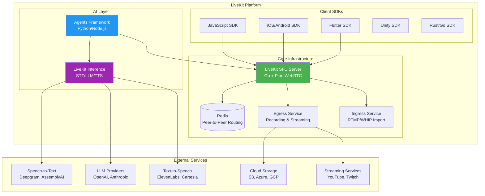
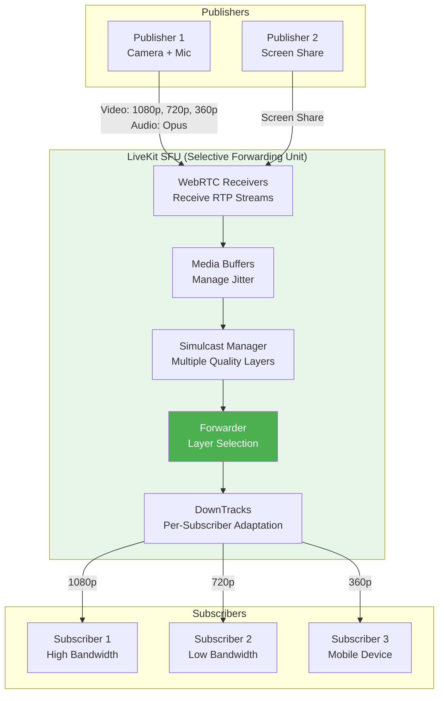
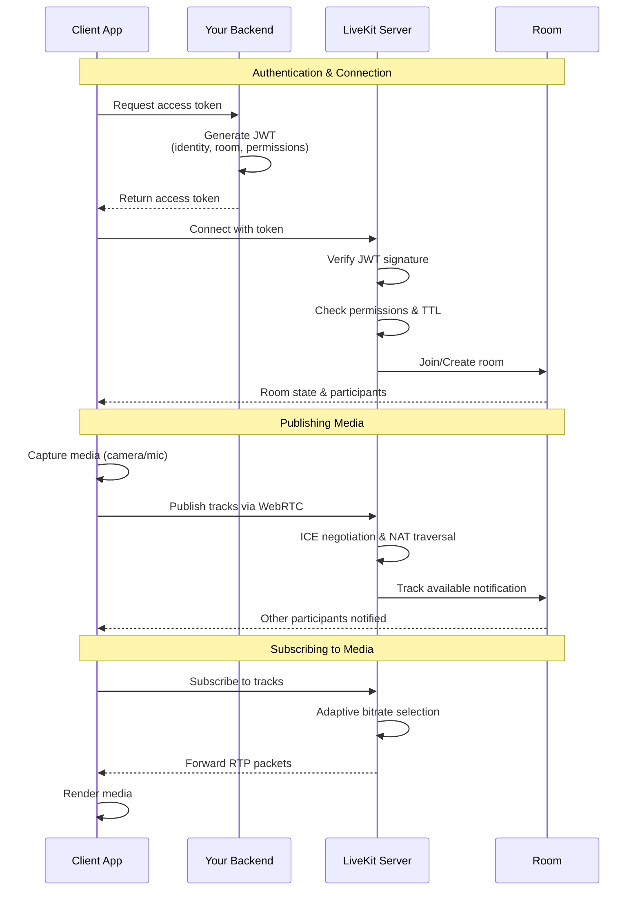
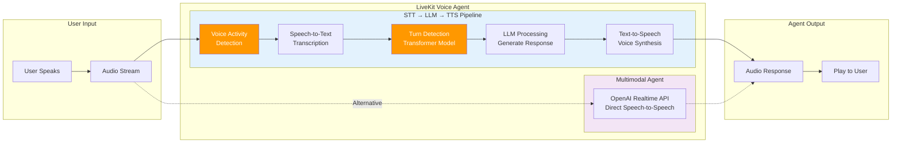
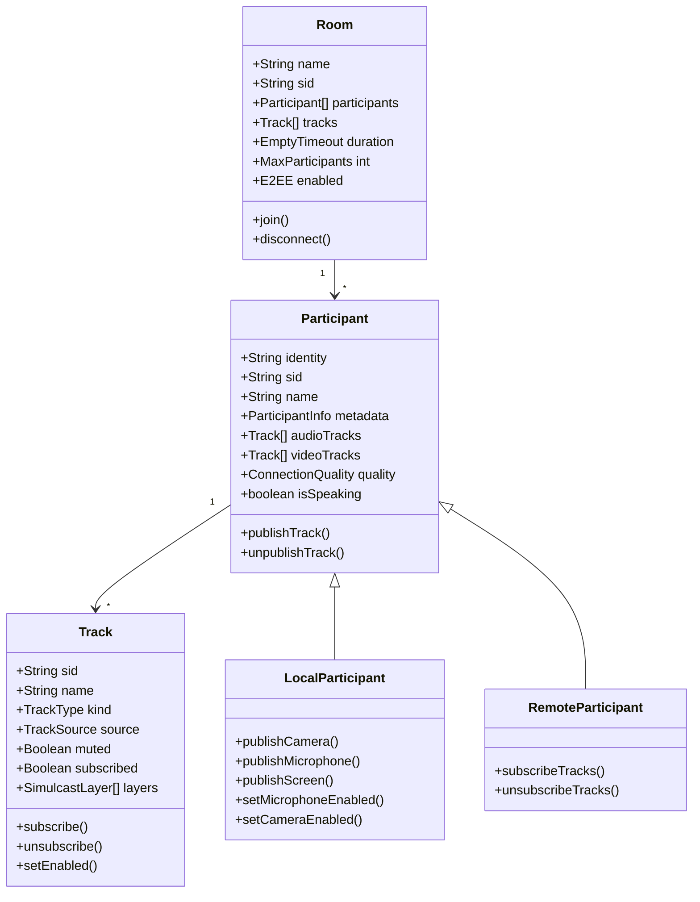
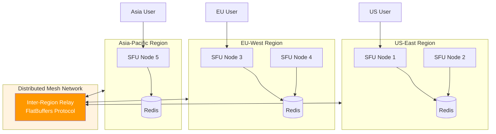
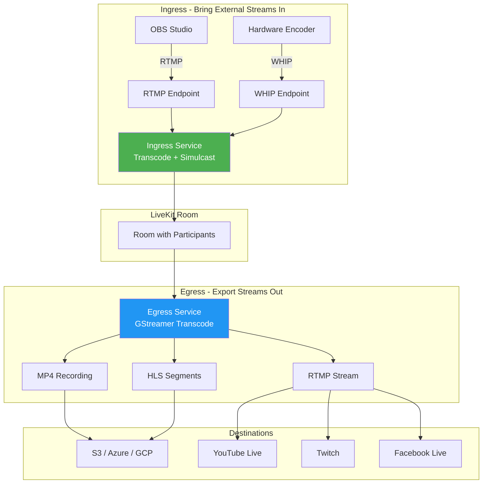
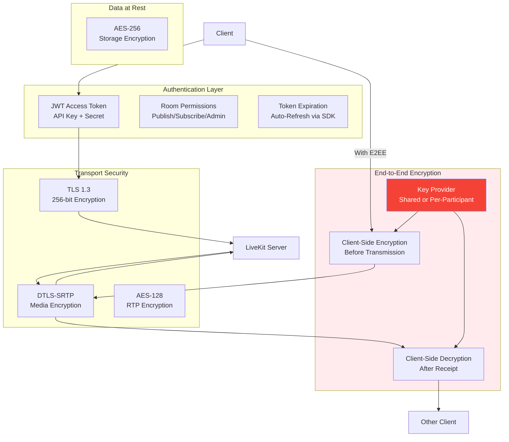
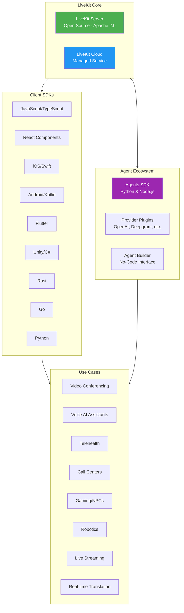

# LiveKit - Technical Overview

LiveKit is an open-source, real-time communication platform built on WebRTC that enables developers to build voice, video, and AI agent applications. It provides a Selective Forwarding Unit (SFU) architecture with comprehensive SDKs for multiple platforms.

## High-Level Architecture

## How It Works - SFU Architecture

## WebRTC Connection Flow

## Voice AI Agent Pipeline

## Room, Participants, and Tracks Model

## Distributed Architecture - Multi-Region

## Egress & Ingress Flow

## Security Architecture

## Ecosystem - Participants & Use Cases

## Key Concepts

### Selective Forwarding Unit (SFU)

Unlike MCU (Multipoint Control Unit) that decodes and re-encodes all streams, an SFU routes media packets directly without transcoding:

| Aspect | SFU (LiveKit) | MCU |
|--------|---------------|-----|
| **Latency** | Ultra-low (~100-300ms) | Higher (decoding delay) |
| **Server CPU** | Low (just routing) | High (transcoding) |
| **Flexibility** | Full control per track | Single composite |
| **Bandwidth** | More downstream | Less downstream |
| **Scalability** | Horizontal | Vertical |

### Simulcast

Publishers send multiple quality layers (e.g., 1080p, 720p, 360p). The SFU selects the appropriate layer for each subscriber based on:
- Available bandwidth
- Device capabilities
- Network conditions

### Rooms and Tracks

- **Room**: Virtual space where participants connect
- **Participant**: User or agent in a room
- **Track**: Individual audio or video stream
  - **Source Types**: Camera, Microphone, Screen Share
  - **Track Types**: Audio, Video

### Voice Pipeline Components

1. **VAD (Voice Activity Detection)**: Detects when user is speaking
2. **STT (Speech-to-Text)**: Converts speech to text
3. **Turn Detection**: Determines when user finished speaking
4. **LLM**: Generates response
5. **TTS (Text-to-Speech)**: Converts text to audio

## Key Facts (2025)

- **Scale**: Single session supports up to 100,000 simultaneous users
- **Latency**: Sub-300ms latency for global participants
- **Developers**: 100,000+ developers on LiveKit Cloud
- **Usage**: 3+ billion calls per year on LiveKit Cloud
- **License**: Apache 2.0 (fully open source)
- **Languages**: Server written in Go with Pion WebRTC
- **SDKs**: 10+ client SDKs (JS, React, iOS, Android, Flutter, Unity, Rust, Go, Python, Node.js)
- **Free Tier**: 10,000 participant minutes/month
- **AI Inference**: Free until January 1, 2026
- **Noise Cancellation**: Partnered with Krisp for AI-powered noise suppression

## Technical Specifications

| Component | Technology |
|-----------|------------|
| **Server Language** | Go |
| **WebRTC Implementation** | Pion |
| **Transport Encryption** | TLS 1.3 (256-bit) |
| **Media Encryption** | AES-128 (SRTP) |
| **Storage Encryption** | AES-256 |
| **Clustering** | Redis |
| **Inter-Region Protocol** | FlatBuffers |
| **Transcoding** | GStreamer |
| **E2EE** | SFrame (optional) |

## Common Use Cases

1. **Video Conferencing**: Build Zoom/Meet-like applications
2. **Voice AI Assistants**: Create conversational AI agents
3. **Telehealth**: HIPAA-compliant medical consultations
4. **Call Centers**: AI-powered inbound/outbound support
5. **Live Streaming**: Broadcast to YouTube, Twitch with recording
6. **Gaming NPCs**: Voice-enabled AI characters
7. **Robotics**: Cloud-based robot brains
8. **Real-time Translation**: Multi-language conversations

## Integration Providers

### Speech-to-Text
- Deepgram, AssemblyAI, OpenAI Whisper, Google Speech, Azure Speech, Speechmatics

### Large Language Models
- OpenAI GPT-4, Anthropic Claude, Google Gemini, Open-source models

### Text-to-Speech
- ElevenLabs, Cartesia, OpenAI TTS, Azure Neural Voice, Google TTS, Rime

## Sources

- [LiveKit Official Website](https://livekit.io/)
- [LiveKit Documentation](https://docs.livekit.io/)
- [LiveKit GitHub Repository](https://github.com/livekit/livekit)
- [LiveKit Agents Framework](https://github.com/livekit/agents)
- [LiveKit SFU Architecture](https://docs.livekit.io/reference/internals/livekit-sfu/)
- [LiveKit Security](https://livekit.io/security)
- [LiveKit Cloud Pricing](https://livekit.io/pricing)
- [Scaling WebRTC with Distributed Mesh](https://blog.livekit.io/scaling-webrtc-with-distributed-mesh/)
