# Loveable (Lovable.dev) - How It Works

## Overview

Loveable is an AI-powered full-stack web application development platform that enables users to create production-ready applications using natural language prompts.

## Architecture & Workflow

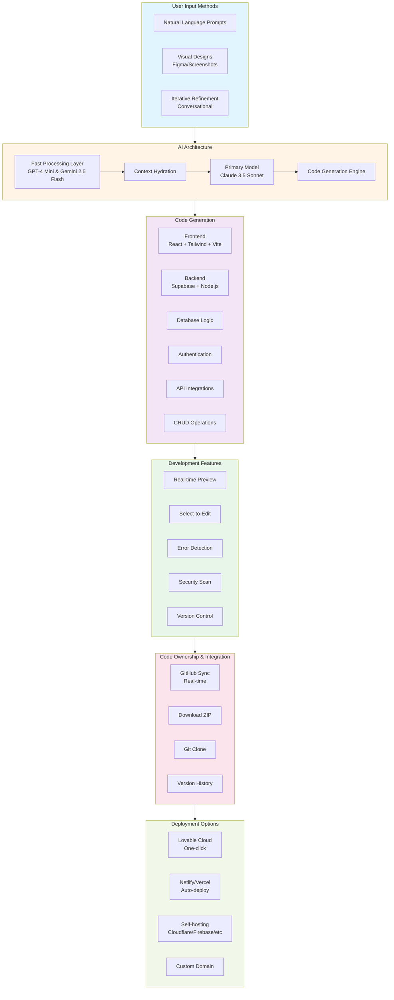

## Multi-Model LLM Strategy

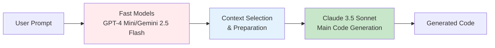

## Technology Stack

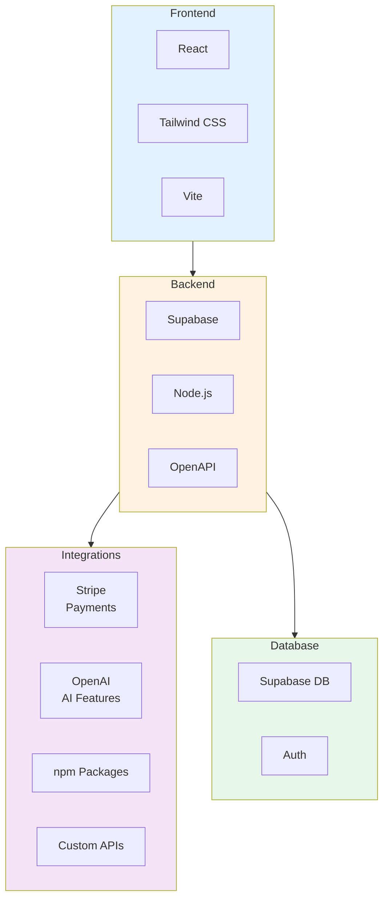

## User Interaction Flow

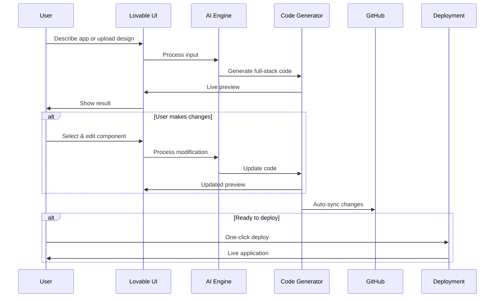

## Key Capabilities

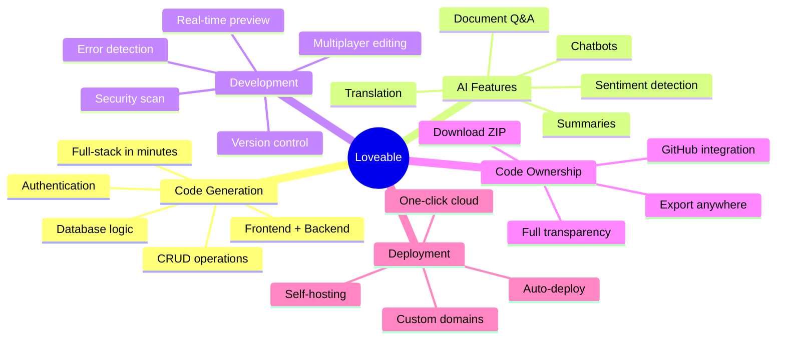

## Target Users & Use Cases

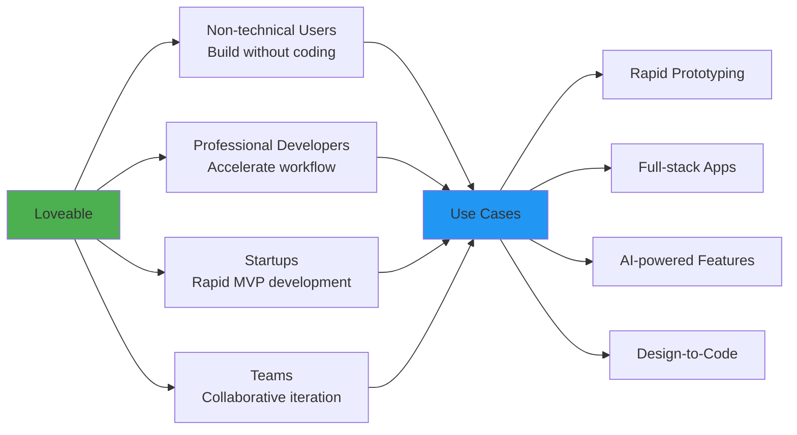

## Key Differentiators

- **Real Code Generation**: Generates actual, editable source code (not no-code)
- **Claude-Powered**: Uses Claude 3.5 Sonnet for best code generation
- **Full-Stack in Minutes**: Complete frontend, backend, and database from single prompts
- **Code Ownership**: Complete transparency with GitHub integration
- **Production-Ready**: Immediately deployable applications

---

# Building a Loveable-Like Product: Proposed Architecture

## System Architecture Overview

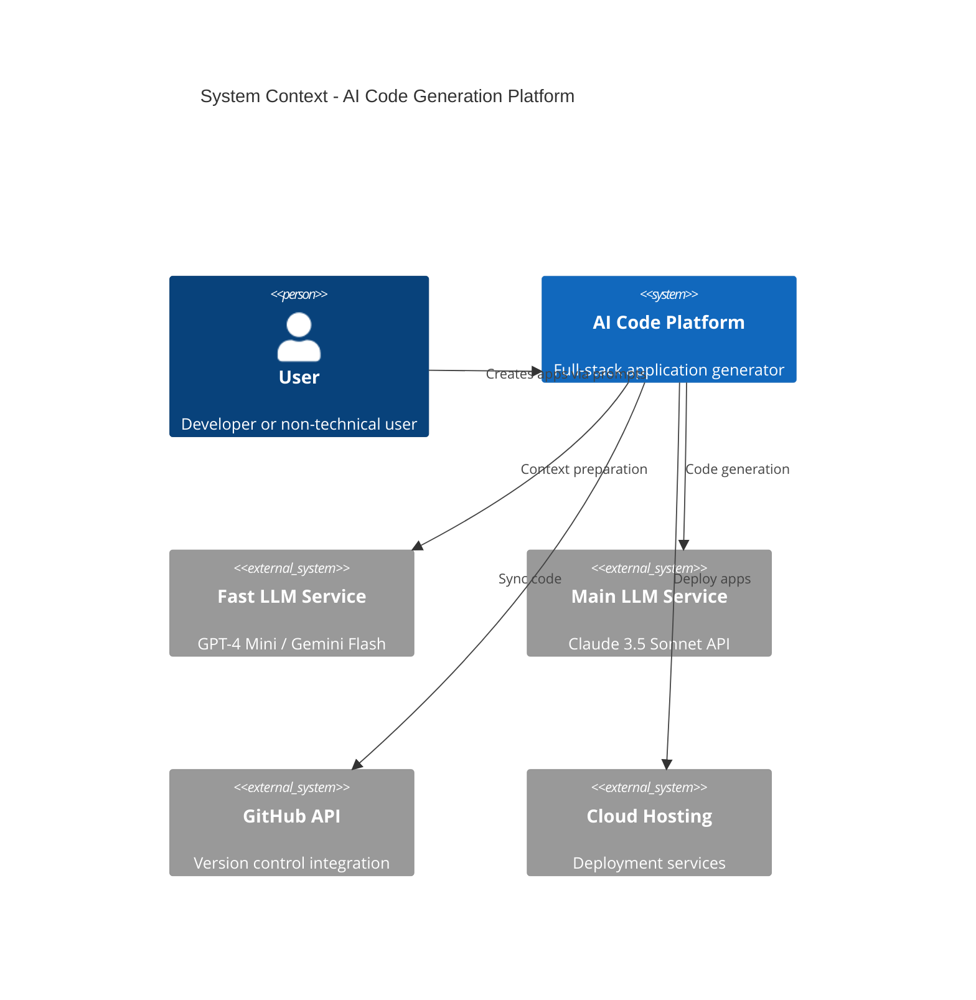

## Container Architecture

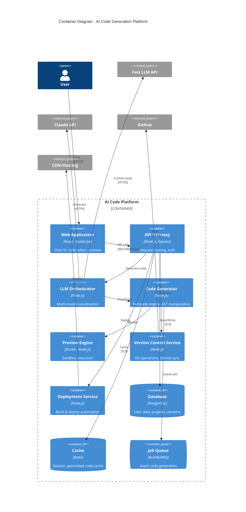

## Component Architecture - Code Generation Flow

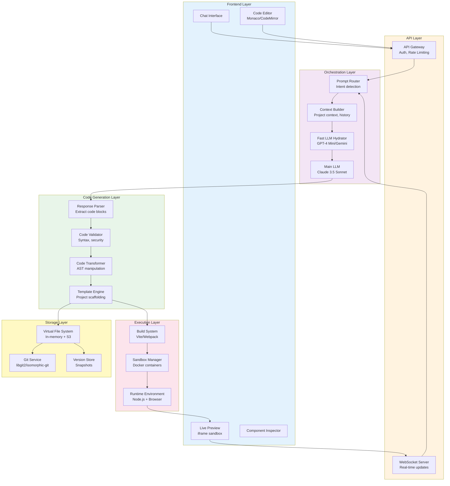

## Key Components Deep Dive

### 1. LLM Orchestration Strategy

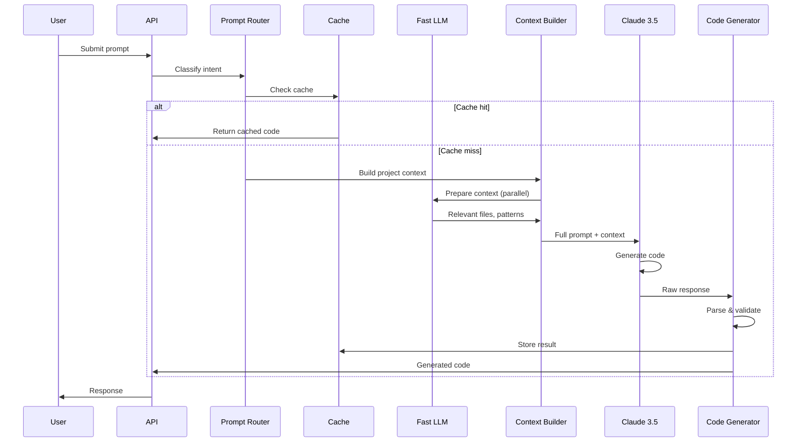

### 2. Real-time Preview System

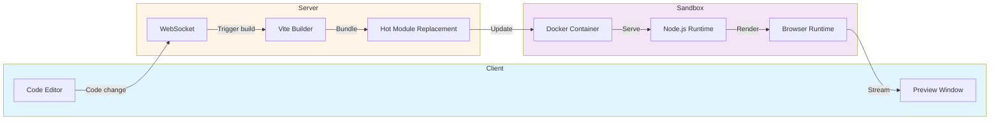

### 3. Version Control & GitHub Integration

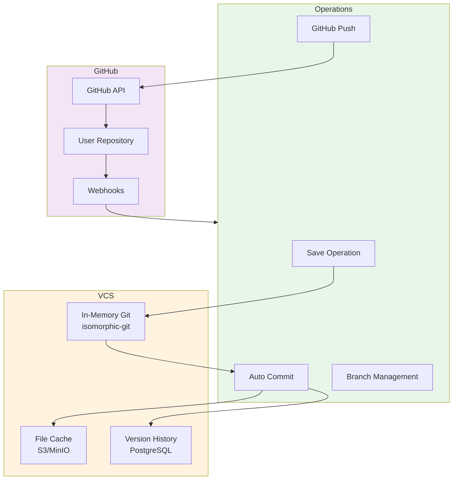

## Technology Stack Proposal

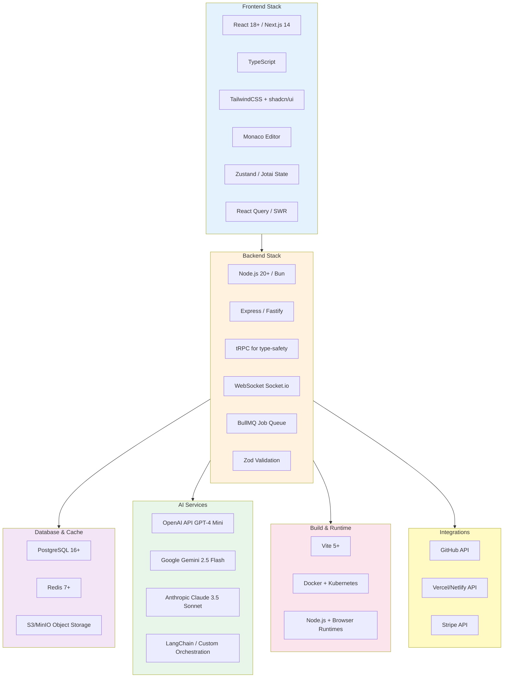

## Deployment Architecture

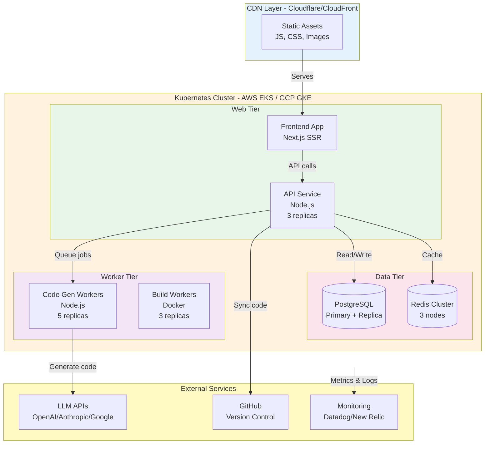

## Implementation Phases

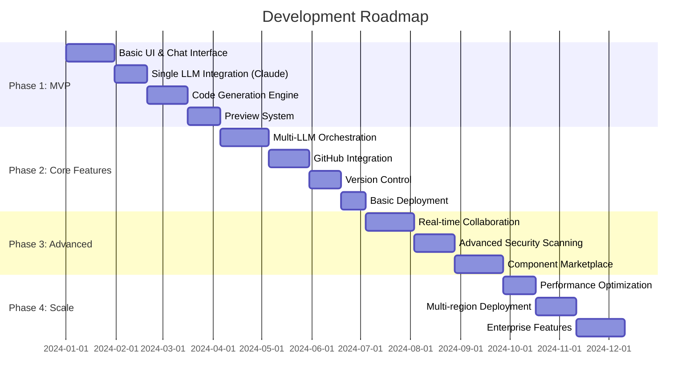

## Cost Considerations

### LLM API Costs

- **Fast Models**: $0.10-0.30 per 1M tokens (GPT-4 Mini, Gemini Flash)
- **Main Model**: $3-15 per 1M tokens (Claude 3.5 Sonnet)
- **Strategy**: Cache aggressively, use fast models for 80% of work

### Infrastructure Costs (estimated monthly)

- **Compute**: $500-2000 (Kubernetes cluster, auto-scaling)
- **Database**: $200-500 (PostgreSQL managed service)
- **Cache**: $100-300 (Redis cluster)
- **Storage**: $100-500 (S3 for code/assets)
- **CDN**: $50-200 (Cloudflare/CloudFront)

### Scalability Targets

- Support 1000 concurrent users
- Generate 10,000 apps per day
- 99.9% uptime SLA
- < 5s average code generation time

## Security Considerations

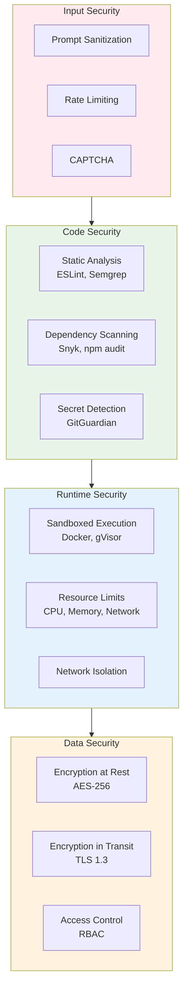

## Key Technical Challenges

1. **LLM Response Quality**

   - Challenge: Ensuring consistent, high-quality code generation
   - Solution: Multi-model validation, context hydration, template refinement

2. **Real-time Preview Performance**

   - Challenge: Fast rebuild and hot reload for complex apps
   - Solution: Incremental builds, intelligent caching, optimized bundling

3. **Scalability**

   - Challenge: Handle thousands of concurrent code generations
   - Solution: Horizontal scaling, job queuing, distributed caching

4. **Cost Management**

   - Challenge: LLM API costs can be high at scale
   - Solution: Aggressive caching, tiered model usage, prompt optimization

5. **Security**
   - Challenge: Executing user-generated code safely
   - Solution: Containerization, sandboxing, static analysis, runtime limits

## Differentiation Opportunities

1. **Specialized Domains**: Focus on specific verticals (e.g., SaaS, e-commerce, dashboards)
2. **Custom Templates**: Curated, production-ready templates
3. **Team Collaboration**: Real-time multiplayer features beyond Loveable
4. **Advanced Testing**: Automated test generation and execution
5. **Performance Optimization**: Built-in performance monitoring and optimization suggestions
6. **Pricing Model**: More competitive pricing or freemium tier
