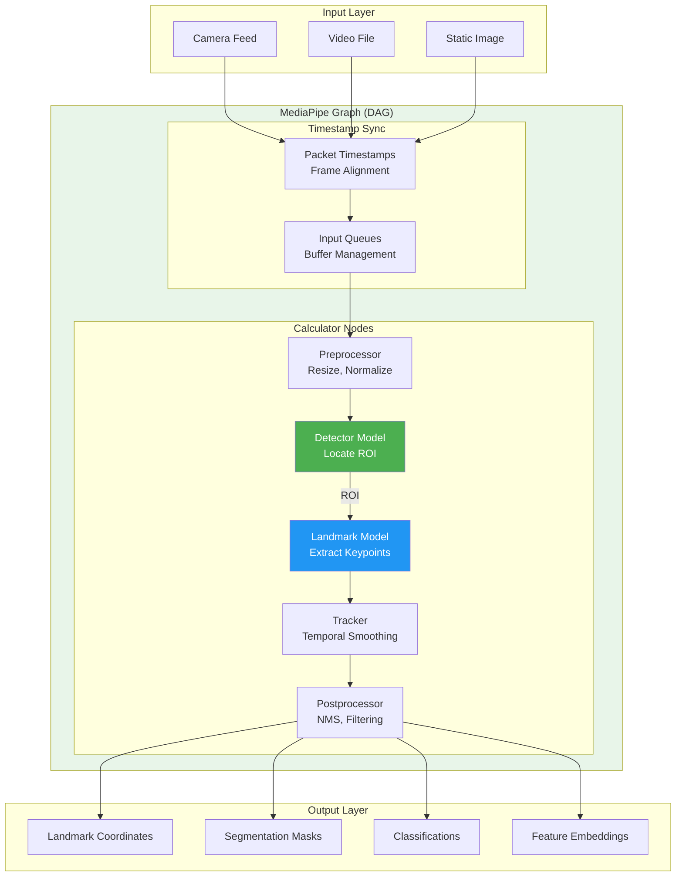
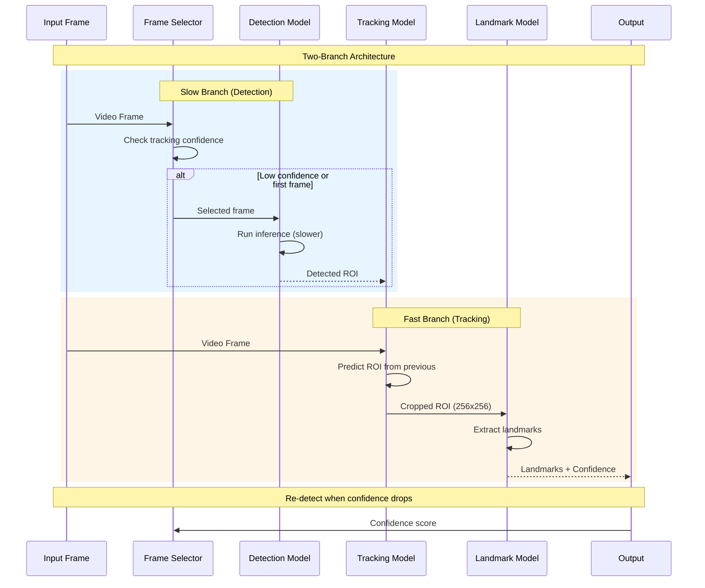
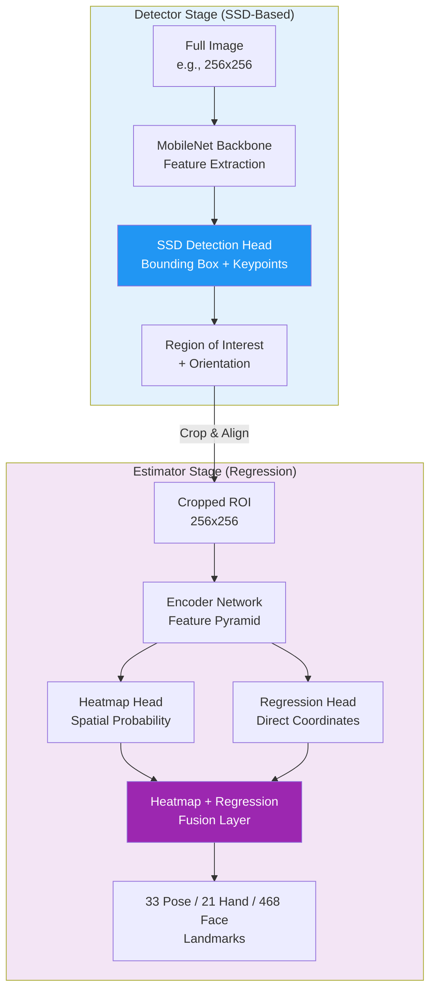
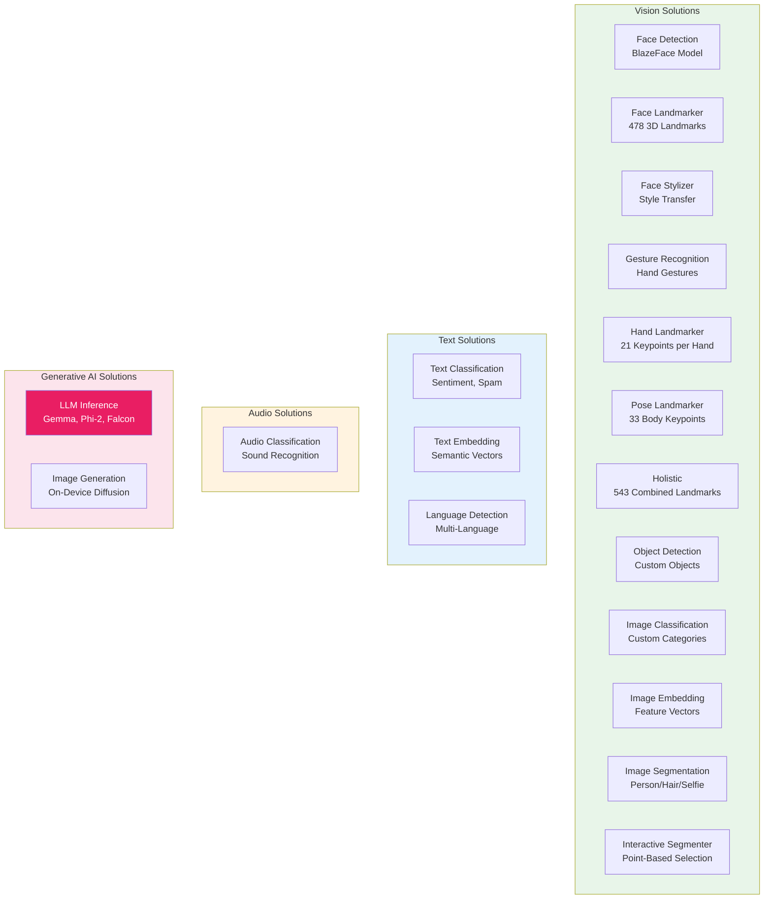
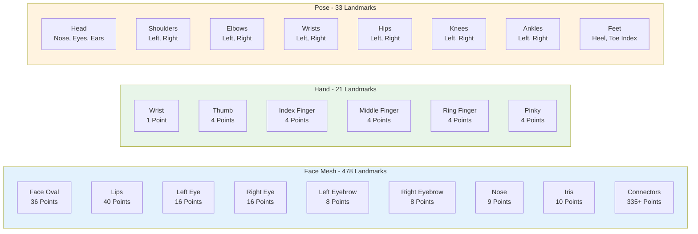
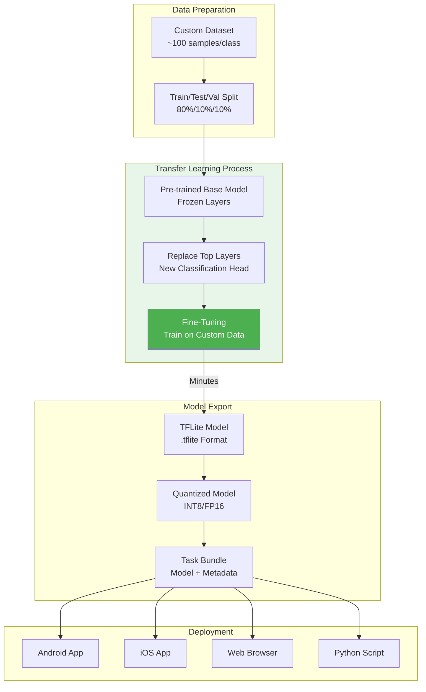
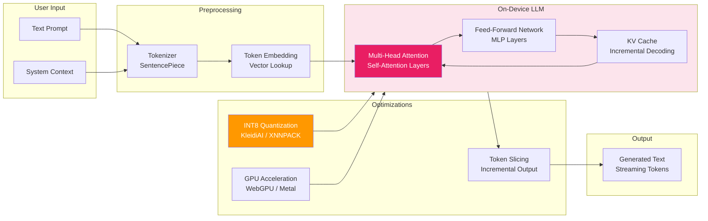
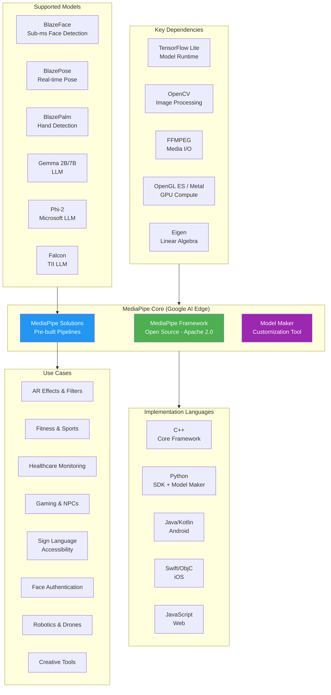

# MediaPipe - Technical Overview

MediaPipe is an open-source framework developed by Google for building cross-platform, customizable machine learning solutions for live and streaming media. It provides pre-built pipelines for computer vision tasks like face detection, hand tracking, pose estimation, and now includes support for on-device LLM inference. Part of Google AI Edge, MediaPipe is designed for real-time performance on mobile, edge, web, and desktop platforms.

## High-Level Architecture

```mermaid
graph TB
    subgraph "MediaPipe Framework"
        subgraph "Core Components"
            Graph[Graph Engine<br/>DAG Processing]
            Calculator[Calculators<br/>Processing Nodes]
            Packets[Packets<br/>Timestamped Data Units]
            Streams[Streams<br/>Data Flow Channels]
        end

        subgraph "Acceleration Layer"
            CPU[CPU Backend<br/>XNNPACK]
            GPU[GPU Backend<br/>OpenGL ES / Metal]
            NNAPI[Android NNAPI<br/>Hardware Accelerators]
            WebGPU[WebGPU<br/>Browser GPU]
        end

        subgraph "MediaPipe Solutions"
            Vision[Vision Solutions<br/>Face, Hand, Pose]
            Text[Text Solutions<br/>Classification, Embedding]
            Audio[Audio Solutions<br/>Classification]
            GenAI[GenAI Solutions<br/>LLM Inference]
        end
    end

    subgraph "External Dependencies"
        TFLite[TensorFlow Lite<br/>Model Runtime]
        OpenCV[OpenCV<br/>Image Processing]
        FFMPEG[FFMPEG<br/>Audio/Video I/O]
    end

    subgraph "Target Platforms"
        Android[Android]
        iOS[iOS]
        Web[Web/JavaScript]
        Python[Python]
        Desktop[Desktop C++]
    end

    Graph --> Calculator
    Calculator --> Packets
    Packets --> Streams
    Calculator --> CPU & GPU & NNAPI & WebGPU
    Vision & Text & Audio & GenAI --> Graph
    TFLite --> GPU & CPU
    OpenCV --> Vision
    Solutions --> Target Platforms

    style Graph fill:#4CAF50,color:#fff
    style Calculator fill:#2196F3,color:#fff
    style Vision fill:#9C27B0,color:#fff
    style GenAI fill:#FF5722,color:#fff
```

## How It Works - Graph-Based Processing



## Detection and Tracking Pipeline



## BlazePose/BlazeFace/BlazePalm Model Architecture



## MediaPipe Solutions Suite



## Landmark Topologies



## Model Maker - Transfer Learning Flow



## LLM Inference Pipeline



## Ecosystem - Platforms and Integrations



## Key Concepts

### Graph-Based Architecture

MediaPipe uses a Directed Acyclic Graph (DAG) for processing:

| Component | Description |
|-----------|-------------|
| **Packet** | Basic data unit with timestamp and immutable payload |
| **Stream** | Sequence of packets between nodes |
| **Calculator** | Processing node that transforms packets |
| **Graph** | DAG defining data flow between calculators |

### Two-Stage Detection Pattern

Most MediaPipe vision solutions use a detector-tracker pattern:

1. **Detector (Slow)**: Runs on selected frames to find regions of interest
2. **Tracker (Fast)**: Tracks ROI across frames, re-detecting when confidence drops

This enables real-time performance by running heavy detection only when needed.

### Blaze Model Family

| Model | Task | Landmarks | Performance |
|-------|------|-----------|-------------|
| **BlazeFace** | Face Detection | 6 keypoints | Sub-millisecond on mobile GPU |
| **BlazePalm** | Palm Detection | 7 keypoints | Real-time palm localization |
| **BlazePose Lite** | Pose Estimation | 33 keypoints | 2.7 MFlop, 1.3M params |
| **BlazePose Full** | Pose Estimation | 33 keypoints | 6.9 MFlop, 3.5M params |

### Model Maker Customization

- Uses transfer learning to retrain models with custom data
- Requires ~100 samples per class
- Training typically completes in minutes
- Supports: Object Detection, Image Classification, Gesture Recognition, Text Classification

## Key Facts (2025)

- **Framework Version**: 0.10.31 (December 2025)
- **Repository**: github.com/google-ai-edge/mediapipe
- **License**: Apache 2.0 (Open Source)
- **Primary Languages**: C++, Python, JavaScript, Java, Swift
- **Face Landmarks**: 478 3D points with 52 blendshape expressions
- **Hand Landmarks**: 21 keypoints per hand
- **Pose Landmarks**: 33 full-body keypoints
- **Holistic Total**: 543 combined landmarks (pose + face + hands)
- **LLM Support**: Gemma 2B/7B, Phi-2, Falcon, StableLM
- **LoRA Support**: Fine-tuning for Gemma and Phi-2 models
- **WebGPU**: Recently open-sourced WebGPU helpers

## Performance Benchmarks

| Solution | Platform | Backend | Latency |
|----------|----------|---------|---------|
| **Face Detection** | Mobile | GPU | Sub-millisecond |
| **Pose Estimation** | Mobile CPU | CPU | ~7 FPS (Jetson Nano) |
| **Pose Estimation** | Mobile GPU | GPU | ~20+ FPS |
| **Selfie Segmentation** | Web | GPU | <3ms inference |
| **Selfie Segmentation** | Web | CPU | 120+ ms |
| **LLM (Gemma 2B)** | Mobile | GPU | 50-200ms response |

### GPU Support

- **Android/Linux**: OpenGL ES up to 3.2
- **iOS**: OpenGL ES 3.0, Metal
- **Web**: WebGL, WebGPU (experimental)
- **Requirement**: OpenGL ES 3.1+ for ML inference calculators

## Common Use Cases

1. **Augmented Reality**: Face filters, virtual try-on, makeup effects
2. **Fitness & Sports**: Form analysis, rep counting, motion tracking
3. **Healthcare**: Fall prevention, physical therapy monitoring
4. **Sign Language Recognition**: Accessibility applications
5. **Gaming**: Gesture controls, full-body game input
6. **Video Conferencing**: Background blur, face effects
7. **Robotics & Drones**: Object tracking, navigation
8. **Creative Tools**: Animation, motion capture

## Technical Specifications

| Component | Technology |
|-----------|------------|
| **Core Language** | C++ |
| **Build System** | Bazel |
| **Model Format** | TensorFlow Lite (.tflite) |
| **Video Processing** | OpenCV |
| **Audio Processing** | FFMPEG |
| **GPU Compute** | OpenGL ES, Metal, WebGPU |
| **CPU Inference** | XNNPACK |
| **Quantization** | INT8, FP16 (QAT and PTQ) |

## Security Considerations

- **On-Device Processing**: Data never leaves the device for inference
- **Privacy by Design**: No cloud dependency for core ML tasks
- **Model Protection**: TFLite models can be encrypted
- **Input Validation**: Sanitize input dimensions to prevent buffer overflows

## Sources

- [MediaPipe Official Documentation](https://developers.google.com/mediapipe)
- [MediaPipe GitHub Repository](https://github.com/google-ai-edge/mediapipe)
- [Google AI Edge - MediaPipe Solutions](https://ai.google.dev/edge/mediapipe/solutions/guide)
- [MediaPipe Model Maker Guide](https://ai.google.dev/edge/mediapipe/solutions/model_maker)
- [BlazePose Research Paper](https://arxiv.org/abs/2006.10204)
- [MediaPipe LLM Inference Guide](https://ai.google.dev/edge/mediapipe/solutions/genai/llm_inference)
- [MediaPipe Wikipedia](https://en.wikipedia.org/wiki/MediaPipe)
- [Google Research - MediaPipe Framework](https://research.google/pubs/mediapipe-a-framework-for-perceiving-and-processing-reality/)
- [LearnOpenCV - MediaPipe Guide](https://learnopencv.com/introduction-to-mediapipe/)
- [Roboflow - MediaPipe Beginner Guide](https://blog.roboflow.com/what-is-mediapipe/)
