# Moondream - Technical Overview

Moondream is an open-source vision language model (VLM) designed to be efficient, fast, and deployable anywhere - from edge devices to cloud servers. Created by Vikhyat Korrapati, it enables machines to understand and reason about visual content through natural language.

## High-Level Architecture

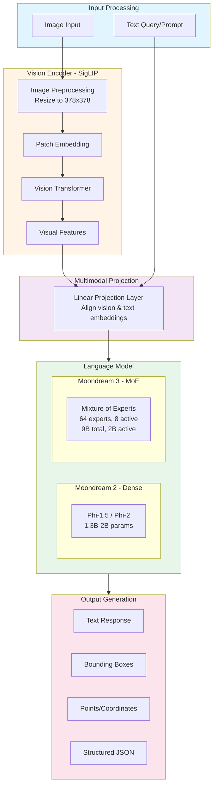

## How It Works

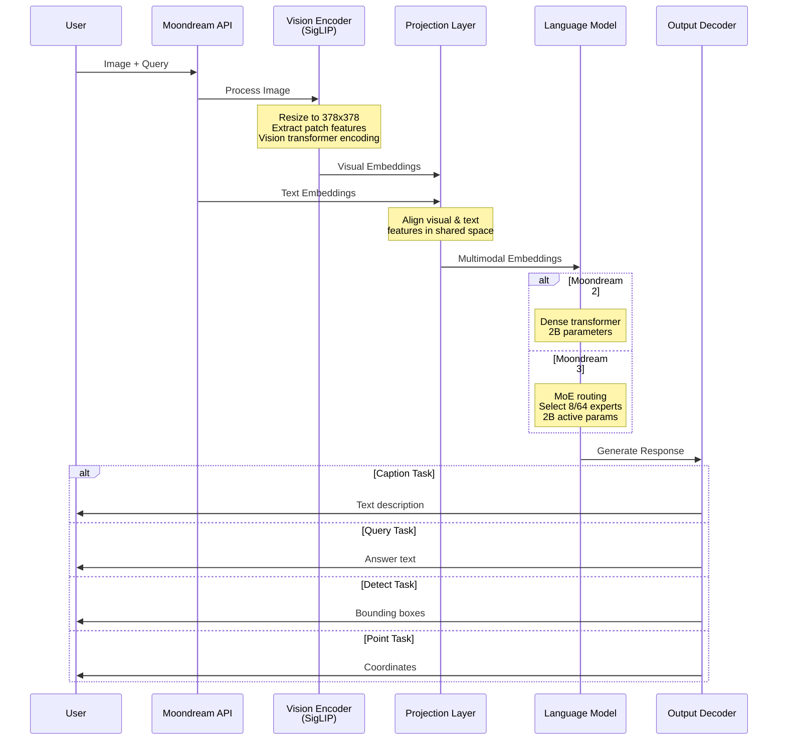

## Model Variants

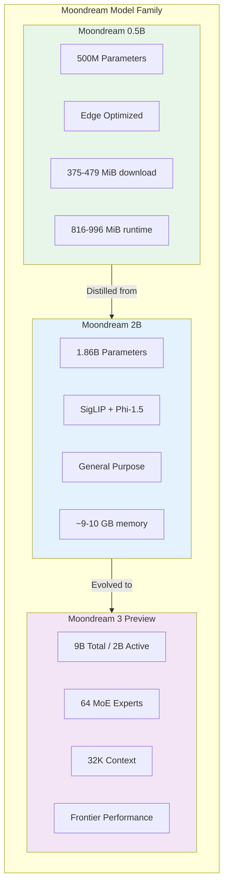

## Core Components Deep Dive

### Vision Encoder: SigLIP

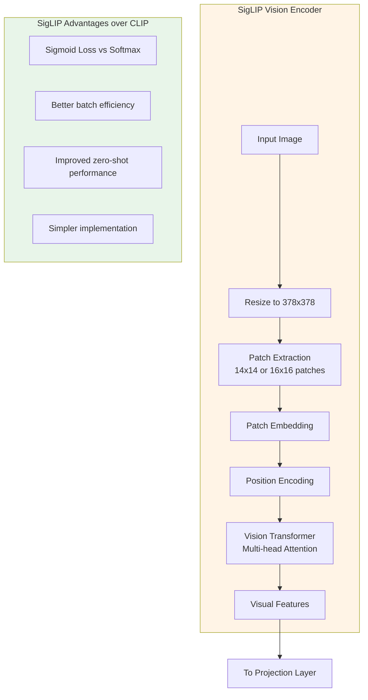

### Moondream 3 MoE Architecture

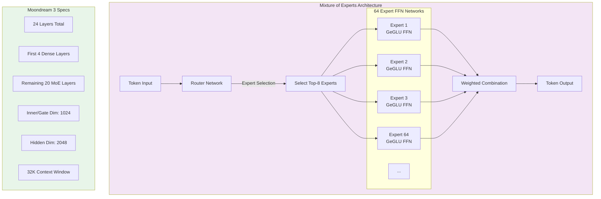

## Key Capabilities

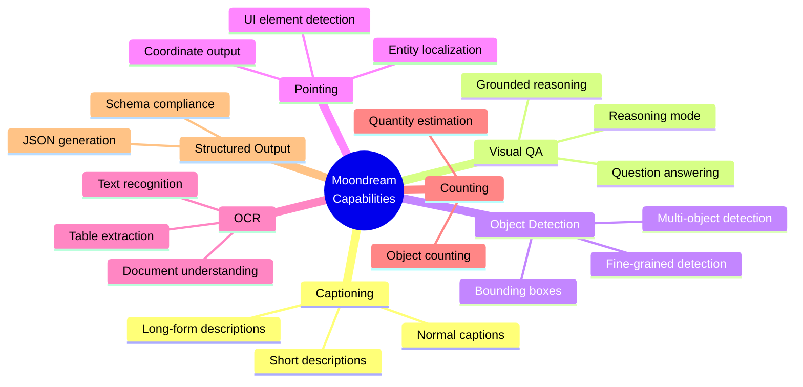

## Performance Benchmarks (2025)

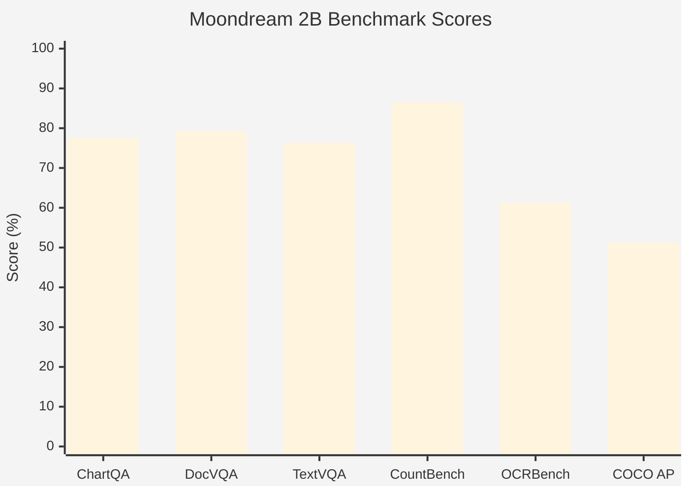

| Benchmark | Moondream 2B | Task Type |
|-----------|-------------|-----------|
| ChartQA | 77.5% (82.2% with PoT) | Chart Understanding |
| DocVQA | 79.3% | Document QA |
| TextVQA | 76.3% | Text in Images |
| CountBenchQA | 86.4% | Object Counting |
| OCRBench | 61.2% | Text Recognition |
| COCO Object Detection | 51.2 AP | Detection |
| ScreenSpot (UI) | 80.4 F1@0.5 | UI Element Localization |

### Moondream 3 Preview Performance

| Benchmark | Score | Notes |
|-----------|-------|-------|
| RefCOCOg | 88.6% | Object Detection - Outperforms comparable models |
| CountBenchQA | 93.2% | Counting Accuracy |

## Deployment Options

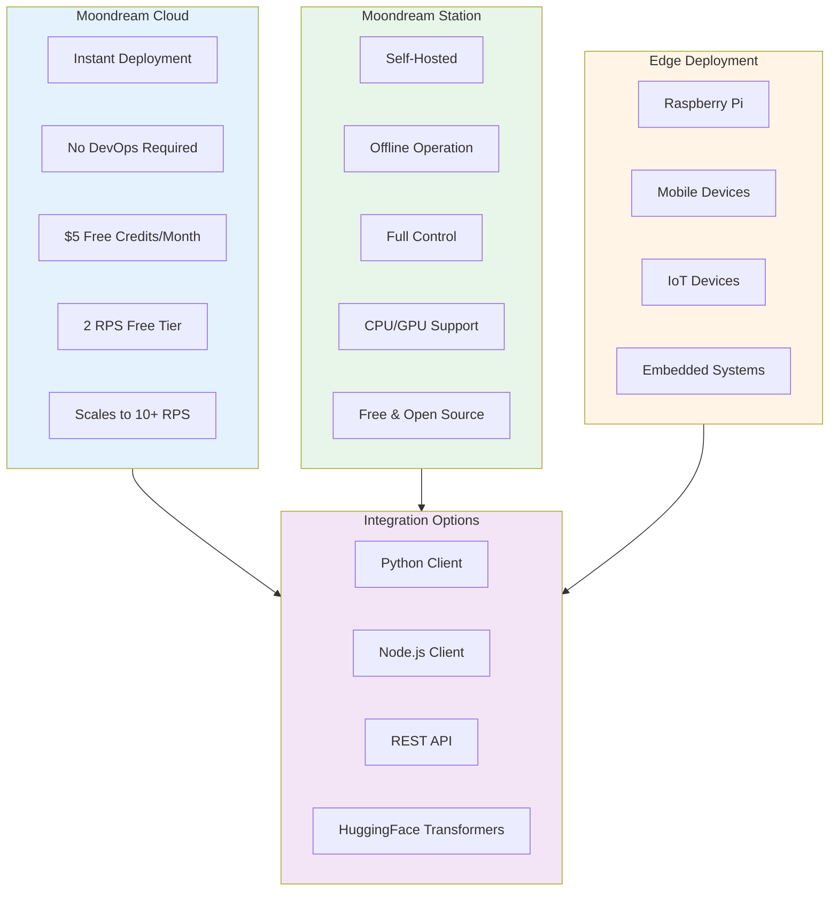

## Usage Examples

### Python with Transformers

```python
from transformers import AutoModelForCausalLM
from PIL import Image

# Load model (specify revision for reproducibility)
model = AutoModelForCausalLM.from_pretrained(
    "vikhyatk/moondream2",
    revision="2025-06-21",
    trust_remote_code=True,
    device_map={"": "cuda"}  # or "mps" for Apple Silicon
)

# Load image
image = Image.open("image.jpg")

# Captioning
caption = model.caption(image, length="short")["caption"]

# Visual Question Answering
answer = model.query(image, "How many people are in the image?")["answer"]

# Object Detection
objects = model.detect(image, "face")["objects"]

# Pointing (localization)
points = model.point(image, "person")["points"]

# Grounded Reasoning (Moondream 3)
result = model.query(image, "What is happening?", reasoning=True)
```

### Moondream 3 with Reasoning

```python
# Enable step-by-step reasoning with spatial grounding
result = model.query(
    image,
    "Explain what the person is doing",
    reasoning=True  # Enables grounded reasoning mode
)
# Returns reasoning steps with image-specific references
```

## Ecosystem

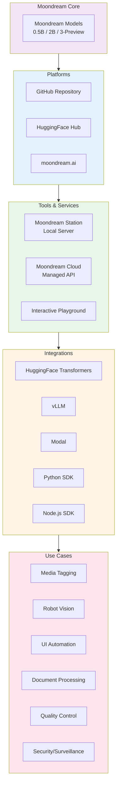

## Key Facts (2025)

- **GitHub Stars**: 9,000+
- **Monthly Downloads**: 3.5M+ (HuggingFace)
- **Active Developers**: 10,000+
- **Contributors**: 25+
- **License**: Apache 2.0 (Moondream 2), BSL 1.1 (Moondream 3 Preview)
- **Primary Language**: Python (95.8%)
- **Latest Release**: 2025-06-21

## Use Cases

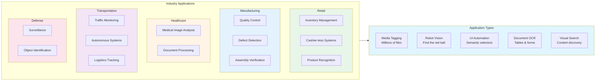

## Technical Considerations

### Limitations

| Limitation | Description |
|------------|-------------|
| **Resolution** | Images downsampled to 378x378, limiting fine detail recognition |
| **Counting** | May struggle with counting beyond 2-3 items (improved in v3) |
| **Abstract Reasoning** | Difficulty with multi-step theoretical questions |
| **OCR** | Limited accuracy on small text (significantly improved in v3) |
| **Hallucination** | May generate plausible but incorrect information |

### Resource Requirements

| Model | Download Size | Runtime Memory |
|-------|--------------|----------------|
| Moondream 0.5B (8-bit) | 479 MiB | 996 MiB |
| Moondream 0.5B (4-bit) | 375 MiB | 816 MiB |
| Moondream 2B | ~2 GB | ~9-10 GB |
| Moondream 3 Preview | ~9 GB | Varies by quantization |

### Best Practices

1. **Version Pinning**: Always specify revision for production (`revision="2025-06-21"`)
2. **Quantization**: Use 4-bit/8-bit for edge deployment
3. **Reasoning Mode**: Enable `reasoning=True` for complex queries requiring step-by-step thinking
4. **Streaming**: Use streaming generation for better UX on long responses
5. **Batch Processing**: Process multiple images in batches for efficiency

## Recent Improvements (2025)

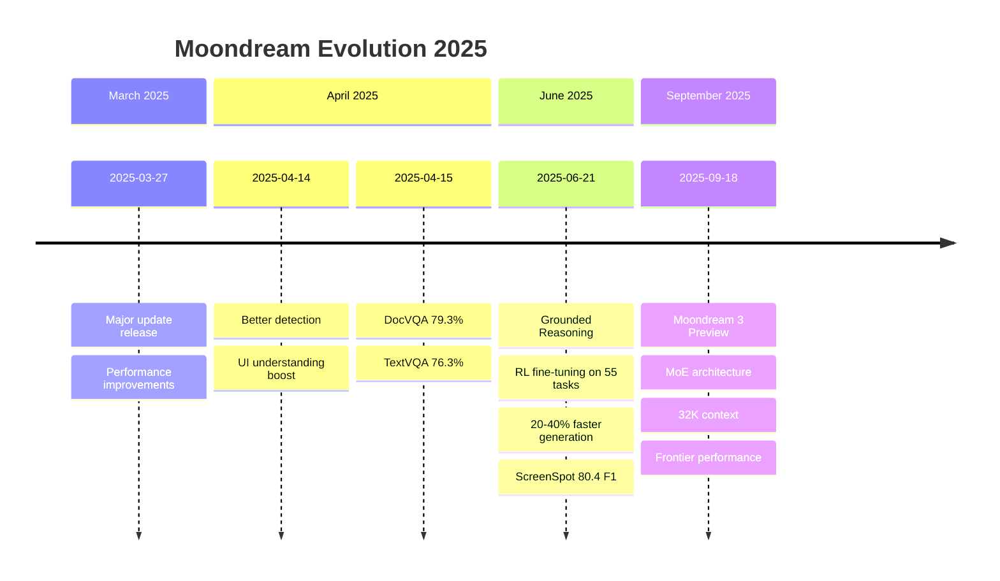

## Comparison with Other VLMs

| Feature | Moondream 2B | Moondream 3 | GPT-4V | Claude 3.5 |
|---------|-------------|-------------|--------|------------|
| Parameters | 1.86B | 9B (2B active) | Undisclosed | Undisclosed |
| Open Source | Yes | Preview License | No | No |
| Edge Deployment | Yes | Limited | No | No |
| Local Execution | Yes | Yes | No | No |
| API Cost | Free/$5 credits | Free/$5 credits | Pay per token | Pay per token |
| Context Length | 2K | 32K | 128K | 200K |

## Sources

- [GitHub - vikhyat/moondream](https://github.com/vikhyat/moondream)
- [Moondream Official Website](https://moondream.ai/)
- [HuggingFace - vikhyatk/moondream2](https://huggingface.co/vikhyatk/moondream2)
- [Moondream 3 Preview Announcement](https://moondream.ai/blog/moondream-3-preview)
- [Moondream 0.5B Introduction](https://moondream.ai/blog/introducing-moondream-0-5b)
- [Analytics Vidhya - Moondream2 Introduction](https://www.analyticsvidhya.com/blog/2024/03/introducing-moondream2-a-tiny-vision-language-model/)
- [Moondream Documentation](https://docs.moondream.ai/)
