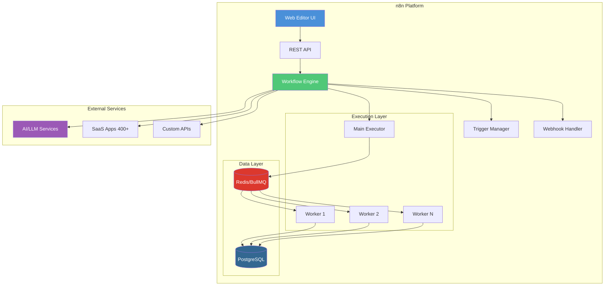
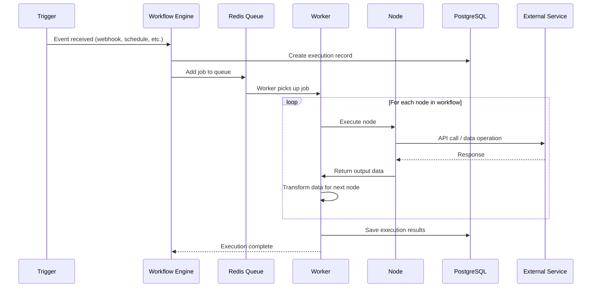
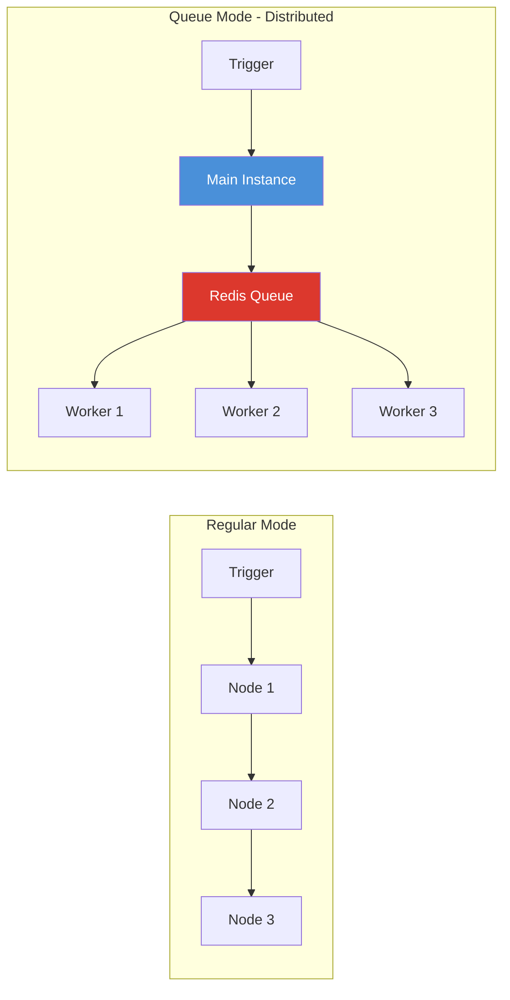
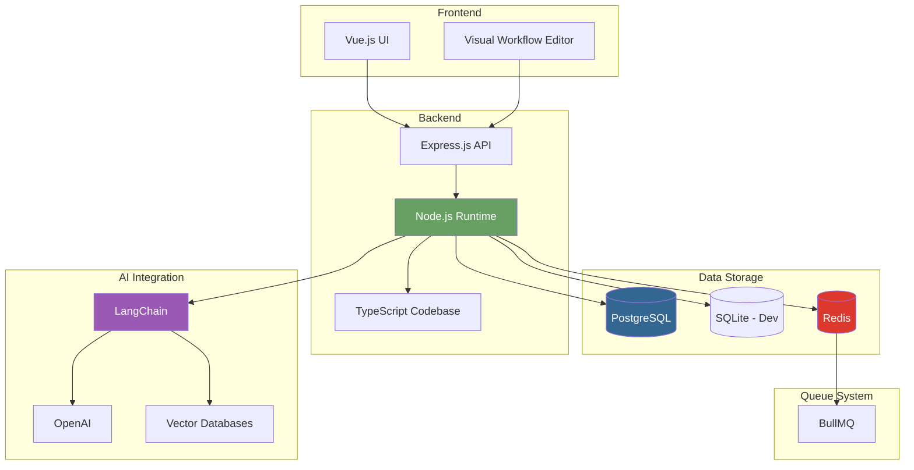
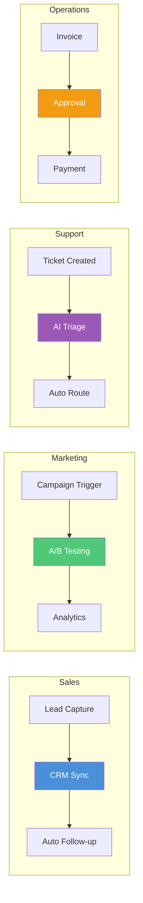
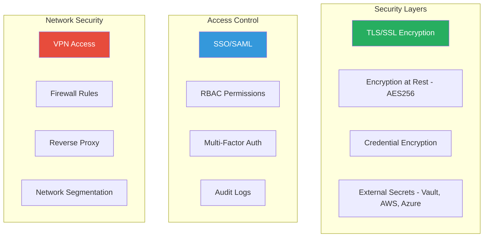

# n8n - Technical Overview

n8n is an open-source, fair-code workflow automation platform that combines AI capabilities with business process automation. It provides a visual, node-based interface for building workflows while offering the flexibility of code for technical teams.

## High-Level Architecture



## How It Works



## Key Concepts

### Nodes
Nodes are the fundamental building blocks of n8n workflows. Each node represents a specific action or operation:

| Node Type | Purpose | Examples |
|-----------|---------|----------|
| **Trigger Nodes** | Start workflows based on events | Webhook, Schedule, Email received |
| **Action Nodes** | Perform operations | HTTP Request, Send Email, Database Query |
| **Logic Nodes** | Control flow | IF, Switch, Merge, Split |
| **Code Nodes** | Custom logic | JavaScript, Python |
| **AI Nodes** | LLM integration | OpenAI, LangChain, Embeddings |

### Workflows
A workflow is a directed graph of connected nodes that automates a process:
- Stored as JSON definitions
- Can be executed manually or automatically
- Support branching, looping, and error handling
- Can call sub-workflows for modularity

### Execution Modes



- **Regular Mode**: Single process executes workflows sequentially
- **Queue Mode**: Distributed execution with Redis/BullMQ for horizontal scaling

## Technical Architecture Details

### Technology Stack



### Database Structure
- **Workflows**: JSON definitions of automation flows
- **Executions**: Run history with input/output data
- **Credentials**: Encrypted authentication tokens
- **Users**: Authentication and RBAC data
- **Webhooks**: Registered webhook endpoints

### Queue Mode Components
- **Main Instance**: Handles UI, API, webhooks, and scheduling
- **Workers**: Process executions from the queue
- **Redis**: Message broker for job queue (BullMQ)
- **PostgreSQL**: Persistent storage for workflow state

## Ecosystem

```mermaid
graph TB
    subgraph "n8n Core"
        PLATFORM[n8n Platform]
    end

    subgraph "Deployment Options"
        CLOUD[n8n Cloud]
        SELF[Self-Hosted]
        ENT[Enterprise]
    end

    subgraph "Integrations 400+"
        CRM[CRM - Salesforce, HubSpot]
        COMM[Communication - Slack, Teams]
        DB[Databases - MySQL, MongoDB]
        STORAGE[Storage - S3, GDrive]
        DEV[Developer - GitHub, GitLab]
        MARKET[Marketing - Mailchimp]
    end

    subgraph "AI Ecosystem"
        LLM[LLMs - GPT, Claude, Gemini]
        LANG[LangChain Framework]
        EMBED[Embeddings]
        VECTOR[Vector Stores]
        MCP[MCP Server Integration]
    end

    subgraph "Community"
        NODES[5000+ Community Nodes]
        TEMPLATES[600+ AI Templates]
        FORUM[200k+ Community Members]
    end

    PLATFORM --> CLOUD
    PLATFORM --> SELF
    PLATFORM --> ENT

    PLATFORM --> CRM
    PLATFORM --> COMM
    PLATFORM --> DB
    PLATFORM --> STORAGE
    PLATFORM --> DEV
    PLATFORM --> MARKET

    PLATFORM --> LLM
    PLATFORM --> LANG
    PLATFORM --> EMBED
    PLATFORM --> VECTOR
    PLATFORM --> MCP

    PLATFORM --> NODES
    PLATFORM --> TEMPLATES
    PLATFORM --> FORUM

    style PLATFORM fill:#FF6D5A,color:#fff
    style CLOUD fill:#4A90D9,color:#fff
    style LLM fill:#9B59B6,color:#fff
```



## Key Facts (2025)

### Platform Statistics
- **150,000+ GitHub stars** (Top 50 most popular projects on GitHub)
- **200,000+ active users** worldwide
- **3,000+ enterprise customers**
- **400+ native integrations**
- **5,000+ community nodes** (growing ~13/day)
- **600+ AI workflow templates**
- **4.9/5 rating** on G2

### Company & Funding
- **$60M funding** raised in March 2025 (€55M)
- **$270M valuation** (€250M)
- **75% of customers** use AI tools
- **5X revenue growth** after AI pivot in 2022
- **50%+ user base** in the United States

### Performance
- **220 executions/second** on single instance
- Supports horizontal scaling with queue mode
- Self-hosted option for complete data control

## Use Cases

### Business Automation


### Common Implementations
| Use Case | Description | Time Saved |
|----------|-------------|------------|
| **Lead Qualification** | AI-qualify leads, sync CRM, trigger follow-ups | 10x scaling |
| **Document Processing** | Extract data, classify, route to systems | 200 hrs/month |
| **Translation Workflows** | Auto-translate with human review | 50% faster |
| **AI Agents** | Multi-agent systems for complex tasks | Variable |
| **Data Pipelines** | ETL, sync between systems | Continuous |

### AI Agent Capabilities
- **Research Agents**: Document analysis, web scraping, summarization
- **Writing Agents**: Content generation, email drafting
- **Multi-Agent Systems**: Coordinated specialized agents
- **RAG Pipelines**: Vector database integration for knowledge retrieval
- **Human-in-the-Loop**: Approval steps for AI decisions

## n8n vs Alternatives

| Feature | n8n | Zapier | Make |
|---------|-----|--------|------|
| **Self-Hosting** | Yes | No | No |
| **Open Source** | Fair-code | No | No |
| **Integrations** | 400+ native | 7,000+ | 2,000+ |
| **Code Support** | JS/Python | Limited | Limited |
| **AI Native** | LangChain, 70+ nodes | Basic | Moderate |
| **Pricing** | Free self-hosted | Task-based ($$) | Operation-based ($) |
| **Learning Curve** | Steeper | Easy | Medium |
| **Data Control** | Complete | None | Limited |

## Security Considerations

### Authentication & Access Control
- **SSO/SAML/LDAP**: Enterprise plan features
- **MFA**: Multi-factor authentication support
- **RBAC**: Role-based access control
- **API Keys**: For programmatic access

### Data Protection


### Best Practices
- Run behind reverse proxy with HTTPS
- Hide editor behind VPN or IP allowlist
- Use workflow-specific credentials (not global)
- Enable external secrets manager integration
- Regular security updates and patching
- Network segmentation (VLAN/subnet isolation)
- Audit log monitoring

### Compliance
- **GDPR**: Full compliance with self-hosted
- **HIPAA**: Achievable with proper configuration
- **SOX**: Supported with audit logging
- Self-hosting enables custom compliance requirements

## Deployment Options

### n8n Cloud
- **Pros**: Zero setup, automatic updates, managed infrastructure
- **Cons**: Less customization, external data hosting, recurring costs
- **Pricing**: Starting at $20/month for 2,500 executions

### Self-Hosted
- **Pros**: Full control, unlimited executions, complete customization
- **Cons**: Requires DevOps expertise, infrastructure costs
- **Best For**: Security-conscious orgs, high-volume workloads

### Enterprise
- Fully on-premise option
- SSO, LDAP, advanced RBAC
- Git version control for workflows
- Multiple environments
- Priority support

## Getting Started

```bash
# Docker (quickest start)
docker run -it --rm \
  -p 5678:5678 \
  n8nio/n8n

# Docker Compose (with PostgreSQL)
# See: https://docs.n8n.io/hosting/installation/docker/

# npm (development)
npm install n8n -g
n8n start
```

### Key Environment Variables
```bash
# Queue mode
EXECUTIONS_MODE=queue
QUEUE_BULL_REDIS_HOST=redis
QUEUE_BULL_REDIS_PORT=6379

# Database
DB_TYPE=postgresdb
DB_POSTGRESDB_HOST=postgres
DB_POSTGRESDB_DATABASE=n8n

# Security
N8N_ENCRYPTION_KEY=your-encryption-key
N8N_BASIC_AUTH_ACTIVE=true
```

## Resources

- [Official Documentation](https://docs.n8n.io/)
- [GitHub Repository](https://github.com/n8n-io/n8n)
- [Community Forum](https://community.n8n.io/)
- [Workflow Templates](https://n8n.io/workflows/)
- [API Reference](https://docs.n8n.io/api/)

---

*Last updated: January 2025*
