# OAuth2-Proxy - Technical Overview

OAuth2-Proxy is a flexible, open-source reverse proxy that provides authentication using OAuth2/OIDC providers. It sits in front of applications to handle authentication complexities, so requests reaching your application have already been authorized.

## High-Level Architecture

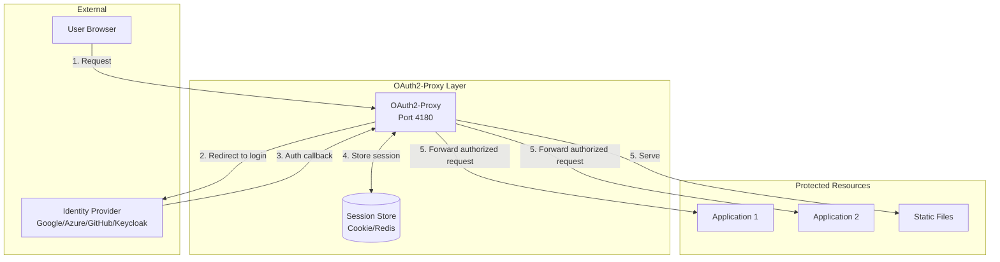

## Authentication Flow

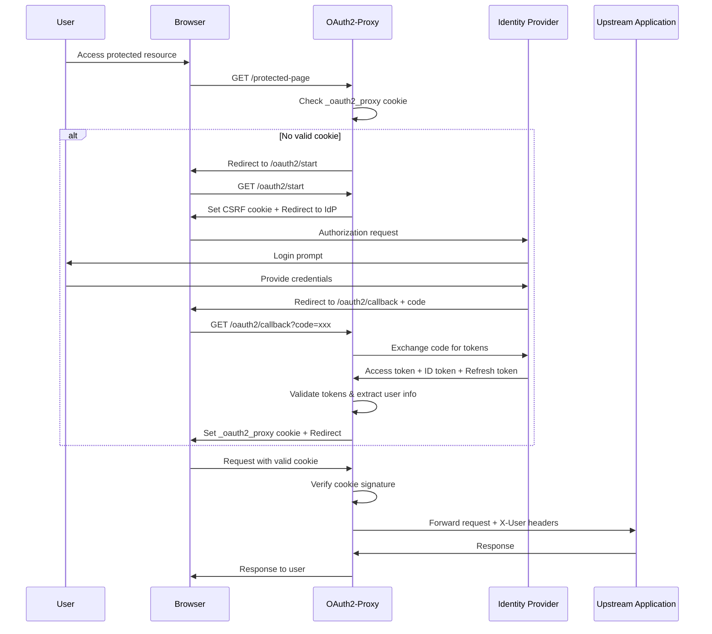

## Operating Modes

OAuth2-Proxy can function in two primary modes:

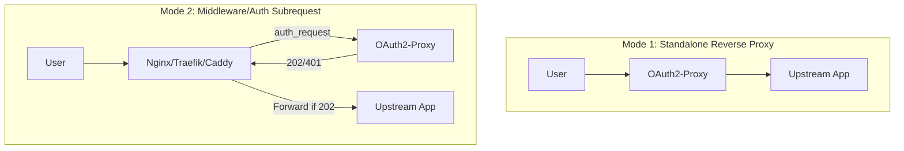

### Standalone Mode
- Acts as the primary reverse proxy
- Handles all traffic directly
- Proxies to upstream applications after authentication

### Auth Subrequest Mode (Middleware)
- Integrates with existing reverse proxies (Nginx, Traefik, Caddy)
- Uses `auth_request` or `ForwardAuth` directives
- Returns `202 Accepted` or `401 Unauthorized`
- More flexible for complex infrastructure

## Key Endpoints

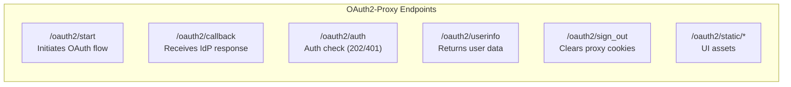

| Endpoint | Purpose | Response |
|----------|---------|----------|
| `/oauth2/start` | Initiates OAuth2 flow | Redirect to IdP |
| `/oauth2/callback` | Receives IdP authorization | Sets session cookie |
| `/oauth2/auth` | Authentication check | 202 Accepted / 401 Unauthorized |
| `/oauth2/userinfo` | Returns user info | JSON with email, groups |
| `/oauth2/sign_out` | Sign out user | Clears proxy cookies |
| `/oauth2/static/*` | Static assets | CSS, JS for UI |

## Supported Identity Providers

```mermaid
graph TB
    subgraph "OAuth2-Proxy"
        Proxy[OAuth2-Proxy]
    end

    subgraph "Specialized Providers"
        Google[Google]
        Azure[Microsoft Entra ID]
        GitHub[GitHub]
        GitLab[GitLab]
        Keycloak[Keycloak OIDC]
        Facebook[Facebook]
        LinkedIn[LinkedIn]
        LoginGov[login.gov]
        Bitbucket[Bitbucket]
        DigitalOcean[DigitalOcean]
        Nextcloud[Nextcloud]
        Gitea[Gitea]
    end

    subgraph "Generic"
        OIDC[Generic OIDC]
        ADFS[ADFS]
    end

    Google --> Proxy
    Azure --> Proxy
    GitHub --> Proxy
    GitLab --> Proxy
    Keycloak --> Proxy
    Facebook --> Proxy
    LinkedIn --> Proxy
    LoginGov --> Proxy
    Bitbucket --> Proxy
    DigitalOcean --> Proxy
    Nextcloud --> Proxy
    Gitea --> Proxy
    OIDC --> Proxy
    ADFS --> Proxy

    style Google fill:#4285F4,color:#fff
    style Azure fill:#0078D4,color:#fff
    style GitHub fill:#181717,color:#fff
    style GitLab fill:#FC6D26,color:#fff
    style Keycloak fill:#4D4D4D,color:#fff
```

### Provider Types
- **Specialized**: Google, Azure, GitHub, GitLab, Keycloak, Facebook, LinkedIn, login.gov, Bitbucket, DigitalOcean, Nextcloud, Gitea
- **Generic**: Any OIDC-compliant provider (Okta, Auth0, Dex, etc.)

## Session Storage Architecture

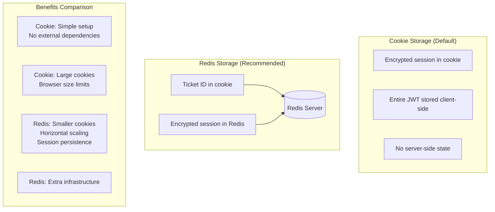

### Cookie Storage
- Default storage method
- Encrypted session stored in browser cookie
- Simple setup, no external dependencies
- Limited by browser cookie size (~4KB)

### Redis Storage
- Recommended for production
- Only ticket ID stored in cookie
- Full session encrypted in Redis
- Supports horizontal scaling
- Session persistence across restarts
- Required for large OIDC tokens (e.g., Azure AD)

## Nginx Integration Architecture

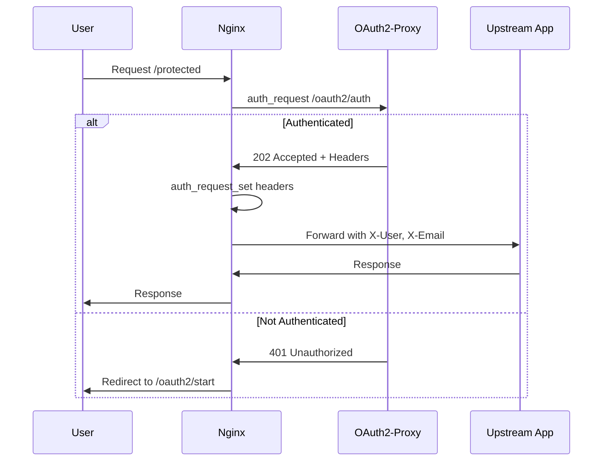

### Nginx Configuration Pattern
```nginx
location /oauth2/ {
    proxy_pass http://oauth2-proxy:4180;
    proxy_set_header Host $host;
    proxy_set_header X-Real-IP $remote_addr;
}

location = /oauth2/auth {
    internal;
    proxy_pass http://oauth2-proxy:4180;
    proxy_set_header X-Forwarded-Uri $request_uri;
}

location / {
    auth_request /oauth2/auth;
    auth_request_set $user $upstream_http_x_auth_request_user;
    auth_request_set $email $upstream_http_x_auth_request_email;

    proxy_set_header X-User $user;
    proxy_set_header X-Email $email;
    proxy_pass http://upstream-app;
}
```

## Kubernetes Deployment Architecture

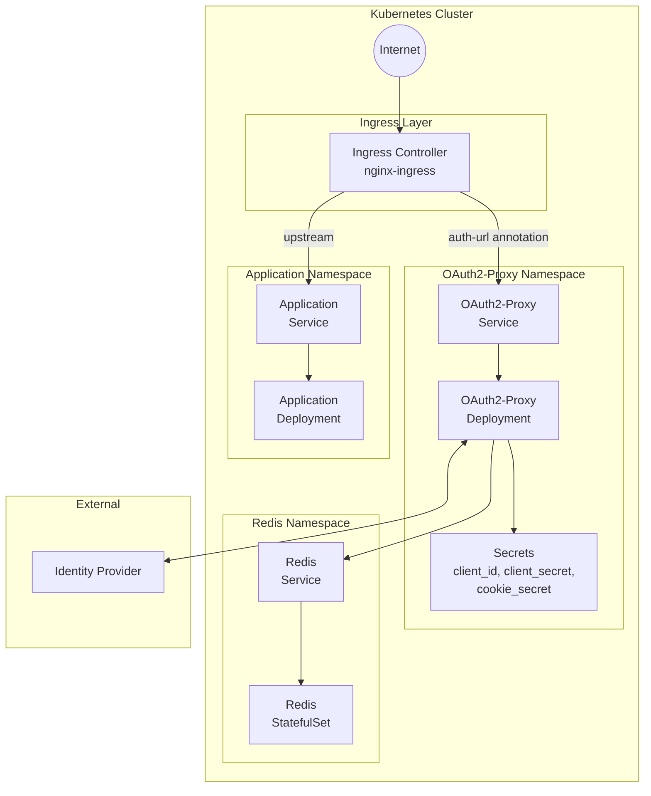

### Kubernetes Ingress Annotations
```yaml
annotations:
  nginx.ingress.kubernetes.io/auth-url: "https://oauth2-proxy.example.com/oauth2/auth"
  nginx.ingress.kubernetes.io/auth-signin: "https://oauth2-proxy.example.com/oauth2/start?rd=$escaped_request_uri"
  nginx.ingress.kubernetes.io/auth-response-headers: "X-Auth-Request-User,X-Auth-Request-Email"
```

## Security Architecture

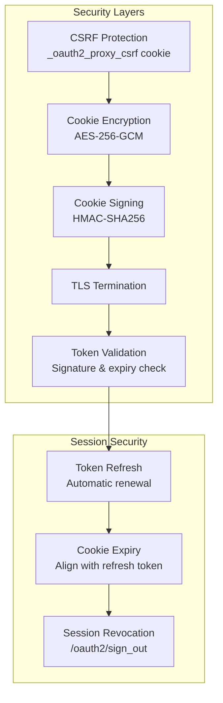

### Security Features
- **CSRF Protection**: Token-based protection during OAuth flow
- **Cookie Encryption**: Sessions encrypted with cookie-secret
- **Cookie Signing**: HMAC signature prevents tampering
- **Token Validation**: Verifies JWT signatures and expiry
- **Automatic Refresh**: Renews access tokens before expiry

### Best Practices
1. Always use HTTPS (`--cookie-secure=true`)
2. Set `cookie-expire` equal to refresh token lifetime
3. Set `cookie-refresh` slightly less than access token lifetime
4. Use Redis session store for production
5. Generate strong `cookie-secret` (32-byte random)
6. Restrict `email-domains` or use group validation

## Configuration Options

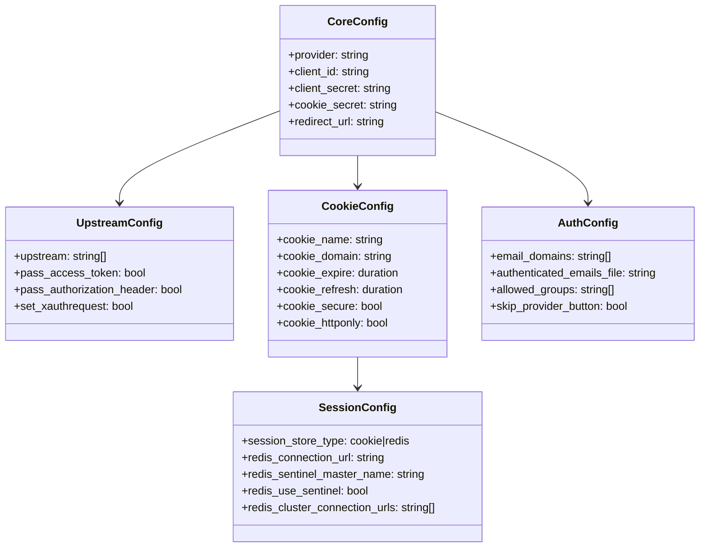

### Essential Configuration
```toml
# Provider settings
provider = "oidc"
client_id = "your-client-id"
client_secret = "your-client-secret"
oidc_issuer_url = "https://idp.example.com"

# Cookie settings
cookie_secret = "32-byte-random-base64-encoded"
cookie_secure = true
cookie_expire = "168h"  # 7 days
cookie_refresh = "1h"

# Upstream
upstreams = ["http://localhost:8080"]

# Access control
email_domains = ["example.com"]

# Session storage (production)
session_store_type = "redis"
redis_connection_url = "redis://localhost:6379"
```

## Key Facts (2025)

- **GitHub Stars**: 13.5k+
- **Contributors**: 417+
- **Latest Version**: v7.13.0 (November 2025)
- **License**: MIT
- **Language**: Go
- **Base Image**: GoogleContainerTools/distroless (v7.6.0+)
- **Supported Architectures**: amd64, arm64, ppc64le, s390x
- **Original Fork**: From bitly/oauth2_proxy (November 2018)

## Use Cases

### 1. Protecting Legacy Applications
Add authentication to applications without native OAuth support

### 2. Kubernetes Sidecar Pattern
Keep auth concerns separate from application code

### 3. Single Sign-On (SSO)
Unified authentication across multiple applications

### 4. API Gateway Authentication
Validate tokens before requests reach backend services

### 5. Internal Tools Protection
Secure admin dashboards and internal tools with corporate IdP

### 6. Multi-tenant Applications
Different providers per tenant using multiple proxy instances

## Deployment Checklist

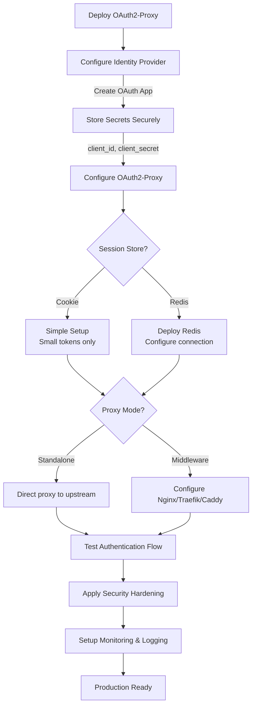

## Sources

- [OAuth2-Proxy GitHub Repository](https://github.com/oauth2-proxy/oauth2-proxy)
- [OAuth2-Proxy Official Documentation](https://oauth2-proxy.github.io/oauth2-proxy/)
- [OAuth2-Proxy Integration Guide](https://oauth2-proxy.github.io/oauth2-proxy/configuration/integration/)
- [Session Storage Documentation](https://oauth2-proxy.github.io/oauth2-proxy/configuration/session_storage/)
- [OpenID Connect Provider Configuration](https://oauth2-proxy.github.io/oauth2-proxy/configuration/providers/openid_connect/)
- [Add Auth to Any App with OAuth2 Proxy - Okta Developer](https://developer.okta.com/blog/2022/07/14/add-auth-to-any-app-with-oauth2-proxy)
- [OAuth2 Proxy Authentication Flow - Medium](https://medium.com/@kesaralive/oauth2-proxy-authentication-flow-part-2-799b90f98a15)
- [OAuth2 Proxy on Kubernetes - Medium](https://medium.com/@nsalexamy/oauth2-proxy-as-a-standalone-reverse-proxy-on-kubernetes-3a034f1d46af)
