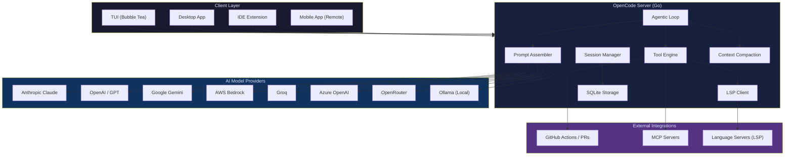
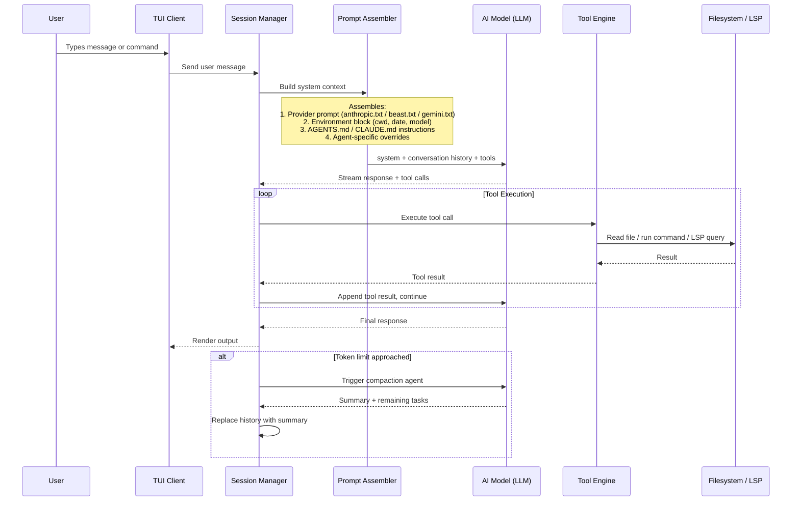
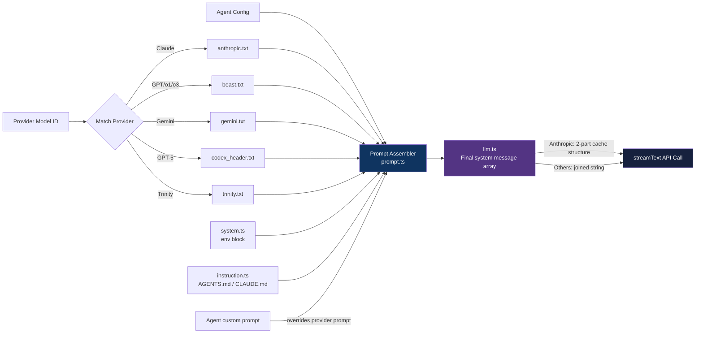
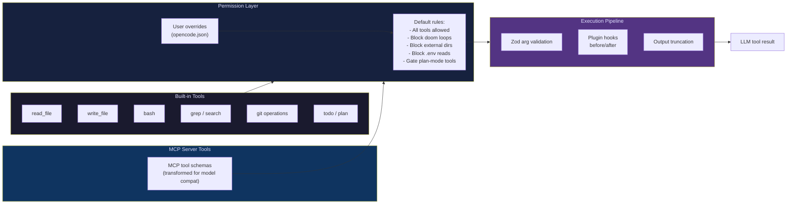
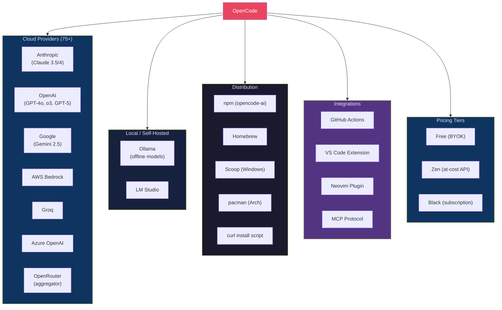

# OpenCode - Technical Overview

OpenCode is an open-source, terminal-native AI coding agent built in Go. It provides a rich TUI (Terminal User Interface) for interacting with 75+ AI model providers to perform code generation, debugging, refactoring, and agentic development tasks — all from the command line.

---

## High-Level Architecture

---

## How It Works — Agentic Loop

---

## Key Concepts

### BYOK — Bring Your Own Key
OpenCode connects directly to AI provider APIs using your own keys. No code passes through OpenCode's servers. You pay only API costs with zero markup (unless using the "Zen" at-cost tier or "Black" subscription).

### Agent System
Agents are named AI configurations with a specific model, system prompt, tool permissions, and temperature. There are two categories:

- **Primary agents** — directly conversational; you cycle through them with `Tab`
- **Subagents** — invoked internally or via `@mention` for specific subtasks

Built-in agents:
| Agent | Type | Purpose | Tool Access |
|-------|------|---------|-------------|
| `build` | Primary | Full development work | All tools |
| `plan` | Primary | Analysis, read-only planning | No edit tools |
| `general` | Subagent | Multi-step research tasks | No todo tools |
| `explore` | Subagent | Codebase exploration | Read-only |
| `compaction` | Hidden | Context summarization | All denied |
| `title` | Hidden | Session title generation | All denied |
| `summary` | Hidden | Conversation summaries | All denied |

### LSP Integration
Unlike most AI coding tools that rely on grep/read for code understanding, OpenCode connects natively to **Language Server Protocol** servers — the same protocol IDEs use for autocomplete, go-to-definition, diagnostics, and symbol search. This gives the AI real-time, semantically accurate codebase intelligence.

### Skills System
OpenCode discovers `SKILL.md` files from multiple directories (`.claude/skills/`, `.agents/skills/`, `.opencode/skill/`). Each skill has a name, description, and body. When invoked, the LLM receives the skill's full instructions plus a file listing of the skill's directory.

### Context Compaction
When token usage approaches the model's context window limit, the compaction agent is triggered. It produces a structured summary of work done and remaining tasks, replacing the conversation history so the session can continue without hitting token limits.

---

## Prompt Assembly Pipeline

---

## Tool Engine & Permissions

---

## Ecosystem & Providers

---

## Key Facts (2026)

- **Stars**: 45,000+ GitHub stars (as of early 2026)
- **Language**: Go (backend/server), TypeScript (session/prompt logic in packages/)
- **TUI Framework**: Bubble Tea (Go)
- **Storage**: SQLite for sessions and conversation history
- **Model Providers**: 75+ supported
- **License**: MIT (fully open-source)
- **Context Window**: Recommended minimum 64k tokens
- **Creators**: Built by Neovim users and the team behind terminal.shop
- **Architecture**: Client/server — TUI is just one possible client; mobile app can drive the server remotely
- **GitHub App**: Supports `/opencode` or `/oc` in PR/issue comments to trigger agent in CI

---

## Use Cases

### 1. Terminal-First Development
Developers who live in the terminal use OpenCode as a full AI pair programmer without leaving their shell. Vim/Neovim users are a primary target demographic.

### 2. Model Experimentation
Since OpenCode supports 75+ providers with BYOK, developers can compare GPT-5 vs. Claude vs. Gemini on the same task, or route different agents to different models (e.g., a faster model for `plan`, a smarter model for `build`).

### 3. CI/CD Agentic Tasks
Via the GitHub integration, teams trigger OpenCode in GitHub Actions to implement features, write tests, review PRs, or fix failing CI jobs — all autonomously on a branch, ending with an auto-opened PR.

### 4. Air-Gapped / Private Environments
Using local Ollama models, OpenCode runs entirely offline with no external API calls. Code never leaves the machine, making it viable for regulated industries.

### 5. Multi-Agent Parallel Sessions
OpenCode supports multiple simultaneous sessions, allowing teams or individual developers to run parallel agents — one exploring/planning and another implementing.

### 6. Custom Workflow Automation
Using `.opencode/agent/*.md` markdown files, teams define specialized agents (e.g., a `review` agent with read-only tools, a `docs` agent for documentation generation) and commit them to the repo for consistent AI behavior across the team.

---

## Comparison: OpenCode vs. Claude Code vs. Cursor

| Feature | OpenCode | Claude Code | Cursor |
|---------|---------|-------------|--------|
| Interface | Terminal TUI + Desktop + IDE | Terminal CLI | Full IDE (VS Code fork) |
| Model support | 75+ providers | Anthropic only | Multi-model |
| Open source | Yes (MIT) | No | No |
| Pricing | Free (BYOK) / Zen / Black | Claude Pro ($20+) | Subscription |
| LSP integration | Native | grep/read based | Native (IDE) |
| GitHub Actions | Yes | Limited | No |
| Autocomplete | No | No | Yes (Tab completion) |
| Local models | Yes (Ollama) | No | No |
| Permission granularity | High (per-command) | Moderate | Moderate |
| Context compaction | Yes (automatic) | Yes (automatic) | N/A |

---

## Security Considerations

- **No data retention**: OpenCode does not store code on its servers; all context stays local or goes directly to the AI provider's API.
- **Permission gates**: The default ruleset blocks `.env` file reads, blocks actions outside the project directory, and prevents doom loops (runaway recursive tool calls).
- **GITHUB_TOKEN scope**: When using GitHub Actions integration, you can use the runner's built-in `GITHUB_TOKEN` instead of the OpenCode GitHub App — limiting blast radius to the current repo.
- **Local model option**: Ollama integration enables fully offline operation for sensitive codebases.
- **Agent tool isolation**: Each agent has its own permission set — `plan` agents cannot write files, limiting accidental destructive actions during analysis.
- **MCP server trust**: Tools from MCP servers are wrapped with the same permission checks and plugin hooks as built-in tools, but third-party MCP servers should be audited before enabling.

---

## Sources

- [OpenCode Official Site](https://opencode.ai/)
- [OpenCode Docs — Intro](https://opencode.ai/docs/)
- [OpenCode Docs — Agents](https://opencode.ai/docs/agents/)
- [OpenCode Docs — GitHub Integration](https://opencode.ai/docs/github/)
- [GitHub — anomalyco/opencode](https://github.com/anomalyco/opencode)
- [GitHub — opencode-ai/opencode](https://github.com/opencode-ai/opencode)
- [FreeCodeCamp — Integrate AI into Your Terminal Using OpenCode](https://www.freecodecamp.org/news/integrate-ai-into-your-terminal-using-opencode/)
- [Medium — OpenCode: The Terminal-Native AI Coding Agent](https://medium.com/@ananyavhegde2001/opencode-the-terminal-native-ai-coding-agent-that-actually-gets-it-5260c7ea8908)
- [DataCamp — OpenCode vs Claude Code](https://www.datacamp.com/blog/opencode-vs-claude-code)
- [NxCode — OpenCode vs Claude Code vs Cursor: 2026](https://www.nxcode.io/resources/news/opencode-vs-claude-code-vs-cursor-2026)
- [OpenCode Prompt Construction Gist](https://gist.github.com/rmk40/cde7a98c1c90614a27478216cc01551f)
- [Ollama OpenCode Integration](https://docs.ollama.com/integrations/opencode)
