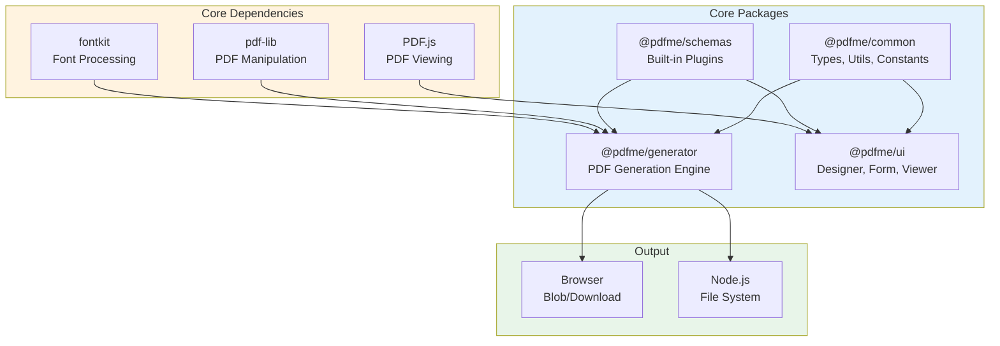
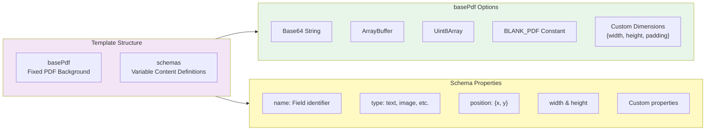
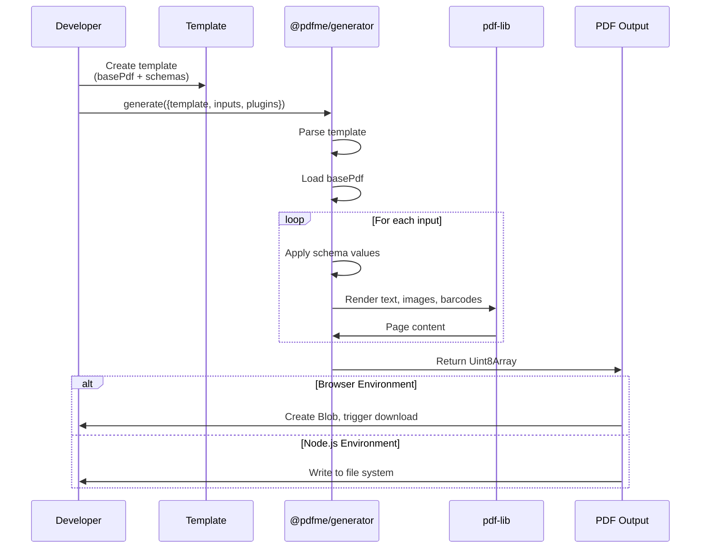
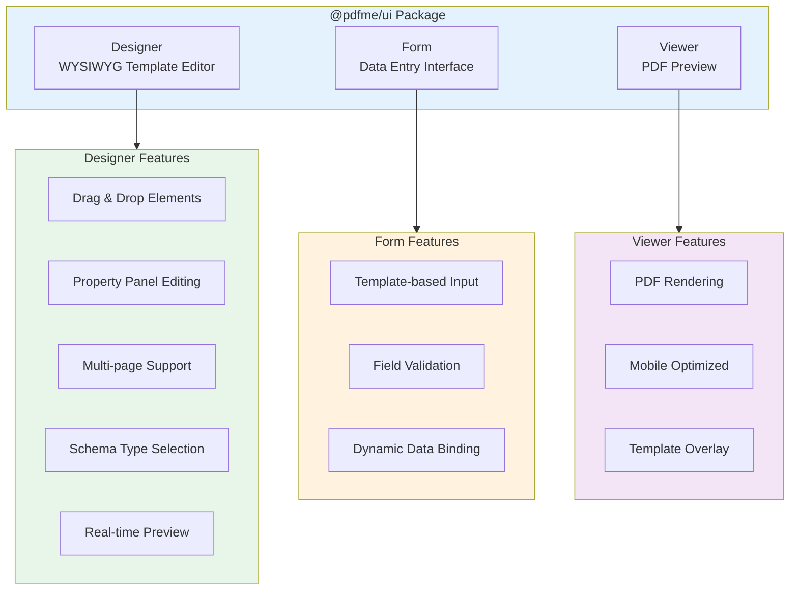
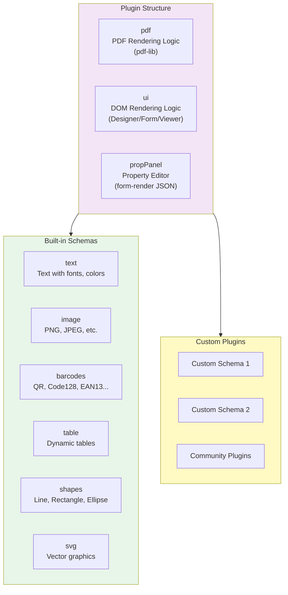
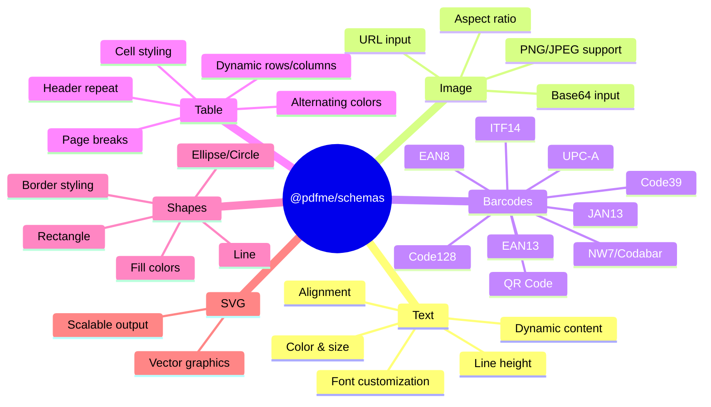
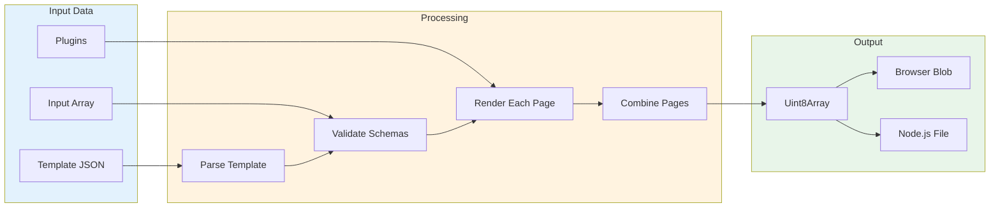
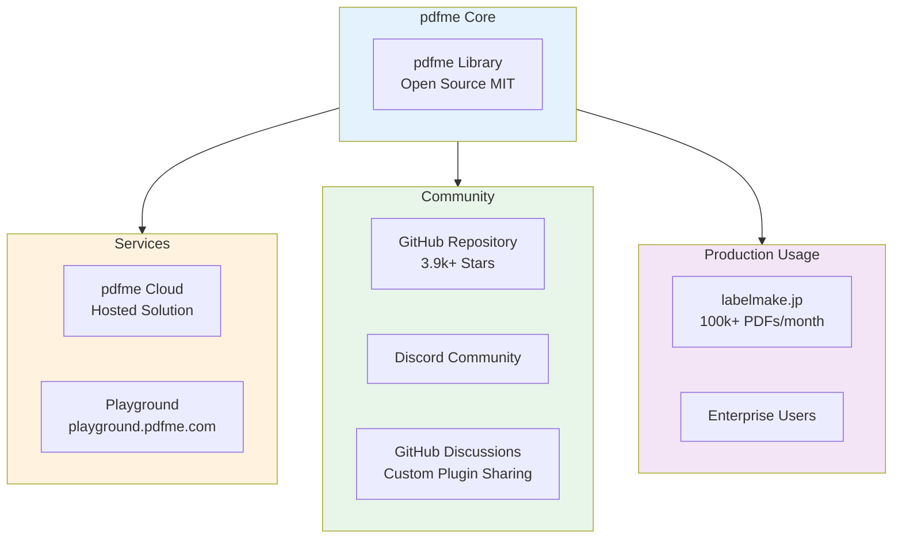
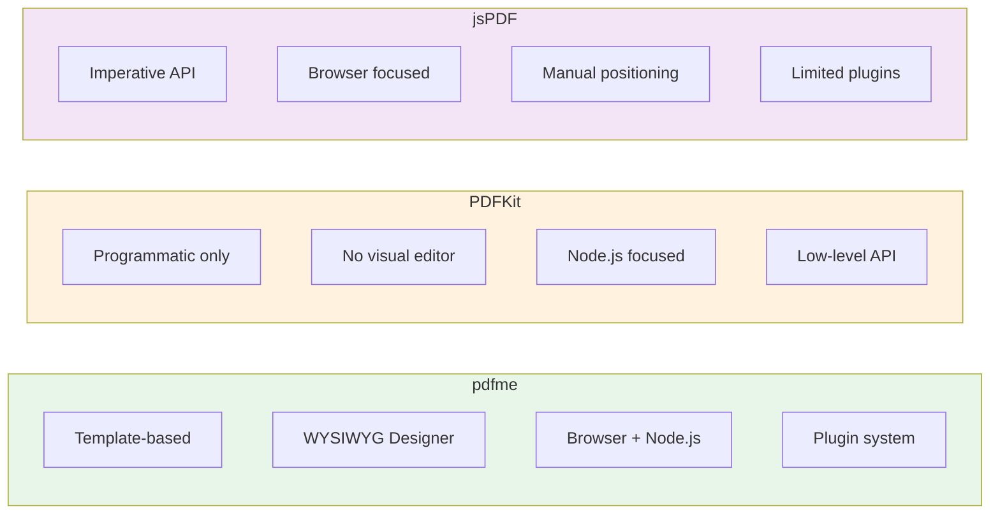

# pdfme - Technical Overview

## Overview

pdfme is an open-source PDF generation library built with TypeScript and React. It provides a template-based approach to PDF creation with a WYSIWYG designer, PDF viewer, and powerful generation capabilities. pdfme works seamlessly in both browser and Node.js environments, making it versatile for various use cases from client-side PDF generation to server-side batch processing.

## High-Level Architecture



## Template System

The template is the core concept in pdfme. It consists of two main parts:



## How It Works - Generation Flow



## UI Components Architecture



## Plugin System Architecture



## Built-in Schema Types



## Data Flow Diagram



## Key Concepts

### Templates
Templates are JSON objects that define the structure of PDFs. They consist of:
- **basePdf**: The static background PDF (can be blank or pre-designed)
- **schemas**: Array of arrays defining variable content per page

### Schemas
Schemas define individual elements in the PDF:
- Position (x, y coordinates in mm)
- Dimensions (width, height)
- Type (text, image, barcode, etc.)
- Type-specific properties (font, color, barcode format, etc.)

### Inputs
Input data is provided as an array where each element generates one PDF document or page:
```javascript
const inputs = [
  { name: 'John Doe', date: '2024-01-15' },
  { name: 'Jane Smith', date: '2024-01-16' }
];
```

### Plugins
Plugins extend schema capabilities with three components:
- **pdf**: Handles rendering to PDF using pdf-lib
- **ui**: Handles rendering to DOM for Designer/Form/Viewer
- **propPanel**: Defines the property editor interface

## Technical Details

### Package Structure

| Package | Purpose | Size |
|---------|---------|------|
| @pdfme/common | Shared types, utilities, constants | Core dependency |
| @pdfme/generator | PDF generation engine | For server & client |
| @pdfme/ui | Designer, Form, Viewer components | React-based UI |
| @pdfme/schemas | Built-in schema plugins | Optional extensions |

### Requirements
- Node.js >= 16
- Modern browsers with ES6+ support
- TypeScript 5.x for type definitions

### Performance
- Most PDF generations complete in tens to hundreds of milliseconds
- Batch generation supported (single call, multiple PDFs)
- Efficient caching recommended for repeated operations

## Integration Examples

### Basic Generation (Node.js)

```javascript
import { generate } from '@pdfme/generator';
import { BLANK_PDF, Template } from '@pdfme/common';
import { text, image } from '@pdfme/schemas';
import fs from 'fs';

const template: Template = {
  basePdf: BLANK_PDF,
  schemas: [[
    {
      name: 'title',
      type: 'text',
      position: { x: 20, y: 20 },
      width: 170,
      height: 10,
    }
  ]]
};

const inputs = [{ title: 'Hello pdfme!' }];
const plugins = { text, image };

generate({ template, inputs, plugins }).then((pdf) => {
  fs.writeFileSync('output.pdf', pdf);
});
```

### Designer Integration (React)

```javascript
import { Designer } from '@pdfme/ui';
import { text, image, barcodes } from '@pdfme/schemas';

const designer = new Designer({
  domContainer: document.getElementById('designer'),
  template: template,
  plugins: { text, image, ...barcodes }
});

// Get updated template
const updatedTemplate = designer.getTemplate();
```

## Ecosystem



## Key Facts (2024-2025)

- **GitHub Stars**: 3,900+
- **Contributors**: 51+
- **Total Commits**: 1,229+
- **NPM Downloads**: Active with 11+ dependent projects
- **Latest Version**: 5.5.8 (December 2024)
- **License**: MIT (completely free for commercial use)
- **Language**: 98.8% TypeScript
- **Production Scale**: Powers services generating 100,000+ PDFs per month

## Use Cases

### Document Generation
- Invoices and receipts
- Labels and shipping documents
- Certificates and diplomas
- Reports and statements

### Form-Based PDFs
- Application forms
- Contracts with dynamic data
- Personalized documents

### Batch Processing
- Mass mail merge
- Bulk certificate generation
- Automated report generation

### Interactive Design
- Non-technical users designing templates
- In-app PDF template editors
- Custom document builders

## Version History Highlights

| Version | Date | Key Changes |
|---------|------|-------------|
| 5.5.0 | Nov 2024 | Added headerRepeat option for tables |
| 5.4.1 | Jul 2024 | XSS vulnerability prevention, security improvements |
| 5.2.0 | Nov 2023 | Headers/footers in fixed positions, template engine |
| 5.0.0 | Sep 2023 | Breaking: Schema array format, removed deprecated schemas |
| 4.5.0 | 2023 | Table schema introduced |

## Comparison with Alternatives



## Security Considerations

- **Input Sanitization**: Version 5.4.1+ includes XSS vulnerability prevention
- **No Server Required**: Client-side generation means no data leaves the browser
- **MIT License**: Full code transparency and auditability
- **Dependency Security**: Regular dependency updates for security patches

## Getting Started Checklist

1. Install packages: `npm i @pdfme/generator @pdfme/common`
2. Import BLANK_PDF or prepare your base PDF
3. Define schemas for variable content
4. Create input data array
5. Call `generate()` with template, inputs, and plugins
6. Handle output (Blob for browser, Buffer for Node.js)

## Resources

- **Official Website**: [pdfme.com](https://pdfme.com)
- **GitHub Repository**: [github.com/pdfme/pdfme](https://github.com/pdfme/pdfme)
- **Playground**: [playground.pdfme.com](https://playground.pdfme.com)
- **NPM Packages**: [@pdfme/generator](https://www.npmjs.com/package/@pdfme/generator), [@pdfme/ui](https://www.npmjs.com/package/@pdfme/ui), [@pdfme/schemas](https://www.npmjs.com/package/@pdfme/schemas)
- **Documentation**: [pdfme.com/docs/getting-started](https://pdfme.com/docs/getting-started)
