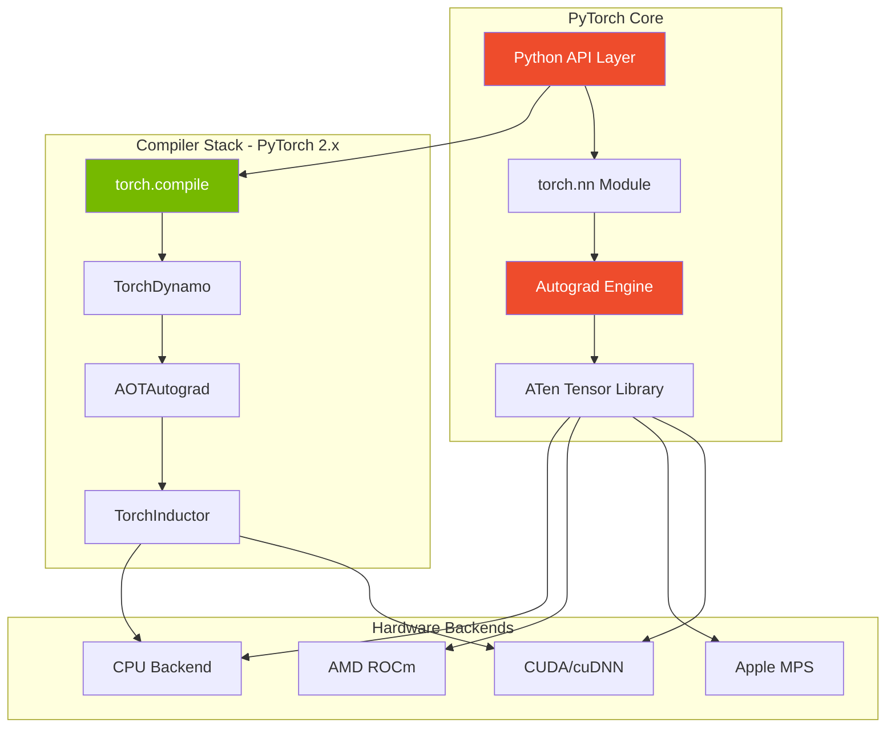
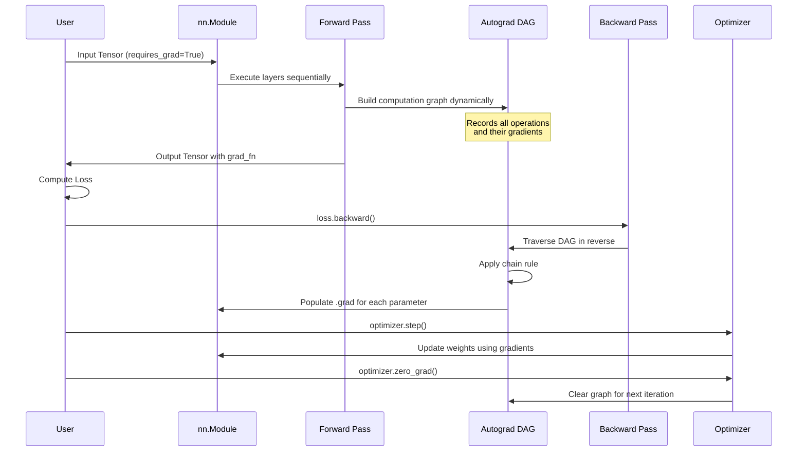
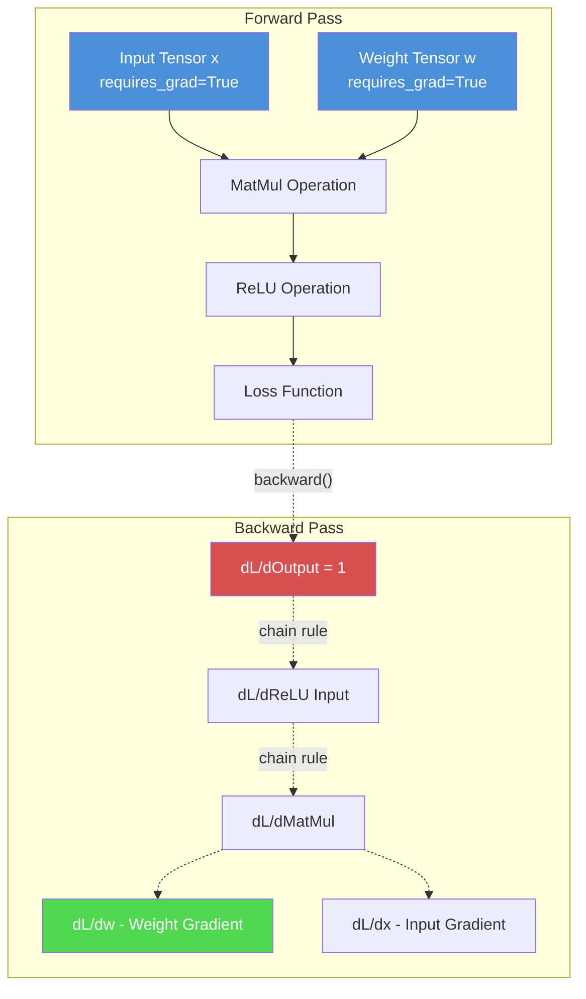
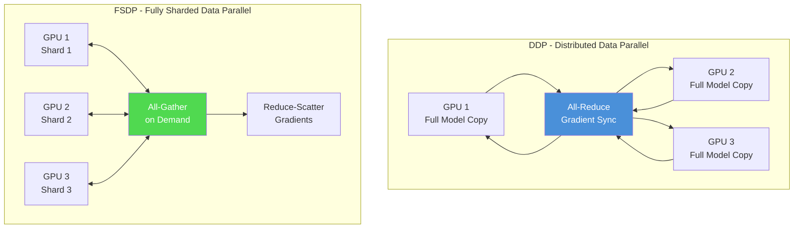

# PyTorch - Technical Overview

## High-Level Architecture

## How Neural Network Training Works

## Autograd: Dynamic Computation Graph

## PyTorch 2.x Compiler Architecture (torch.compile)

```mermaid
flowchart LR
    subgraph "Input"
        Code[Python Code<br/>with PyTorch ops]
    end

    subgraph "TorchDynamo"
        PEP[PEP 523<br/>Frame Evaluation]
        Bytecode[Bytecode Analysis]
        VarTracker[VariableTracker<br/>System]
        FXGraph[FX Graph<br/>Capture]
        Guards[Guard<br/>Generation]
    end

    subgraph "AOTAutograd"
        FwdGraph[Forward Graph]
        BwdGraph[Backward Graph]
        MinCut[Min-Cut<br/>Partitioning]
    end

    subgraph "Backend"
        Inductor[TorchInductor]
        Triton[Triton Kernels<br/>for GPU]
        CppCodegen[C++ Codegen<br/>for CPU]
    end

    subgraph "Output"
        Optimized[Optimized<br/>Compiled Code]
    end

    Code --> PEP
    PEP --> Bytecode
    Bytecode --> VarTracker
    VarTracker --> FXGraph
    FXGraph --> Guards
    Guards --> FwdGraph
    FwdGraph --> MinCut
    MinCut --> BwdGraph
    BwdGraph --> Inductor
    Inductor --> Triton
    Inductor --> CppCodegen
    Triton --> Optimized
    CppCodegen --> Optimized

    style PEP fill:#76b900,color:#fff
    style Inductor fill:#76b900,color:#fff
```

## Key Concepts

### Tensors
- Multi-dimensional arrays similar to NumPy but with GPU acceleration
- Support automatic differentiation when `requires_grad=True`
- Stored with metadata: shape, stride, dtype, device, and `grad_fn`
- Can be moved between CPU and GPU with `.to(device)` or `.cuda()`

### Dynamic Computation Graphs
- Unlike static graph frameworks, PyTorch builds the computation graph at runtime
- Graph is recreated on every forward pass, allowing dynamic control flow
- Each tensor operation creates a node in the Directed Acyclic Graph (DAG)
- The `grad_fn` attribute points to the function that created the tensor

### Autograd Engine
- Implements reverse-mode automatic differentiation
- Computes Jacobian-vector products for efficient gradient calculation
- Handles non-differentiable functions with subgradients
- Supports higher-order derivatives and custom backward functions

### torch.nn.Module
- Base class for all neural network modules
- Manages parameters, buffers, and submodules
- Provides `forward()` method that defines the computation
- Enables model serialization with `state_dict()`

### torch.compile (PyTorch 2.x)
- **TorchDynamo**: Captures Python bytecode using PEP 523 frame evaluation
- **AOTAutograd**: Generates ahead-of-time backward graphs
- **TorchInductor**: Generates optimized Triton (GPU) or C++ (CPU) kernels
- **Guards**: Conditions under which compiled code is valid

## Technical Details

### ATen Library
ATen (A Tensor Library) is the C++17 foundation of PyTorch:
- Provides core `Tensor` class with 500+ operations
- Automatically dispatches to CPU or GPU backends based on tensor location
- Supports dynamic typing for shape, stride, and dtype management
- Enables custom C++ and CUDA extensions

### Distributed Training

**DDP (Distributed Data Parallel)**:
- Each GPU holds a complete model replica
- Gradients synchronized via all-reduce after backward pass
- Best for models that fit in single GPU memory
- Minimal code changes required

**FSDP (Fully Sharded Data Parallel)**:
- Model parameters, gradients, and optimizer states sharded across GPUs
- Parameters gathered on-demand during forward/backward passes
- Enables training of models with 10B+ parameters
- FSDP2 uses DTensor for simpler per-parameter sharding

## Ecosystem

```mermaid
graph TB
    subgraph "Core PyTorch"
        PyTorch[PyTorch Core]
    end

    subgraph "Domain Libraries"
        TorchVision[TorchVision<br/>Computer Vision]
        TorchAudio[TorchAudio<br/>Audio Processing]
        TorchText[TorchText<br/>NLP Utilities]
        TorchRec[TorchRec<br/>Recommendations]
    end

    subgraph "Training & Deployment"
        Lightning[PyTorch Lightning<br/>Training Framework]
        TorchServe[TorchServe<br/>Model Serving]
        ExecuTorch[ExecuTorch<br/>Mobile/Edge]
        ONNX[ONNX Export<br/>Cross-platform]
    end

    subgraph "External Ecosystem"
        HuggingFace[Hugging Face<br/>Transformers]
        Ultralytics[Ultralytics<br/>YOLO]
        Diffusers[Diffusers<br/>Stable Diffusion]
        vLLM[vLLM<br/>LLM Inference]
    end

    PyTorch --> TorchVision
    PyTorch --> TorchAudio
    PyTorch --> TorchText
    PyTorch --> TorchRec

    PyTorch --> Lightning
    PyTorch --> TorchServe
    PyTorch --> ExecuTorch
    PyTorch --> ONNX

    PyTorch --> HuggingFace
    PyTorch --> Ultralytics
    PyTorch --> Diffusers
    PyTorch --> vLLM

    style PyTorch fill:#ee4c2c,color:#fff
    style HuggingFace fill:#ffd21e,color:#000
```

### Library Status (2025)
- **TorchVision** (v0.24.1): Actively maintained, provides datasets, transforms, and pre-trained models
- **TorchAudio** (v2.9): Transitioning to maintenance mode; encoding/decoding migrating to TorchCodec
- **TorchText**: NLP preprocessing utilities
- **ExecuTorch**: Mobile and edge deployment

## Key Facts (2025)

- **Market Position**: 63% adoption rate for model training (Linux Foundation Report)
- **Research Dominance**: ~85% of deep learning papers use PyTorch
- **Company Adoption**: 17,196+ companies globally (52.86% in US)
- **Current Version**: PyTorch 2.5+ with torch.compile as default compiler
- **Governance**: Linux Foundation's PyTorch Foundation (since 2022)
- **Major Users**: ChatGPT, Tesla Autopilot, Hugging Face Transformers, Uber's Pyro
- **GPU Support**: CUDA (NVIDIA), ROCm (AMD), MPS (Apple Silicon)
- **torch.compile Speedup**: Typically 30-200% performance improvement

## Use Cases

### Computer Vision
- Image classification, object detection, semantic segmentation
- Facial recognition, pose estimation
- Medical image analysis
- Autonomous vehicle perception

### Natural Language Processing
- Large Language Models (LLMs) training and inference
- Text classification, named entity recognition
- Machine translation, question answering
- Hugging Face Transformers ecosystem

### Generative AI
- Diffusion models (Stable Diffusion)
- GANs and VAEs
- Text-to-image, image-to-image generation
- Audio synthesis and speech generation

### Industry Applications
- **Healthcare**: Drug discovery, diagnostic imaging
- **Finance**: Fraud detection, algorithmic trading
- **Autonomous Systems**: Self-driving cars, robotics
- **Recommendations**: Large-scale recommendation systems (TorchRec)

## Security Considerations

### Critical Vulnerability: CVE-2025-32434 (April 2025)
- **Severity**: CVSS 9.3 (Critical)
- **Issue**: Remote Code Execution via `torch.load()` even with `weights_only=True`
- **Affected**: All versions <= 2.5.1
- **Fix**: Update to PyTorch 2.6.0+

### Best Practices
1. **Update PyTorch** to version 2.6.0 or later immediately
2. **Audit model sources**: Treat all third-party model files as potential attack vectors
3. **Never load untrusted models** without verification
4. **Distributed training security**: PyTorch distributed features are for internal networks only - no authorization or encryption built-in
5. **Data privacy**: Trained weights can potentially leak training data, especially in overfitted models

### Additional Vulnerabilities
- **ShellTorch (2023)**: TorchServe RCE vulnerabilities (CVE-2023-43654, CVSS 9.8)
- **PickleScan Bypasses (2025)**: Three zero-day vulnerabilities in ML model scanning tool (fixed in v0.0.31)

## Sources

- [PyTorch Official Documentation](https://pytorch.org/)
- [PyTorch Wikipedia](https://en.wikipedia.org/wiki/PyTorch)
- [TorchDynamo Deep Dive](https://docs.pytorch.org/docs/stable/torch.compiler_dynamo_deepdive.html)
- [PyTorch Autograd Overview](https://pytorch.org/blog/overview-of-pytorch-autograd-engine/)
- [ATen Library Documentation](https://docs.pytorch.org/cppdocs/)
- [FSDP Tutorial](https://docs.pytorch.org/tutorials/intermediate/FSDP_tutorial.html)
- [DDP vs FSDP Comparison](https://www.jellyfishtechnologies.com/ddp-vs-fsdp-in-pytorch-unlocking-efficient-multi-gpu-training/)
- [PyTorch 2024 Year in Review](https://pytorch.org/blog/2024-year-in-review/)
- [CVE-2025-32434 Advisory](https://github.com/pytorch/pytorch/security/advisories/GHSA-53q9-r3pm-6pq6)
- [6sense PyTorch Market Share](https://6sense.com/tech/data-science-machine-learning/pytorch-market-share)
- [TorchAudio Future Update](https://github.com/pytorch/audio/issues/3902)
