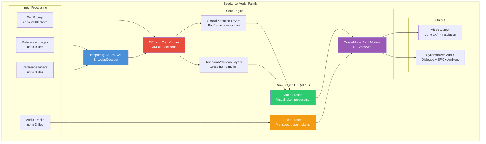
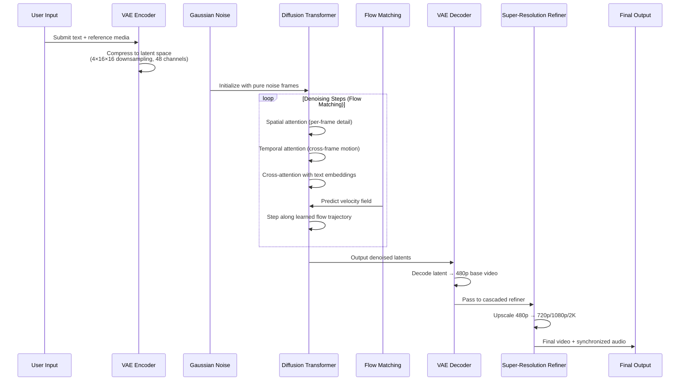
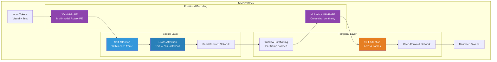
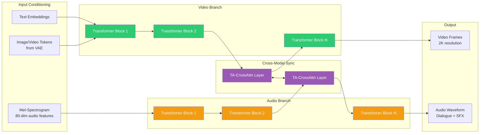
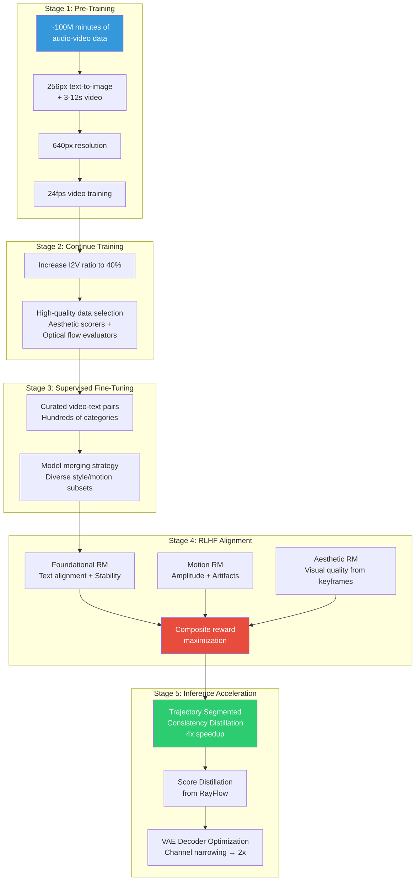
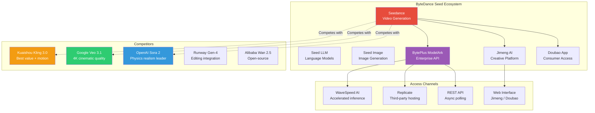

# Seedance AI Video - Technical Overview

ByteDance's Seedance is a family of AI video generation models built on Diffusion Transformer (DiT) architecture. The model family — spanning Seedance 1.0, 1.5 Pro, and 2.0 — progressively introduces native audio-video joint generation, multi-modal input control, and physics-aware synthesis. Seedance is part of ByteDance's broader "Seed" foundation model ecosystem.

## High-Level Architecture

## How It Works — Video Generation Pipeline

## Core Architecture — Diffusion Transformer (DiT)

## Dual-Branch Architecture (Seedance 1.5 Pro / 2.0)

## Key Concepts

### Temporally-Causal VAE
The Variational Autoencoder compresses raw video into a compact latent space with downsampling ratios of (4, 16, 16) across temporal, height, and width dimensions into 48 channels. The "temporally-causal" design ensures each frame is conditioned only on preceding frames, eliminating flickering and temporal inconsistencies. Training uses L1 reconstruction loss, KL divergence loss, LPIPS perceptual loss, and adversarial training with a PatchGAN-style discriminator.

### Flow Matching
Rather than traditional Gaussian diffusion, Seedance uses a flow matching framework with velocity prediction. The model learns the direct mathematical "flow" from noise to clean video, enabling a more efficient denoising trajectory. A logit-normal distribution samples training timesteps, and a resolution-aware shift adjusts noise levels for higher-resolution or longer-duration content.

### Decoupled Spatial-Temporal Attention
The DiT separates attention into two types:
- **Spatial layers**: Self-attention within each frame handles composition, texture, lighting, and color
- **Temporal layers**: Self-attention across frames with window partitioning models motion, physics, and camera dynamics. Text tokens only participate in spatial cross-attention, reducing temporal computation

### 3D Multi-Modal RoPE (MM-RoPE)
Positional encoding that adds 3D rotary embeddings for visual tokens (time, height, width) plus an extra 1D encoding for text tokens. Multi-shot MM-RoPE extends this to handle multiple video shots organized in temporal order, enabling coherent multi-shot storytelling with consistent characters across cuts.

### TA-CrossAttn (Temporal-Aligned Cross-Attention)
Introduced in Seedance 1.5 Pro and refined in 2.0, this mechanism synchronizes audio and video generation across different temporal granularities. Video runs at 24-30 fps while audio samples at much higher rates — TA-CrossAttn bridges this gap to achieve millisecond-level lip-sync and sound-effect alignment.

### Dual-Branch Diffusion Transformer (DB-DiT)
A 4.5-billion parameter architecture (in Seedance 1.5 Pro) with parallel video and audio branches. The video branch processes visual patch embeddings; the audio branch processes 80-dimensional mel-spectrogram tokens. Bidirectional cross-attention is interleaved at designated layers — video queries attend to audio keys/values and vice versa — enabling native audio-visual generation in a single forward pass.

## Training Pipeline

## Technical Details

### Model Versions

| Feature | Seedance 1.0 | Seedance 1.5 Pro | Seedance 2.0 |
|---|---|---|---|
| **Architecture** | MMDiT | DB-DiT (4.5B params) | MMDiT + DB-DiT |
| **Audio Generation** | No | Native joint A/V | Native joint A/V |
| **Max Resolution** | 1080p | 1080p | 2K (up to 4K) |
| **Max Duration** | ~10s | 4-12s | 15-30s+ |
| **Input Modalities** | Text, Image | Text, Image | Text, Image, Video, Audio (12 files) |
| **Languages** | Bilingual (CN/EN) | 8 languages | 8+ languages |
| **Lip-Sync** | Basic | Phoneme-level | Phoneme-level |
| **Multi-Shot** | Yes | Yes | Enhanced |
| **Release** | Mid-2025 | Dec 2025 | Feb 2026 |

### RLHF Strategy
Seedance's RLHF approach is distinct: rather than PPO, DPO, or GRPO, it directly predicts the clean video (x0) and maximizes composite rewards from multiple reward models simultaneously. Comparative experiments showed this reward maximization approach is more efficient and effective than alternatives, comprehensively improving text-video alignment, motion quality, and aesthetics.

### Inference Performance
- 5-second 1080p video generated in **41.4 seconds** (NVIDIA L40)
- **10x overall speedup** through multi-stage distillation pipeline
- 4x acceleration via Trajectory Segmented Consistency Distillation (TSCD)
- 2x VAE decoder speedup via channel narrowing
- Seedance 2.0 is **30% faster** than 1.5 Pro

### Seedance 2.0 Universal Reference System
Unique "@" identifier system where users tag reference assets in prompts:
- `@character1` — reference image for character consistency
- `@camera_ref` — reference video for camera movement extraction
- `@bgm` — audio track for rhythm reference
- Accepts up to 12 simultaneous reference files

## Ecosystem & Competitive Landscape

### Competitive Comparison (Feb 2026)

| Dimension | Seedance 2.0 | Sora 2 | Veo 3.1 | Kling 3.0 |
|---|---|---|---|---|
| **Best For** | Creative control | Physics realism | Cinematic quality | Value + human motion |
| **Max Resolution** | 2K | 1080p | 4K | 4K/60fps |
| **Max Duration** | ~15-30s | 5-25s | ~8s | ~10s |
| **Native Audio** | Yes | No | Yes | No |
| **Multi-modal Input** | 12 files | Text + Image | Text + Image | Text + Image + Video |
| **Usable Output Rate** | ~90% | ~60% | ~70% | ~75% |
| **Approx. Cost** | ~$0.06/s | Premium | $19.99/mo plan | Free tier available |

## Key Facts (2026)

- **Seedance 2.0** launched February 8, 2026 as ByteDance's most capable video model
- **4.5 billion parameters** in the Dual-Branch DiT architecture (Seedance 1.5 Pro)
- **12-billion parameter** "Alive" variant available as open-source for consumer GPUs (24GB VRAM)
- **8+ languages** supported with phoneme-level lip-sync accuracy
- **12 reference files** accepted simultaneously (images, videos, audio)
- **90% usable output rate** reported (vs ~20% for prior generation models)
- **10x inference speedup** through multi-stage distillation
- **41.4 seconds** to generate a 5-second 1080p video on NVIDIA L40
- Ranked **#1 on Artificial Analysis Arena** for both text-to-video and image-to-video
- Available via **BytePlus ModelArk** API (async-polling, REST), **Doubao** app, and **Jimeng AI** platform
- API supports durations of 4, 6, 8, 10, or 12 seconds at 480p/720p/1080p
- Pricing approximately **$0.65 per 5-second 720p video** with audio (Seedance 1.5 Pro)
- Technical paper: [arXiv 2506.09113](https://arxiv.org/abs/2506.09113) (Seedance 1.0), [arXiv 2512.13507](https://arxiv.org/abs/2512.13507) (Seedance 1.5 Pro)

## Use Cases

- **Advertising & Marketing**: Generate product videos, social media ads, and promotional content with director-level control over camera, lighting, and performance
- **Film Pre-visualization**: Rapid prototyping of scenes with multi-shot narrative consistency and synchronized dialogue
- **Content Creation**: Short-form video generation for TikTok, YouTube Shorts, and Instagram Reels with native audio
- **Localization**: Auto-generate lip-synced dialogue in 8+ languages from a single source video
- **Music Videos**: Reference audio tracks to generate rhythm-matched visuals with ambient soundscapes
- **E-commerce**: Product showcase videos with consistent character/brand identity across shots
- **Education**: Generate explainer videos with synchronized narration and visual demonstrations
- **Game Development**: Cutscene prototyping and cinematic trailer creation

## Considerations

- **20-30% faithfulness gap** compared to human expectations for complex human actions — struggles with high-speed motion, hand manipulation, and multi-character dialogue
- **Physics limitations**: While improved, still produces physically implausible results in edge cases (gravity, fluid dynamics, fabric draping)
- **Ethical risks**: Deepfake potential — ByteDance includes content provenance metadata but enforcement varies by platform
- **Compute requirements**: Full Seedance 2.0 requires **96GB+ VRAM**; the 12B open-source "Alive" variant needs 24GB (RTX 3090/4090)
- **Geographic access**: Primary access through Chinese platforms (Doubao, Jimeng); international access via BytePlus ModelArk API
- **Content policy**: Subject to ByteDance's content moderation; restricted content categories apply
- **Duration limits**: API currently caps at 12 seconds per generation (Seedance 1.5 Pro); longer content requires stitching multiple clips
- **Audio quality**: Native audio generation is a differentiator, but singing and complex musical performances remain challenging
- **Data provenance**: Training data (~100M minutes of audio-video) raises standard concerns about copyright and consent in generative AI training datasets

## Sources

- [Seedance 2.0 Official Page — ByteDance Seed](https://seed.bytedance.com/en/seedance2_0)
- [Seedance 1.0 Technical Report — arXiv](https://arxiv.org/html/2506.09113v1)
- [Seedance 1.5 Pro Paper — arXiv 2512.13507](https://arxiv.org/abs/2512.13507)
- [Seedance 2.0 Technical Assessment — Sterlites](https://sterlites.com/blog/seedance-2-technical-assessment)
- [What Is Seedance 1.5 Pro — MindStudio](https://www.mindstudio.ai/blog/what-is-seedance-1-5-pro-bytedance-video)
- [Seedance 2.0 Developer Guide — SitePoint](https://www.sitepoint.com/introducing-seedance-2-0/)
- [Video Generation Comparison 2026 — WaveSpeed AI](https://wavespeed.ai/blog/posts/seedance-2-0-vs-kling-3-0-sora-2-veo-3-1-video-generation-comparison-2026/)
- [ByteDance Seed Models](https://seed.bytedance.com/en/models)
