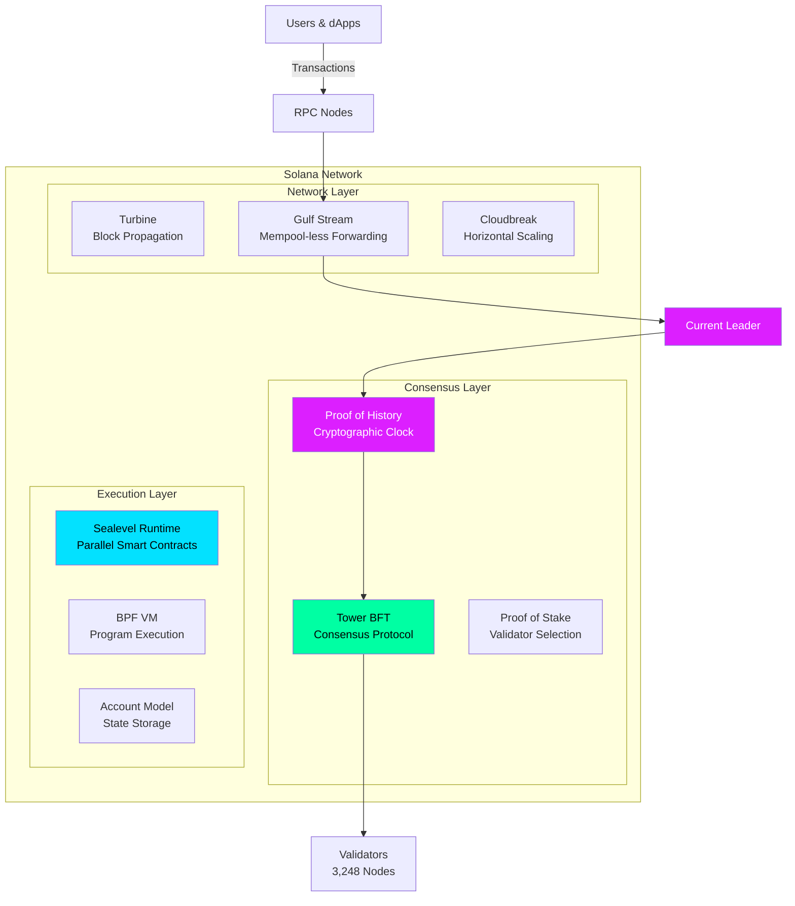
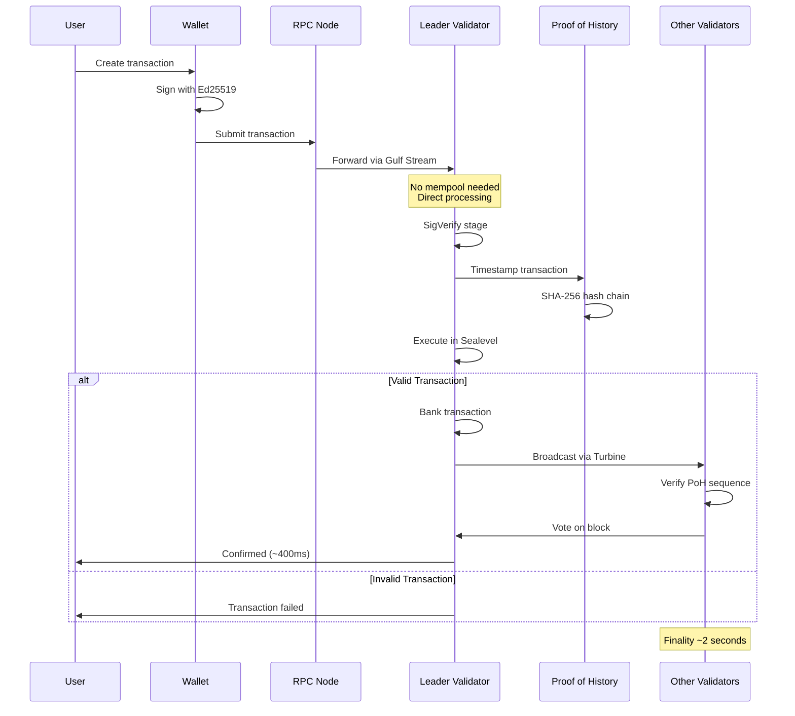
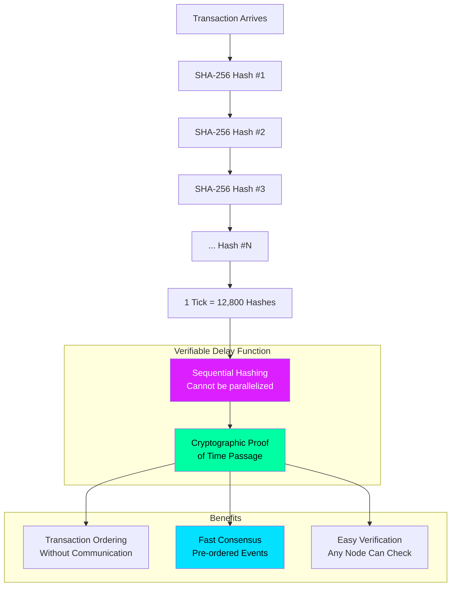
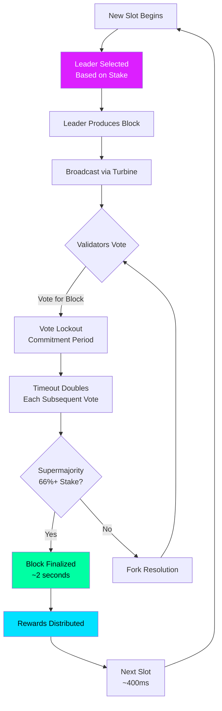
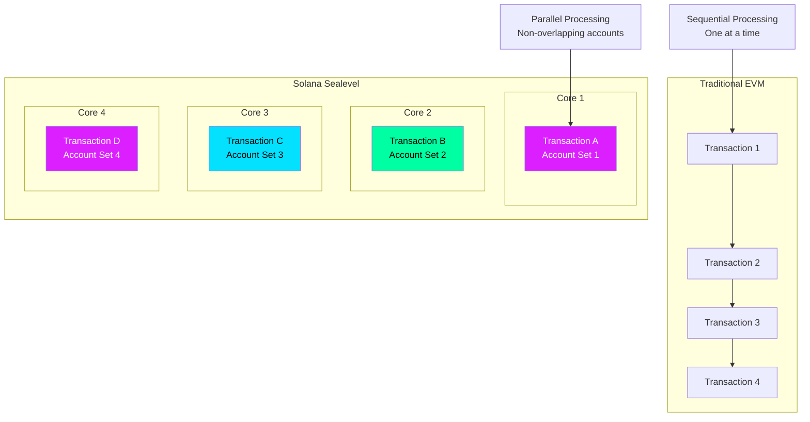
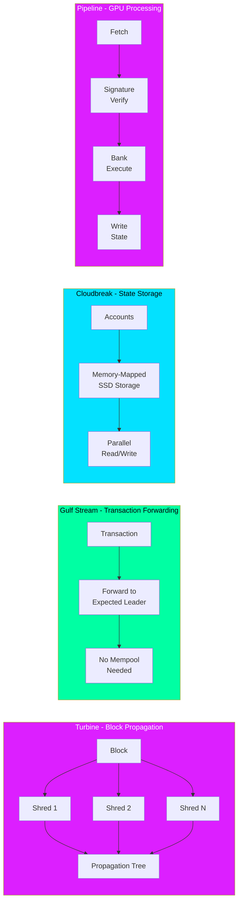
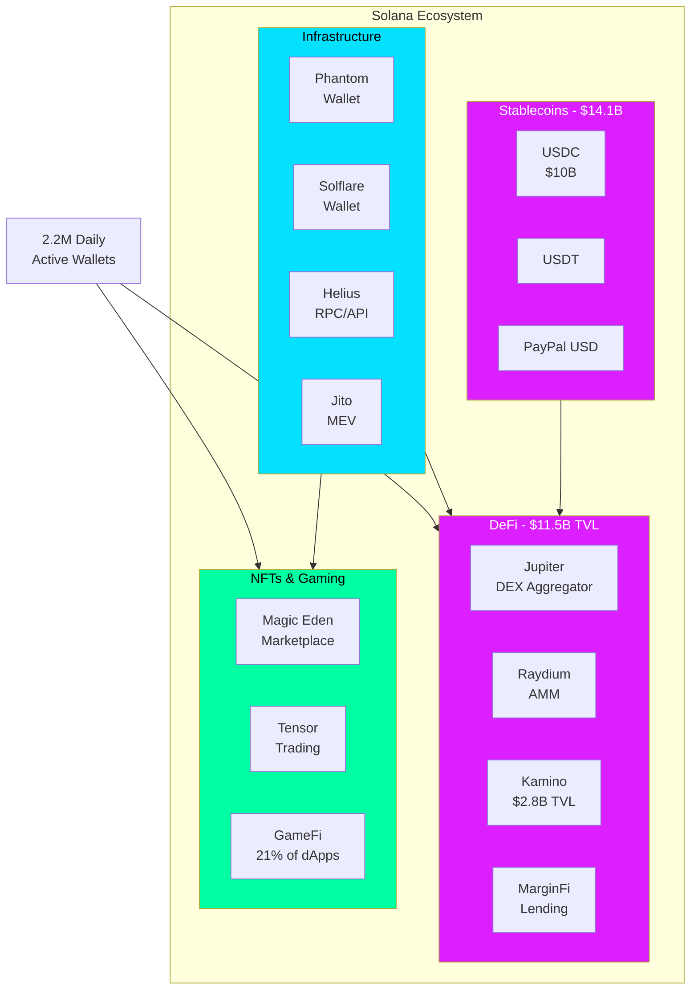
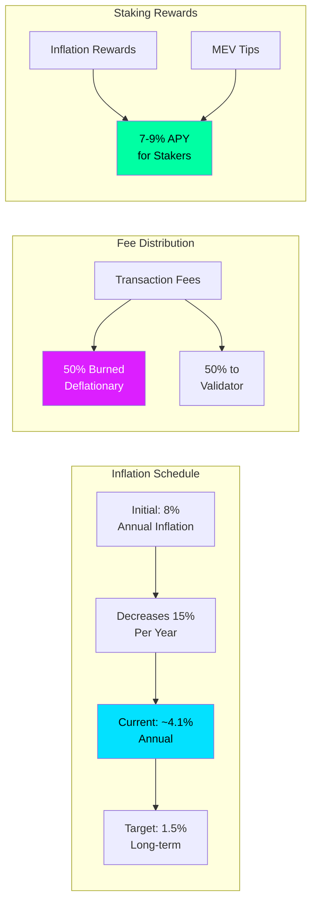
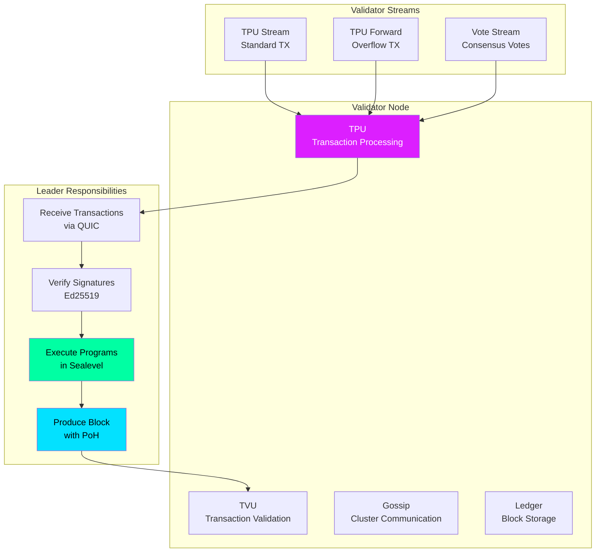
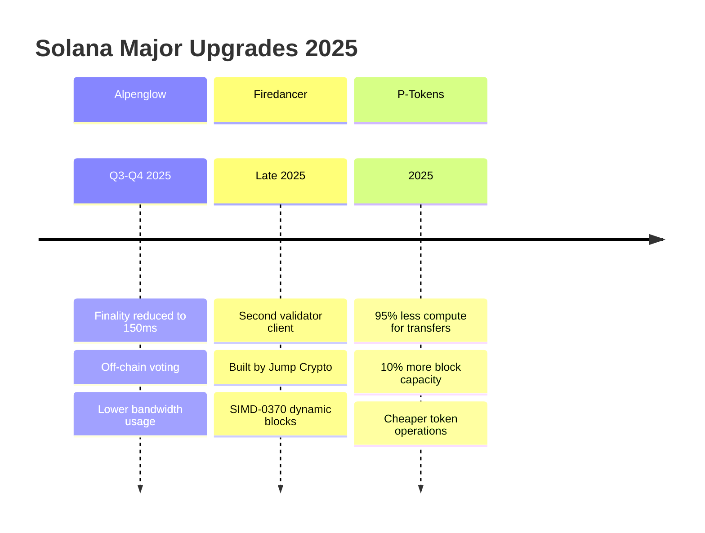

# Solana - Technical Overview

## High-Level Architecture

## Transaction Flow

## Proof of History (PoH) Mechanism

## Tower BFT Consensus

## Sealevel Parallel Runtime

## Network Architecture Components

## Ecosystem Overview

## Token Economics

## Validator Architecture

## Upcoming Upgrades (2025)

## Key Facts (2025)

### Network Performance
- **Block Time**: ~400 milliseconds
- **Finality**: ~2 seconds (150ms with Alpenglow)
- **Theoretical TPS**: 65,000
- **Actual TPS**: 3,700 - 55,000+ (peak during events)
- **Average TPS (2024)**: ~48,000

### Validators & Staking
- **Active Validators**: 3,248 across 45+ countries
- **Current Inflation**: ~4.1% annually
- **Target Inflation**: 1.5% (long-term)
- **Staking APY**: 7-9%
- **Fee Burn Rate**: 50% of transaction fees

### DeFi & Ecosystem
- **DeFi TVL**: $11.5 billion (Q3 2025)
- **Stablecoin Market Cap**: $14.1 billion
- **Daily DEX Volume**: ~$4 billion average
- **Active dApps**: 2,100+
- **Daily Active Wallets**: 2.2 million

### Market (2025)
- **SOL Market Cap**: $113.5 billion (Q3 2025)
- **Total Transactions**: 250+ billion since launch
- **NFT Total Sales**: $3+ billion

### Transaction Costs
- **Average Fee**: ~$0.00025
- **NFT Minting**: < $0.10

## Eight Key Innovations

| Innovation | Description |
|------------|-------------|
| **Proof of History** | Cryptographic clock for transaction ordering |
| **Tower BFT** | PoH-optimized Byzantine Fault Tolerance |
| **Turbine** | Block propagation via shredding |
| **Gulf Stream** | Mempool-less transaction forwarding |
| **Sealevel** | Parallel smart contract execution |
| **Pipelining** | GPU-based transaction processing |
| **Cloudbreak** | Horizontally-scaled account database |
| **Archivers** | Distributed ledger storage |

## Security Considerations

- **Validator Diversity**: 3,248 validators reduce centralization risk
- **Stake Distribution**: Top validators hold significant stake concentration
- **Leader Selection**: PoS-based, proportional to stake
- **Slashing**: Not implemented by default (delegators protected)
- **Network Outages**: Historical incidents in 2021-2022, improved stability since

## Use Cases

- **DeFi Trading**: Jupiter processes $700M+ daily swaps
- **NFT Marketplaces**: Magic Eden, Tensor for low-cost trading
- **Gaming**: 21% of dApps, benefits from fast finality
- **Payments**: Sub-second confirmation, near-zero fees
- **DePIN**: Decentralized physical infrastructure networks
- **Meme Coins**: Popular platform for token launches

## References

- [Solana Whitepaper](https://solana.com/solana-whitepaper.pdf)
- [Solana Documentation](https://docs.solana.com/)
- [State of Solana Q3 2025 - Messari](https://messari.io/report/state-of-solana-q3-2025)
- [Solana Statistics 2025 - CoinLaw](https://coinlaw.io/solana-statistics/)
- [Solana Staking Economics 2025 - Gate.io](https://www.gate.com/learn/articles/understanding-solanas-staking-and-validator-economics-in-2025)
- [Solana Brand & Press](https://solana.com/branding)
- [CoinDesk - Solana Architectural Changes](https://www.coindesk.com/tech/2025/10/05/solana-s-upcoming-architectural-changes-and-why-they-matter)
- [Crypto.com - Proof of History](https://crypto.com/en/university/what-is-solanas-proof-of-history-sol-consensus-mechanism)
