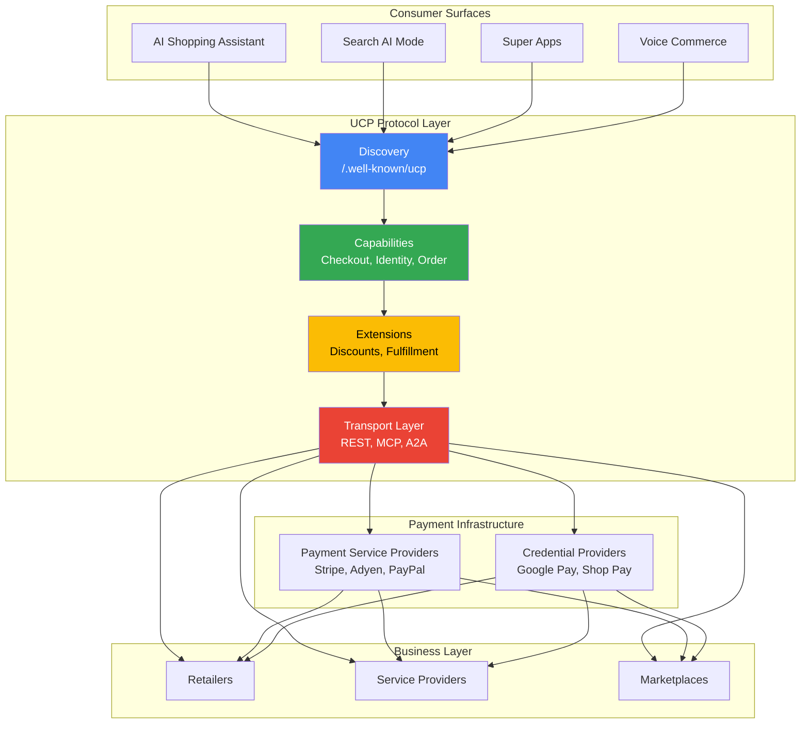
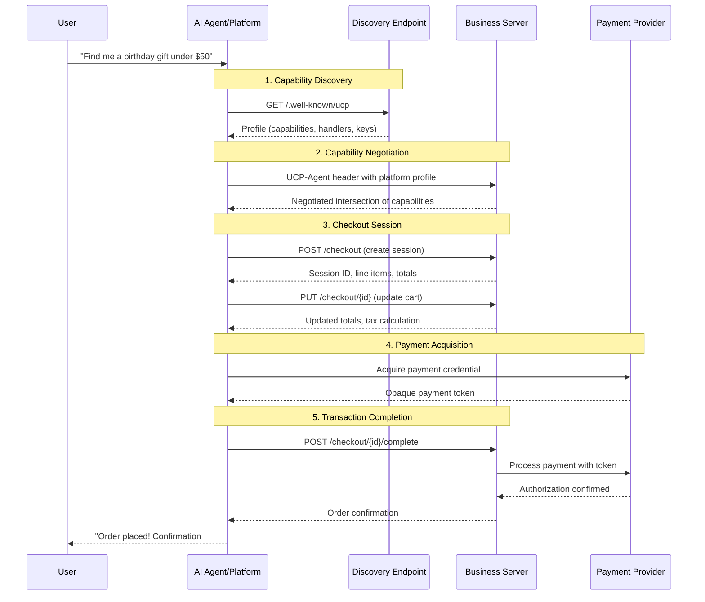
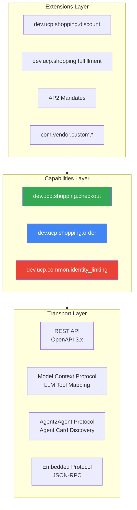
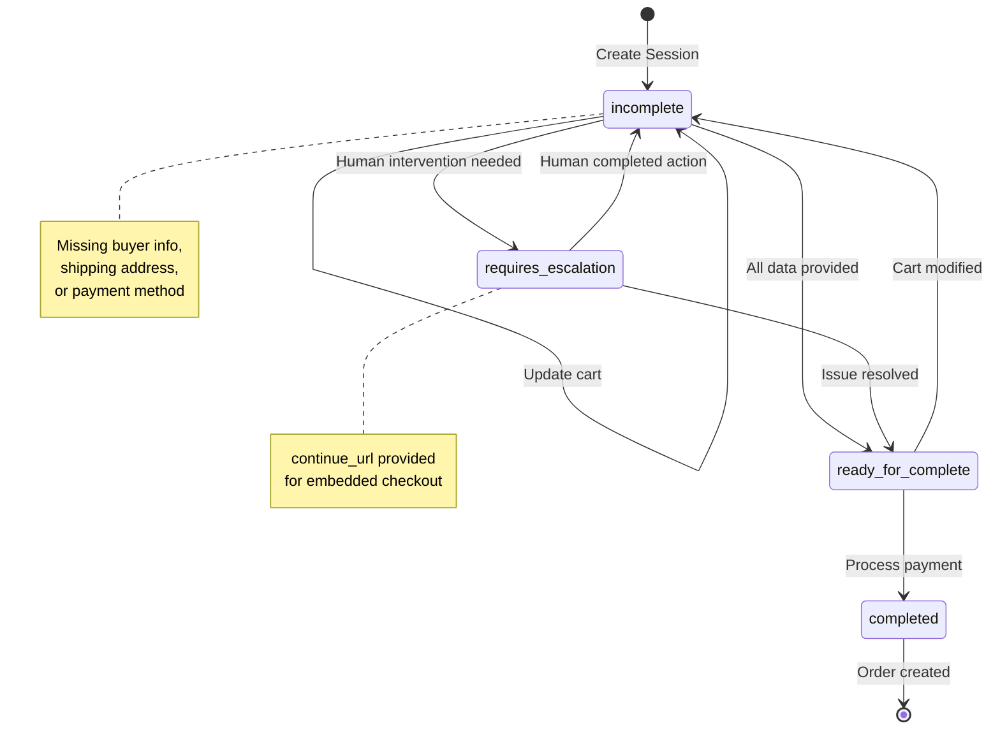
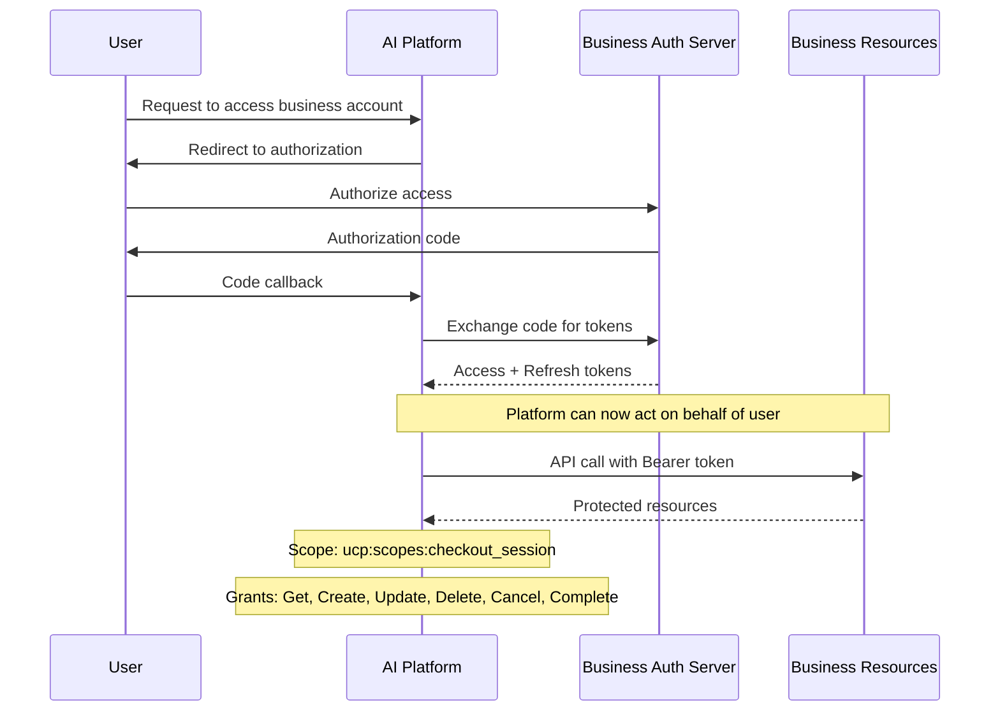
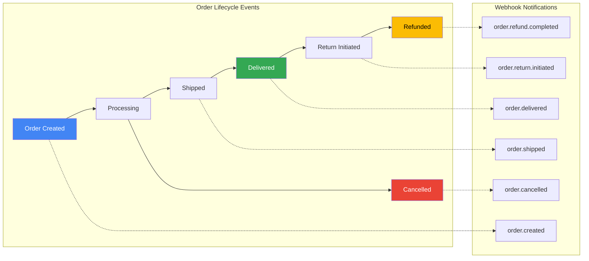
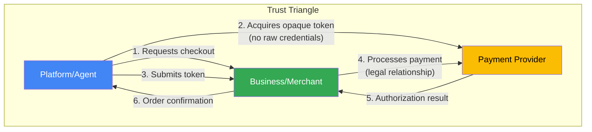
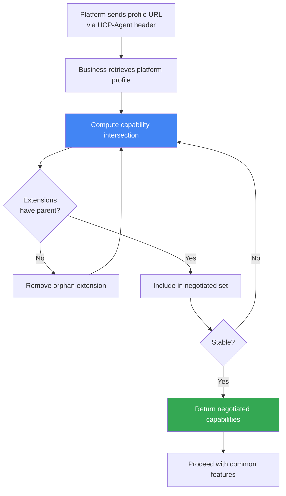
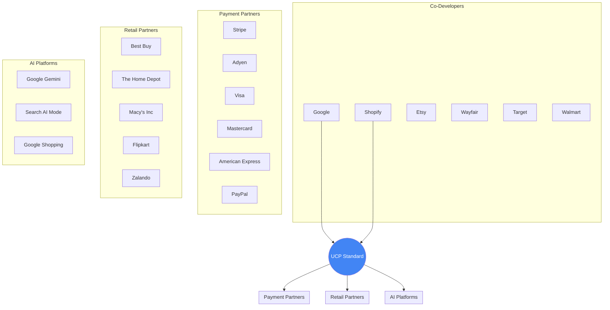
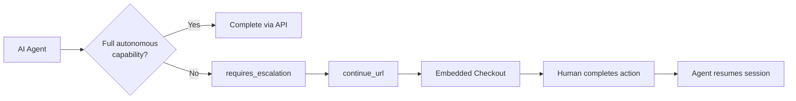

# Universal Commerce Protocol (UCP) - Technical Overview

## High-Level Architecture

The Universal Commerce Protocol (UCP) is an open standard that enables seamless commerce interactions between AI agents, applications, businesses, and payment providers. It establishes a "common language and functional primitives" for the agentic commerce ecosystem.



## How It Works - Agentic Commerce Flow



## Key Concepts

### Four Primary Actors

The UCP ecosystem defines four key roles that interact through the protocol:

| Actor | Description | Examples |
|-------|-------------|----------|
| **Platform** | Consumer-facing surface orchestrating user journeys | Gemini, ChatGPT, Search AI Mode |
| **Business** | Merchant or service provider (Merchant of Record) | Shopify stores, Etsy sellers, Target |
| **Credential Provider** | Manages payment instruments and personal data | Google Pay, Shop Pay, Apple Pay |
| **Payment Service Provider** | Processes authorizations and settlements | Stripe, Adyen, PayPal |

### Layered Protocol Architecture

UCP follows a TCP/IP-inspired layered approach:



### Namespace Governance

UCP uses reverse-domain naming to enable decentralized capability ownership:

```
{reverse-domain}.{service}.{capability}

Examples:
- dev.ucp.shopping.checkout      → Authority: ucp.dev
- com.shopify.payments.shopPay   → Authority: shopify.com
- com.loyaltyprovider.rewards    → Authority: loyaltyprovider.com
```

This eliminates the need for a central registry and enables an "open bazaar of capabilities."

## Core Capabilities

### 1. Checkout Capability (`dev.ucp.shopping.checkout`)

The foundation of UCP commerce transactions:



**Features:**
- Multi-item cart management with line items
- Dynamic pricing and tax calculation
- Payment handler negotiation
- Checkout session state machine
- Support for human-in-the-loop escalation

### 2. Identity Linking Capability (`dev.ucp.common.identity_linking`)

OAuth 2.0-based authorization for acting on behalf of users:



**Use Cases:**
- Accessing loyalty benefits and rewards
- Personalized offers and pricing
- Wishlist and saved cart management
- Authenticated checkouts

### 3. Order Capability (`dev.ucp.shopping.order`)

Webhook-based lifecycle management for post-purchase tracking:



## Technical Details

### Discovery & Profile Structure

Businesses expose their UCP profile at `/.well-known/ucp`:

```json
{
  "ucp": {
    "version": "2026-01-11",
    "services": [
      {
        "name": "dev.ucp.shopping.checkout",
        "version": "2026-01-11",
        "spec": "https://ucp.dev/specs/checkout.yaml",
        "endpoint": "https://api.example.com/ucp"
      }
    ],
    "capabilities": ["checkout", "identity_linking", "order"]
  },
  "payment": {
    "handlers": [
      {
        "id": "stripe-card",
        "name": "com.stripe.card",
        "version": "1.0.0",
        "config": { "publishable_key": "pk_live_..." }
      }
    ]
  },
  "signing_keys": [
    { "kty": "RSA", "kid": "key-1", "n": "...", "e": "AQAB" }
  ]
}
```

### Payment Architecture - The Trust Triangle



**Key Principles:**
- Platforms never touch raw financial credentials
- Payment instruments are separated from payment handlers
- Tokenized payments minimize PCI-DSS scope
- Merchants retain full control of settlement and compliance

### Security Mechanisms

| Mechanism | Purpose |
|-----------|---------|
| **HTTPS (mandatory)** | Transport layer security |
| **OAuth 2.0** | Identity linking and authorization |
| **Bearer Tokens** | Platform-to-business authentication |
| **JWT Signatures** | Webhook verification |
| **Request Signing** | Non-repudiation via `request-signature` headers |
| **Idempotency Keys** | Prevent duplicate transaction processing |
| **AP2 Mandates** | Cryptographic proof of user consent for autonomous agents |

### Negotiation Protocol

When platforms and businesses connect, they compute the intersection of their capabilities:



## Ecosystem Participants



## Key Facts (2026)

- **Version:** 2026-01-11 (date-based versioning: YYYY-MM-DD)
- **License:** Apache 2.0 (open source)
- **Co-Developers:** Google, Shopify, Etsy, Wayfair, Target, Walmart
- **Endorsers:** 60+ organizations including Visa, Mastercard, Stripe, PayPal
- **Transport Protocols:** REST API, MCP, A2A, Embedded Protocol (JSON-RPC)
- **Core Capabilities:** Checkout, Identity Linking, Order Management
- **Extensions:** Discounts, Fulfillment, AP2 Mandates, Subscription Mandates
- **Discovery Endpoint:** `/.well-known/ucp`
- **OAuth Discovery:** `/.well-known/oauth-authorization-server` (RFC 8414)
- **GitHub:** [Universal-Commerce-Protocol/ucp](https://github.com/Universal-Commerce-Protocol/ucp)
- **Documentation:** [ucp.dev](https://ucp.dev)

## Use Cases

### 1. AI-Powered Shopping Assistants

Agents can discover products, manage carts, and complete purchases autonomously:

```
User: "Find me running shoes under $150"
Agent: [Discovers capabilities via /.well-known/ucp]
Agent: [Searches product catalog, filters by price]
Agent: [Creates checkout session, adds items]
Agent: [Acquires payment token from user's wallet]
Agent: [Completes purchase, returns order confirmation]
```

### 2. Voice Commerce

Surface-agnostic design enables voice-first shopping experiences:

- "Hey Google, reorder my coffee pods"
- Platform retrieves identity-linked account
- Accesses saved preferences and payment methods
- Completes transaction with voice confirmation

### 3. Embedded Checkout

When agents encounter capability gaps, graceful degradation to human-in-the-loop:



### 4. Multi-Merchant Carts

Platforms can orchestrate purchases across multiple businesses in a single user journey, with each merchant maintaining Merchant of Record status.

## UCP vs. ACP Comparison

| Aspect | UCP (Google) | ACP (OpenAI) |
|--------|--------------|--------------|
| **Primary Surfaces** | Gemini, Search AI Mode, Google Shopping | ChatGPT, OpenAI ecosystem |
| **Payment Focus** | Google Pay (PayPal planned) | Delegated tokens (single-use, time-bound) |
| **Merchant Control** | Merchant of Record retained | Merchant controls settlement/refunds |
| **Architecture** | Transport-agnostic, capability-based | Product feed + agent checkout |
| **Interoperability** | Designed to coexist with ACP | Designed to coexist with UCP |

Both protocols are complementary and merchants should prepare to support both as agentic commerce evolves.

## Future Roadmap

- **New Verticals:** Travel, Services, Food Delivery
- **Loyalty Programs:** Standardized rewards and points management
- **Personalization:** Enhanced signals for product discovery
- **Subscription Mandates:** Recurring payment authorization

## Resources

- **Official Documentation:** [ucp.dev](https://ucp.dev)
- **GitHub Repository:** [Universal-Commerce-Protocol/ucp](https://github.com/Universal-Commerce-Protocol/ucp)
- **Specification Overview:** [ucp.dev/specification/overview](https://ucp.dev/specification/overview/)
- **Google Developers Guide:** [developers.google.com/merchant/ucp](https://developers.google.com/merchant/ucp)
- **Shopify Engineering:** [shopify.engineering/UCP](https://shopify.engineering/UCP)

---

*Last updated: January 2026*
