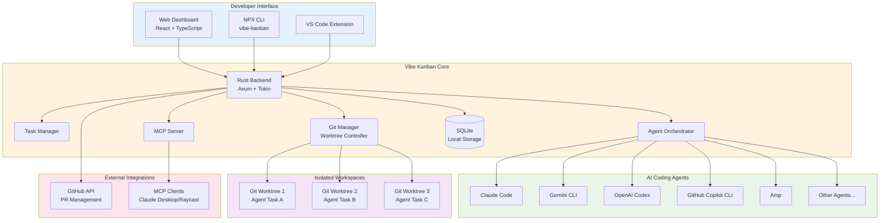
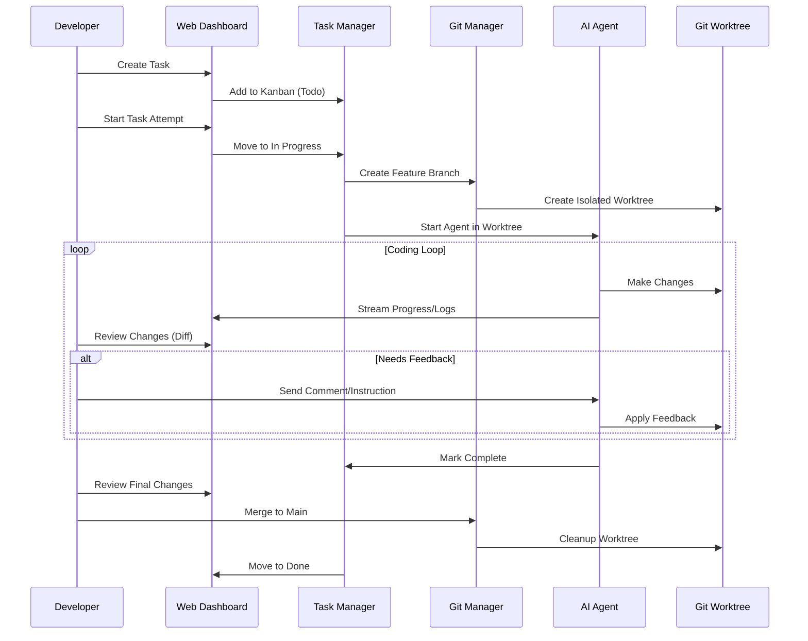
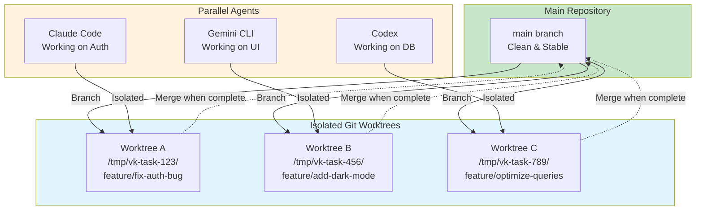
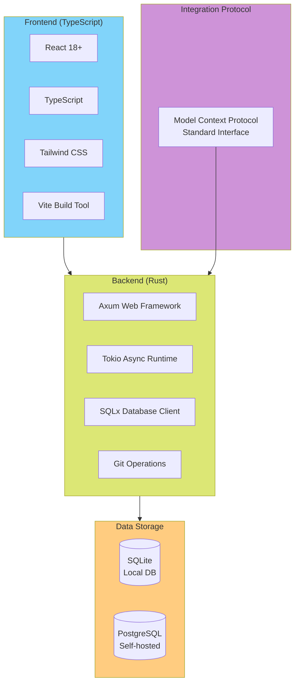
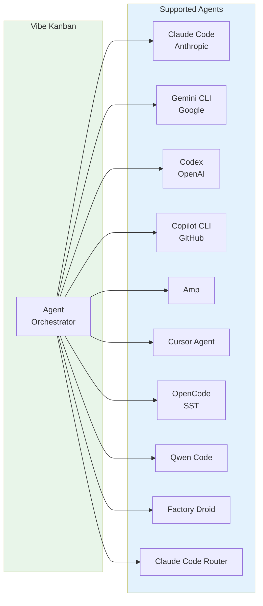
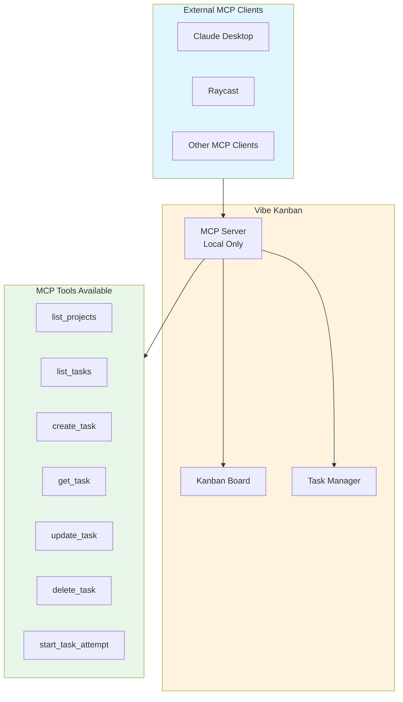
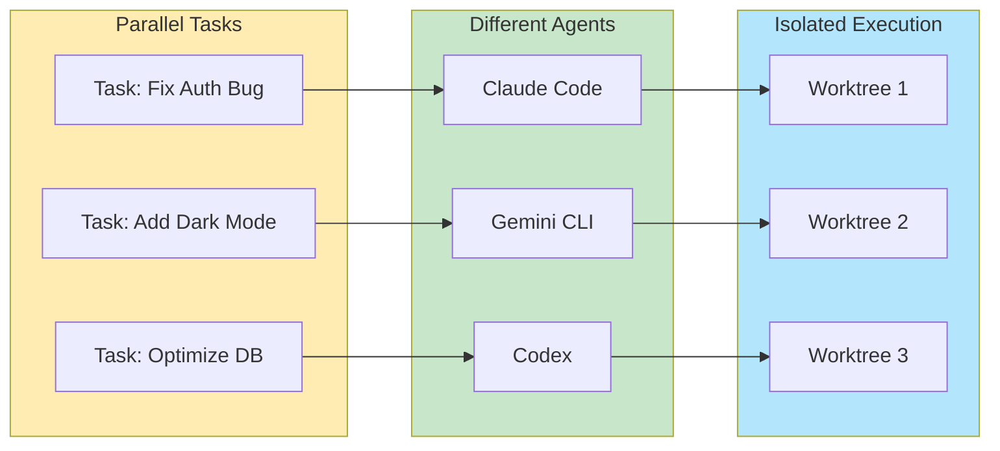
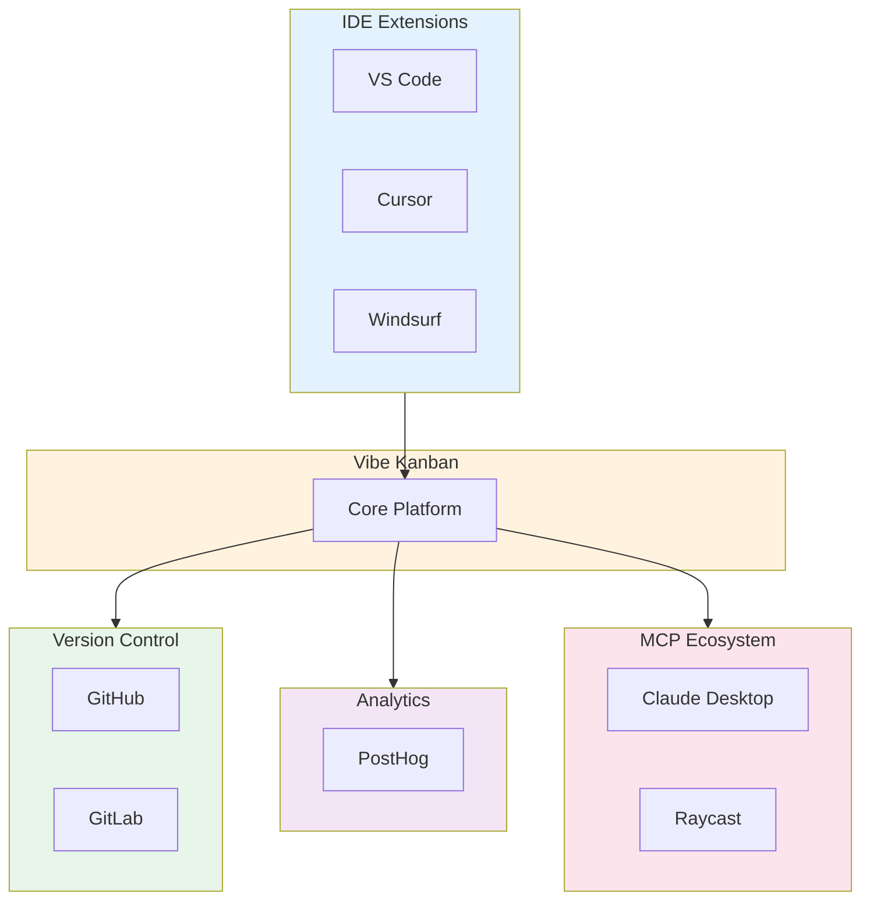

# Vibe Kanban - Technical Overview

## What is Vibe Kanban?

Vibe Kanban is an open-source orchestration platform for AI coding agents, developed by BloopAI. It provides a web-based Kanban board interface that enables developers to manage, monitor, and execute multiple AI coding agents in parallel. The tool addresses the paradigm shift where AI agents increasingly write code while human engineers focus on planning, reviewing, and orchestrating tasks.

**Key Value Proposition**: Get 10X more out of Claude Code, Gemini CLI, Codex, and other coding agents by running them in parallel, isolated environments with centralized management.

## High-Level Architecture



## How It Works

### Task Execution Flow



### Git Worktree Isolation Model



## Key Concepts

### Task States

Tasks flow through the Kanban board with three primary states:

| State | Description |
|-------|-------------|
| **Todo** | Queued tasks waiting for execution |
| **In Progress** | Active tasks being worked on by agents |
| **Done** | Completed tasks ready for merge/review |

### Task Attempts

Each task can have multiple "attempts" - separate executions with different:
- AI agents (Claude, Gemini, Codex, etc.)
- Agent variants/profiles (different prompts, models)
- Base branches

### Agent Profiles

Configurable agent variants allow customization of:
- Planning behavior
- Model selection
- Sandbox permissions
- Custom instructions

## Technology Stack



### Repository Structure

```
vibe-kanban/
├── crates/           # Rust backend modules
├── frontend/         # React web application
├── remote-frontend/  # Remote access interface
├── npx-cli/          # NPM distribution CLI
├── shared/           # Common code
└── Cargo.toml        # Rust workspace config
```

## Supported AI Coding Agents



## MCP (Model Context Protocol) Integration

Vibe Kanban exposes a local MCP server, enabling bidirectional integration:



### MCP Configuration

```json
{
  "mcpServers": {
    "vibe_kanban": {
      "command": "npx",
      "args": ["-y", "vibe-kanban@latest", "--mcp"]
    }
  }
}
```

### MCP Tools Reference

| Tool | Description | Required Parameters |
|------|-------------|---------------------|
| `list_projects` | Fetch all projects | None |
| `list_tasks` | List tasks in project | `project_id` |
| `create_task` | Create new task | `project_id`, `title` |
| `get_task` | Get task details | `task_id` |
| `update_task` | Modify task | `task_id` |
| `delete_task` | Remove task | `task_id` |
| `start_task_attempt` | Start agent on task | `task_id`, `executor`, `base_branch` |

## Installation & Usage

### Quick Start

```bash
# Prerequisites: Node.js 18+
npx vibe-kanban
```

### Development Setup

```bash
# Clone repository
git clone https://github.com/BloopAI/vibe-kanban

# Prerequisites
# - Rust (latest stable)
# - Node.js 18+
# - pnpm 8+

# Start development server
pnpm run dev
```

### Docker Deployment

```bash
docker run -p 8080:8080 bloopai/vibe-kanban
```

## Key Features

### 1. Parallel Agent Execution

Run multiple AI agents simultaneously without conflicts:



### 2. Code Review Interface

- Line-by-line diff visualization
- Comment and feedback system
- Direct feedback to agents
- Approve/reject changes

### 3. Real-time Monitoring

- Live execution logs
- Progress streaming
- Pause/resume/stop controls
- Step-by-step visibility

### 4. GitHub Integration

- Automated PR creation
- Branch management
- Rebase conflict resolution
- Direct merge support

## Ecosystem Integration



## Key Facts (2025-2026)

- **GitHub Stars**: 14.3k+ stars
- **Contributors**: 40+ contributors
- **Releases**: 150+ releases (v0.0.146 as of Jan 2026)
- **License**: Apache 2.0 (open source)
- **Languages**: ~51% Rust, ~46% TypeScript
- **Architecture**: Local-first, privacy-focused
- **Cost**: Free and open source (you only pay for AI agent APIs)

## Use Cases

### 1. Feature Development at Scale

Run multiple agents in parallel working on different features:
- Agent 1: Implements backend API
- Agent 2: Creates frontend components
- Agent 3: Writes tests

### 2. Bug Fixing Sprints

Assign multiple bugs to different agents simultaneously:
- Each bug gets isolated worktree
- No conflicts between fixes
- Merge when each is verified

### 3. Code Refactoring

Distribute refactoring tasks across agents:
- One agent per module/component
- Isolated changes prevent cascading conflicts
- Review and merge incrementally

### 4. Research & Exploration

Use agents to explore solutions in parallel:
- Different approaches to same problem
- Compare results before choosing
- Delete unused worktrees

## Security Considerations

| Aspect | Implementation |
|--------|----------------|
| **Local-First** | Runs entirely on your machine |
| **No Code Upload** | Code never sent to external servers |
| **Git Isolation** | Each agent in separate worktree |
| **MCP Local Only** | MCP server accessible only locally |
| **Permission Control** | Agent sandbox permissions configurable |

## Comparison with Direct Agent Usage

| Feature | Direct Agent | With Vibe Kanban |
|---------|--------------|------------------|
| Parallel execution | Manual worktree setup | Automatic isolation |
| Task tracking | Memory/notes | Visual Kanban board |
| Code review | Terminal diff | Visual diff interface |
| Agent switching | Restart session | One-click switch |
| MCP configuration | Per-agent setup | Centralized config |
| Progress monitoring | Terminal watching | Real-time dashboard |

## Resources

- **GitHub**: [BloopAI/vibe-kanban](https://github.com/BloopAI/vibe-kanban)
- **Website**: [vibekanban.com](https://www.vibekanban.com/)
- **Documentation**: [vibekanban.com/docs](https://www.vibekanban.com/docs)
- **NPM Package**: [vibe-kanban](https://www.npmjs.com/package/vibe-kanban)
- **VS Code Extension**: Available in VS Code Marketplace
