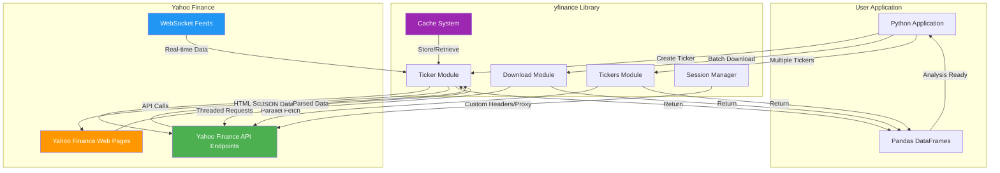
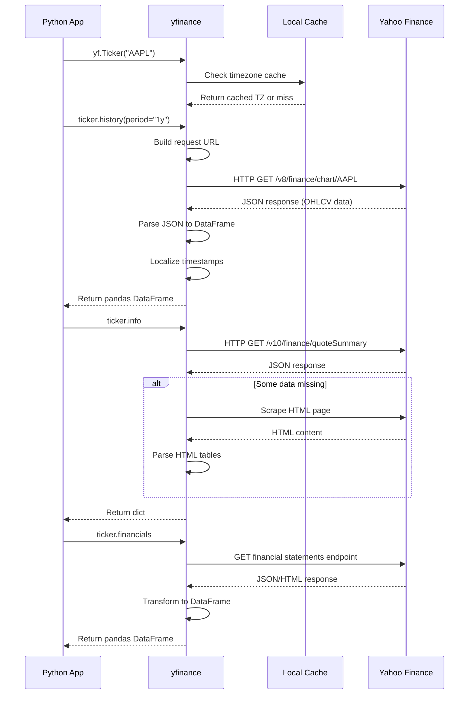
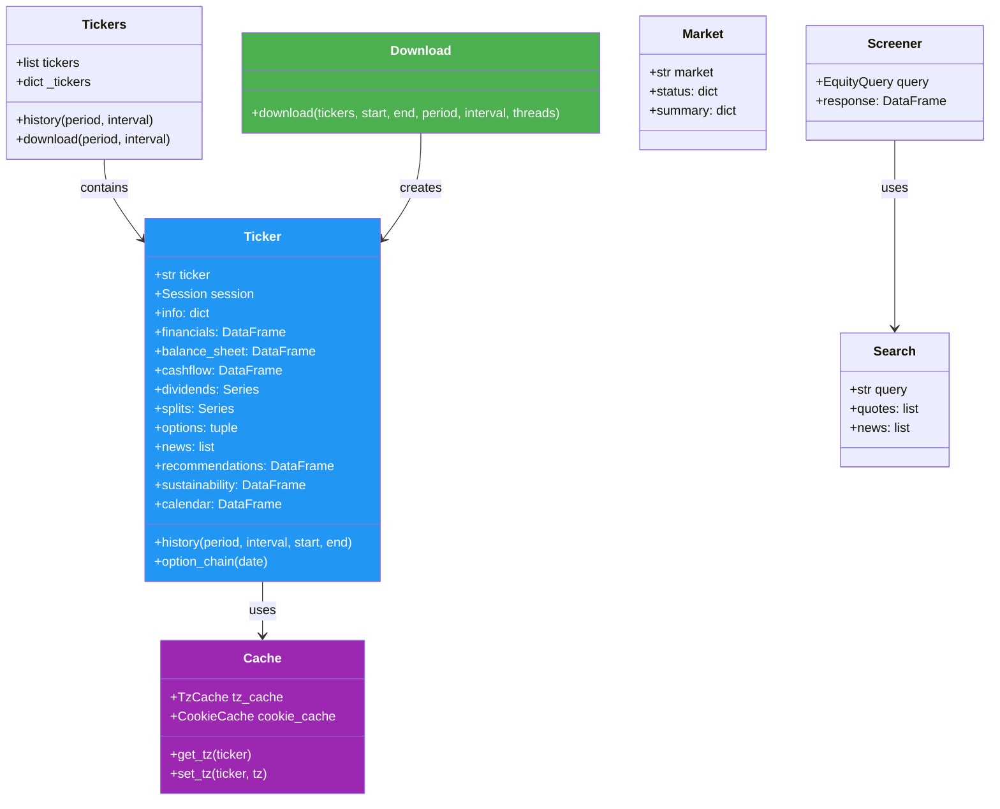
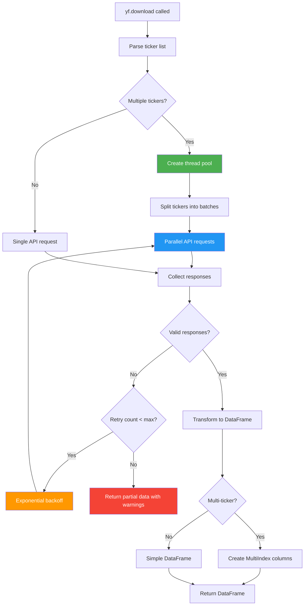
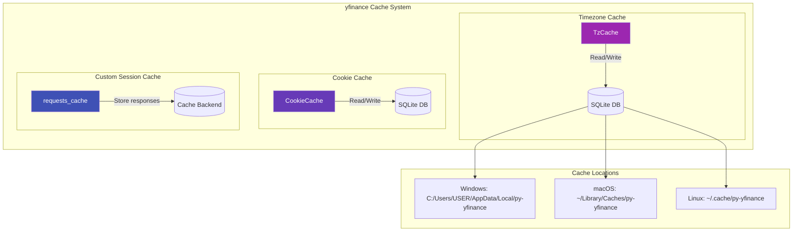
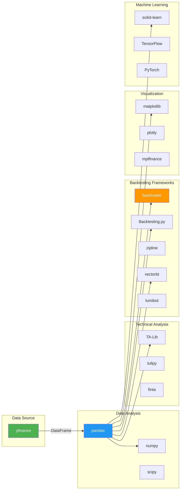
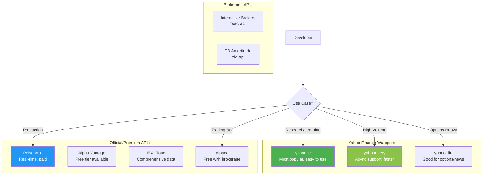

# yfinance - Technical Overview

yfinance is an open-source Python library that provides a simple, Pythonic interface to download financial market data from Yahoo Finance. Created by Ran Aroussi, it's one of the most popular tools for fetching historical stock prices, financial statements, and other market data for research and educational purposes.

## High-Level Architecture



## Data Retrieval Flow



## Core Module Architecture



## Key Concepts

### Data Sources
yfinance retrieves data through two primary methods:
1. **API Calls** - Direct HTTP requests to Yahoo Finance's JSON endpoints (preferred method for price data)
2. **HTML Scraping** - Parsing web pages for data not available via API (used for some financial statements and company info)

### Supported Data Types
| Data Type | Method | Output |
|-----------|--------|--------|
| Historical Prices | `history()` / `download()` | DataFrame with OHLCV |
| Company Info | `info` | Dictionary |
| Financial Statements | `financials`, `balance_sheet`, `cashflow` | DataFrame |
| Dividends & Splits | `dividends`, `splits` | Series |
| Options Data | `options`, `option_chain()` | Tuple / DataFrame |
| Analyst Data | `recommendations`, `analyst_price_target` | DataFrame |
| News | `news` | List of dicts |
| ESG Scores | `sustainability` | DataFrame |

### Time Intervals
| Period | Interval Options |
|--------|------------------|
| Intraday (7 days max) | 1m, 2m, 5m, 15m, 30m, 60m, 90m |
| Short-term (60 days max) | 1h |
| Long-term | 1d, 5d, 1wk, 1mo, 3mo |

## Download Module - Batch Processing



## Caching Architecture



## Ecosystem & Integrations



## Alternative Python Libraries



## Key Facts (2025)

- **GitHub Stars**: 20.7k+
- **PyPI Downloads**: Millions per month (one of the most downloaded finance libraries)
- **Current Version**: 1.0 (released December 2025)
- **Dependencies**: pandas, numpy, requests, lxml, multitasking, frozendict, peewee, beautifulsoup4
- **Python Support**: 2.7, 3.6+
- **License**: Apache 2.0
- **Maintainer**: Ran Aroussi (community-maintained)
- **Used By**: ~85,600+ dependent projects on GitHub
- **Release Frequency**: Multiple releases per month

## Common Use Cases

### 1. Algorithmic Trading Research
```python
import yfinance as yf

# Download historical data for backtesting
data = yf.download("AAPL", period="2y", interval="1d")

# Calculate simple moving averages
data['SMA_20'] = data['Close'].rolling(window=20).mean()
data['SMA_50'] = data['Close'].rolling(window=50).mean()
```

### 2. Portfolio Analysis
```python
# Download multiple assets
tickers = ["AAPL", "GOOGL", "MSFT", "AMZN"]
portfolio = yf.download(tickers, period="1y", group_by='ticker')
```

### 3. Fundamental Analysis
```python
ticker = yf.Ticker("AAPL")
info = ticker.info  # Company information
financials = ticker.financials  # Income statement
balance = ticker.balance_sheet  # Balance sheet
cashflow = ticker.cashflow  # Cash flow statement
```

### 4. Options Analysis
```python
ticker = yf.Ticker("AAPL")
expirations = ticker.options  # Get expiration dates
chain = ticker.option_chain(expirations[0])  # Get options chain
calls = chain.calls
puts = chain.puts
```

### 5. Real-time Streaming (v1.0+)
```python
import yfinance as yf

# WebSocket streaming for real-time data
ws = yf.WebSocket()
ws.subscribe(["AAPL", "GOOGL"])
```

## Security & Considerations

### Rate Limiting
- Yahoo Finance may rate-limit or block IPs making excessive requests
- No official rate limit documentation; community estimates ~100-500 requests/day safely
- HTTP 429 errors indicate rate limiting
- Implement delays (1-5 seconds) between requests for bulk operations

### Reliability Concerns
| Risk | Description | Mitigation |
|------|-------------|------------|
| API Changes | Yahoo may change endpoints without notice | Keep yfinance updated; monitor GitHub issues |
| Rate Limiting | Excessive requests cause temporary blocks | Implement caching and request throttling |
| Data Accuracy | Unofficial data source, no SLA | Cross-validate critical data with official sources |
| Availability | Dependent on Yahoo Finance uptime | Have fallback data sources for production |

### Best Practices
1. **Use caching** - Implement `requests_cache` for repeated queries
2. **Add delays** - Sleep between requests to avoid rate limits
3. **Use proxies** - Rotate proxies for high-volume applications
4. **Handle errors** - Implement retry logic with exponential backoff
5. **Validate data** - Cross-check with official sources for critical decisions

### Legal Considerations
- yfinance is intended for **personal, research, and educational use only**
- Not affiliated with or endorsed by Yahoo, Inc.
- Review Yahoo's Terms of Service for commercial use restrictions
- Consider official API providers for production applications

## Sources

- [yfinance GitHub Repository](https://github.com/ranaroussi/yfinance)
- [yfinance PyPI](https://pypi.org/project/yfinance/)
- [yfinance Documentation](https://ranaroussi.github.io/yfinance/)
- [AlgoTrading101 yfinance Guide](https://algotrading101.com/learn/yfinance-guide/)
- [Yahoo Finance API Guide](https://algotrading101.com/learn/yahoo-finance-api-guide/)
- [Interactive Brokers yfinance Guide](https://www.interactivebrokers.com/campus/ibkr-quant-news/yfinance-library-a-complete-guide/)
