# Zitadel - Technical Overview

Zitadel is an open-source, cloud-native Identity and Access Management (IAM) platform built in Go. It provides authentication, authorization, and user management with a strong focus on multi-tenancy, event sourcing architecture, and developer experience. Zitadel combines the open-source commitment of Keycloak with the modern developer experience of Auth0.

## High-Level Architecture

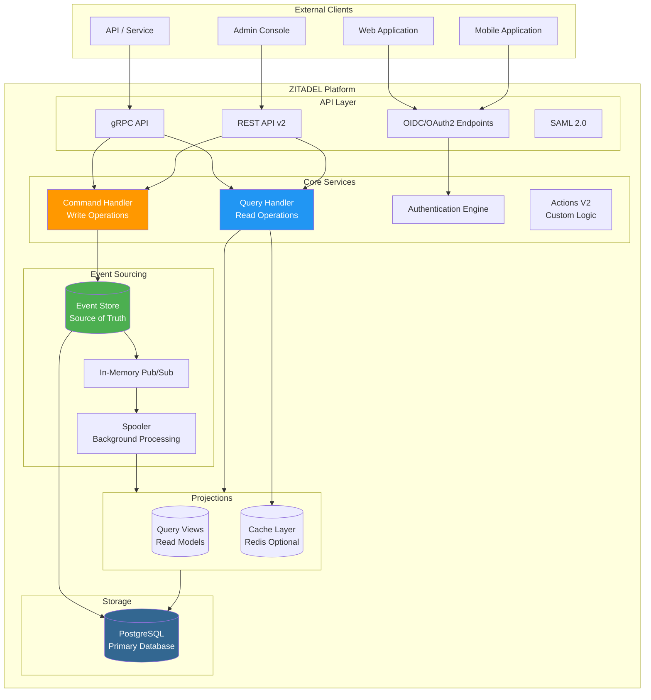

## Authentication Flow (OIDC Authorization Code with PKCE)

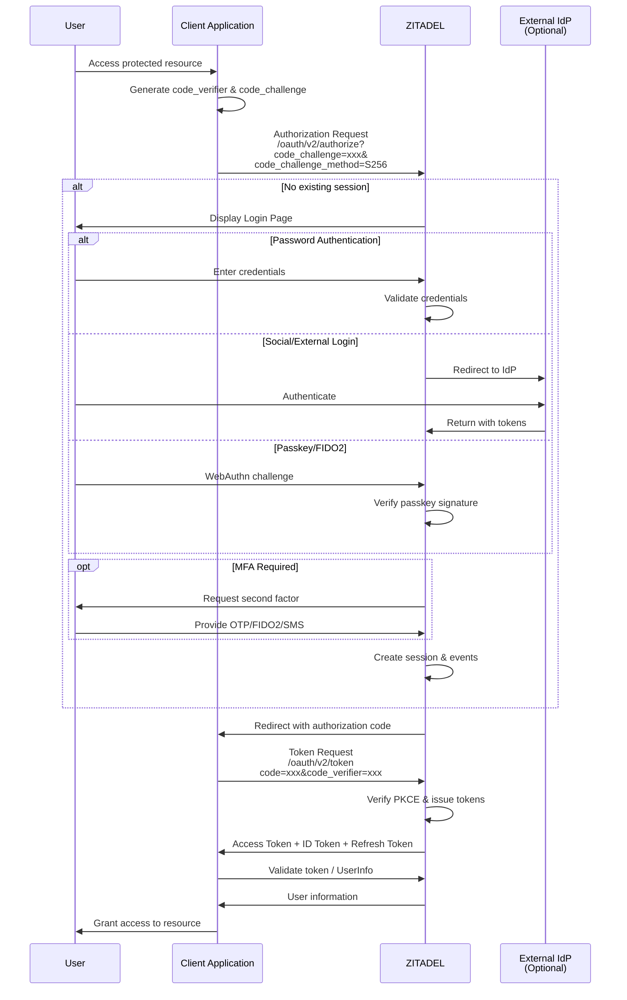

## Event Sourcing & CQRS Architecture

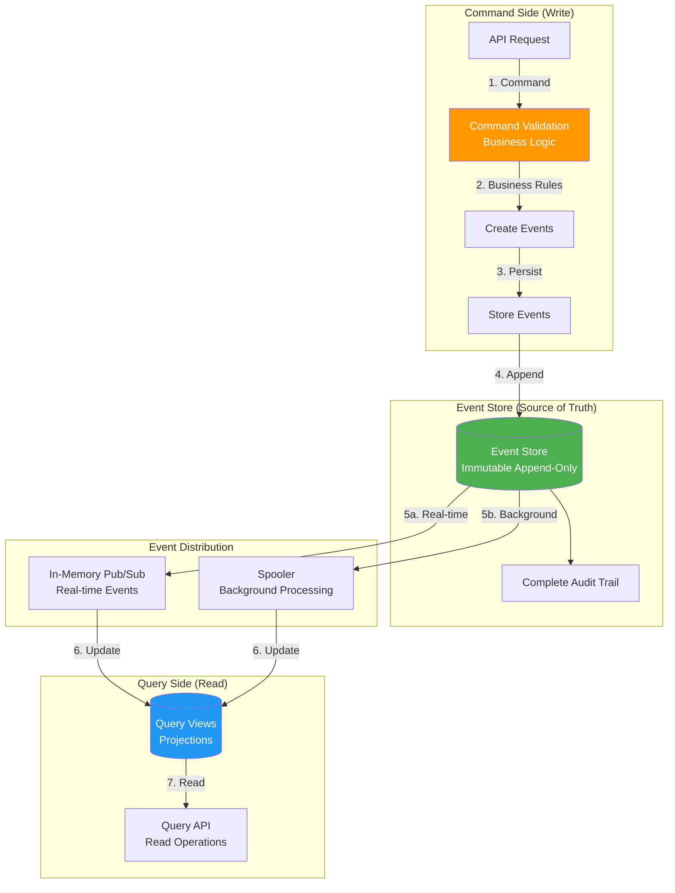

### Event Sourcing Benefits

| Benefit | Description |
|---------|-------------|
| **Complete Audit Trail** | Every change is recorded as an immutable event |
| **Time Travel** | Reconstruct state at any point in time |
| **Debugging** | Full history of what happened and when |
| **Recovery** | Replay events to rebuild state if needed |
| **Compliance** | Built-in audit logging for regulatory requirements |

### CQRS Pattern

- **Command Side**: Handles all write operations (user creation, login, role changes)
- **Query Side**: Optimized read operations from denormalized projections
- **Eventual Consistency**: Query views are updated asynchronously
- **Strong Consistency by ID**: Individual resource lookups can verify against Event Store

## Multi-Tenancy Model

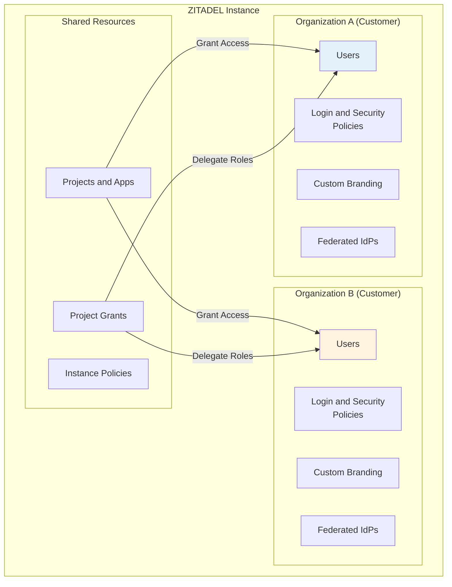

### Multi-Tenancy Concepts

| Concept | Description |
|---------|-------------|
| **Instance** | Completely isolated ZITADEL deployment |
| **Organization** | Tenant within an instance (users, policies, branding) |
| **Project** | Collection of applications with roles |
| **Project Grant** | Delegated access to projects for other organizations |
| **User** | Belongs to one organization, can have cross-org authorizations |

### B2B Scenario Flow

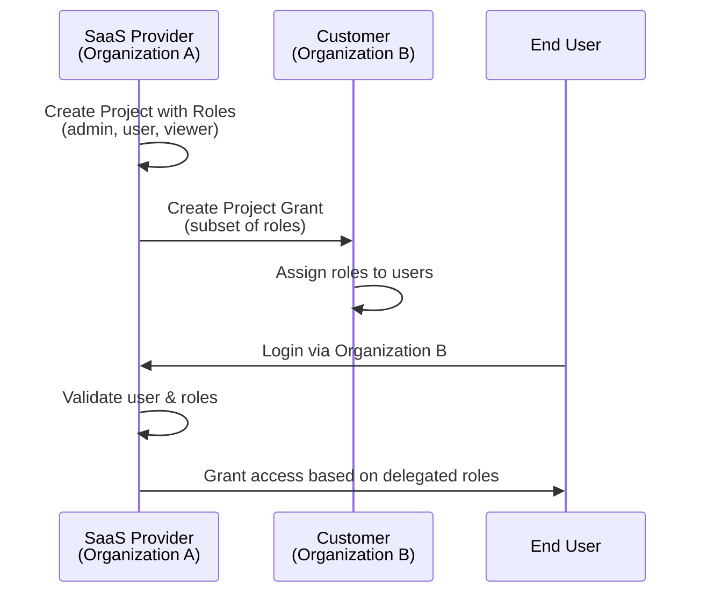

## Actions V2 - Custom Logic System

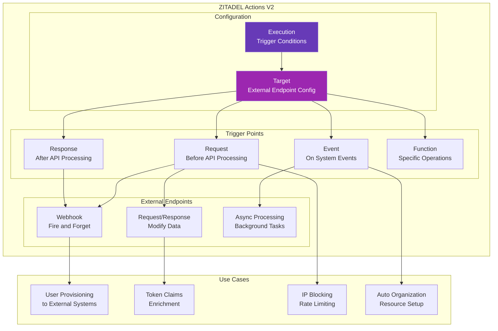

### Actions V2 Components

| Component | Description |
|-----------|-------------|
| **Endpoint** | External HTTP endpoint with custom logic |
| **Target** | ZITADEL resource pointing to an endpoint |
| **Execution** | Rules defining when to trigger targets |

### Trigger Types

- **Request**: Intercept and modify incoming API requests
- **Response**: Process and modify API responses
- **Event**: React to system events (user created, role changed)
- **Function**: Hook into specific ZITADEL functions

## Security Features

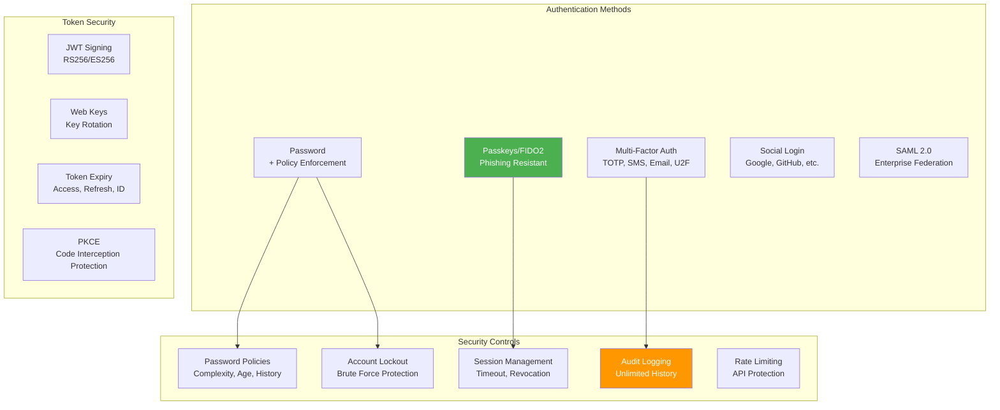

### Why Passkeys Over Traditional MFA

| Aspect | Passwords + MFA | Passkeys (FIDO2) |
|--------|-----------------|------------------|
| **Phishing Resistance** | Vulnerable | Resistant (domain-bound) |
| **Credential Theft** | Possible | Not possible |
| **User Experience** | Multiple steps | Single gesture |
| **Device Support** | Varies | Universal (modern devices) |
| **Brute Force** | Rate limiting needed | Not applicable |

## Deployment Architecture

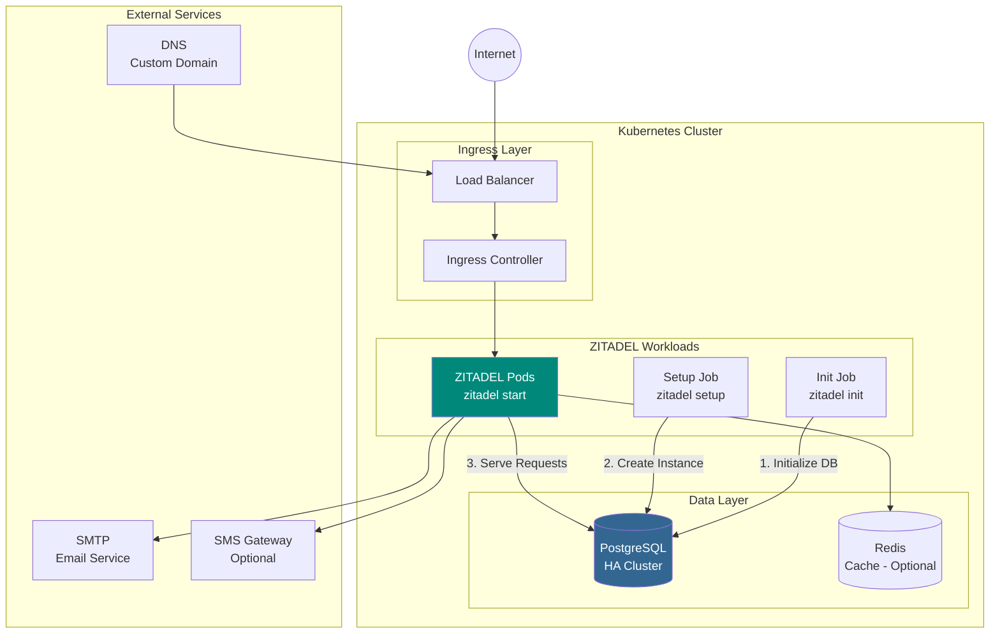

### Deployment Options

| Method | Description | Use Case |
|--------|-------------|----------|
| **Docker Compose** | Single-node deployment | Development, testing |
| **Kubernetes** | Scalable, HA deployment | Production |
| **Linux Binary** | Direct installation | Simple setups |
| **ZITADEL Cloud** | Managed SaaS | No ops overhead |

### Production Requirements

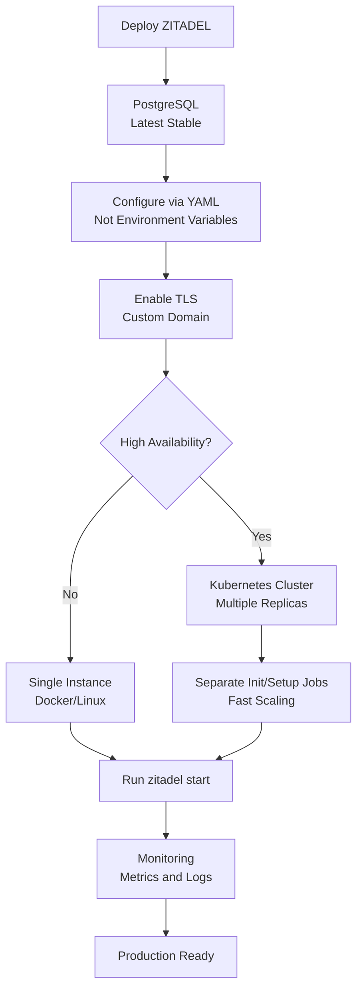

## Protocol Support

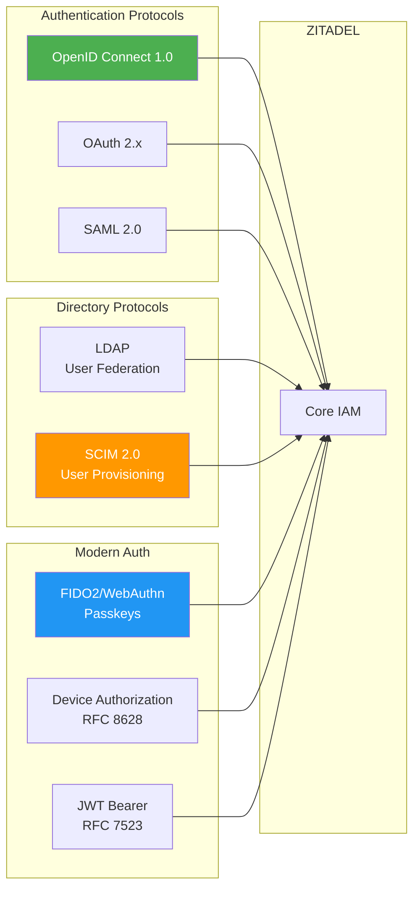

## Comparison with Alternatives

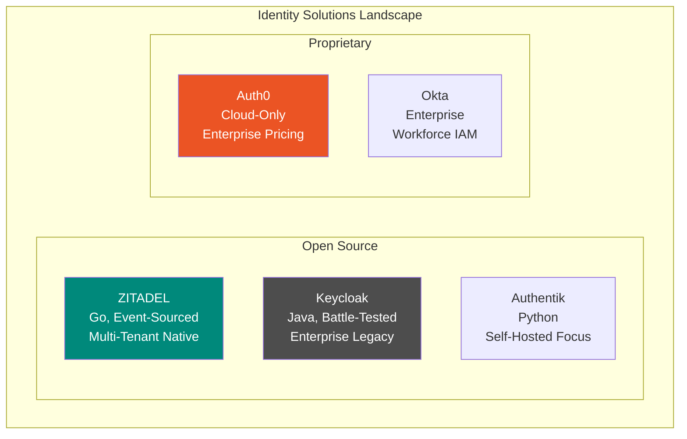

| Feature | ZITADEL | Keycloak | Auth0 |
|---------|---------|----------|-------|
| **License** | AGPL v3 | Apache 2.0 | Proprietary |
| **Language** | Go | Java | N/A |
| **Multi-Tenancy** | Native, first-class | Via Realms | Yes |
| **Event Sourcing** | Yes | No | No |
| **Self-Hosted** | Yes | Yes | No |
| **Cloud Offering** | Yes | No | Yes |
| **Passkeys** | Included free | Plugin | Extra cost |
| **API** | gRPC + REST | REST | REST |

## Key Facts (2025)

- **Series A Funding**: $9 million (November 2024), led by Nexus Venture Partners
- **GitHub Stars**: 10,000+
- **License**: AGPL v3 (as of v3)
- **Language**: Go
- **Database**: PostgreSQL (CockroachDB deprecated in v3)
- **Customers**: 150+ across North America and Europe
- **Primary Protocol**: OpenID Connect certified
- **OIDC Library**: Certified by OpenID Foundation

## Use Cases

### 1. B2B SaaS Multi-Tenancy
Manage multiple business customers with isolated configurations, branding, and user management delegation.

### 2. Customer Identity (CIAM)
Consumer-facing applications requiring social login, passwordless authentication, and self-service.

### 3. Workforce Identity
Internal employee authentication with federated login to corporate identity providers.

### 4. API Security
Machine-to-machine authentication using JWT bearer tokens and client credentials.

### 5. Single Sign-On (SSO)
Unified authentication across multiple applications and services.

### 6. Passwordless Migration
Transitioning users from passwords to passkeys for improved security and UX.

## Getting Started

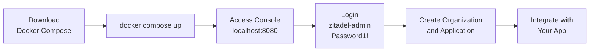

### Quick Start Commands

```bash
# Download docker-compose.yaml
curl -fsSL https://raw.githubusercontent.com/zitadel/zitadel/main/docker-compose.yaml -o docker-compose.yaml

# Start ZITADEL
docker compose pull
docker compose up --detach --wait

# Access at http://localhost:8080/ui/console
# Login: zitadel-admin@zitadel.localhost / Password1!
```

## Sources

- [ZITADEL Official Website](https://zitadel.com/)
- [ZITADEL GitHub Repository](https://github.com/zitadel/zitadel)
- [ZITADEL Documentation](https://zitadel.com/docs)
- [ZITADEL Software Architecture](https://zitadel.com/docs/concepts/architecture/software)
- [ZITADEL OIDC Recommended Flows](https://zitadel.com/docs/guides/integrate/login/oidc/oauth-recommended-flows)
- [ZITADEL Multi-Tenancy with Organizations](https://zitadel.com/blog/multi-tenancy-with-organizations)
- [ZITADEL B2B Authentication Guide](https://zitadel.com/docs/guides/solution-scenarios/b2b)
- [ZITADEL Actions V2](https://zitadel.com/docs/concepts/features/actions_v2)
- [ZITADEL Passkeys Documentation](https://zitadel.com/docs/concepts/features/passkeys)
- [ZITADEL Deployment Guide](https://zitadel.com/docs/self-hosting/deploy/overview)
- [ZITADEL vs Keycloak Comparison](https://zitadel.com/blog/zitadel-vs-keycloak)
- [Event Sourcing in Identity Management - The New Stack](https://thenewstack.io/transforming-identity-and-access-management-with-event-sourcing/)
- [State of Open-Source Identity in 2025](https://www.houseoffoss.com/post/the-state-of-open-source-identity-in-2025-authentik-vs-authelia-vs-keycloak-vs-zitadel)
- [ZITADEL 2024 Product Wrap Up](https://zitadel.com/blog/end-of-year-product-wrap-up)
- [ZITADEL DeepWiki Architecture Overview](https://deepwiki.com/zitadel/zitadel/1.2-architecture-overview)
